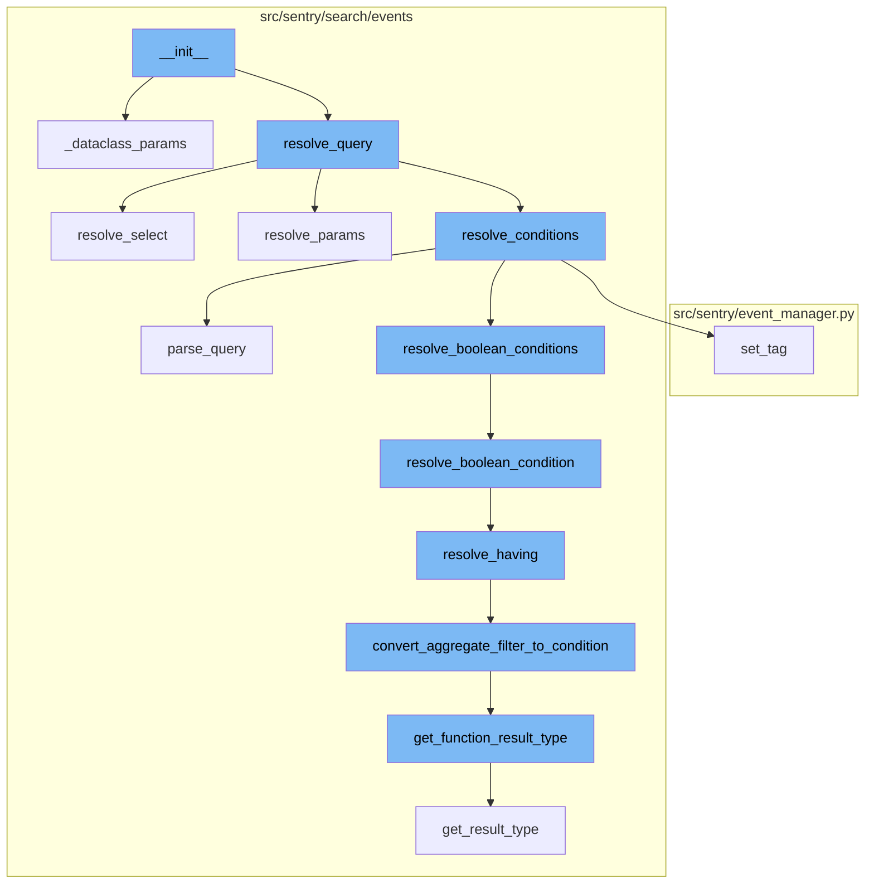
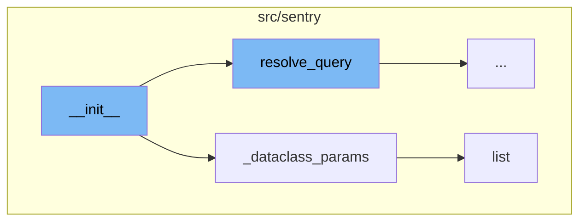
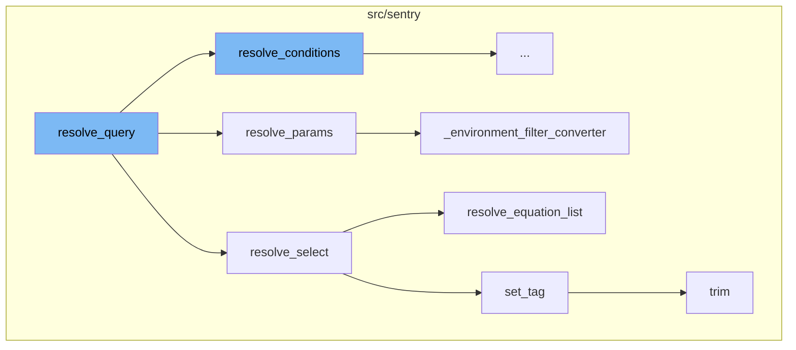
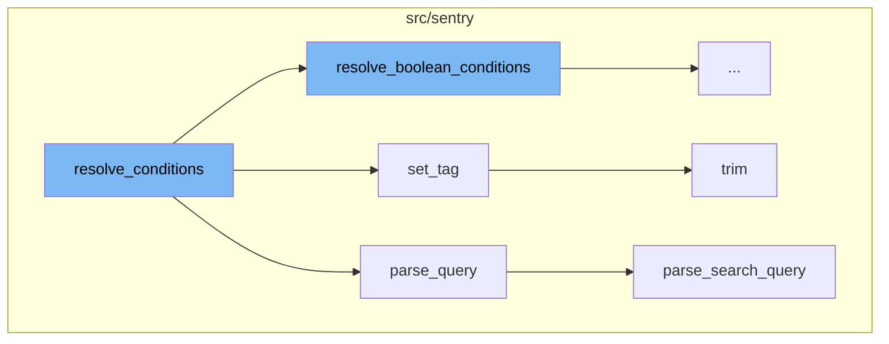
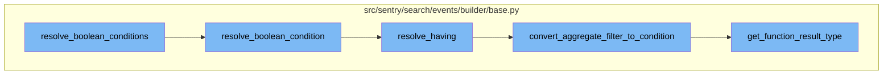

<SwmSnippet path="/src/sentry/search/events/builder/base.py" line="179">

---

# Understanding **init**

The `__init__` function is a special method in Python classes, often referred to as the class constructor. This function is called when an object is created from a class and it allows the class to initialize the attributes of the class. In this case, the `__init__` function is used to initialize various attributes of the QueryBuilder class such as dataset, params, config, snuba_params, query, selected_columns, groupby_columns, equations, orderby, limit, offset, limitby, turbo, sample_rate, array_join, and entity.

```python
    def __init__(
        self,
        dataset: Dataset,
        params: ParamsType,
        config: QueryBuilderConfig | None = None,
        snuba_params: SnubaParams | None = None,
        query: str | None = None,
        selected_columns: list[str] | None = None,
        groupby_columns: list[str] | None = None,
        equations: list[str] | None = None,
        orderby: list[str] | str | None = None,
        limit: int | None = 50,
        offset: int | None = 0,
        limitby: tuple[str, int] | None = None,
        turbo: bool = False,
        sample_rate: float | None = None,
        array_join: str | None = None,
        entity: Entity | None = None,
    ):
        if config is None:
            self.builder_config = QueryBuilderConfig()
```

---

</SwmSnippet>

<SwmSnippet path="/src/sentry/search/events/builder/base.py" line="116">

---

# Helper Function: \_dataclass_params

The `_dataclass_params` function is a helper function used within the `__init__` function. Its purpose is to convert the passed parameters into a dataclass. This function takes in two parameters: snuba_params and params. If snuba_params is not None, it returns snuba_params directly. Otherwise, it constructs a new SnubaParams object based on the provided params.

```python
    def _dataclass_params(
        self, snuba_params: SnubaParams | None, params: ParamsType
    ) -> SnubaParams:
        """Shim so the query builder can start using the dataclass

        need a lot of type: ignore since the params being passed can't be trusted from files that are probably still in the type ignorelist
        """
        if snuba_params is not None:
            return snuba_params

        if "project_objects" in params:
            projects = cast(Sequence[Project], params["project_objects"])
        elif "project_id" in params and (
            isinstance(params["project_id"], list) or isinstance(params["project_id"], tuple)  # type: ignore[unreachable]
        ):
            projects = Project.objects.filter(id__in=params["project_id"])
        else:
            projects = []

        if "organization_id" in params and isinstance(params["organization_id"], int):
            organization = Organization.objects.filter(id=params["organization_id"]).first()
```

---

</SwmSnippet>

<SwmSnippet path="/src/sentry/runner/commands/permissions.py" line="76">

---

# Function: list

The `list` function is used to list permissions for a user. It retrieves the user instance based on the provided user parameter, fetches the UserPermission objects associated with the user, and then prints out each permission.

```python
def list(user: str) -> None:
    "List permissions for a user."
    from sentry.models.userpermission import UserPermission

    user_inst = user_param_to_user(user)
    up_list = UserPermission.objects.filter(user=user_inst).order_by("permission")
    click.echo(f"Permissions for `{user_inst.username}`:")
    for permission in up_list:
        click.echo(f"- {permission.permission}")
```

---

</SwmSnippet>

<SwmSnippet path="/src/sentry/search/events/builder/base.py" line="308">

---

# Resolving the Query

The `resolve_query` function is responsible for resolving various aspects of a query such as time conditions, conditions, parameters, columns, order by, and group by. This function is called within the `__init__` function.

```python
    def resolve_query(
        self,
        query: str | None = None,
        selected_columns: list[str] | None = None,
        groupby_columns: list[str] | None = None,
        equations: list[str] | None = None,
        orderby: list[str] | str | None = None,
    ) -> None:
        with sentry_sdk.start_span(op="QueryBuilder", description="resolve_query"):
            with sentry_sdk.start_span(op="QueryBuilder", description="resolve_time_conditions"):
                # Has to be done early, since other conditions depend on start and end
                self.resolve_time_conditions()
            with sentry_sdk.start_span(op="QueryBuilder", description="resolve_conditions"):
                self.where, self.having = self.resolve_conditions(query)
            with sentry_sdk.start_span(op="QueryBuilder", description="resolve_params"):
                # params depends on parse_query, and conditions being resolved first since there may be projects in conditions
                self.where += self.resolve_params()
            with sentry_sdk.start_span(op="QueryBuilder", description="resolve_columns"):
                self.columns = self.resolve_select(selected_columns, equations)
            with sentry_sdk.start_span(op="QueryBuilder", description="resolve_orderby"):
                self.orderby = self.resolve_orderby(orderby)
```

---

</SwmSnippet>

<SwmSnippet path="/src/sentry/search/events/builder/base.py" line="599">

---

# Resolving Select Columns

The `resolve_select` function is called within `resolve_query`. It constructs a list of Snql Columns or Functions based on the provided list of discover fields. It also sets a tag to indicate if the query has equations.

```python
    def resolve_select(
        self, selected_columns: list[str] | None, equations: list[str] | None
    ) -> list[SelectType]:
        """Given a public list of discover fields, construct the corresponding
        list of Snql Columns or Functions. Duplicate columns are ignored
        """

        if selected_columns is None:
            return []

        resolved_columns = []
        stripped_columns = [column.strip() for column in set(selected_columns)]

        sentry_sdk.set_tag("query.has_equations", equations is not None and len(equations) > 0)
        if equations:
            stripped_columns, parsed_equations = resolve_equation_list(
                equations,
                stripped_columns,
                **(
                    self.builder_config.equation_config
                    if self.builder_config.equation_config
```

---

</SwmSnippet>

<SwmSnippet path="/src/sentry/search/events/builder/base.py" line="531">

---

# Resolving Parameters

The `resolve_params` function is also called within `resolve_query`. It prioritizes keys included as URL parameters over the same keys included in the search. It also checks for various conditions such as date range, project IDs, and environments.

```python
    def resolve_params(self) -> list[WhereType]:
        """Keys included as url params take precedent if same key is included in search
        They are also considered safe and to have had access rules applied unlike conditions
        from the query string.
        """
        conditions = []

        # Update start to be within retention
        expired = False
        if self.start and self.end:
            expired, self.start = outside_retention_with_modified_start(
                self.start, self.end, self.params.organization
            )

        if expired:
            raise QueryOutsideRetentionError(
                "Invalid date range. Please try a more recent date range."
            )

        if self.start:
            conditions.append(Condition(self.column("timestamp"), Op.GTE, self.start))
```

---

</SwmSnippet>

<SwmSnippet path="/src/sentry/search/events/builder/base.py" line="1398">

---

# Environment Filter Converter

The `_environment_filter_converter` function is used within `resolve_params` to handle conditions related to the environment.

```python
    def _environment_filter_converter(
        self, search_filter: event_search.SearchFilter
    ) -> WhereType | None:
        # conditions added to env_conditions can be OR'ed
        env_conditions = []
        value = search_filter.value.value
        values_set = set(value if isinstance(value, (list, tuple)) else [value])
        # sorted for consistency
        values = sorted(f"{value}" for value in values_set)
        environment = self.column("environment")
        # the "no environment" environment is null in snuba
        if "" in values:
            values.remove("")
            operator = Op.IS_NULL if search_filter.operator == "=" else Op.IS_NOT_NULL
            env_conditions.append(Condition(environment, operator))
        if len(values) == 1:
            operator = Op.EQ if search_filter.operator in constants.EQUALITY_OPERATORS else Op.NEQ
            env_conditions.append(Condition(environment, operator, values.pop()))
        elif values:
            operator = (
                Op.IN if search_filter.operator in constants.EQUALITY_OPERATORS else Op.NOT_IN
```

---

</SwmSnippet>

<SwmSnippet path="/src/sentry/discover/arithmetic.py" line="324">

---

# Resolving Equation List

The `resolve_equation_list` function is used within `resolve_select` to resolve a list of equation strings to their equivalent Snuba JSON query formats.

```python
def resolve_equation_list(
    equations: list[str],
    selected_columns: list[str],
    aggregates_only: bool = False,
    auto_add: bool = False,
    plain_math: bool = False,
    custom_measurements: set[str] | None = None,
) -> tuple[list[str], list[ParsedEquation]]:
    """Given a list of equation strings, resolve them to their equivalent snuba json query formats
    :param equations: list of equations strings that haven't been parsed yet
    :param selected_columns: list of public aliases from the endpoint, can be a mix of fields and aggregates
    :param aggregates_only: Optional parameter whether we need to enforce equations don't include fields
        intended for use with event-stats where fields aren't compatible since they change grouping
    :param: auto_add: Optional parameter that will take any fields in the equation that's missing in the
        selected_columns and return a new list with them added
    :param plain_math: Allow equations that don't include any fields or functions, disabled by default
    """
    parsed_equations: list[ParsedEquation] = []
    resolved_columns: list[str] = selected_columns[:]
    for index, equation in enumerate(equations):
        parsed_equation, fields, functions = parse_arithmetic(equation, None, custom_measurements)
```

---

</SwmSnippet>

<SwmSnippet path="/src/sentry/event_manager.py" line="180">

---

# Setting a Tag

The `set_tag` function is used to set a tag in the data. It first removes any existing tag with the same key before setting the new tag.

```python
def set_tag(data: dict[str, Any], key: str, value: Any) -> None:
    pop_tag(data, key)
    if value is not None:
        data.setdefault("tags", []).append((key, trim(value, MAX_TAG_VALUE_LENGTH)))
```

---

</SwmSnippet>

<SwmSnippet path="/src/sentry/tsdb/snuba.py" line="653">

---

# Trimming Keys

The `trim` function is used within `set_tag` to remove keys that should not exist. It operates on the non-flattened version of keys, allowing different sets of keys to exist in different branches at the same nesting level.

```python
    def trim(self, result, groups, keys):
        """
        Similar to zerofill, but removes keys that should not exist.
        Uses the non-flattened version of keys, so that different sets
        of keys can exist in different branches at the same nesting level.
        """
        if len(groups) > 0:
            group, subgroups = groups[0], groups[1:]
            if isinstance(result, dict):
                for rk in list(result.keys()):
                    if group == "time":  # Skip over time group
                        self.trim(result[rk], subgroups, keys)
                    elif rk in keys:
                        if isinstance(keys, dict):
                            self.trim(result[rk], subgroups, keys[rk])
                    else:
                        del result[rk]
```

---

</SwmSnippet>

<SwmSnippet path="/src/sentry/search/events/builder/base.py" line="1115">

---

# Parsing the Query

The `parse_query` function is called within `resolve_conditions`. It takes a user's query string and constructs a list of filters that can be used to construct the conditions of the Query.

```python
    def parse_query(self, query: str | None) -> event_filter.ParsedTerms:
        """Given a user's query, string construct a list of filters that can be
        then used to construct the conditions of the Query"""
        if query is None:
            return []

        try:
            parsed_terms = event_search.parse_search_query(
                query,
                params=self.filter_params,
                builder=self,
                config_overrides=self.builder_config.parser_config_overrides,
            )
        except ParseError as e:
            if e.expr is not None:
                raise InvalidSearchQuery(f"Parse error: {e.expr.name} (column {e.column():d})")
            else:
                raise InvalidSearchQuery(f"Parse error for: {query}")

        if not parsed_terms:
            return []
```

---

</SwmSnippet>

<SwmSnippet path="/src/sentry/search/events/builder/base.py" line="430">

---

# Resolving Boolean Conditions

The `resolve_boolean_conditions` function takes a list of parsed terms and returns two lists of conditions. It checks if there are any invalid queries and raises an error if found. It then splits the terms based on the presence of OR and AND operators and recursively resolves the boolean conditions for each split.

```python
    def resolve_boolean_conditions(
        self, terms: event_filter.ParsedTerms
    ) -> tuple[list[WhereType], list[WhereType]]:
        if len(terms) == 1:
            return self.resolve_boolean_condition(terms[0])

        # Filter out any ANDs since we can assume anything without an OR is an AND. Also do some
        # basic sanitization of the query: can't have two operators next to each other, and can't
        # start or end a query with an operator.
        previous_term: event_filter.ParsedTerm | None = None
        new_terms = []
        term: event_filter.ParsedTerm | None = None
        for term in terms:
            if previous_term:
                if event_search.SearchBoolean.is_operator(
                    previous_term
                ) and event_search.SearchBoolean.is_operator(term):
                    raise InvalidSearchQuery(
                        f"Missing condition in between two condition operators: '{previous_term} {term}'"
                    )
            else:
```

---

</SwmSnippet>

<SwmSnippet path="/src/sentry/search/events/builder/base.py" line="515">

---

# Resolving Boolean Condition

The `resolve_boolean_condition` function takes a single parsed term and returns two lists of conditions. It checks the type of the term and calls the appropriate function to resolve the term into conditions.

```python
    def resolve_boolean_condition(
        self, term: event_filter.ParsedTerm
    ) -> tuple[list[WhereType], list[WhereType]]:
        if isinstance(term, event_search.ParenExpression):
            return self.resolve_boolean_conditions(term.children)

        where, having = [], []

        # I have no idea why but mypy thinks this is SearchFilter | SearchFilter, which is incompatible with SearchFilter...
        if isinstance(term, event_search.SearchFilter):
            where = self.resolve_where([cast(event_search.SearchFilter, term)])
        elif isinstance(term, event_search.AggregateFilter):
            having = self.resolve_having([cast(event_search.AggregateFilter, term)])

        return where, having
```

---

</SwmSnippet>

<SwmSnippet path="/src/sentry/search/events/builder/base.py" line="381">

---

# Resolving Having Conditions

The `resolve_having` function takes a list of parsed terms and returns a list of conditions. It filters for aggregate conditions and converts each aggregate filter into a condition.

```python
    def resolve_having(self, parsed_terms: event_filter.ParsedTerms) -> list[WhereType]:
        """Given a list of parsed terms, construct their equivalent snql having
        conditions, filtering only for aggregate conditions"""

        if not self.builder_config.use_aggregate_conditions:
            return []

        having_conditions: list[WhereType] = []
        for term in parsed_terms:
            if isinstance(term, event_search.AggregateFilter):
                # I have no idea why but mypy thinks this is AggregateFilter | AggregateFilter, which is incompatible with AggregateFilter...
                condition = self.convert_aggregate_filter_to_condition(
                    cast(event_search.AggregateFilter, term)
                )
                if condition:
                    having_conditions.append(condition)

        return having_conditions
```

---

</SwmSnippet>

<SwmSnippet path="/src/sentry/search/events/builder/base.py" line="1166">

---

# Converting Aggregate Filter to Condition

The `convert_aggregate_filter_to_condition` function takes an aggregate filter and converts it into a condition. It first gets the function result type of the filter key name and then resolves the measurement value if a unit is found. It then checks the operator of the filter and returns the appropriate condition.

```python
    def convert_aggregate_filter_to_condition(
        self, aggregate_filter: event_search.AggregateFilter
    ) -> WhereType | None:
        name = aggregate_filter.key.name
        value = aggregate_filter.value.value
        unit = self.get_function_result_type(aggregate_filter.key.name)
        if unit:
            value = self.resolve_measurement_value(unit, value)

        value = (
            int(value.timestamp()) if isinstance(value, datetime) and name != "timestamp" else value
        )

        if aggregate_filter.operator in {"=", "!="} and value == "":
            operator = Op.IS_NULL if aggregate_filter.operator == "=" else Op.IS_NOT_NULL
            return Condition(name, operator)

        # When resolving functions in conditions we don't want to add them to the list of aggregates
        function = self.resolve_function(name, resolve_only=True)

        return Condition(function, Op(aggregate_filter.operator), value)
```

---

</SwmSnippet>

<SwmSnippet path="/src/sentry/search/events/builder/base.py" line="763">

---

# Getting Function Result Type

The `get_function_result_type` function takes a function name, resolves it, and returns its result type. It first checks if the resolved function is a Function and has an alias. If it does, it gets the function details from the function alias map and returns the result type.

```python
    def get_function_result_type(
        self,
        function: str,
    ) -> str | None:
        """Given a function, resolve it and then get the result_type

        params to this function should match that of resolve_function
        """
        resolved_function = self.resolve_function(function, resolve_only=True)

        if not isinstance(resolved_function, Function) or resolved_function.alias is None:
            return None

        function_details = self.function_alias_map.get(resolved_function.alias)
        if function_details is None:
            return None

        result_type: str | None = function_details.instance.get_result_type(
            function_details.field, function_details.arguments
        )
        return result_type
```

---

</SwmSnippet>



# Flow drill down

First, we'll zoom into this section of the flow:



<SwmSnippet path="/src/sentry/search/events/builder/base.py" line="179">

---

# **init** function

The `__init__` function is a special method in Python classes, it's often referred to as the class constructor. This function is called when an object is created from a class and it allows the class to initialize the attributes of the class. In this case, the `__init__` function is used to initialize various attributes of the QueryBuilder class such as dataset, params, config, snuba_params, query, selected_columns, groupby_columns, equations, orderby, limit, offset, limitby, turbo, sample_rate, array_join, and entity.

```python
    def __init__(
        self,
        dataset: Dataset,
        params: ParamsType,
        config: QueryBuilderConfig | None = None,
        snuba_params: SnubaParams | None = None,
        query: str | None = None,
        selected_columns: list[str] | None = None,
        groupby_columns: list[str] | None = None,
        equations: list[str] | None = None,
        orderby: list[str] | str | None = None,
        limit: int | None = 50,
        offset: int | None = 0,
        limitby: tuple[str, int] | None = None,
        turbo: bool = False,
        sample_rate: float | None = None,
        array_join: str | None = None,
        entity: Entity | None = None,
    ):
        if config is None:
            self.builder_config = QueryBuilderConfig()
```

---

</SwmSnippet>

<SwmSnippet path="/src/sentry/search/events/builder/base.py" line="116">

---

# \_dataclass_params function

The `_dataclass_params` function is a helper function used within the `__init__` function. It's purpose is to convert the passed parameters into a dataclass. This function takes in two parameters: snuba_params and params. If snuba_params is not None, it returns snuba_params directly. Otherwise, it constructs a new SnubaParams object based on the provided params.

```python
    def _dataclass_params(
        self, snuba_params: SnubaParams | None, params: ParamsType
    ) -> SnubaParams:
        """Shim so the query builder can start using the dataclass

        need a lot of type: ignore since the params being passed can't be trusted from files that are probably still in the type ignorelist
        """
        if snuba_params is not None:
            return snuba_params

        if "project_objects" in params:
            projects = cast(Sequence[Project], params["project_objects"])
        elif "project_id" in params and (
            isinstance(params["project_id"], list) or isinstance(params["project_id"], tuple)  # type: ignore[unreachable]
        ):
            projects = Project.objects.filter(id__in=params["project_id"])
        else:
            projects = []

        if "organization_id" in params and isinstance(params["organization_id"], int):
            organization = Organization.objects.filter(id=params["organization_id"]).first()
```

---

</SwmSnippet>

<SwmSnippet path="/src/sentry/runner/commands/permissions.py" line="76">

---

# list function

The `list` function is used to list permissions for a user. It retrieves the user instance based on the provided user parameter, fetches the UserPermission objects associated with the user, and then prints out each permission.

```python
def list(user: str) -> None:
    "List permissions for a user."
    from sentry.models.userpermission import UserPermission

    user_inst = user_param_to_user(user)
    up_list = UserPermission.objects.filter(user=user_inst).order_by("permission")
    click.echo(f"Permissions for `{user_inst.username}`:")
    for permission in up_list:
        click.echo(f"- {permission.permission}")
```

---

</SwmSnippet>

Now, lets zoom into this section of the flow:



<SwmSnippet path="/src/sentry/search/events/builder/base.py" line="308">

---

# **init** Flow

The `__init__` flow starts with the `resolve_query` function. This function is responsible for resolving various aspects of a query such as time conditions, conditions, parameters, columns, order by, and group by.

```python
    def resolve_query(
        self,
        query: str | None = None,
        selected_columns: list[str] | None = None,
        groupby_columns: list[str] | None = None,
        equations: list[str] | None = None,
        orderby: list[str] | str | None = None,
    ) -> None:
        with sentry_sdk.start_span(op="QueryBuilder", description="resolve_query"):
            with sentry_sdk.start_span(op="QueryBuilder", description="resolve_time_conditions"):
                # Has to be done early, since other conditions depend on start and end
                self.resolve_time_conditions()
            with sentry_sdk.start_span(op="QueryBuilder", description="resolve_conditions"):
                self.where, self.having = self.resolve_conditions(query)
            with sentry_sdk.start_span(op="QueryBuilder", description="resolve_params"):
                # params depends on parse_query, and conditions being resolved first since there may be projects in conditions
                self.where += self.resolve_params()
            with sentry_sdk.start_span(op="QueryBuilder", description="resolve_columns"):
                self.columns = self.resolve_select(selected_columns, equations)
            with sentry_sdk.start_span(op="QueryBuilder", description="resolve_orderby"):
                self.orderby = self.resolve_orderby(orderby)
```

---

</SwmSnippet>

<SwmSnippet path="/src/sentry/search/events/builder/base.py" line="599">

---

The `resolve_select` function is called within `resolve_query`. It constructs a list of Snql Columns or Functions based on the provided list of discover fields. It also sets a tag to indicate if the query has equations.

```python
    def resolve_select(
        self, selected_columns: list[str] | None, equations: list[str] | None
    ) -> list[SelectType]:
        """Given a public list of discover fields, construct the corresponding
        list of Snql Columns or Functions. Duplicate columns are ignored
        """

        if selected_columns is None:
            return []

        resolved_columns = []
        stripped_columns = [column.strip() for column in set(selected_columns)]

        sentry_sdk.set_tag("query.has_equations", equations is not None and len(equations) > 0)
        if equations:
            stripped_columns, parsed_equations = resolve_equation_list(
                equations,
                stripped_columns,
                **(
                    self.builder_config.equation_config
                    if self.builder_config.equation_config
```

---

</SwmSnippet>

<SwmSnippet path="/src/sentry/search/events/builder/base.py" line="531">

---

The `resolve_params` function is also called within `resolve_query`. It prioritizes keys included as URL parameters over the same keys included in the search. It also checks for various conditions such as date range, project IDs, and environments.

```python
    def resolve_params(self) -> list[WhereType]:
        """Keys included as url params take precedent if same key is included in search
        They are also considered safe and to have had access rules applied unlike conditions
        from the query string.
        """
        conditions = []

        # Update start to be within retention
        expired = False
        if self.start and self.end:
            expired, self.start = outside_retention_with_modified_start(
                self.start, self.end, self.params.organization
            )

        if expired:
            raise QueryOutsideRetentionError(
                "Invalid date range. Please try a more recent date range."
            )

        if self.start:
            conditions.append(Condition(self.column("timestamp"), Op.GTE, self.start))
```

---

</SwmSnippet>

<SwmSnippet path="/src/sentry/search/events/builder/base.py" line="1398">

---

The `_environment_filter_converter` function is used within `resolve_params` to handle conditions related to the environment.

```python
    def _environment_filter_converter(
        self, search_filter: event_search.SearchFilter
    ) -> WhereType | None:
        # conditions added to env_conditions can be OR'ed
        env_conditions = []
        value = search_filter.value.value
        values_set = set(value if isinstance(value, (list, tuple)) else [value])
        # sorted for consistency
        values = sorted(f"{value}" for value in values_set)
        environment = self.column("environment")
        # the "no environment" environment is null in snuba
        if "" in values:
            values.remove("")
            operator = Op.IS_NULL if search_filter.operator == "=" else Op.IS_NOT_NULL
            env_conditions.append(Condition(environment, operator))
        if len(values) == 1:
            operator = Op.EQ if search_filter.operator in constants.EQUALITY_OPERATORS else Op.NEQ
            env_conditions.append(Condition(environment, operator, values.pop()))
        elif values:
            operator = (
                Op.IN if search_filter.operator in constants.EQUALITY_OPERATORS else Op.NOT_IN
```

---

</SwmSnippet>

<SwmSnippet path="/src/sentry/discover/arithmetic.py" line="324">

---

The `resolve_equation_list` function is used within `resolve_select` to resolve a list of equation strings to their equivalent Snuba JSON query formats.

```python
def resolve_equation_list(
    equations: list[str],
    selected_columns: list[str],
    aggregates_only: bool = False,
    auto_add: bool = False,
    plain_math: bool = False,
    custom_measurements: set[str] | None = None,
) -> tuple[list[str], list[ParsedEquation]]:
    """Given a list of equation strings, resolve them to their equivalent snuba json query formats
    :param equations: list of equations strings that haven't been parsed yet
    :param selected_columns: list of public aliases from the endpoint, can be a mix of fields and aggregates
    :param aggregates_only: Optional parameter whether we need to enforce equations don't include fields
        intended for use with event-stats where fields aren't compatible since they change grouping
    :param: auto_add: Optional parameter that will take any fields in the equation that's missing in the
        selected_columns and return a new list with them added
    :param plain_math: Allow equations that don't include any fields or functions, disabled by default
    """
    parsed_equations: list[ParsedEquation] = []
    resolved_columns: list[str] = selected_columns[:]
    for index, equation in enumerate(equations):
        parsed_equation, fields, functions = parse_arithmetic(equation, None, custom_measurements)
```

---

</SwmSnippet>

<SwmSnippet path="/src/sentry/event_manager.py" line="180">

---

The `set_tag` function is used to set a tag in the data. It first removes any existing tag with the same key before setting the new tag.

```python
def set_tag(data: dict[str, Any], key: str, value: Any) -> None:
    pop_tag(data, key)
    if value is not None:
        data.setdefault("tags", []).append((key, trim(value, MAX_TAG_VALUE_LENGTH)))
```

---

</SwmSnippet>

<SwmSnippet path="/src/sentry/tsdb/snuba.py" line="653">

---

The `trim` function is used within `set_tag` to remove keys that should not exist. It operates on the non-flattened version of keys, allowing different sets of keys to exist in different branches at the same nesting level.

```python
    def trim(self, result, groups, keys):
        """
        Similar to zerofill, but removes keys that should not exist.
        Uses the non-flattened version of keys, so that different sets
        of keys can exist in different branches at the same nesting level.
        """
        if len(groups) > 0:
            group, subgroups = groups[0], groups[1:]
            if isinstance(result, dict):
                for rk in list(result.keys()):
                    if group == "time":  # Skip over time group
                        self.trim(result[rk], subgroups, keys)
                    elif rk in keys:
                        if isinstance(keys, dict):
                            self.trim(result[rk], subgroups, keys[rk])
                    else:
                        del result[rk]
```

---

</SwmSnippet>

Now, lets zoom into this section of the flow:



<SwmSnippet path="/src/sentry/search/events/builder/base.py" line="400">

---

# **init** Flow

The `resolve_conditions` function is the starting point of the flow. It sets tags for the query and determines the type of conditions in the query. Depending on the type of conditions, it either resolves boolean conditions or resolves where and having conditions separately.

```python
    def resolve_conditions(
        self,
        query: str | None,
    ) -> tuple[list[WhereType], list[WhereType]]:
        sentry_sdk.set_tag("query.query_string", query if query else "<No Query>")
        sentry_sdk.set_tag(
            "query.use_aggregate_conditions", self.builder_config.use_aggregate_conditions
        )
        parsed_terms = self.parse_query(query)

        self.has_or_condition = any(
            event_search.SearchBoolean.is_or_operator(term) for term in parsed_terms
        )
        sentry_sdk.set_tag("query.has_or_condition", self.has_or_condition)

        if any(
            isinstance(term, event_search.ParenExpression)
            or event_search.SearchBoolean.is_operator(term)
            for term in parsed_terms
        ):
            where, having = self.resolve_boolean_conditions(parsed_terms)
```

---

</SwmSnippet>

<SwmSnippet path="/src/sentry/search/events/builder/base.py" line="1115">

---

The `parse_query` function is called within `resolve_conditions`. It takes a user's query string and constructs a list of filters that can be used to construct the conditions of the Query.

```python
    def parse_query(self, query: str | None) -> event_filter.ParsedTerms:
        """Given a user's query, string construct a list of filters that can be
        then used to construct the conditions of the Query"""
        if query is None:
            return []

        try:
            parsed_terms = event_search.parse_search_query(
                query,
                params=self.filter_params,
                builder=self,
                config_overrides=self.builder_config.parser_config_overrides,
            )
        except ParseError as e:
            if e.expr is not None:
                raise InvalidSearchQuery(f"Parse error: {e.expr.name} (column {e.column():d})")
            else:
                raise InvalidSearchQuery(f"Parse error for: {query}")

        if not parsed_terms:
            return []
```

---

</SwmSnippet>

<SwmSnippet path="/src/sentry/event_manager.py" line="180">

---

The `set_tag` function is used in `resolve_conditions` to set tags for the query. It takes a data dictionary, a key, and a value, and appends a new tag to the data dictionary.

```python
def set_tag(data: dict[str, Any], key: str, value: Any) -> None:
    pop_tag(data, key)
    if value is not None:
        data.setdefault("tags", []).append((key, trim(value, MAX_TAG_VALUE_LENGTH)))
```

---

</SwmSnippet>

<SwmSnippet path="/src/sentry/tsdb/snuba.py" line="653">

---

The `trim` function is called within `set_tag`. It removes keys that should not exist from the result. It uses the non-flattened version of keys, so that different sets of keys can exist in different branches at the same nesting level.

```python
    def trim(self, result, groups, keys):
        """
        Similar to zerofill, but removes keys that should not exist.
        Uses the non-flattened version of keys, so that different sets
        of keys can exist in different branches at the same nesting level.
        """
        if len(groups) > 0:
            group, subgroups = groups[0], groups[1:]
            if isinstance(result, dict):
                for rk in list(result.keys()):
                    if group == "time":  # Skip over time group
                        self.trim(result[rk], subgroups, keys)
                    elif rk in keys:
                        if isinstance(keys, dict):
                            self.trim(result[rk], subgroups, keys[rk])
                    else:
                        del result[rk]
```

---

</SwmSnippet>

<SwmSnippet path="/src/sentry/api/event_search.py" line="1235">

---

The `parse_search_query` function is called within `parse_query`. It takes a query and parses it into a list of SearchFilters. If there are any parsing errors, it raises an InvalidSearchQuery exception.

```python
def parse_search_query(
    query, config=None, params=None, builder=None, config_overrides=None
) -> list[
    SearchFilter
]:  # TODO: use the `Sequence[QueryToken]` type and update the code that fails type checking.
    if config is None:
        config = default_config

    try:
        tree = event_search_grammar.parse(query)
    except IncompleteParseError as e:
        idx = e.column()
        prefix = query[max(0, idx - 5) : idx]
        suffix = query[idx : (idx + 5)]
        raise InvalidSearchQuery(
            "{} {}".format(
                f"Parse error at '{prefix}{suffix}' (column {e.column():d}).",
                "This is commonly caused by unmatched parentheses. Enclose any text in double quotes.",
            )
        )

```

---

</SwmSnippet>

Now, lets zoom into this section of the flow:



<SwmSnippet path="/src/sentry/search/events/builder/base.py" line="430">

---

# Resolving Boolean Conditions

The `resolve_boolean_conditions` function takes a list of parsed terms and returns two lists of conditions. It checks if there are any invalid queries and raises an error if found. It then splits the terms based on the presence of OR and AND operators and recursively resolves the boolean conditions for each split.

```python
    def resolve_boolean_conditions(
        self, terms: event_filter.ParsedTerms
    ) -> tuple[list[WhereType], list[WhereType]]:
        if len(terms) == 1:
            return self.resolve_boolean_condition(terms[0])

        # Filter out any ANDs since we can assume anything without an OR is an AND. Also do some
        # basic sanitization of the query: can't have two operators next to each other, and can't
        # start or end a query with an operator.
        previous_term: event_filter.ParsedTerm | None = None
        new_terms = []
        term: event_filter.ParsedTerm | None = None
        for term in terms:
            if previous_term:
                if event_search.SearchBoolean.is_operator(
                    previous_term
                ) and event_search.SearchBoolean.is_operator(term):
                    raise InvalidSearchQuery(
                        f"Missing condition in between two condition operators: '{previous_term} {term}'"
                    )
            else:
```

---

</SwmSnippet>

<SwmSnippet path="/src/sentry/search/events/builder/base.py" line="515">

---

# Resolving Boolean Condition

The `resolve_boolean_condition` function takes a single parsed term and returns two lists of conditions. It checks the type of the term and calls the appropriate function to resolve the term into conditions.

```python
    def resolve_boolean_condition(
        self, term: event_filter.ParsedTerm
    ) -> tuple[list[WhereType], list[WhereType]]:
        if isinstance(term, event_search.ParenExpression):
            return self.resolve_boolean_conditions(term.children)

        where, having = [], []

        # I have no idea why but mypy thinks this is SearchFilter | SearchFilter, which is incompatible with SearchFilter...
        if isinstance(term, event_search.SearchFilter):
            where = self.resolve_where([cast(event_search.SearchFilter, term)])
        elif isinstance(term, event_search.AggregateFilter):
            having = self.resolve_having([cast(event_search.AggregateFilter, term)])

        return where, having
```

---

</SwmSnippet>

<SwmSnippet path="/src/sentry/search/events/builder/base.py" line="381">

---

# Resolving Having Conditions

The `resolve_having` function takes a list of parsed terms and returns a list of conditions. It filters for aggregate conditions and converts each aggregate filter into a condition.

```python
    def resolve_having(self, parsed_terms: event_filter.ParsedTerms) -> list[WhereType]:
        """Given a list of parsed terms, construct their equivalent snql having
        conditions, filtering only for aggregate conditions"""

        if not self.builder_config.use_aggregate_conditions:
            return []

        having_conditions: list[WhereType] = []
        for term in parsed_terms:
            if isinstance(term, event_search.AggregateFilter):
                # I have no idea why but mypy thinks this is AggregateFilter | AggregateFilter, which is incompatible with AggregateFilter...
                condition = self.convert_aggregate_filter_to_condition(
                    cast(event_search.AggregateFilter, term)
                )
                if condition:
                    having_conditions.append(condition)

        return having_conditions
```

---

</SwmSnippet>

<SwmSnippet path="/src/sentry/search/events/builder/base.py" line="1166">

---

# Converting Aggregate Filter to Condition

The `convert_aggregate_filter_to_condition` function takes an aggregate filter and converts it into a condition. It first gets the function result type of the filter key name and then resolves the measurement value if a unit is found. It then checks the operator of the filter and returns the appropriate condition.

```python
    def convert_aggregate_filter_to_condition(
        self, aggregate_filter: event_search.AggregateFilter
    ) -> WhereType | None:
        name = aggregate_filter.key.name
        value = aggregate_filter.value.value
        unit = self.get_function_result_type(aggregate_filter.key.name)
        if unit:
            value = self.resolve_measurement_value(unit, value)

        value = (
            int(value.timestamp()) if isinstance(value, datetime) and name != "timestamp" else value
        )

        if aggregate_filter.operator in {"=", "!="} and value == "":
            operator = Op.IS_NULL if aggregate_filter.operator == "=" else Op.IS_NOT_NULL
            return Condition(name, operator)

        # When resolving functions in conditions we don't want to add them to the list of aggregates
        function = self.resolve_function(name, resolve_only=True)

        return Condition(function, Op(aggregate_filter.operator), value)
```

---

</SwmSnippet>

<SwmSnippet path="/src/sentry/search/events/builder/base.py" line="763">

---

# Getting Function Result Type

The `get_function_result_type` function takes a function name, resolves it, and returns its result type. It first checks if the resolved function is a Function and has an alias. If it does, it gets the function details from the function alias map and returns the result type.

```python
    def get_function_result_type(
        self,
        function: str,
    ) -> str | None:
        """Given a function, resolve it and then get the result_type

        params to this function should match that of resolve_function
        """
        resolved_function = self.resolve_function(function, resolve_only=True)

        if not isinstance(resolved_function, Function) or resolved_function.alias is None:
            return None

        function_details = self.function_alias_map.get(resolved_function.alias)
        if function_details is None:
            return None

        result_type: str | None = function_details.instance.get_result_type(
            function_details.field, function_details.arguments
        )
        return result_type
```

---

</SwmSnippet>

&nbsp;

*This is an auto-generated document by Swimm AI 🌊 and has not yet been verified by a human*

<SwmMeta version="3.0.0" repo-id="Z2l0aHViJTNBJTNBc2VudHJ5LWRlbW8lM0ElM0FTd2ltbS1EZW1v" repo-name="sentry-demo" doc-type="flows"><sup>Powered by [Swimm](/)</sup></SwmMeta>
