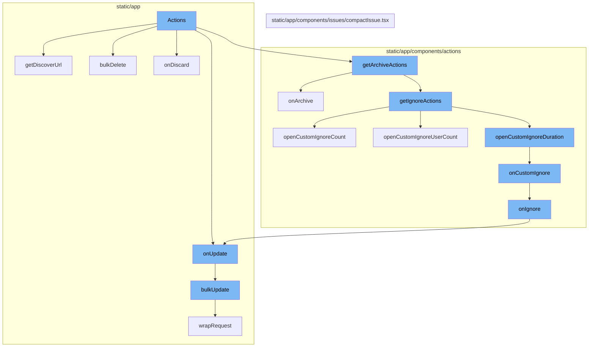
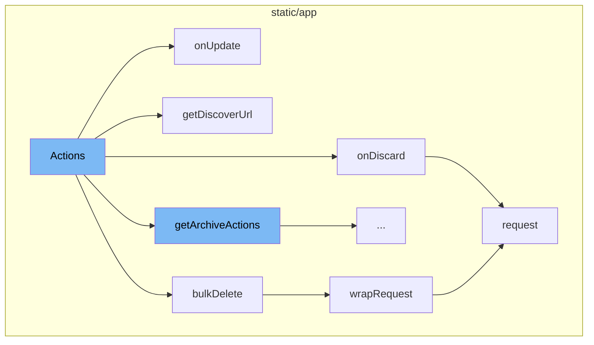
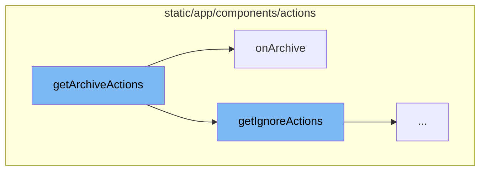
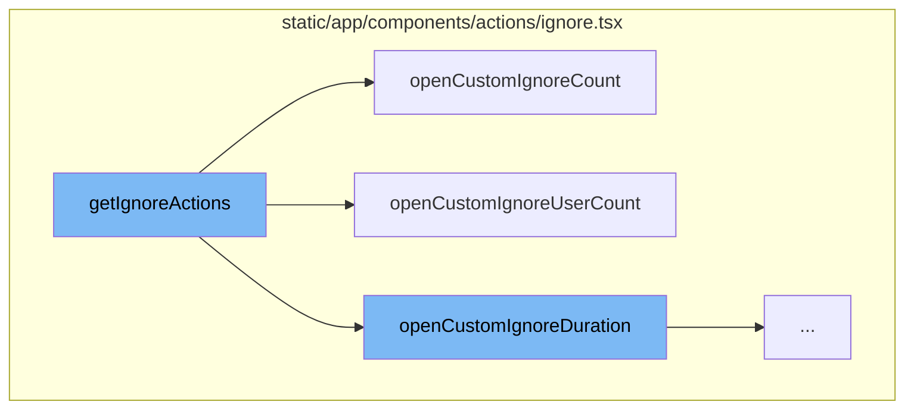
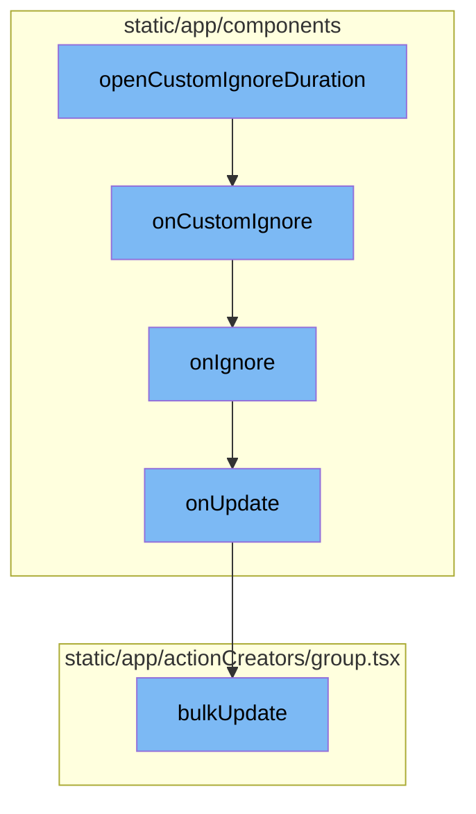

# Actions Overview

Actions in Sentry are operations that can be performed on issues. They are used to manage and control the state of issues in the system. Actions include updating, deleting, discarding, and archiving issues.

<SwmSnippet path="/static/app/views/issueDetails/actions/index.tsx" line="73">

---

## Actions Flow

The `Actions` function is the starting point of the flow. It takes in various properties such as `api`, `group`, `project`, `organization`, `disabled`, `event`, and `query`. It uses these properties to perform various actions on the issue such as updating, deleting, discarding, and archiving.

```tsx
export function Actions(props: Props) {
  const {api, group, project, organization, disabled, event, query = {}} = props;
  const {status, isBookmarked} = group;

  const bookmarkKey = isBookmarked ? 'unbookmark' : 'bookmark';
  const bookmarkTitle = isBookmarked ? t('Remove bookmark') : t('Bookmark');
  const hasRelease = !!project.features?.includes('releases');
  const isResolved = status === 'resolved';
  const isAutoResolved =
    group.status === 'resolved' ? group.statusDetails.autoResolved : undefined;
  const isIgnored = status === 'ignored';

  const hasDeleteAccess = organization.access.includes('event:admin');

  const config = useMemo(() => getConfigForIssueType(group, project), [group, project]);

  const {
    actions: {
      archiveUntilOccurrence: archiveUntilOccurrenceCap,
      delete: deleteCap,
      deleteAndDiscard: deleteDiscardCap,
```

---

</SwmSnippet>

<SwmSnippet path="/static/app/views/issueDetails/actions/index.tsx" line="182">

---

### onUpdate Function

The `onUpdate` function is called when there is a need to update the issue. It uses the `bulkUpdate` function to perform the update operation. The function also checks if the update is a resolution status and tracks the issue action accordingly.

```tsx
  const onUpdate = (data: UpdateData) => {
    addLoadingMessage(t('Saving changes\u2026'));

    bulkUpdate(
      api,
      {
        orgId: organization.slug,
        projectId: project.slug,
        itemIds: [group.id],
        data,
      },
      {
        complete: clearIndicators,
      }
    );

    if (isResolutionStatus(data)) {
      trackIssueAction(
        data.status,
        data.substatus,
        Object.keys(data.statusDetails || {})[0]
```

---

</SwmSnippet>

<SwmSnippet path="/static/app/views/issueDetails/actions/index.tsx" line="100">

---

### getDiscoverUrl Function

The `getDiscoverUrl` function is used to generate a URL for the Discover view of the issue. It creates a `discoverQuery` based on the issue's details and uses it to create a `discoverView`. The URL for this view is then returned.

```tsx
  const getDiscoverUrl = () => {
    const {title, type, shortId} = group;

    const groupIsOccurrenceBacked =
      group.issueCategory === IssueCategory.PERFORMANCE && !!event?.occurrence;

    const discoverQuery = {
      id: undefined,
      name: title || type,
      fields: ['title', 'release', 'environment', 'user.display', 'timestamp'],
      orderby: '-timestamp',
      query: `issue:${shortId}`,
      projects: [Number(project.id)],
      version: 2 as SavedQueryVersions,
      range: '90d',
      dataset:
        config.usesIssuePlatform || groupIsOccurrenceBacked
          ? DiscoverDatasets.ISSUE_PLATFORM
          : undefined,
    };

```

---

</SwmSnippet>

<SwmSnippet path="/static/app/actionCreators/group.tsx" line="302">

---

### bulkDelete Function

The `bulkDelete` function is used to delete multiple issues at once. It uses the `wrapRequest` function to make the API request for deletion.

```tsx
export function bulkDelete(
  api: Client,
  params: BulkDeleteParams,
  options: RequestCallbacks
) {
  const {itemIds} = params;
  const path = getUpdateUrl(params);

  const query: QueryArgs = paramsToQueryArgs(params);
  const id = uniqueId();

  GroupStore.onDelete(id, itemIds);

  return wrapRequest(
    api,
    path,
    {
      query,
      method: 'DELETE',
      success: response => {
        GroupStore.onDeleteSuccess(id, itemIds, response);
```

---

</SwmSnippet>

<SwmSnippet path="/static/app/views/issueDetails/actions/index.tsx" line="235">

---

### onDiscard Function

The `onDiscard` function is used to discard an issue. It makes an API request to update the issue with `discard: true`. Upon successful discard, it redirects the user to the issues page.

```tsx
  const onDiscard = () => {
    const id = uniqueId();
    addLoadingMessage(t('Discarding event\u2026'));

    GroupStore.onDiscard(id, group.id);

    api.request(`/issues/${group.id}/`, {
      method: 'PUT',
      data: {discard: true},
      success: response => {
        GroupStore.onDiscardSuccess(id, group.id, response);
        browserHistory.push(
          normalizeUrl({
            pathname: `/organizations/${organization.slug}/issues/`,
            query: {project: project.id},
          })
        );
      },
      error: error => {
        GroupStore.onDiscardError(id, group.id, error);
      },
```

---

</SwmSnippet>

<SwmSnippet path="/static/app/api.tsx" line="420">

---

### request Method

The `request` method is a generic method used to make API requests. It takes in a path and options, builds the full URL for the request, and makes the fetch request. It handles success, error, and complete scenarios for the request.

```tsx
  request(path: string, options: Readonly<RequestOptions> = {}): Request {
    const method = options.method || (options.data ? 'POST' : 'GET');

    let fullUrl = buildRequestUrl(this.baseUrl, path, options);

    let data = options.data;

    if (data !== undefined && method !== 'GET' && !(data instanceof FormData)) {
      data = JSON.stringify(data);
    }

    // TODO(epurkhiser): Mimicking the old jQuery API, data could be a string /
    // object for GET requests. jQuery just sticks it onto the URL as query
    // parameters
    if (method === 'GET' && data) {
      const queryString = typeof data === 'string' ? data : qs.stringify(data);

      if (queryString.length > 0) {
        fullUrl = fullUrl + (fullUrl.includes('?') ? '&' : '?') + queryString;
      }
    }
```

---

</SwmSnippet>

<SwmSnippet path="/static/app/actionCreators/group.tsx" line="287">

---

### wrapRequest Function

The `wrapRequest` function is used to wrap the `request` method with additional success, error, and complete callbacks. It is used in the `bulkDelete` function to make the delete request.

```tsx
function wrapRequest(
  api: Client,
  path: string,
  options: RequestOptions,
  extraParams: RequestCallbacks = {}
) {
  options.success = chainUtil(options.success, extraParams.success);
  options.error = chainUtil(options.error, extraParams.error);
  options.complete = chainUtil(options.complete, extraParams.complete);

  return api.request(path, options);
}
```

---

</SwmSnippet>

<SwmSnippet path="/static/app/components/actions/archive.tsx" line="45">

---

## Archive Actions

The `getArchiveActions` function is responsible for generating the archive actions that can be performed on an issue. It takes in a set of properties and returns an object containing the archive actions and a function `onArchive` to handle the archive action.

```tsx
export function getArchiveActions({
  shouldConfirm,
  confirmLabel,
  confirmMessage,
  onUpdate,
  disableArchiveUntilOccurrence,
}: GetArchiveActionsProps): {
  dropdownItems: MenuItemProps[];
  onArchive: (resolution: GroupStatusResolution) => void;
} {
  // TODO(workflow): Replace ignore actions with more archive actions
  const {dropdownItems} = getIgnoreActions({
    confirmLabel,
    onUpdate,
    shouldConfirm,
    confirmMessage,
  });

  const onArchive = (resolution: GroupStatusResolution) => {
    if (shouldConfirm && confirmMessage) {
      openConfirmModal({
```

---

</SwmSnippet>

<SwmSnippet path="/static/app/components/actions/archive.tsx" line="63">

---

### onArchive Function

The `onArchive` function is a callback function that is triggered when an archive action is performed. It takes in a resolution and checks if a confirmation is required. If so, it opens a confirmation modal. If not, it directly calls the `onUpdate` function with the resolution.

```tsx
  const onArchive = (resolution: GroupStatusResolution) => {
    if (shouldConfirm && confirmMessage) {
      openConfirmModal({
        onConfirm: () => onUpdate(resolution),
        message: confirmMessage(),
        confirmText: confirmLabel,
      });
    } else {
      onUpdate(resolution);
    }
  };
```

---

</SwmSnippet>

<SwmSnippet path="/static/app/components/actions/ignore.tsx" line="43">

---

## Ignore Actions

The `getIgnoreActions` function is the starting point of the flow. It defines several actions that can be performed, such as ignoring an issue for a certain duration, ignoring until a certain count is reached, or ignoring until a certain user count is reached. These actions are represented as modal windows that are opened when the corresponding action is triggered.

```tsx
export function getIgnoreActions({
  confirmLabel,
  confirmMessage,
  shouldConfirm,
  onUpdate,
}: Pick<
  IgnoreActionProps,
  'shouldConfirm' | 'confirmMessage' | 'confirmLabel' | 'onUpdate'
>) {
  const onIgnore = (
    statusDetails: IgnoredStatusDetails | undefined = {},
    {bypassConfirm} = {bypassConfirm: false}
  ) => {
    openConfirmModal({
      bypass: bypassConfirm || !shouldConfirm,
      onConfirm: () =>
        onUpdate({
          status: GroupStatus.IGNORED,
          statusDetails,
          substatus: GroupSubstatus.ARCHIVED_UNTIL_CONDITION_MET,
        }),
```

---

</SwmSnippet>

<SwmSnippet path="/static/app/components/actions/ignore.tsx" line="81">

---

### openCustomIgnoreCount Function

The `openCustomIgnoreCount` function opens a modal window that allows the user to specify the number of times an issue should occur before it is no longer ignored. The details selected in the modal are then passed to the `onCustomIgnore` function.

```tsx
  const openCustomIgnoreCount = () =>
    openModal(deps => (
      <CustomIgnoreCountModal
        {...deps}
        onSelected={details => onCustomIgnore(details)}
        label={t('Ignore this issue until it occurs again\u2026')}
        countLabel={t('Number of times')}
        countName="ignoreCount"
        windowName="ignoreWindow"
        windowOptions={IGNORE_WINDOWS}
      />
    ));
```

---

</SwmSnippet>

<SwmSnippet path="/static/app/components/actions/ignore.tsx" line="94">

---

### openCustomIgnoreUserCount Function

The `openCustomIgnoreUserCount` function opens a modal window that allows the user to specify the number of users an issue should affect before it is no longer ignored. The details selected in the modal are then passed to the `onCustomIgnore` function.

```tsx
  const openCustomIgnoreUserCount = () =>
    openModal(deps => (
      <CustomIgnoreCountModal
        {...deps}
        onSelected={details => onCustomIgnore(details)}
        label={t('Ignore this issue until it affects an additional\u2026')}
        countLabel={t('Number of users')}
        countName="ignoreUserCount"
        windowName="ignoreUserWindow"
        windowOptions={IGNORE_WINDOWS}
      />
    ));
```

---

</SwmSnippet>

<SwmSnippet path="/static/app/components/actions/ignore.tsx" line="73">

---

### openCustomIgnoreDuration Function

The `openCustomIgnoreDuration` function opens a modal window that allows the user to specify a duration for which an issue should be ignored. The details selected in the modal are then passed to the `onCustomIgnore` function.

```tsx
  const openCustomIgnoreDuration = () =>
    openModal(deps => (
      <CustomIgnoreDurationModal
        {...deps}
```

---

</SwmSnippet>

<SwmSnippet path="/static/app/components/actions/ignore.tsx" line="69">

---

### onCustomIgnore Function

The `onCustomIgnore` function is triggered when a user selects a custom ignore duration. It calls the `onIgnore` function with the selected status details and bypasses the confirmation.

```tsx
  const onCustomIgnore = (statusDetails: IgnoredStatusDetails) => {
    onIgnore(statusDetails, {bypassConfirm: true});
  };
```

---

</SwmSnippet>

<SwmSnippet path="/static/app/components/actions/ignore.tsx" line="52">

---

### onIgnore Function

The `onIgnore` function opens a confirmation modal. If the confirmation is bypassed or the user confirms, it calls the `onUpdate` function with the new status details.

```tsx
  const onIgnore = (
    statusDetails: IgnoredStatusDetails | undefined = {},
    {bypassConfirm} = {bypassConfirm: false}
  ) => {
    openConfirmModal({
      bypass: bypassConfirm || !shouldConfirm,
      onConfirm: () =>
        onUpdate({
          status: GroupStatus.IGNORED,
          statusDetails,
          substatus: GroupSubstatus.ARCHIVED_UNTIL_CONDITION_MET,
        }),
      message: confirmMessage?.() ?? null,
      confirmText: confirmLabel,
    });
  };
```

---

</SwmSnippet>

<SwmSnippet path="/static/app/components/issues/compactIssue.tsx" line="127">

---

### onUpdate Method

The `onUpdate` method is triggered when the status details are updated. It calls the `bulkUpdate` function with the new data.

```tsx
  onUpdate(data: Record<string, string>) {
    const issue = this.state.issue;
    if (!issue) {
      return;
    }
    addLoadingMessage(t('Saving changes\u2026'));

    bulkUpdate(
      this.props.api,
      {
        orgId: this.props.organization.slug,
        projectId: issue.project.slug,
        itemIds: [issue.id],
        data,
      },
      {
        complete: () => {
          clearIndicators();
        },
      }
    );
```

---

</SwmSnippet>

<SwmSnippet path="/static/app/actionCreators/group.tsx" line="337">

---

### bulkUpdate Function

The `bulkUpdate` function updates the group store and sends a PUT request to the server with the new data.

```tsx
export function bulkUpdate(
  api: Client,
  params: BulkUpdateParams,
  options: RequestCallbacks
) {
  const {itemIds, failSilently, data} = params;
  const path = getUpdateUrl(params);

  const query: QueryArgs = paramsToQueryArgs(params);
  const id = uniqueId();

  GroupStore.onUpdate(id, itemIds, data);

  return wrapRequest(
    api,
    path,
    {
      query,
      method: 'PUT',
      data,
      success: response => {
```

---

</SwmSnippet>



# Flow drill down

First, we'll zoom into this section of the flow:



<SwmSnippet path="/static/app/views/issueDetails/actions/index.tsx" line="73">

---

# Actions Flow

The `Actions` function is the starting point of the flow. It takes in various properties such as `api`, `group`, `project`, `organization`, `disabled`, `event`, and `query`. It uses these properties to perform various actions on the issue such as updating, deleting, discarding, and archiving.

```tsx
export function Actions(props: Props) {
  const {api, group, project, organization, disabled, event, query = {}} = props;
  const {status, isBookmarked} = group;

  const bookmarkKey = isBookmarked ? 'unbookmark' : 'bookmark';
  const bookmarkTitle = isBookmarked ? t('Remove bookmark') : t('Bookmark');
  const hasRelease = !!project.features?.includes('releases');
  const isResolved = status === 'resolved';
  const isAutoResolved =
    group.status === 'resolved' ? group.statusDetails.autoResolved : undefined;
  const isIgnored = status === 'ignored';

  const hasDeleteAccess = organization.access.includes('event:admin');

  const config = useMemo(() => getConfigForIssueType(group, project), [group, project]);

  const {
    actions: {
      archiveUntilOccurrence: archiveUntilOccurrenceCap,
      delete: deleteCap,
      deleteAndDiscard: deleteDiscardCap,
```

---

</SwmSnippet>

<SwmSnippet path="/static/app/views/issueDetails/actions/index.tsx" line="182">

---

# onUpdate Function

The `onUpdate` function is called when there is a need to update the issue. It uses the `bulkUpdate` function to perform the update operation. The function also checks if the update is a resolution status and tracks the issue action accordingly.

```tsx
  const onUpdate = (data: UpdateData) => {
    addLoadingMessage(t('Saving changes\u2026'));

    bulkUpdate(
      api,
      {
        orgId: organization.slug,
        projectId: project.slug,
        itemIds: [group.id],
        data,
      },
      {
        complete: clearIndicators,
      }
    );

    if (isResolutionStatus(data)) {
      trackIssueAction(
        data.status,
        data.substatus,
        Object.keys(data.statusDetails || {})[0]
```

---

</SwmSnippet>

<SwmSnippet path="/static/app/views/issueDetails/actions/index.tsx" line="100">

---

# getDiscoverUrl Function

The `getDiscoverUrl` function is used to generate a URL for the Discover view of the issue. It creates a `discoverQuery` based on the issue's details and uses it to create a `discoverView`. The URL for this view is then returned.

```tsx
  const getDiscoverUrl = () => {
    const {title, type, shortId} = group;

    const groupIsOccurrenceBacked =
      group.issueCategory === IssueCategory.PERFORMANCE && !!event?.occurrence;

    const discoverQuery = {
      id: undefined,
      name: title || type,
      fields: ['title', 'release', 'environment', 'user.display', 'timestamp'],
      orderby: '-timestamp',
      query: `issue:${shortId}`,
      projects: [Number(project.id)],
      version: 2 as SavedQueryVersions,
      range: '90d',
      dataset:
        config.usesIssuePlatform || groupIsOccurrenceBacked
          ? DiscoverDatasets.ISSUE_PLATFORM
          : undefined,
    };

```

---

</SwmSnippet>

<SwmSnippet path="/static/app/actionCreators/group.tsx" line="302">

---

# bulkDelete Function

The `bulkDelete` function is used to delete multiple issues at once. It uses the `wrapRequest` function to make the API request for deletion.

```tsx
export function bulkDelete(
  api: Client,
  params: BulkDeleteParams,
  options: RequestCallbacks
) {
  const {itemIds} = params;
  const path = getUpdateUrl(params);

  const query: QueryArgs = paramsToQueryArgs(params);
  const id = uniqueId();

  GroupStore.onDelete(id, itemIds);

  return wrapRequest(
    api,
    path,
    {
      query,
      method: 'DELETE',
      success: response => {
        GroupStore.onDeleteSuccess(id, itemIds, response);
```

---

</SwmSnippet>

<SwmSnippet path="/static/app/views/issueDetails/actions/index.tsx" line="235">

---

# onDiscard Function

The `onDiscard` function is used to discard an issue. It makes an API request to update the issue with `discard: true`. Upon successful discard, it redirects the user to the issues page.

```tsx
  const onDiscard = () => {
    const id = uniqueId();
    addLoadingMessage(t('Discarding event\u2026'));

    GroupStore.onDiscard(id, group.id);

    api.request(`/issues/${group.id}/`, {
      method: 'PUT',
      data: {discard: true},
      success: response => {
        GroupStore.onDiscardSuccess(id, group.id, response);
        browserHistory.push(
          normalizeUrl({
            pathname: `/organizations/${organization.slug}/issues/`,
            query: {project: project.id},
          })
        );
      },
      error: error => {
        GroupStore.onDiscardError(id, group.id, error);
      },
```

---

</SwmSnippet>

<SwmSnippet path="/static/app/api.tsx" line="420">

---

# request Method

The `request` method is a generic method used to make API requests. It takes in a path and options, builds the full URL for the request, and makes the fetch request. It handles success, error, and complete scenarios for the request.

```tsx
  request(path: string, options: Readonly<RequestOptions> = {}): Request {
    const method = options.method || (options.data ? 'POST' : 'GET');

    let fullUrl = buildRequestUrl(this.baseUrl, path, options);

    let data = options.data;

    if (data !== undefined && method !== 'GET' && !(data instanceof FormData)) {
      data = JSON.stringify(data);
    }

    // TODO(epurkhiser): Mimicking the old jQuery API, data could be a string /
    // object for GET requests. jQuery just sticks it onto the URL as query
    // parameters
    if (method === 'GET' && data) {
      const queryString = typeof data === 'string' ? data : qs.stringify(data);

      if (queryString.length > 0) {
        fullUrl = fullUrl + (fullUrl.includes('?') ? '&' : '?') + queryString;
      }
    }
```

---

</SwmSnippet>

<SwmSnippet path="/static/app/actionCreators/group.tsx" line="287">

---

# wrapRequest Function

The `wrapRequest` function is used to wrap the `request` method with additional success, error, and complete callbacks. It is used in the `bulkDelete` function to make the delete request.

```tsx
function wrapRequest(
  api: Client,
  path: string,
  options: RequestOptions,
  extraParams: RequestCallbacks = {}
) {
  options.success = chainUtil(options.success, extraParams.success);
  options.error = chainUtil(options.error, extraParams.error);
  options.complete = chainUtil(options.complete, extraParams.complete);

  return api.request(path, options);
}
```

---

</SwmSnippet>

Now, lets zoom into this section of the flow:



# Actions Flow

Actions in Sentry are operations that can be performed on issues. They are used to manage and control the state of issues in the system.

<SwmSnippet path="/static/app/components/actions/archive.tsx" line="45">

---

## getArchiveActions Function

The `getArchiveActions` function is responsible for generating the archive actions that can be performed on an issue. It takes in a set of properties and returns an object containing the archive actions and a function `onArchive` to handle the archive action.

```tsx
export function getArchiveActions({
  shouldConfirm,
  confirmLabel,
  confirmMessage,
  onUpdate,
  disableArchiveUntilOccurrence,
}: GetArchiveActionsProps): {
  dropdownItems: MenuItemProps[];
  onArchive: (resolution: GroupStatusResolution) => void;
} {
  // TODO(workflow): Replace ignore actions with more archive actions
  const {dropdownItems} = getIgnoreActions({
    confirmLabel,
    onUpdate,
    shouldConfirm,
    confirmMessage,
  });

  const onArchive = (resolution: GroupStatusResolution) => {
    if (shouldConfirm && confirmMessage) {
      openConfirmModal({
```

---

</SwmSnippet>

<SwmSnippet path="/static/app/components/actions/archive.tsx" line="63">

---

### onArchive Function

The `onArchive` function is a callback function that is triggered when an archive action is performed. It takes in a resolution and checks if a confirmation is required. If so, it opens a confirmation modal. If not, it directly calls the `onUpdate` function with the resolution.

```tsx
  const onArchive = (resolution: GroupStatusResolution) => {
    if (shouldConfirm && confirmMessage) {
      openConfirmModal({
        onConfirm: () => onUpdate(resolution),
        message: confirmMessage(),
        confirmText: confirmLabel,
      });
    } else {
      onUpdate(resolution);
    }
  };
```

---

</SwmSnippet>

Now, lets zoom into this section of the flow:



<SwmSnippet path="/static/app/components/actions/ignore.tsx" line="43">

---

# getIgnoreActions Function

The `getIgnoreActions` function is the starting point of the flow. It defines several actions that can be performed, such as ignoring an issue for a certain duration, ignoring until a certain count is reached, or ignoring until a certain user count is reached. These actions are represented as modal windows that are opened when the corresponding action is triggered.

```tsx
export function getIgnoreActions({
  confirmLabel,
  confirmMessage,
  shouldConfirm,
  onUpdate,
}: Pick<
  IgnoreActionProps,
  'shouldConfirm' | 'confirmMessage' | 'confirmLabel' | 'onUpdate'
>) {
  const onIgnore = (
    statusDetails: IgnoredStatusDetails | undefined = {},
    {bypassConfirm} = {bypassConfirm: false}
  ) => {
    openConfirmModal({
      bypass: bypassConfirm || !shouldConfirm,
      onConfirm: () =>
        onUpdate({
          status: GroupStatus.IGNORED,
          statusDetails,
          substatus: GroupSubstatus.ARCHIVED_UNTIL_CONDITION_MET,
        }),
```

---

</SwmSnippet>

<SwmSnippet path="/static/app/components/actions/ignore.tsx" line="81">

---

# openCustomIgnoreCount Function

The `openCustomIgnoreCount` function opens a modal window that allows the user to specify the number of times an issue should occur before it is no longer ignored. The details selected in the modal are then passed to the `onCustomIgnore` function.

```tsx
  const openCustomIgnoreCount = () =>
    openModal(deps => (
      <CustomIgnoreCountModal
        {...deps}
        onSelected={details => onCustomIgnore(details)}
        label={t('Ignore this issue until it occurs again\u2026')}
        countLabel={t('Number of times')}
        countName="ignoreCount"
        windowName="ignoreWindow"
        windowOptions={IGNORE_WINDOWS}
      />
    ));
```

---

</SwmSnippet>

<SwmSnippet path="/static/app/components/actions/ignore.tsx" line="94">

---

# openCustomIgnoreUserCount Function

The `openCustomIgnoreUserCount` function opens a modal window that allows the user to specify the number of users an issue should affect before it is no longer ignored. The details selected in the modal are then passed to the `onCustomIgnore` function.

```tsx
  const openCustomIgnoreUserCount = () =>
    openModal(deps => (
      <CustomIgnoreCountModal
        {...deps}
        onSelected={details => onCustomIgnore(details)}
        label={t('Ignore this issue until it affects an additional\u2026')}
        countLabel={t('Number of users')}
        countName="ignoreUserCount"
        windowName="ignoreUserWindow"
        windowOptions={IGNORE_WINDOWS}
      />
    ));
```

---

</SwmSnippet>

<SwmSnippet path="/static/app/components/actions/ignore.tsx" line="73">

---

# openCustomIgnoreDuration Function

The `openCustomIgnoreDuration` function opens a modal window that allows the user to specify a duration for which an issue should be ignored. The details selected in the modal are then passed to the `onCustomIgnore` function.

```tsx
  const openCustomIgnoreDuration = () =>
    openModal(deps => (
      <CustomIgnoreDurationModal
        {...deps}
```

---

</SwmSnippet>

Now, lets zoom into this section of the flow:



<SwmSnippet path="/static/app/components/actions/ignore.tsx" line="73">

---

# Actions Flow

The `openCustomIgnoreDuration` function opens a modal for custom ignore duration. It passes the `onCustomIgnore` function as a prop to the `CustomIgnoreDurationModal` component.

```tsx
  const openCustomIgnoreDuration = () =>
    openModal(deps => (
      <CustomIgnoreDurationModal
        {...deps}
        onSelected={details => onCustomIgnore(details)}
      />
    ));
```

---

</SwmSnippet>

<SwmSnippet path="/static/app/components/actions/ignore.tsx" line="69">

---

The `onCustomIgnore` function is triggered when a user selects a custom ignore duration. It calls the `onIgnore` function with the selected status details and bypasses the confirmation.

```tsx
  const onCustomIgnore = (statusDetails: IgnoredStatusDetails) => {
    onIgnore(statusDetails, {bypassConfirm: true});
  };
```

---

</SwmSnippet>

<SwmSnippet path="/static/app/components/actions/ignore.tsx" line="52">

---

The `onIgnore` function opens a confirmation modal. If the confirmation is bypassed or the user confirms, it calls the `onUpdate` function with the new status details.

```tsx
  const onIgnore = (
    statusDetails: IgnoredStatusDetails | undefined = {},
    {bypassConfirm} = {bypassConfirm: false}
  ) => {
    openConfirmModal({
      bypass: bypassConfirm || !shouldConfirm,
      onConfirm: () =>
        onUpdate({
          status: GroupStatus.IGNORED,
          statusDetails,
          substatus: GroupSubstatus.ARCHIVED_UNTIL_CONDITION_MET,
        }),
      message: confirmMessage?.() ?? null,
      confirmText: confirmLabel,
    });
  };
```

---

</SwmSnippet>

<SwmSnippet path="/static/app/components/issues/compactIssue.tsx" line="127">

---

The `onUpdate` method is triggered when the status details are updated. It calls the `bulkUpdate` function with the new data.

```tsx
  onUpdate(data: Record<string, string>) {
    const issue = this.state.issue;
    if (!issue) {
      return;
    }
    addLoadingMessage(t('Saving changes\u2026'));

    bulkUpdate(
      this.props.api,
      {
        orgId: this.props.organization.slug,
        projectId: issue.project.slug,
        itemIds: [issue.id],
        data,
      },
      {
        complete: () => {
          clearIndicators();
        },
      }
    );
```

---

</SwmSnippet>

<SwmSnippet path="/static/app/actionCreators/group.tsx" line="337">

---

The `bulkUpdate` function updates the group store and sends a PUT request to the server with the new data.

```tsx
export function bulkUpdate(
  api: Client,
  params: BulkUpdateParams,
  options: RequestCallbacks
) {
  const {itemIds, failSilently, data} = params;
  const path = getUpdateUrl(params);

  const query: QueryArgs = paramsToQueryArgs(params);
  const id = uniqueId();

  GroupStore.onUpdate(id, itemIds, data);

  return wrapRequest(
    api,
    path,
    {
      query,
      method: 'PUT',
      data,
      success: response => {
```

---

</SwmSnippet>

&nbsp;

*This is an auto-generated document by Swimm AI 🌊 and has not yet been verified by a human*

<SwmMeta version="3.0.0" repo-id="Z2l0aHViJTNBJTNBc2VudHJ5LWRlbW8lM0ElM0FTd2ltbS1EZW1v" repo-name="sentry-demo" doc-type="flows"><sup>Powered by [Swimm](/)</sup></SwmMeta>
