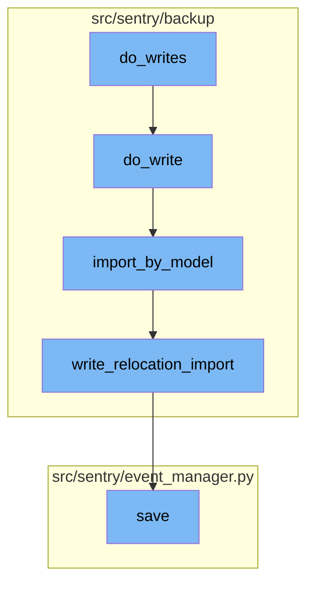
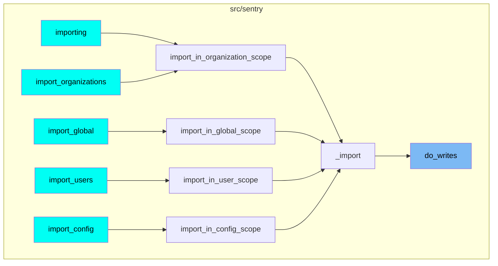

<SwmSnippet path="/src/sentry/backup/imports.py" line="395">

---

## do_writes Function

The `do_writes` function is responsible for writing data to the database. It takes a `pk_map` as an argument, which is a map of primary keys. It iterates over the JSON models yielded from the `yield_json_models` function. If the model name matches the `org_auth_token_model_name`, it appends the JSON data to `deferred_org_auth_tokens` and continues to the next iteration. Otherwise, it calls the `do_write` function.

```python
    def do_writes(pk_map: PrimaryKeyMap) -> None:
        nonlocal deferred_org_auth_tokens, import_write_context

        for model_name, json_data, offset in yield_json_models(content):
            if model_name == org_auth_token_model_name:
                deferred_org_auth_tokens.append(json_data)
                continue

            do_write(import_write_context, pk_map, model_name, json_data, offset)
```

---

</SwmSnippet>

<SwmSnippet path="/src/sentry/backup/imports.py" line="296">

---

## do_write Function

The `do_write` function is responsible for writing a single model. It takes several arguments including `import_write_context`, `pk_map`, `model_name`, `json_data`, and `offset`. It first gets the model relations from the `import_write_context`. If there are no model relations, it returns. Otherwise, it gets the dependencies for relocation and the importer for the model. It then calls the `import_by_model` function.

```python
    def do_write(
        import_write_context: ImportWriteContext,
        pk_map: PrimaryKeyMap,
        model_name: NormalizedModelName,
        json_data: Any,
        offset: int,
    ) -> None:
        model_relations = import_write_context.dependencies.get(model_name)
        if not model_relations:
            return

        dep_models = {get_model_name(d) for d in model_relations.get_dependencies_for_relocation()}
        import_by_model = ImportExportService.get_importer_for_model(model_relations.model)
        model_name_str = str(model_name)
        min_ordinal = offset + 1

        extra = {
            "model_name": model_name_str,
            "import_uuid": flags.import_uuid,
            "min_ordinal": min_ordinal,
        }
```

---

</SwmSnippet>

<SwmSnippet path="/src/sentry/backup/services/import_export/impl.py" line="106">

---

## import_by_model Function

The `import_by_model` function is responsible for importing data by model. It takes several arguments including `model_name`, `scope`, `flags`, `filter_by`, `pk_map`, `json_data`, and `min_ordinal`. It performs several checks and validations before importing the data. If the import is successful, it returns an `RpcImportOk` object, otherwise it returns an `RpcImportError` object.

```python
    def import_by_model(
        self,
        *,
        model_name: str,
        scope: RpcImportScope | None = None,
        flags: RpcImportFlags,
        filter_by: list[RpcFilter],
        pk_map: RpcPrimaryKeyMap,
        json_data: str,
        min_ordinal: int,
    ) -> RpcImportResult:
        if min_ordinal < 1:
            return RpcImportError(
                kind=RpcImportErrorKind.InvalidMinOrdinal,
                on=InstanceID(model_name),
                reason=f"The model `{model_name}` was offset with an invalid `min_ordinal` of `{min_ordinal}`",
            )

        batch_model_name = NormalizedModelName(model_name)
        model = get_model(batch_model_name)
        if model is None:
```

---

</SwmSnippet>

<SwmSnippet path="/src/sentry/backup/mixins.py" line="16">

---

## write_relocation_import Function

The `write_relocation_import` function is responsible for writing the import data after relocation. It takes `scope` and `flags` as arguments. It first gets all unique sets that will potentially cause collisions. If the relocation scope is `Config`, it checks if there is an existing entry with the same unique set. If there is, it reuses the existing data or overwrites it depending on the `overwrite_configs` flag. If there is no existing entry, it writes a new entry.

```python
    def write_relocation_import(
        self, scope: ImportScope, flags: ImportFlags
    ) -> tuple[int, ImportKind] | None:
        # Get all unique sets that will potentially cause collisions.
        uniq_sets = dependencies()[get_model_name(self)].get_uniques_without_foreign_keys()  # type: ignore[arg-type]

        # Don't use this mixin for models with multiple unique sets; write custom logic instead.
        assert len(uniq_sets) <= 1

        # Must set `__relocation_custom_ordinal__` on models that use this mixin.
        assert getattr(self.__class__, "__relocation_custom_ordinal__", None) is not None

        if self.get_relocation_scope() == RelocationScope.Config:  # type: ignore[attr-defined]
            if len(uniq_sets) == 1:
                uniq_set = uniq_sets[0]
                query = dict()
                for uniq_field_name in uniq_set:
                    if getattr(self, uniq_field_name, None) is not None:
                        query[uniq_field_name] = getattr(self, uniq_field_name)

                # If all of the fields in the unique set are NULL, we'll avoid a collision, so exit
```

---

</SwmSnippet>

<SwmSnippet path="/src/sentry/event_manager.py" line="442">

---

## save Function

The `save` function is responsible for saving the event after normalizing and processing it. It saves adjacent models such as releases and environments to postgres and writes the event into the eventstream. It re-inserts events with duplicate IDs into Snuba, which is responsible for deduplicating events. It also increments counters and frequencies before events get inserted to the eventstream.

```python
    def save(
        self,
        project_id: int | None,
        raw: bool = False,
        assume_normalized: bool = False,
        start_time: float | None = None,
        cache_key: str | None = None,
        skip_send_first_transaction: bool = False,
        has_attachments: bool = False,
    ) -> Event:
        """
        After normalizing and processing an event, save adjacent models such as
        releases and environments to postgres and write the event into
        eventstream. From there it will be picked up by Snuba and
        post-processing.

        We re-insert events with duplicate IDs into Snuba, which is responsible
        for deduplicating events. Since deduplication in Snuba is on the primary
        key (based on event ID, project ID and day), events with same IDs are only
        deduplicated if their timestamps fall on the same day. The latest event
        always wins and overwrites the value of events received earlier in that day.
```

---

</SwmSnippet>

# Flow drill down



<SwmSnippet path="/src/sentry/backup/imports.py" line="395">

---

# do_writes function

The `do_writes` function is responsible for writing data to the database. It takes a `pk_map` as an argument, which is a map of primary keys. It iterates over the JSON models yielded from the `yield_json_models` function. If the model name matches the `org_auth_token_model_name`, it appends the JSON data to `deferred_org_auth_tokens` and continues to the next iteration. Otherwise, it calls the `do_write` function.

```python
    def do_writes(pk_map: PrimaryKeyMap) -> None:
        nonlocal deferred_org_auth_tokens, import_write_context

        for model_name, json_data, offset in yield_json_models(content):
            if model_name == org_auth_token_model_name:
                deferred_org_auth_tokens.append(json_data)
                continue

            do_write(import_write_context, pk_map, model_name, json_data, offset)
```

---

</SwmSnippet>

<SwmSnippet path="/src/sentry/backup/imports.py" line="296">

---

# do_write function

The `do_write` function is responsible for writing a single model. It takes several arguments including `import_write_context`, `pk_map`, `model_name`, `json_data`, and `offset`. It first gets the model relations from the `import_write_context`. If there are no model relations, it returns. Otherwise, it gets the dependencies for relocation and the importer for the model. It then calls the `import_by_model` function.

```python
    def do_write(
        import_write_context: ImportWriteContext,
        pk_map: PrimaryKeyMap,
        model_name: NormalizedModelName,
        json_data: Any,
        offset: int,
    ) -> None:
        model_relations = import_write_context.dependencies.get(model_name)
        if not model_relations:
            return

        dep_models = {get_model_name(d) for d in model_relations.get_dependencies_for_relocation()}
        import_by_model = ImportExportService.get_importer_for_model(model_relations.model)
        model_name_str = str(model_name)
        min_ordinal = offset + 1

        extra = {
            "model_name": model_name_str,
            "import_uuid": flags.import_uuid,
            "min_ordinal": min_ordinal,
        }
```

---

</SwmSnippet>

<SwmSnippet path="/src/sentry/backup/services/import_export/impl.py" line="106">

---

# import_by_model function

The `import_by_model` function is responsible for importing data by model. It takes several arguments including `model_name`, `scope`, `flags`, `filter_by`, `pk_map`, `json_data`, and `min_ordinal`. It performs several checks and validations before importing the data. If the import is successful, it returns an `RpcImportOk` object, otherwise it returns an `RpcImportError` object.

```python
    def import_by_model(
        self,
        *,
        model_name: str,
        scope: RpcImportScope | None = None,
        flags: RpcImportFlags,
        filter_by: list[RpcFilter],
        pk_map: RpcPrimaryKeyMap,
        json_data: str,
        min_ordinal: int,
    ) -> RpcImportResult:
        if min_ordinal < 1:
            return RpcImportError(
                kind=RpcImportErrorKind.InvalidMinOrdinal,
                on=InstanceID(model_name),
                reason=f"The model `{model_name}` was offset with an invalid `min_ordinal` of `{min_ordinal}`",
            )

        batch_model_name = NormalizedModelName(model_name)
        model = get_model(batch_model_name)
        if model is None:
```

---

</SwmSnippet>

<SwmSnippet path="/src/sentry/backup/mixins.py" line="16">

---

# write_relocation_import function

The `write_relocation_import` function is responsible for writing the import data after relocation. It takes `scope` and `flags` as arguments. It first gets all unique sets that will potentially cause collisions. If the relocation scope is `Config`, it checks if there is an existing entry with the same unique set. If there is, it reuses the existing data or overwrites it depending on the `overwrite_configs` flag. If there is no existing entry, it writes a new entry.

```python
    def write_relocation_import(
        self, scope: ImportScope, flags: ImportFlags
    ) -> tuple[int, ImportKind] | None:
        # Get all unique sets that will potentially cause collisions.
        uniq_sets = dependencies()[get_model_name(self)].get_uniques_without_foreign_keys()  # type: ignore[arg-type]

        # Don't use this mixin for models with multiple unique sets; write custom logic instead.
        assert len(uniq_sets) <= 1

        # Must set `__relocation_custom_ordinal__` on models that use this mixin.
        assert getattr(self.__class__, "__relocation_custom_ordinal__", None) is not None

        if self.get_relocation_scope() == RelocationScope.Config:  # type: ignore[attr-defined]
            if len(uniq_sets) == 1:
                uniq_set = uniq_sets[0]
                query = dict()
                for uniq_field_name in uniq_set:
                    if getattr(self, uniq_field_name, None) is not None:
                        query[uniq_field_name] = getattr(self, uniq_field_name)

                # If all of the fields in the unique set are NULL, we'll avoid a collision, so exit
```

---

</SwmSnippet>

<SwmSnippet path="/src/sentry/event_manager.py" line="442">

---

# save function

The `save` function is responsible for saving the event after normalizing and processing it. It saves adjacent models such as releases and environments to postgres and writes the event into the eventstream. It re-inserts events with duplicate IDs into Snuba, which is responsible for deduplicating events. It also increments counters and frequencies before events get inserted to the eventstream.

```python
    def save(
        self,
        project_id: int | None,
        raw: bool = False,
        assume_normalized: bool = False,
        start_time: float | None = None,
        cache_key: str | None = None,
        skip_send_first_transaction: bool = False,
        has_attachments: bool = False,
    ) -> Event:
        """
        After normalizing and processing an event, save adjacent models such as
        releases and environments to postgres and write the event into
        eventstream. From there it will be picked up by Snuba and
        post-processing.

        We re-insert events with duplicate IDs into Snuba, which is responsible
        for deduplicating events. Since deduplication in Snuba is on the primary
        key (based on event ID, project ID and day), events with same IDs are only
        deduplicated if their timestamps fall on the same day. The latest event
        always wins and overwrites the value of events received earlier in that day.
```

---

</SwmSnippet>

# Where is this flow used?

This flow is used multiple times in the codebase as represented in the following diagram:



&nbsp;

*This is an auto-generated document by Swimm AI 🌊 and has not yet been verified by a human*

<SwmMeta version="3.0.0" repo-id="Z2l0aHViJTNBJTNBc2VudHJ5LWRlbW8lM0ElM0FTd2ltbS1EZW1v" repo-name="sentry-demo" doc-type="flows"><sup>Powered by [Swimm](/)</sup></SwmMeta>
