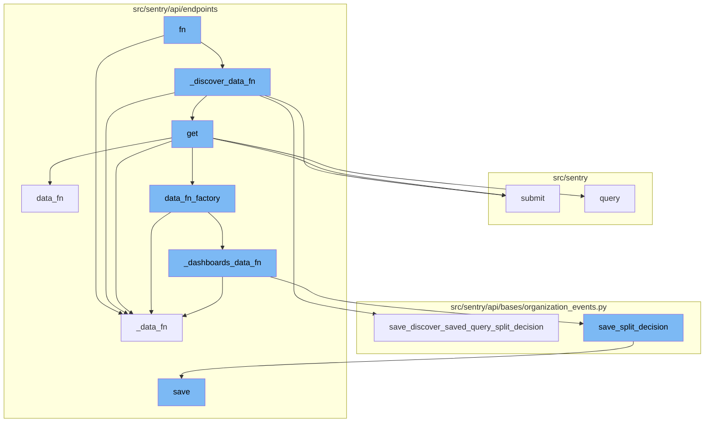
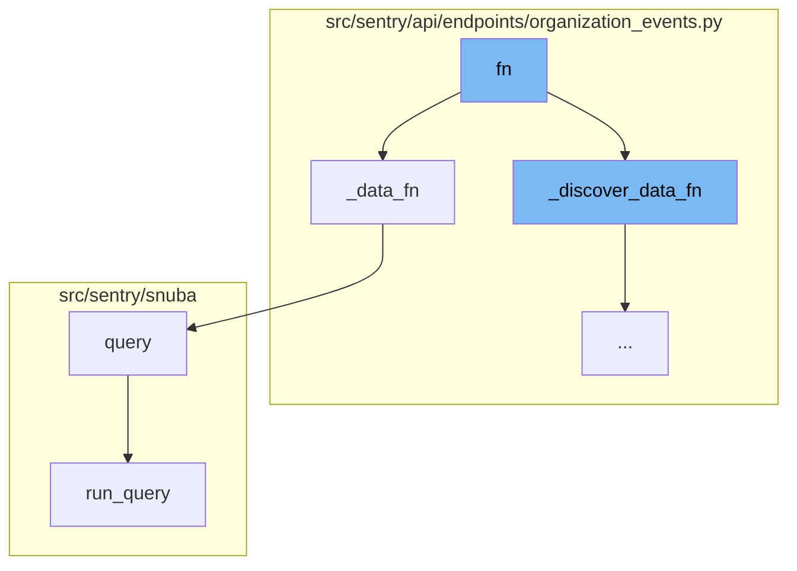
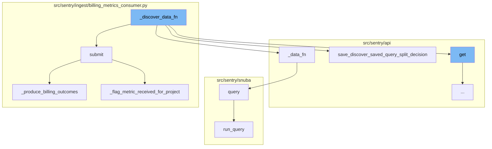
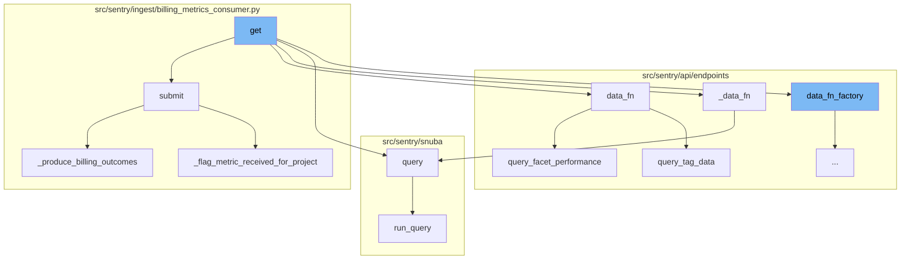
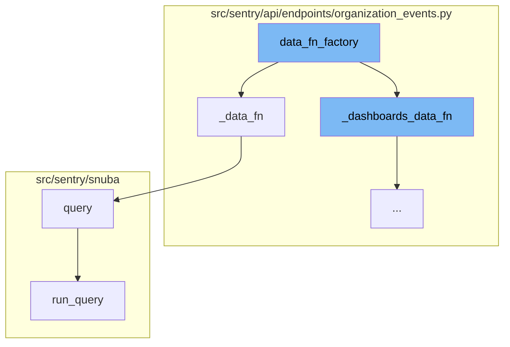
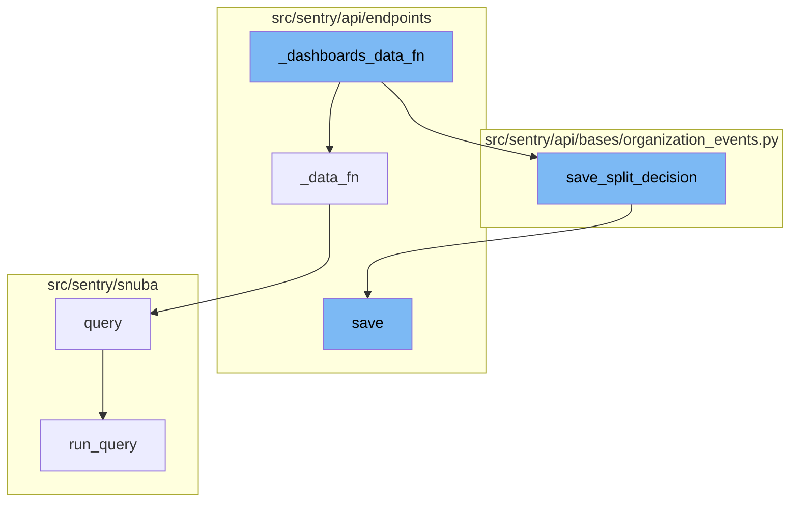

<SwmSnippet path="/src/sentry/api/endpoints/organization_events.py" line="564">

---

# Function 'fn'

The function 'fn' is a decision-making function that determines which data function to call based on certain conditions. It takes in parameters 'offset' and 'limit' and returns a dictionary.

```python
            def fn(offset, limit) -> dict[str, Any]:
                if save_discover_dataset_decision and discover_saved_query_id:
                    return _discover_data_fn(
                        scopedDataset, offset, limit, scoped_query, discover_saved_query_id
                    )

                if not (metrics_enhanced and dashboard_widget_id):
                    return _data_fn(scopedDataset, offset, limit, scoped_query)

                return _dashboards_data_fn(
                    scopedDataset, offset, limit, scoped_query, dashboard_widget_id
                )
```

---

</SwmSnippet>

<SwmSnippet path="/src/sentry/api/endpoints/organization_events.py" line="357">

---

## Function '\_data_fn'

The function '\_data_fn' is one of the possible functions that 'fn' can call. It takes in parameters 'scopedDataset', 'offset', 'limit', and 'query' and returns a dictionary. It is responsible for querying the scoped dataset with the provided parameters.

```python
        def _data_fn(scopedDataset, offset, limit, query) -> dict[str, Any]:
            return scopedDataset.query(
                selected_columns=self.get_field_list(organization, request),
                query=query,
                params=params,
                snuba_params=snuba_params,
                equations=self.get_equation_list(organization, request),
                orderby=self.get_orderby(request),
                offset=offset,
                limit=limit,
                referrer=referrer,
                auto_fields=True,
                auto_aggregations=True,
                use_aggregate_conditions=True,
                allow_metric_aggregates=allow_metric_aggregates,
                transform_alias_to_input_format=True,
                # Whether the flag is enabled or not, regardless of the referrer
                has_metrics=use_metrics,
                use_metrics_layer=batch_features.get("organizations:use-metrics-layer", False),
                on_demand_metrics_enabled=on_demand_metrics_enabled,
                on_demand_metrics_type=on_demand_metrics_type,
```

---

</SwmSnippet>

<SwmSnippet path="/src/sentry/snuba/spans_metrics.py" line="21">

---

### Function 'query'

The function 'query' is called within '\_data_fn'. It takes in a variety of parameters to build and run a query, and then processes the results. This function is a key part of the data retrieval process.

```python
def query(
    selected_columns,
    query,
    params,
    snuba_params=None,
    equations=None,
    orderby=None,
    offset=None,
    limit=50,
    referrer=None,
    auto_fields=False,
    auto_aggregations=False,
    include_equation_fields=False,
    allow_metric_aggregates=False,
    use_aggregate_conditions=False,
    conditions=None,
    functions_acl=None,
    transform_alias_to_input_format=False,
    sample=None,
    has_metrics=False,
    use_metrics_layer=False,
```

---

</SwmSnippet>

<SwmSnippet path="/src/sentry/snuba/metrics_layer/query.py" line="143">

---

#### Function 'run_query'

The function 'run_query' is the final step in this flow. It is called within 'query' and is the entry point for executing a metrics query in Snuba. It returns the result of the query.

```python
def run_query(request: Request) -> Mapping[str, Any]:
    """
    Entrypoint for executing a metrics query in Snuba.
    """
    return bulk_run_query([request])[0]
```

---

</SwmSnippet>

<SwmSnippet path="/src/sentry/api/endpoints/organization_events.py" line="451">

---

# \_discover_data_fn Function

The `_discover_data_fn` function is responsible for handling the discovery of data. It takes in parameters such as the dataset, offset, limit, and query. It first tries to get the saved query from the database. If the widget has a split, it calls the `_data_fn` function. If not, it infers the dataset from the query and saves the decision. If the dataset cannot be inferred, it runs both queries and saves the decision.

```python
        def _discover_data_fn(scopedDataset, offset, limit, scoped_query, discover_saved_query_id):
            try:
                discover_query = DiscoverSavedQuery.objects.get(
                    id=discover_saved_query_id, organization=organization
                )
                does_widget_have_split = (
                    discover_query.dataset is not DiscoverSavedQueryTypes.DISCOVER
                )
                if does_widget_have_split:
                    return _data_fn(scopedDataset, offset, limit, scoped_query)

                dataset_inferred_from_query = dataset_split_decision_inferred_from_query(
                    self.get_field_list(organization, request),
                    scoped_query,
                )
                has_errors = False
                has_transactions = False

                # See if we can infer which dataset based on selected columns and query string.
                if dataset_inferred_from_query is not None:
                    result = _data_fn(
```

---

</SwmSnippet>

<SwmSnippet path="/src/sentry/ingest/billing_metrics_consumer.py" line="77">

---

# submit Function

The `submit` function is used to process the message payload. It calls the `_produce_billing_outcomes` and `_flag_metric_received_for_project` functions to handle the payload.

```python
    def submit(self, message: Message[KafkaPayload]) -> None:
        assert not self.__closed

        payload = self._get_payload(message)

        self._produce_billing_outcomes(payload)
        self._flag_metric_received_for_project(payload)

        self.__next_step.submit(message)
```

---

</SwmSnippet>

<SwmSnippet path="/src/sentry/api/endpoints/organization_events.py" line="357">

---

# \_data_fn Function

The `_data_fn` function is used to query the dataset. It takes in parameters such as the dataset, offset, limit, and query. It returns the result of the query.

```python
        def _data_fn(scopedDataset, offset, limit, query) -> dict[str, Any]:
            return scopedDataset.query(
                selected_columns=self.get_field_list(organization, request),
                query=query,
                params=params,
                snuba_params=snuba_params,
                equations=self.get_equation_list(organization, request),
                orderby=self.get_orderby(request),
                offset=offset,
                limit=limit,
                referrer=referrer,
                auto_fields=True,
                auto_aggregations=True,
                use_aggregate_conditions=True,
                allow_metric_aggregates=allow_metric_aggregates,
                transform_alias_to_input_format=True,
                # Whether the flag is enabled or not, regardless of the referrer
                has_metrics=use_metrics,
                use_metrics_layer=batch_features.get("organizations:use-metrics-layer", False),
                on_demand_metrics_enabled=on_demand_metrics_enabled,
                on_demand_metrics_type=on_demand_metrics_type,
```

---

</SwmSnippet>

<SwmSnippet path="/src/sentry/api/bases/organization_events.py" line="269">

---

# save_discover_saved_query_split_decision Function

The `save_discover_saved_query_split_decision` function is used to save the decision of the dataset split. It takes in parameters such as the query, dataset inferred from the query, and whether there are errors or transactions. It saves the decision and returns it.

```python
    def save_discover_saved_query_split_decision(
        self, query, dataset_inferred_from_query, has_errors, has_transactions_data
    ):
        """
        This can be removed once the discover dataset has been fully split.
        If dataset is ambiguous (i.e., could be either transactions or errors),
        default to errors.
        """
        if dataset_inferred_from_query:
            decision = dataset_inferred_from_query
            sentry_sdk.set_tag("discover.split_reason", "inferred_from_query")
        elif has_errors and not has_transactions_data:
            decision = DiscoverSavedQueryTypes.ERROR_EVENTS
            sentry_sdk.set_tag("discover.split_reason", "query_result")
        elif not has_errors and has_transactions_data:
            decision = DiscoverSavedQueryTypes.TRANSACTION_LIKE
            sentry_sdk.set_tag("discover.split_reason", "query_result")
        else:
            # In the case that neither or both datasets return data,
            # default to Errors.
            decision = DiscoverSavedQueryTypes.ERROR_EVENTS
```

---

</SwmSnippet>

<SwmSnippet path="/src/sentry/snuba/spans_metrics.py" line="21">

---

# query Function

The `query` function is used to build and run the query. It takes in parameters such as the selected columns, query, params, and others. It builds the query using the `SpansMetricsQueryBuilder` and runs it.

```python
def query(
    selected_columns,
    query,
    params,
    snuba_params=None,
    equations=None,
    orderby=None,
    offset=None,
    limit=50,
    referrer=None,
    auto_fields=False,
    auto_aggregations=False,
    include_equation_fields=False,
    allow_metric_aggregates=False,
    use_aggregate_conditions=False,
    conditions=None,
    functions_acl=None,
    transform_alias_to_input_format=False,
    sample=None,
    has_metrics=False,
    use_metrics_layer=False,
```

---

</SwmSnippet>

<SwmSnippet path="/src/sentry/snuba/metrics_layer/query.py" line="143">

---

# run_query Function

The `run_query` function is the entry point for executing a metrics query in Snuba. It takes in a request and returns the result of the query.

```python
def run_query(request: Request) -> Mapping[str, Any]:
    """
    Entrypoint for executing a metrics query in Snuba.
    """
    return bulk_run_query([request])[0]
```

---

</SwmSnippet>

<SwmSnippet path="/src/sentry/ingest/billing_metrics_consumer.py" line="124">

---

# \_produce_billing_outcomes Function

The `_produce_billing_outcomes` function is used to produce billing outcomes. It takes in a generic metric and counts the processed items. It then produces a billing outcome for each category.

```python
    def _produce_billing_outcomes(self, generic_metric: GenericMetric) -> None:
        for category, quantity in self._count_processed_items(generic_metric).items():
            self._produce_billing_outcome(
                org_id=generic_metric["org_id"],
                project_id=generic_metric["project_id"],
                category=category,
                quantity=quantity,
            )
```

---

</SwmSnippet>

<SwmSnippet path="/src/sentry/ingest/billing_metrics_consumer.py" line="157">

---

# \_flag_metric_received_for_project Function

The `_flag_metric_received_for_project` function is used to flag the received metric for a project. It takes in a generic metric and flags the metric if it is a custom metric and the project has not been updated yet.

```python
    def _flag_metric_received_for_project(self, generic_metric: GenericMetric) -> None:
        try:
            org_id = generic_metric["org_id"]
            project_id = generic_metric["project_id"]
            metric_mri = self._resolve(generic_metric["mapping_meta"], generic_metric["metric_id"])

            parsed_mri = parse_mri(metric_mri)
            if parsed_mri is None or not is_custom_metric(parsed_mri):
                return

            # If the cache key is present, it means that we have already updated the metric flag for this project.
            cache_key = _get_project_flag_updated_cache_key(org_id, project_id)
            if cache.get(cache_key) is not None:
                return

            project = Project.objects.get_from_cache(id=project_id)

            if not project.flags.has_custom_metrics:
                first_custom_metric_received.send_robust(project=project, sender=project)

            cache.set(cache_key, "1", CACHE_TTL_IN_SECONDS)
```

---

</SwmSnippet>

# Function Flow Overview

The function `fn` is the starting point of the flow. It calls `_discover_data_fn` which then calls `get`. The `get` function is a crucial part of the flow as it branches out to several other functions such as `submit`, `data_fn`, `_data_fn`, `query`, and `data_fn_factory`. Each of these functions plays a specific role in the flow, contributing to the overall functionality of the system.

<SwmSnippet path="/src/sentry/api/endpoints/organization_events.py" line="276">

---

# Function: get

The `get` function is responsible for handling requests and returning a response. It calls the `_data_fn` function, passing in the necessary parameters.

```python
    def get(self, request: Request, organization) -> Response:
        """
        Retrieves discover (also known as events) data for a given organization.

        **Eventsv2 Deprecation Note**: Users who may be using the `eventsv2` endpoint should update their requests to the `events` endpoint outline in this document.
        The `eventsv2` endpoint is not a public endpoint and has no guaranteed availability. If you are not making any API calls to `eventsv2`, you can safely ignore this.
        Changes between `eventsv2` and `events` include:
        - Field keys in the response now match the keys in the requested `field` param exactly.
        - The `meta` object in the response now shows types in the nested `field` object.

        Aside from the url change, there are no changes to the request payload itself.

        **Note**: This endpoint is intended to get a table of results, and is not for doing a full export of data sent to
        Sentry.

        The `field` query parameter determines what fields will be selected in the `data` and `meta` keys of the endpoint response.
        - The `data` key contains a list of results row by row that match the `query` made
        - The `meta` key contains information about the response, including the unit or type of the fields requested
        """
        if not self.has_feature(organization, request):
            return Response(status=404)
```

---

</SwmSnippet>

<SwmSnippet path="/src/sentry/ingest/billing_metrics_consumer.py" line="77">

---

# Function: submit

The `submit` function is responsible for processing the message payload. It calls the `_produce_billing_outcomes` and `_flag_metric_received_for_project` functions to handle billing outcomes and flag metrics respectively.

```python
    def submit(self, message: Message[KafkaPayload]) -> None:
        assert not self.__closed

        payload = self._get_payload(message)

        self._produce_billing_outcomes(payload)
        self._flag_metric_received_for_project(payload)

        self.__next_step.submit(message)
```

---

</SwmSnippet>

<SwmSnippet path="/src/sentry/api/endpoints/organization_events_facets_performance.py" line="91">

---

# Function: data_fn

The `data_fn` function is responsible for querying tag data and facet performance. It uses the `query_tag_data` and `query_facet_performance` functions to retrieve the necessary data.

```python
        def data_fn(offset, limit):
            with sentry_sdk.start_span(op="discover.endpoint", description="discover_query"):
                referrer = "api.organization-events-facets-performance.top-tags"
                tag_data = query_tag_data(
                    filter_query=filter_query,
                    aggregate_column=aggregate_column,
                    referrer=referrer,
                    params=params,
                )

                if not tag_data:
                    return {"data": []}

                results = query_facet_performance(
                    tag_data=tag_data,
                    filter_query=filter_query,
                    aggregate_column=aggregate_column,
                    referrer=referrer,
                    orderby=self.get_orderby(request),
                    limit=limit,
                    offset=offset,
```

---

</SwmSnippet>

<SwmSnippet path="/src/sentry/api/endpoints/organization_events.py" line="357">

---

# Function: \_data_fn

The `_data_fn` function is responsible for querying the scoped dataset. It calls the `query` function to execute the query.

```python
        def _data_fn(scopedDataset, offset, limit, query) -> dict[str, Any]:
            return scopedDataset.query(
                selected_columns=self.get_field_list(organization, request),
                query=query,
                params=params,
                snuba_params=snuba_params,
                equations=self.get_equation_list(organization, request),
                orderby=self.get_orderby(request),
                offset=offset,
                limit=limit,
                referrer=referrer,
                auto_fields=True,
                auto_aggregations=True,
                use_aggregate_conditions=True,
                allow_metric_aggregates=allow_metric_aggregates,
                transform_alias_to_input_format=True,
                # Whether the flag is enabled or not, regardless of the referrer
                has_metrics=use_metrics,
                use_metrics_layer=batch_features.get("organizations:use-metrics-layer", False),
                on_demand_metrics_enabled=on_demand_metrics_enabled,
                on_demand_metrics_type=on_demand_metrics_type,
```

---

</SwmSnippet>

<SwmSnippet path="/src/sentry/snuba/spans_metrics.py" line="21">

---

# Function: query

The `query` function is responsible for building and executing the query. It uses the `SpansMetricsQueryBuilder` to build the query and then processes the results.

```python
def query(
    selected_columns,
    query,
    params,
    snuba_params=None,
    equations=None,
    orderby=None,
    offset=None,
    limit=50,
    referrer=None,
    auto_fields=False,
    auto_aggregations=False,
    include_equation_fields=False,
    allow_metric_aggregates=False,
    use_aggregate_conditions=False,
    conditions=None,
    functions_acl=None,
    transform_alias_to_input_format=False,
    sample=None,
    has_metrics=False,
    use_metrics_layer=False,
```

---

</SwmSnippet>

<SwmSnippet path="/src/sentry/api/endpoints/organization_events.py" line="552">

---

# Function: data_fn_factory

The `data_fn_factory` function is a factory function that creates and returns another function `fn`. This factory function is used to make an additional request to the errors dataset in case the request is from a dashboard widget or a discover query. The `fn` function it returns is used to decide which data function to use based on certain conditions.

```python
        def data_fn_factory(scopedDataset):
            """
            This factory closes over query and dataset in order to make an additional request to the errors dataset
            in the case that this request is from a dashboard widget or a discover query and we're trying to split
            their discover dataset.

            This should be removed once the discover dataset is completely split in dashboards and discover.
            """
            scoped_query = request.GET.get("query")
            dashboard_widget_id = request.GET.get("dashboardWidgetId", None)
            discover_saved_query_id = request.GET.get("discoverSavedQueryId", None)

            def fn(offset, limit) -> dict[str, Any]:
                if save_discover_dataset_decision and discover_saved_query_id:
                    return _discover_data_fn(
                        scopedDataset, offset, limit, scoped_query, discover_saved_query_id
                    )

                if not (metrics_enhanced and dashboard_widget_id):
                    return _data_fn(scopedDataset, offset, limit, scoped_query)

```

---

</SwmSnippet>

<SwmSnippet path="/src/sentry/api/endpoints/organization_events.py" line="357">

---

# Function: \_data_fn

The `_data_fn` function is one of the possible data functions that can be returned by the `fn` function. It takes in a dataset, an offset, a limit, and a query, and returns a dictionary. It uses the `query` method of the `scopedDataset` object to execute the query.

```python
        def _data_fn(scopedDataset, offset, limit, query) -> dict[str, Any]:
            return scopedDataset.query(
                selected_columns=self.get_field_list(organization, request),
                query=query,
                params=params,
                snuba_params=snuba_params,
                equations=self.get_equation_list(organization, request),
                orderby=self.get_orderby(request),
                offset=offset,
                limit=limit,
                referrer=referrer,
                auto_fields=True,
                auto_aggregations=True,
                use_aggregate_conditions=True,
                allow_metric_aggregates=allow_metric_aggregates,
                transform_alias_to_input_format=True,
                # Whether the flag is enabled or not, regardless of the referrer
                has_metrics=use_metrics,
                use_metrics_layer=batch_features.get("organizations:use-metrics-layer", False),
                on_demand_metrics_enabled=on_demand_metrics_enabled,
                on_demand_metrics_type=on_demand_metrics_type,
```

---

</SwmSnippet>



# Flow drill down

First, we'll zoom into this section of the flow:



<SwmSnippet path="/src/sentry/api/endpoints/organization_events.py" line="564">

---

# Function 'fn'

The function 'fn' is a decision-making function that determines which data function to call based on certain conditions. It takes in parameters 'offset' and 'limit' and returns a dictionary.

```python
            def fn(offset, limit) -> dict[str, Any]:
                if save_discover_dataset_decision and discover_saved_query_id:
                    return _discover_data_fn(
                        scopedDataset, offset, limit, scoped_query, discover_saved_query_id
                    )

                if not (metrics_enhanced and dashboard_widget_id):
                    return _data_fn(scopedDataset, offset, limit, scoped_query)

                return _dashboards_data_fn(
                    scopedDataset, offset, limit, scoped_query, dashboard_widget_id
                )
```

---

</SwmSnippet>

<SwmSnippet path="/src/sentry/api/endpoints/organization_events.py" line="357">

---

## Function '\_data_fn'

The function '\_data_fn' is one of the possible functions that 'fn' can call. It takes in parameters 'scopedDataset', 'offset', 'limit', and 'query' and returns a dictionary. It is responsible for querying the scoped dataset with the provided parameters.

```python
        def _data_fn(scopedDataset, offset, limit, query) -> dict[str, Any]:
            return scopedDataset.query(
                selected_columns=self.get_field_list(organization, request),
                query=query,
                params=params,
                snuba_params=snuba_params,
                equations=self.get_equation_list(organization, request),
                orderby=self.get_orderby(request),
                offset=offset,
                limit=limit,
                referrer=referrer,
                auto_fields=True,
                auto_aggregations=True,
                use_aggregate_conditions=True,
                allow_metric_aggregates=allow_metric_aggregates,
                transform_alias_to_input_format=True,
                # Whether the flag is enabled or not, regardless of the referrer
                has_metrics=use_metrics,
                use_metrics_layer=batch_features.get("organizations:use-metrics-layer", False),
                on_demand_metrics_enabled=on_demand_metrics_enabled,
                on_demand_metrics_type=on_demand_metrics_type,
```

---

</SwmSnippet>

<SwmSnippet path="/src/sentry/snuba/spans_metrics.py" line="21">

---

### Function 'query'

The function 'query' is called within '\_data_fn'. It takes in a variety of parameters to build and run a query, and then processes the results. This function is a key part of the data retrieval process.

```python
def query(
    selected_columns,
    query,
    params,
    snuba_params=None,
    equations=None,
    orderby=None,
    offset=None,
    limit=50,
    referrer=None,
    auto_fields=False,
    auto_aggregations=False,
    include_equation_fields=False,
    allow_metric_aggregates=False,
    use_aggregate_conditions=False,
    conditions=None,
    functions_acl=None,
    transform_alias_to_input_format=False,
    sample=None,
    has_metrics=False,
    use_metrics_layer=False,
```

---

</SwmSnippet>

<SwmSnippet path="/src/sentry/snuba/metrics_layer/query.py" line="143">

---

#### Function 'run_query'

The function 'run_query' is the final step in this flow. It is called within 'query' and is the entry point for executing a metrics query in Snuba. It returns the result of the query.

```python
def run_query(request: Request) -> Mapping[str, Any]:
    """
    Entrypoint for executing a metrics query in Snuba.
    """
    return bulk_run_query([request])[0]
```

---

</SwmSnippet>

Now, lets zoom into this section of the flow:



<SwmSnippet path="/src/sentry/api/endpoints/organization_events.py" line="451">

---

# \_discover_data_fn Function

The `_discover_data_fn` function is responsible for handling the discovery of data. It takes in parameters such as the dataset, offset, limit, and query. It first tries to get the saved query from the database. If the widget has a split, it calls the `_data_fn` function. If not, it infers the dataset from the query and saves the decision. If the dataset cannot be inferred, it runs both queries and saves the decision.

```python
        def _discover_data_fn(scopedDataset, offset, limit, scoped_query, discover_saved_query_id):
            try:
                discover_query = DiscoverSavedQuery.objects.get(
                    id=discover_saved_query_id, organization=organization
                )
                does_widget_have_split = (
                    discover_query.dataset is not DiscoverSavedQueryTypes.DISCOVER
                )
                if does_widget_have_split:
                    return _data_fn(scopedDataset, offset, limit, scoped_query)

                dataset_inferred_from_query = dataset_split_decision_inferred_from_query(
                    self.get_field_list(organization, request),
                    scoped_query,
                )
                has_errors = False
                has_transactions = False

                # See if we can infer which dataset based on selected columns and query string.
                if dataset_inferred_from_query is not None:
                    result = _data_fn(
```

---

</SwmSnippet>

<SwmSnippet path="/src/sentry/ingest/billing_metrics_consumer.py" line="77">

---

# submit Function

The `submit` function is used to process the message payload. It calls the `_produce_billing_outcomes` and `_flag_metric_received_for_project` functions to handle the payload.

```python
    def submit(self, message: Message[KafkaPayload]) -> None:
        assert not self.__closed

        payload = self._get_payload(message)

        self._produce_billing_outcomes(payload)
        self._flag_metric_received_for_project(payload)

        self.__next_step.submit(message)
```

---

</SwmSnippet>

<SwmSnippet path="/src/sentry/api/endpoints/organization_events.py" line="357">

---

# \_data_fn Function

The `_data_fn` function is used to query the dataset. It takes in parameters such as the dataset, offset, limit, and query. It returns the result of the query.

```python
        def _data_fn(scopedDataset, offset, limit, query) -> dict[str, Any]:
            return scopedDataset.query(
                selected_columns=self.get_field_list(organization, request),
                query=query,
                params=params,
                snuba_params=snuba_params,
                equations=self.get_equation_list(organization, request),
                orderby=self.get_orderby(request),
                offset=offset,
                limit=limit,
                referrer=referrer,
                auto_fields=True,
                auto_aggregations=True,
                use_aggregate_conditions=True,
                allow_metric_aggregates=allow_metric_aggregates,
                transform_alias_to_input_format=True,
                # Whether the flag is enabled or not, regardless of the referrer
                has_metrics=use_metrics,
                use_metrics_layer=batch_features.get("organizations:use-metrics-layer", False),
                on_demand_metrics_enabled=on_demand_metrics_enabled,
                on_demand_metrics_type=on_demand_metrics_type,
```

---

</SwmSnippet>

<SwmSnippet path="/src/sentry/api/bases/organization_events.py" line="269">

---

# save_discover_saved_query_split_decision Function

The `save_discover_saved_query_split_decision` function is used to save the decision of the dataset split. It takes in parameters such as the query, dataset inferred from the query, and whether there are errors or transactions. It saves the decision and returns it.

```python
    def save_discover_saved_query_split_decision(
        self, query, dataset_inferred_from_query, has_errors, has_transactions_data
    ):
        """
        This can be removed once the discover dataset has been fully split.
        If dataset is ambiguous (i.e., could be either transactions or errors),
        default to errors.
        """
        if dataset_inferred_from_query:
            decision = dataset_inferred_from_query
            sentry_sdk.set_tag("discover.split_reason", "inferred_from_query")
        elif has_errors and not has_transactions_data:
            decision = DiscoverSavedQueryTypes.ERROR_EVENTS
            sentry_sdk.set_tag("discover.split_reason", "query_result")
        elif not has_errors and has_transactions_data:
            decision = DiscoverSavedQueryTypes.TRANSACTION_LIKE
            sentry_sdk.set_tag("discover.split_reason", "query_result")
        else:
            # In the case that neither or both datasets return data,
            # default to Errors.
            decision = DiscoverSavedQueryTypes.ERROR_EVENTS
```

---

</SwmSnippet>

<SwmSnippet path="/src/sentry/snuba/spans_metrics.py" line="21">

---

# query Function

The `query` function is used to build and run the query. It takes in parameters such as the selected columns, query, params, and others. It builds the query using the `SpansMetricsQueryBuilder` and runs it.

```python
def query(
    selected_columns,
    query,
    params,
    snuba_params=None,
    equations=None,
    orderby=None,
    offset=None,
    limit=50,
    referrer=None,
    auto_fields=False,
    auto_aggregations=False,
    include_equation_fields=False,
    allow_metric_aggregates=False,
    use_aggregate_conditions=False,
    conditions=None,
    functions_acl=None,
    transform_alias_to_input_format=False,
    sample=None,
    has_metrics=False,
    use_metrics_layer=False,
```

---

</SwmSnippet>

<SwmSnippet path="/src/sentry/snuba/metrics_layer/query.py" line="143">

---

# run_query Function

The `run_query` function is the entry point for executing a metrics query in Snuba. It takes in a request and returns the result of the query.

```python
def run_query(request: Request) -> Mapping[str, Any]:
    """
    Entrypoint for executing a metrics query in Snuba.
    """
    return bulk_run_query([request])[0]
```

---

</SwmSnippet>

<SwmSnippet path="/src/sentry/ingest/billing_metrics_consumer.py" line="124">

---

# \_produce_billing_outcomes Function

The `_produce_billing_outcomes` function is used to produce billing outcomes. It takes in a generic metric and counts the processed items. It then produces a billing outcome for each category.

```python
    def _produce_billing_outcomes(self, generic_metric: GenericMetric) -> None:
        for category, quantity in self._count_processed_items(generic_metric).items():
            self._produce_billing_outcome(
                org_id=generic_metric["org_id"],
                project_id=generic_metric["project_id"],
                category=category,
                quantity=quantity,
            )
```

---

</SwmSnippet>

<SwmSnippet path="/src/sentry/ingest/billing_metrics_consumer.py" line="157">

---

# \_flag_metric_received_for_project Function

The `_flag_metric_received_for_project` function is used to flag the received metric for a project. It takes in a generic metric and flags the metric if it is a custom metric and the project has not been updated yet.

```python
    def _flag_metric_received_for_project(self, generic_metric: GenericMetric) -> None:
        try:
            org_id = generic_metric["org_id"]
            project_id = generic_metric["project_id"]
            metric_mri = self._resolve(generic_metric["mapping_meta"], generic_metric["metric_id"])

            parsed_mri = parse_mri(metric_mri)
            if parsed_mri is None or not is_custom_metric(parsed_mri):
                return

            # If the cache key is present, it means that we have already updated the metric flag for this project.
            cache_key = _get_project_flag_updated_cache_key(org_id, project_id)
            if cache.get(cache_key) is not None:
                return

            project = Project.objects.get_from_cache(id=project_id)

            if not project.flags.has_custom_metrics:
                first_custom_metric_received.send_robust(project=project, sender=project)

            cache.set(cache_key, "1", CACHE_TTL_IN_SECONDS)
```

---

</SwmSnippet>

Now, lets zoom into this section of the flow:



# Function Flow Overview

The function `fn` is the starting point of the flow. It calls `_discover_data_fn` which then calls `get`. The `get` function is a crucial part of the flow as it branches out to several other functions such as `submit`, `data_fn`, `_data_fn`, `query`, and `data_fn_factory`. Each of these functions plays a specific role in the flow, contributing to the overall functionality of the system.

<SwmSnippet path="/src/sentry/api/endpoints/organization_events.py" line="276">

---

# Function: get

The `get` function is responsible for handling requests and returning a response. It calls the `_data_fn` function, passing in the necessary parameters.

```python
    def get(self, request: Request, organization) -> Response:
        """
        Retrieves discover (also known as events) data for a given organization.

        **Eventsv2 Deprecation Note**: Users who may be using the `eventsv2` endpoint should update their requests to the `events` endpoint outline in this document.
        The `eventsv2` endpoint is not a public endpoint and has no guaranteed availability. If you are not making any API calls to `eventsv2`, you can safely ignore this.
        Changes between `eventsv2` and `events` include:
        - Field keys in the response now match the keys in the requested `field` param exactly.
        - The `meta` object in the response now shows types in the nested `field` object.

        Aside from the url change, there are no changes to the request payload itself.

        **Note**: This endpoint is intended to get a table of results, and is not for doing a full export of data sent to
        Sentry.

        The `field` query parameter determines what fields will be selected in the `data` and `meta` keys of the endpoint response.
        - The `data` key contains a list of results row by row that match the `query` made
        - The `meta` key contains information about the response, including the unit or type of the fields requested
        """
        if not self.has_feature(organization, request):
            return Response(status=404)
```

---

</SwmSnippet>

<SwmSnippet path="/src/sentry/ingest/billing_metrics_consumer.py" line="77">

---

# Function: submit

The `submit` function is responsible for processing the message payload. It calls the `_produce_billing_outcomes` and `_flag_metric_received_for_project` functions to handle billing outcomes and flag metrics respectively.

```python
    def submit(self, message: Message[KafkaPayload]) -> None:
        assert not self.__closed

        payload = self._get_payload(message)

        self._produce_billing_outcomes(payload)
        self._flag_metric_received_for_project(payload)

        self.__next_step.submit(message)
```

---

</SwmSnippet>

<SwmSnippet path="/src/sentry/api/endpoints/organization_events_facets_performance.py" line="91">

---

# Function: data_fn

The `data_fn` function is responsible for querying tag data and facet performance. It uses the `query_tag_data` and `query_facet_performance` functions to retrieve the necessary data.

```python
        def data_fn(offset, limit):
            with sentry_sdk.start_span(op="discover.endpoint", description="discover_query"):
                referrer = "api.organization-events-facets-performance.top-tags"
                tag_data = query_tag_data(
                    filter_query=filter_query,
                    aggregate_column=aggregate_column,
                    referrer=referrer,
                    params=params,
                )

                if not tag_data:
                    return {"data": []}

                results = query_facet_performance(
                    tag_data=tag_data,
                    filter_query=filter_query,
                    aggregate_column=aggregate_column,
                    referrer=referrer,
                    orderby=self.get_orderby(request),
                    limit=limit,
                    offset=offset,
```

---

</SwmSnippet>

<SwmSnippet path="/src/sentry/api/endpoints/organization_events.py" line="357">

---

# Function: \_data_fn

The `_data_fn` function is responsible for querying the scoped dataset. It calls the `query` function to execute the query.

```python
        def _data_fn(scopedDataset, offset, limit, query) -> dict[str, Any]:
            return scopedDataset.query(
                selected_columns=self.get_field_list(organization, request),
                query=query,
                params=params,
                snuba_params=snuba_params,
                equations=self.get_equation_list(organization, request),
                orderby=self.get_orderby(request),
                offset=offset,
                limit=limit,
                referrer=referrer,
                auto_fields=True,
                auto_aggregations=True,
                use_aggregate_conditions=True,
                allow_metric_aggregates=allow_metric_aggregates,
                transform_alias_to_input_format=True,
                # Whether the flag is enabled or not, regardless of the referrer
                has_metrics=use_metrics,
                use_metrics_layer=batch_features.get("organizations:use-metrics-layer", False),
                on_demand_metrics_enabled=on_demand_metrics_enabled,
                on_demand_metrics_type=on_demand_metrics_type,
```

---

</SwmSnippet>

<SwmSnippet path="/src/sentry/snuba/spans_metrics.py" line="21">

---

# Function: query

The `query` function is responsible for building and executing the query. It uses the `SpansMetricsQueryBuilder` to build the query and then processes the results.

```python
def query(
    selected_columns,
    query,
    params,
    snuba_params=None,
    equations=None,
    orderby=None,
    offset=None,
    limit=50,
    referrer=None,
    auto_fields=False,
    auto_aggregations=False,
    include_equation_fields=False,
    allow_metric_aggregates=False,
    use_aggregate_conditions=False,
    conditions=None,
    functions_acl=None,
    transform_alias_to_input_format=False,
    sample=None,
    has_metrics=False,
    use_metrics_layer=False,
```

---

</SwmSnippet>

<SwmSnippet path="/src/sentry/api/endpoints/organization_events.py" line="552">

---

# Function: data_fn_factory

The `data_fn_factory` function is responsible for creating a `data_fn` based on the scoped dataset. It uses the `fn` function to create the `data_fn`.

```python
        def data_fn_factory(scopedDataset):
            """
            This factory closes over query and dataset in order to make an additional request to the errors dataset
            in the case that this request is from a dashboard widget or a discover query and we're trying to split
            their discover dataset.

            This should be removed once the discover dataset is completely split in dashboards and discover.
            """
            scoped_query = request.GET.get("query")
            dashboard_widget_id = request.GET.get("dashboardWidgetId", None)
            discover_saved_query_id = request.GET.get("discoverSavedQueryId", None)

            def fn(offset, limit) -> dict[str, Any]:
                if save_discover_dataset_decision and discover_saved_query_id:
                    return _discover_data_fn(
                        scopedDataset, offset, limit, scoped_query, discover_saved_query_id
```

---

</SwmSnippet>

Now, lets zoom into this section of the flow:



<SwmSnippet path="/src/sentry/api/endpoints/organization_events.py" line="552">

---

# Function Flow

The `data_fn_factory` function is a factory function that creates and returns another function `fn`. This factory function is used to make an additional request to the errors dataset in case the request is from a dashboard widget or a discover query. The `fn` function it returns is used to decide which data function to use based on certain conditions.

```python
        def data_fn_factory(scopedDataset):
            """
            This factory closes over query and dataset in order to make an additional request to the errors dataset
            in the case that this request is from a dashboard widget or a discover query and we're trying to split
            their discover dataset.

            This should be removed once the discover dataset is completely split in dashboards and discover.
            """
            scoped_query = request.GET.get("query")
            dashboard_widget_id = request.GET.get("dashboardWidgetId", None)
            discover_saved_query_id = request.GET.get("discoverSavedQueryId", None)

            def fn(offset, limit) -> dict[str, Any]:
                if save_discover_dataset_decision and discover_saved_query_id:
                    return _discover_data_fn(
                        scopedDataset, offset, limit, scoped_query, discover_saved_query_id
                    )

                if not (metrics_enhanced and dashboard_widget_id):
                    return _data_fn(scopedDataset, offset, limit, scoped_query)

```

---

</SwmSnippet>

<SwmSnippet path="/src/sentry/api/endpoints/organization_events.py" line="357">

---

The `_data_fn` function is one of the possible data functions that can be returned by the `fn` function. It takes in a dataset, an offset, a limit, and a query, and returns a dictionary. It uses the `query` method of the `scopedDataset` object to execute the query.

```python
        def _data_fn(scopedDataset, offset, limit, query) -> dict[str, Any]:
            return scopedDataset.query(
                selected_columns=self.get_field_list(organization, request),
                query=query,
                params=params,
                snuba_params=snuba_params,
                equations=self.get_equation_list(organization, request),
                orderby=self.get_orderby(request),
                offset=offset,
                limit=limit,
                referrer=referrer,
                auto_fields=True,
                auto_aggregations=True,
                use_aggregate_conditions=True,
                allow_metric_aggregates=allow_metric_aggregates,
                transform_alias_to_input_format=True,
                # Whether the flag is enabled or not, regardless of the referrer
                has_metrics=use_metrics,
                use_metrics_layer=batch_features.get("organizations:use-metrics-layer", False),
                on_demand_metrics_enabled=on_demand_metrics_enabled,
                on_demand_metrics_type=on_demand_metrics_type,
```

---

</SwmSnippet>

<SwmSnippet path="/src/sentry/snuba/spans_metrics.py" line="21">

---

The `query` function is used within the `_data_fn` function. It takes in various parameters related to the query and returns the result of the query. It uses the `SpansMetricsQueryBuilder` to build and run the query.

```python
def query(
    selected_columns,
    query,
    params,
    snuba_params=None,
    equations=None,
    orderby=None,
    offset=None,
    limit=50,
    referrer=None,
    auto_fields=False,
    auto_aggregations=False,
    include_equation_fields=False,
    allow_metric_aggregates=False,
    use_aggregate_conditions=False,
    conditions=None,
    functions_acl=None,
    transform_alias_to_input_format=False,
    sample=None,
    has_metrics=False,
    use_metrics_layer=False,
```

---

</SwmSnippet>

<SwmSnippet path="/src/sentry/snuba/metrics_layer/query.py" line="143">

---

The `run_query` function is used within the `query` function. It is the entry point for executing a metrics query in Snuba. It uses the `bulk_run_query` function to execute the query.

```python
def run_query(request: Request) -> Mapping[str, Any]:
    """
    Entrypoint for executing a metrics query in Snuba.
    """
    return bulk_run_query([request])[0]
```

---

</SwmSnippet>

Now, lets zoom into this section of the flow:



<SwmSnippet path="/src/sentry/api/endpoints/organization_events.py" line="381">

---

# \_dashboards_data_fn Function

The `_dashboards_data_fn` function is the starting point of the flow. It takes in parameters such as `scopedDataset`, `offset`, `limit`, `scoped_query`, and `dashboard_widget_id`. The function retrieves a widget based on the `dashboard_widget_id` and checks if the widget has a split and if the feature `organizations:performance-discover-widget-split-override-save` is enabled. Depending on these conditions, it calls the `_data_fn` function with different parameters.

```python
        def _dashboards_data_fn(scopedDataset, offset, limit, scoped_query, dashboard_widget_id):
            try:
                widget = DashboardWidget.objects.get(id=dashboard_widget_id)
                does_widget_have_split = widget.discover_widget_split is not None
                has_override_feature = features.has(
                    "organizations:performance-discover-widget-split-override-save",
                    organization,
                    actor=request.user,
                )

                if does_widget_have_split and not has_override_feature:
                    # This is essentially cached behaviour and we skip the check
                    if widget.discover_widget_split == DashboardWidgetTypes.ERROR_EVENTS:
                        split_dataset = errors
                    elif widget.discover_widget_split == DashboardWidgetTypes.TRANSACTION_LIKE:
                        # We can't add event.type:transaction for now because of on-demand.
                        split_dataset = scopedDataset
                    else:
                        split_dataset = discover

                    return _data_fn(split_dataset, offset, limit, scoped_query)
```

---

</SwmSnippet>

<SwmSnippet path="/src/sentry/api/endpoints/organization_events.py" line="357">

---

# \_data_fn Function

The `_data_fn` function is called by `_dashboards_data_fn`. It takes in parameters such as `scopedDataset`, `offset`, `limit`, and `query`. The function executes a query on the `scopedDataset` and returns the result.

```python
        def _data_fn(scopedDataset, offset, limit, query) -> dict[str, Any]:
            return scopedDataset.query(
                selected_columns=self.get_field_list(organization, request),
                query=query,
                params=params,
                snuba_params=snuba_params,
                equations=self.get_equation_list(organization, request),
                orderby=self.get_orderby(request),
                offset=offset,
                limit=limit,
                referrer=referrer,
                auto_fields=True,
                auto_aggregations=True,
                use_aggregate_conditions=True,
                allow_metric_aggregates=allow_metric_aggregates,
                transform_alias_to_input_format=True,
                # Whether the flag is enabled or not, regardless of the referrer
                has_metrics=use_metrics,
                use_metrics_layer=batch_features.get("organizations:use-metrics-layer", False),
                on_demand_metrics_enabled=on_demand_metrics_enabled,
                on_demand_metrics_type=on_demand_metrics_type,
```

---

</SwmSnippet>

<SwmSnippet path="/src/sentry/api/bases/organization_events.py" line="257">

---

# save_split_decision Function

The `save_split_decision` function is called within `_dashboards_data_fn`. It takes in parameters `widget`, `has_errors`, and `has_transactions_data`. The function determines a new split decision based on whether there are errors and transaction data. If the new split decision differs from the current one, it updates the widget's split decision and saves the widget.

```python
    def save_split_decision(self, widget, has_errors, has_transactions_data):
        """This can be removed once the discover dataset has been fully split"""
        new_discover_widget_split = self.get_split_decision(has_errors, has_transactions_data)
        if (
            new_discover_widget_split is not None
            and widget.discover_widget_split != new_discover_widget_split
        ):
            widget.discover_widget_split = new_discover_widget_split
            widget.save()

        return new_discover_widget_split
```

---

</SwmSnippet>

<SwmSnippet path="/src/sentry/api/endpoints/organization_details.py" line="449">

---

# save Function

The `save` function is called after `save_split_decision`. It saves the changes made to the organization's options and flags. If there are changes in the avatar or requirements for 2FA and email verification, it handles those as well.

```python
    def save(self):
        from sentry import features

        org = self.context["organization"]
        changed_data = {}
        if not hasattr(org, "__data"):
            update_tracked_data(org)

        data = self.validated_data

        for key, option, type_, default_value in ORG_OPTIONS:
            if key not in data:
                continue
            try:
                option_inst = OrganizationOption.objects.get(organization=org, key=option)
                update_tracked_data(option_inst)
            except OrganizationOption.DoesNotExist:
                OrganizationOption.objects.set_value(
                    organization=org, key=option, value=type_(data[key])
                )

```

---

</SwmSnippet>

<SwmSnippet path="/src/sentry/snuba/spans_metrics.py" line="21">

---

# query Function

The `query` function is called within `_data_fn`. It takes in various parameters to build and execute a query using the `SpansMetricsQueryBuilder`. The result of the query is processed and returned.

```python
def query(
    selected_columns,
    query,
    params,
    snuba_params=None,
    equations=None,
    orderby=None,
    offset=None,
    limit=50,
    referrer=None,
    auto_fields=False,
    auto_aggregations=False,
    include_equation_fields=False,
    allow_metric_aggregates=False,
    use_aggregate_conditions=False,
    conditions=None,
    functions_acl=None,
    transform_alias_to_input_format=False,
    sample=None,
    has_metrics=False,
    use_metrics_layer=False,
```

---

</SwmSnippet>

<SwmSnippet path="/src/sentry/snuba/metrics_layer/query.py" line="143">

---

# run_query Function

The `run_query` function is called within `query`. It takes in a `request` parameter and executes the query in bulk. The result of the first query is returned.

```python
def run_query(request: Request) -> Mapping[str, Any]:
    """
    Entrypoint for executing a metrics query in Snuba.
    """
    return bulk_run_query([request])[0]
```

---

</SwmSnippet>

&nbsp;

*This is an auto-generated document by Swimm AI 🌊 and has not yet been verified by a human*

<SwmMeta version="3.0.0" repo-id="Z2l0aHViJTNBJTNBc2VudHJ5LWRlbW8lM0ElM0FTd2ltbS1EZW1v" repo-name="sentry-demo" doc-type="flows"><sup>Powered by [Swimm](/)</sup></SwmMeta>
