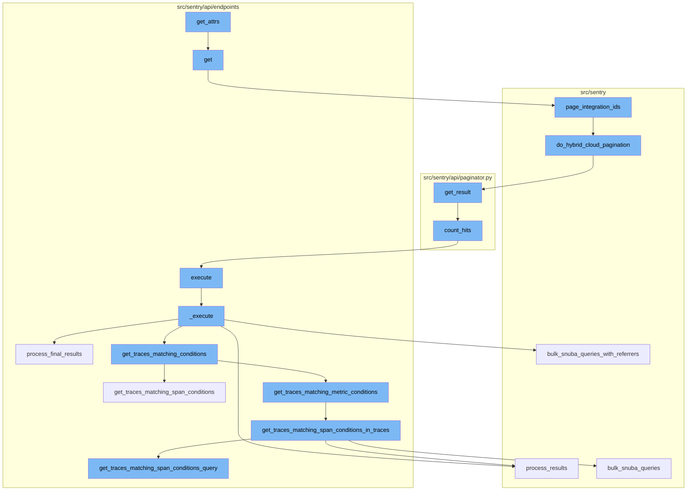
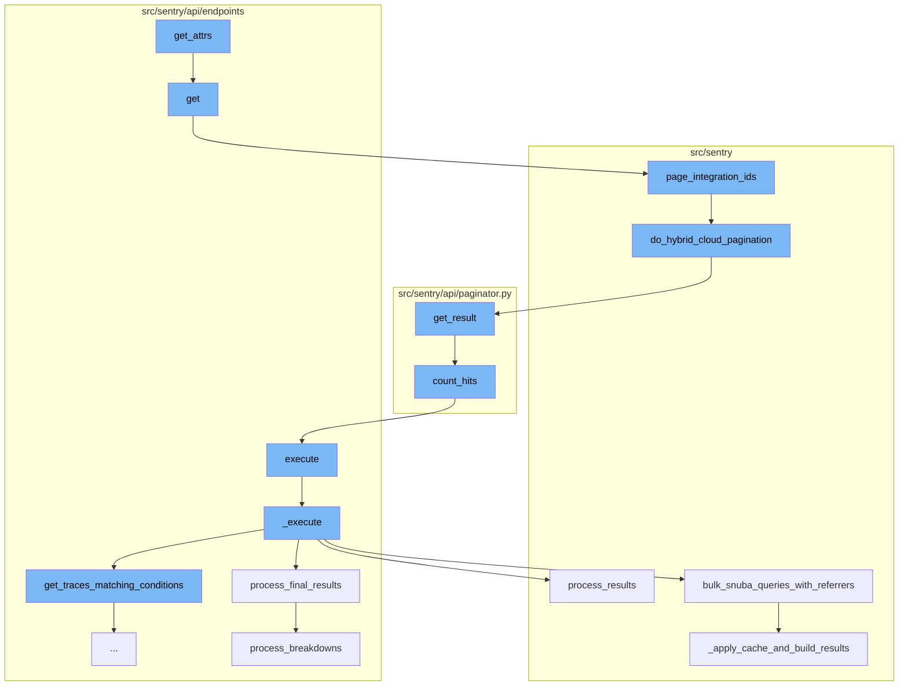
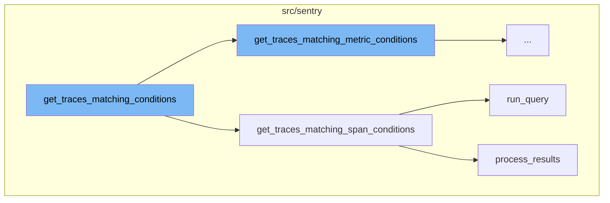
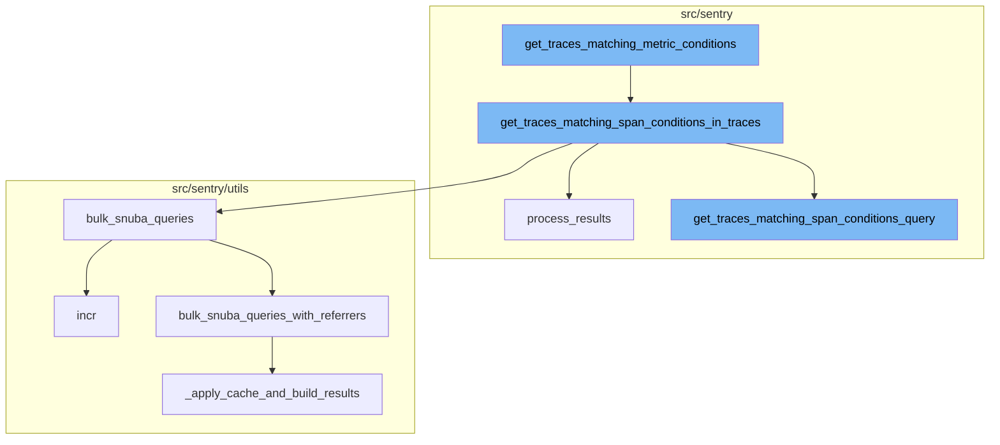

<SwmSnippet path="/src/sentry/api/endpoints/group_integrations.py" line="29">

---

# get_attrs Function

The `get_attrs` function is used to fetch external issues related to a group of integrations. It takes a list of integrations and a user as input and returns a mapping of each integration to its related external issues. The function queries the `ExternalIssue` model to get issues linked to the group and the integrations in the list. It then organizes these issues by their integration ID and returns a dictionary mapping each integration to its list of issues.

```python
    def get_attrs(
        self, item_list: list[RpcIntegration], user: User, **kwargs: Any
    ) -> MutableMapping[RpcIntegration, MutableMapping[str, Any]]:
        external_issues = ExternalIssue.objects.filter(
            id__in=GroupLink.objects.get_group_issues(self.group).values_list(
                "linked_id", flat=True
            ),
            integration_id__in=[i.id for i in item_list],
        )

        issues_by_integration = defaultdict(list)
        for ei in external_issues:
            # TODO(jess): move into an external issue serializer?
            integration = integration_service.get_integration(integration_id=ei.integration_id)
            if integration is None:
                continue
            installation = integration.get_installation(organization_id=self.group.organization.id)
            if hasattr(installation, "get_issue_url") and hasattr(
                installation, "get_issue_display_name"
            ):
                issues_by_integration[ei.integration_id].append(
```

---

</SwmSnippet>

<SwmSnippet path="/src/sentry/api/endpoints/group_integrations.py" line="78">

---

# get Function

The `get` function is an HTTP GET handler that returns a list of integrations related to a group. It first checks if the group's organization has the necessary features enabled. If not, it returns an empty response. If the features are enabled, it fetches the integrations that have either the ISSUE_BASIC or ISSUE_SYNC feature. It then calls the `page_integration_ids` function to paginate the integrations and returns the serialized integrations in the response.

```python
    def get(self, request: Request, group) -> Response:
        has_issue_basic = features.has(
            "organizations:integrations-issue-basic", group.organization, actor=request.user
        )

        has_issue_sync = features.has(
            "organizations:integrations-issue-sync", group.organization, actor=request.user
        )

        if not (has_issue_basic or has_issue_sync):
            return self.respond([])

        providers = [
            i.key
            for i in integrations.all()
            if i.has_feature(IntegrationFeatures.ISSUE_BASIC)
            or i.has_feature(IntegrationFeatures.ISSUE_SYNC)
        ]

        result = integration_service.page_integration_ids(
            organization_id=group.organization.id,
```

---

</SwmSnippet>

<SwmSnippet path="/src/sentry/integrations/services/integration/impl.py" line="65">

---

# page_integration_ids Function

The `page_integration_ids` function is used to paginate the integrations for a specific organization. It takes a list of provider keys, an organization ID, and pagination arguments as input. It then calls the `do_hybrid_cloud_pagination` function to paginate the integrations.

```python
    def page_integration_ids(
        self,
        *,
        provider_keys: list[str],
        organization_id: int,
        args: RpcPaginationArgs,
    ) -> RpcPaginationResult:
        return args.do_hybrid_cloud_pagination(
            description="page_integration_ids",
            paginator_cls=OffsetPaginator,
            order_by="name",
            queryset=Integration.objects.filter(
                organizationintegration__organization_id=organization_id,
                provider__in=provider_keys,
            ),
        )
```

---

</SwmSnippet>

<SwmSnippet path="/src/sentry/hybridcloud/rpc/pagination.py" line="36">

---

# do_hybrid_cloud_pagination Function

The `do_hybrid_cloud_pagination` function is used to paginate a queryset using a hybrid cloud approach. It takes a description, a paginator class, an order by field, a queryset, and optional parameters for a cursor class and count hits. It creates a cursor from the encoded cursor, creates a paginator, and returns the paginated result.

```python
    def do_hybrid_cloud_pagination(
        self,
        *,
        description: str,
        paginator_cls: type[PaginatorLike],
        order_by: str,
        queryset: Any,
        cursor_cls: type[Cursor] = Cursor,
        count_hits: bool | None = None,
    ) -> "RpcPaginationResult":
        cursor = get_cursor(self.encoded_cursor, cursor_cls)
        with sentry_sdk.start_span(
            op="hybrid_cloud.paginate.get_result",
            description=description,
        ) as span:
            annotate_span_with_pagination_args(span, self.per_page)
            paginator = get_paginator(
                None, paginator_cls, dict(order_by=order_by, queryset=queryset.values("id"))
            )
            extra_args: Any = {}
            if count_hits is not None:
```

---

</SwmSnippet>

<SwmSnippet path="/src/sentry/api/paginator.py" line="136">

---

# get_result Function

The `get_result` function is used to get a paginated result. It takes a limit, a cursor, and optional parameters for counting hits, known hits, and max hits. It builds a queryset based on the cursor value, counts the hits if necessary, fetches the results, and returns a cursor with the results.

```python
    def get_result(self, limit=100, cursor=None, count_hits=False, known_hits=None, max_hits=None):
        # cursors are:
        #   (identifier(integer), row offset, is_prev)
        if cursor is None:
            cursor = Cursor(0, 0, 0)

        limit = min(limit, self.max_limit)

        if cursor.value:
            cursor_value = self.value_from_cursor(cursor)
        else:
            cursor_value = 0

        queryset = self.build_queryset(cursor_value, cursor.is_prev)

        # TODO(dcramer): this does not yet work correctly for ``is_prev`` when
        # the key is not unique

        # max_hits can be limited to speed up the query
        if max_hits is None:
            max_hits = MAX_HITS_LIMIT
```

---

</SwmSnippet>

<SwmSnippet path="/src/sentry/api/paginator.py" line="27">

---

# count_hits Function

The `count_hits` function is used to count the number of hits in a queryset. It takes a queryset and a max hits limit as input. It creates a hits query from the queryset, executes the query, and returns the count of hits.

```python
def count_hits(queryset, max_hits):
    if not max_hits:
        return 0
    hits_query = queryset.values()[:max_hits].query
    # clear out any select fields (include select_related) and pull just the id
    hits_query.clear_select_clause()
    hits_query.add_fields(["id"])
    hits_query.clear_ordering(force=True, clear_default=True)
    try:
        h_sql, h_params = hits_query.sql_with_params()
    except EmptyResultSet:
        return 0
    cursor = connections[queryset.using_replica().db].cursor()
    cursor.execute(f"SELECT COUNT(*) FROM ({h_sql}) as t", h_params)
    return cursor.fetchone()[0]
```

---

</SwmSnippet>

<SwmSnippet path="/src/sentry/api/endpoints/organization_traces.py" line="339">

---

# execute Function

The `execute` function is used to execute a query and return the data. It calls the `_execute` function to get the data.

```python
        return cast(ParamsType, all_projects_params), all_projects_snuba_params

    def execute(self, offset: int, limit: int):
        return {"data": self._execute()}
```

---

</SwmSnippet>

<SwmSnippet path="/src/sentry/api/endpoints/organization_traces.py" line="344">

---

# \_execute Function

The `_execute` function is used to execute a series of queries to get trace data. It gets traces matching conditions, refines the parameters, gets all queries, executes the queries in bulk, processes the results, and returns the final data.

```python
    def _execute(self):
        with handle_span_query_errors():
            min_timestamp, max_timestamp, trace_ids = self.get_traces_matching_conditions(
                self.params,
                self.snuba_params,
            )

        self.refine_params(min_timestamp, max_timestamp)

        if not trace_ids:
            return []

        with handle_span_query_errors():
            params, snuba_params = self.params_with_all_projects()

            all_queries = self.get_all_queries(
                params,
                snuba_params,
                trace_ids,
            )

```

---

</SwmSnippet>

<SwmSnippet path="/src/sentry/api/endpoints/organization_traces.py" line="699">

---

# process_final_results Function

The `process_final_results` function is used to process the final results of the trace data. It takes the results of several queries as input, processes the data, and returns a list of trace results.

```python
    def process_final_results(
        self,
        *,
        traces_metas_results,
        traces_errors_results,
        traces_occurrences_results,
        traces_breakdown_projects_results,
    ) -> list[TraceResult]:
        traces_range = {
            row["trace"]: {
                "start": row["first_seen()"],
                "end": row["last_seen()"],
                "slices": self.breakdown_slices,
            }
            for row in traces_metas_results["data"]
        }

        spans = [span for span in traces_breakdown_projects_results["data"]]
        spans.sort(key=lambda span: (span["precise.start_ts"], span["precise.finish_ts"]))

        try:
```

---

</SwmSnippet>

<SwmSnippet path="/src/sentry/api/endpoints/organization_traces.py" line="415">

---

# get_traces_matching_conditions

The `get_traces_matching_conditions` function is the starting point of the flow. It decides which method to use for fetching traces based on the `mri` attribute. If `mri` is not None, it uses `get_traces_matching_metric_conditions`, otherwise it uses `get_traces_matching_span_conditions`.

```python
    def get_traces_matching_conditions(
        self,
        params: ParamsType,
        snuba_params: SnubaParams,
    ) -> tuple[datetime, datetime, list[str]]:
        if self.mri is not None:
            sentry_sdk.set_tag("mri", self.mri)
            return self.get_traces_matching_metric_conditions(params, snuba_params)

        return self.get_traces_matching_span_conditions(params, snuba_params)
```

---

</SwmSnippet>

<SwmSnippet path="/src/sentry/api/endpoints/organization_traces.py" line="492">

---

# get_traces_matching_span_conditions

The `get_traces_matching_span_conditions` function is responsible for fetching traces that match certain span conditions. It first constructs a query using `get_traces_matching_span_conditions_query`, then runs the query and processes the results. The results are then iterated over to extract matching trace IDs and timestamps.

```python
    def get_traces_matching_span_conditions(
        self,
        params: ParamsType,
        snuba_params: SnubaParams,
        trace_ids: list[str] | None = None,
    ) -> tuple[datetime, datetime, list[str]]:
        query, timestamp_column = self.get_traces_matching_span_conditions_query(
            params,
            snuba_params,
        )

        results = query.run_query(
            referrer=Referrer.API_TRACE_EXPLORER_SPANS_LIST.value,
        )
        results = query.process_results(results)

        matching_trace_ids: list[str] = []
        min_timestamp = self.snuba_params.end
        max_timestamp = self.snuba_params.start
        assert min_timestamp is not None
        assert max_timestamp is not None
```

---

</SwmSnippet>

<SwmSnippet path="/src/sentry/snuba/metrics_layer/query.py" line="143">

---

# run_query

The `run_query` function is used to execute a metrics query in Snuba. It is called within the `get_traces_matching_span_conditions` function to run the constructed query.

```python
def run_query(request: Request) -> Mapping[str, Any]:
    """
    Entrypoint for executing a metrics query in Snuba.
    """
    return bulk_run_query([request])[0]
```

---

</SwmSnippet>

<SwmSnippet path="/src/sentry/search/events/builder/base.py" line="1516">

---

# process_results

The `process_results` function is used to process the results of the query. It transforms the results into a more readable format, resolves any aliases, and handles any invalid float values. The processed results are then returned.

```python
    def process_results(self, results: Any) -> EventsResponse:
        with sentry_sdk.start_span(op="QueryBuilder", description="process_results") as span:
            span.set_data("result_count", len(results.get("data", [])))
            translated_columns = {}
            if self.builder_config.transform_alias_to_input_format:
                translated_columns = {
                    column: function_details.field
                    for column, function_details in self.function_alias_map.items()
                }

                for column in list(self.function_alias_map):
                    translated_column = translated_columns.get(column, column)
                    if translated_column in self.function_alias_map:
                        continue
                    function_alias = self.function_alias_map.get(column)
                    if function_alias is not None:
                        self.function_alias_map[translated_column] = function_alias

                if self.raw_equations:
                    for index, equation in enumerate(self.raw_equations):
                        translated_columns[f"equation[{index}]"] = f"equation|{equation}"
```

---

</SwmSnippet>

<SwmSnippet path="/src/sentry/api/endpoints/organization_traces.py" line="426">

---

# get_traces_matching_metric_conditions

The `get_traces_matching_metric_conditions` function is used to get traces that match certain metric conditions. It takes in parameters and snuba parameters, and returns a tuple of minimum timestamp, maximum timestamp, and a list of trace IDs. It uses an executor to get matching traces and refines the parameters based on the timestamps. If user queries exist, it further refines the trace IDs by applying them, leaving us with only traces where the metric exists and matches the user queries.

```python
    def get_traces_matching_metric_conditions(
        self,
        params: ParamsType,
        snuba_params: SnubaParams,
    ) -> tuple[datetime, datetime, list[str]]:
        assert self.mri is not None

        executor_cls = get_sample_list_executor_cls(self.mri)
        if executor_cls is None:
            raise ParseError(detail=f"Unsupported MRI: {self.mri}")

        executor = executor_cls(
            mri=self.mri,
            params=params,
            snuba_params=snuba_params,
            fields=["trace"],
            max=self.metrics_max,
            min=self.metrics_min,
            operation=self.metrics_operation,
            query=self.metrics_query,
            referrer=Referrer.API_TRACE_EXPLORER_METRICS_SPANS_LIST,
```

---

</SwmSnippet>

<SwmSnippet path="/src/sentry/api/endpoints/organization_traces.py" line="526">

---

# get_traces_matching_span_conditions_in_traces

The `get_traces_matching_span_conditions_in_traces` function is used to get traces that match certain span conditions within the traces. It takes in parameters, snuba parameters, and a list of trace IDs, and returns a tuple of minimum timestamp, maximum timestamp, and a list of matching trace IDs. It spreads the trace IDs out evenly across N queries up to some limit per query to avoid encountering the max query size limit in ClickHouse. It then processes the results and returns the matching trace IDs.

```python
    def get_traces_matching_span_conditions_in_traces(
        self,
        params: ParamsType,
        snuba_params: SnubaParams,
        trace_ids: list[str],
    ) -> tuple[datetime, datetime, list[str]]:
        all_queries: list[BaseQueryBuilder] = []
        timestamp_column: str | None = None

        # Putting all the trace ids into a single query will likely encounter the
        # max query size limit in ClickHouse. This tries to spread the trace ids
        # out evenly across N queries up to some limit per query.
        max_trace_ids_per_chunk = options.get(
            "performance.traces.trace-explorer-max-trace-ids-per-chunk"
        )
        num_chunks = math.ceil(len(trace_ids) / max_trace_ids_per_chunk)
        chunk_size = math.ceil(len(trace_ids) / num_chunks)

        for chunk in chunked(trace_ids, chunk_size):
            query, timestamp_column = self.get_traces_matching_span_conditions_query(
                params,
```

---

</SwmSnippet>

<SwmSnippet path="/src/sentry/search/events/builder/base.py" line="1516">

---

# process_results

The `process_results` function is used to process the results of a query. It takes in the results and returns an EventsResponse. It translates the columns to their input format, processes the field meta, and processes the field results. It handles invalid float values and resolves the values based on the value resolver map.

```python
    def process_results(self, results: Any) -> EventsResponse:
        with sentry_sdk.start_span(op="QueryBuilder", description="process_results") as span:
            span.set_data("result_count", len(results.get("data", [])))
            translated_columns = {}
            if self.builder_config.transform_alias_to_input_format:
                translated_columns = {
                    column: function_details.field
                    for column, function_details in self.function_alias_map.items()
                }

                for column in list(self.function_alias_map):
                    translated_column = translated_columns.get(column, column)
                    if translated_column in self.function_alias_map:
                        continue
                    function_alias = self.function_alias_map.get(column)
                    if function_alias is not None:
                        self.function_alias_map[translated_column] = function_alias

                if self.raw_equations:
                    for index, equation in enumerate(self.raw_equations):
                        translated_columns[f"equation[{index}]"] = f"equation|{equation}"
```

---

</SwmSnippet>

<SwmSnippet path="/src/sentry/utils/snuba.py" line="900">

---

# bulk_snuba_queries

The `bulk_snuba_queries` function is an alias for `bulk_snuba_queries_with_referrers` that uses the same referrer for every request. It takes in a list of requests and runs them on the appropriate endpoint.

```python
def bulk_snuba_queries(
    requests: list[Request],
    referrer: str | None = None,
    use_cache: bool = False,
    query_source: (
        QuerySource | None
    ) = None,  # TODO: @athena Make this field required after updated all the callsites
) -> ResultSet:
    """
    Alias for `bulk_snuba_queries_with_referrers` that uses the same referrer for every request.
    """

    metrics.incr("snql.sdk.api", tags={"referrer": referrer or "unknown"})

    return bulk_snuba_queries_with_referrers(
        [(request, referrer) for request in requests],
        use_cache=use_cache,
        query_source=query_source,
    )
```

---

</SwmSnippet>



# Flow drill down

First, we'll zoom into this section of the flow:



<SwmSnippet path="/src/sentry/api/endpoints/group_integrations.py" line="29">

---

# get_attrs Function

The `get_attrs` function is used to fetch external issues related to a group of integrations. It takes a list of integrations and a user as input and returns a mapping of each integration to its related external issues. The function queries the `ExternalIssue` model to get issues linked to the group and the integrations in the list. It then organizes these issues by their integration ID and returns a dictionary mapping each integration to its list of issues.

```python
    def get_attrs(
        self, item_list: list[RpcIntegration], user: User, **kwargs: Any
    ) -> MutableMapping[RpcIntegration, MutableMapping[str, Any]]:
        external_issues = ExternalIssue.objects.filter(
            id__in=GroupLink.objects.get_group_issues(self.group).values_list(
                "linked_id", flat=True
            ),
            integration_id__in=[i.id for i in item_list],
        )

        issues_by_integration = defaultdict(list)
        for ei in external_issues:
            # TODO(jess): move into an external issue serializer?
            integration = integration_service.get_integration(integration_id=ei.integration_id)
            if integration is None:
                continue
            installation = integration.get_installation(organization_id=self.group.organization.id)
            if hasattr(installation, "get_issue_url") and hasattr(
                installation, "get_issue_display_name"
            ):
                issues_by_integration[ei.integration_id].append(
```

---

</SwmSnippet>

<SwmSnippet path="/src/sentry/api/endpoints/group_integrations.py" line="78">

---

# get Function

The `get` function is an HTTP GET handler that returns a list of integrations related to a group. It first checks if the group's organization has the necessary features enabled. If not, it returns an empty response. If the features are enabled, it fetches the integrations that have either the ISSUE_BASIC or ISSUE_SYNC feature. It then calls the `page_integration_ids` function to paginate the integrations and returns the serialized integrations in the response.

```python
    def get(self, request: Request, group) -> Response:
        has_issue_basic = features.has(
            "organizations:integrations-issue-basic", group.organization, actor=request.user
        )

        has_issue_sync = features.has(
            "organizations:integrations-issue-sync", group.organization, actor=request.user
        )

        if not (has_issue_basic or has_issue_sync):
            return self.respond([])

        providers = [
            i.key
            for i in integrations.all()
            if i.has_feature(IntegrationFeatures.ISSUE_BASIC)
            or i.has_feature(IntegrationFeatures.ISSUE_SYNC)
        ]

        result = integration_service.page_integration_ids(
            organization_id=group.organization.id,
```

---

</SwmSnippet>

<SwmSnippet path="/src/sentry/integrations/services/integration/impl.py" line="65">

---

# page_integration_ids Function

The `page_integration_ids` function is used to paginate the integrations for a specific organization. It takes a list of provider keys, an organization ID, and pagination arguments as input. It then calls the `do_hybrid_cloud_pagination` function to paginate the integrations.

```python
    def page_integration_ids(
        self,
        *,
        provider_keys: list[str],
        organization_id: int,
        args: RpcPaginationArgs,
    ) -> RpcPaginationResult:
        return args.do_hybrid_cloud_pagination(
            description="page_integration_ids",
            paginator_cls=OffsetPaginator,
            order_by="name",
            queryset=Integration.objects.filter(
                organizationintegration__organization_id=organization_id,
                provider__in=provider_keys,
            ),
        )
```

---

</SwmSnippet>

<SwmSnippet path="/src/sentry/hybridcloud/rpc/pagination.py" line="36">

---

# do_hybrid_cloud_pagination Function

The `do_hybrid_cloud_pagination` function is used to paginate a queryset using a hybrid cloud approach. It takes a description, a paginator class, an order by field, a queryset, and optional parameters for a cursor class and count hits. It creates a cursor from the encoded cursor, creates a paginator, and returns the paginated result.

```python
    def do_hybrid_cloud_pagination(
        self,
        *,
        description: str,
        paginator_cls: type[PaginatorLike],
        order_by: str,
        queryset: Any,
        cursor_cls: type[Cursor] = Cursor,
        count_hits: bool | None = None,
    ) -> "RpcPaginationResult":
        cursor = get_cursor(self.encoded_cursor, cursor_cls)
        with sentry_sdk.start_span(
            op="hybrid_cloud.paginate.get_result",
            description=description,
        ) as span:
            annotate_span_with_pagination_args(span, self.per_page)
            paginator = get_paginator(
                None, paginator_cls, dict(order_by=order_by, queryset=queryset.values("id"))
            )
            extra_args: Any = {}
            if count_hits is not None:
```

---

</SwmSnippet>

<SwmSnippet path="/src/sentry/api/paginator.py" line="136">

---

# get_result Function

The `get_result` function is used to get a paginated result. It takes a limit, a cursor, and optional parameters for counting hits, known hits, and max hits. It builds a queryset based on the cursor value, counts the hits if necessary, fetches the results, and returns a cursor with the results.

```python
    def get_result(self, limit=100, cursor=None, count_hits=False, known_hits=None, max_hits=None):
        # cursors are:
        #   (identifier(integer), row offset, is_prev)
        if cursor is None:
            cursor = Cursor(0, 0, 0)

        limit = min(limit, self.max_limit)

        if cursor.value:
            cursor_value = self.value_from_cursor(cursor)
        else:
            cursor_value = 0

        queryset = self.build_queryset(cursor_value, cursor.is_prev)

        # TODO(dcramer): this does not yet work correctly for ``is_prev`` when
        # the key is not unique

        # max_hits can be limited to speed up the query
        if max_hits is None:
            max_hits = MAX_HITS_LIMIT
```

---

</SwmSnippet>

<SwmSnippet path="/src/sentry/api/paginator.py" line="27">

---

# count_hits Function

The `count_hits` function is used to count the number of hits in a queryset. It takes a queryset and a max hits limit as input. It creates a hits query from the queryset, executes the query, and returns the count of hits.

```python
def count_hits(queryset, max_hits):
    if not max_hits:
        return 0
    hits_query = queryset.values()[:max_hits].query
    # clear out any select fields (include select_related) and pull just the id
    hits_query.clear_select_clause()
    hits_query.add_fields(["id"])
    hits_query.clear_ordering(force=True, clear_default=True)
    try:
        h_sql, h_params = hits_query.sql_with_params()
    except EmptyResultSet:
        return 0
    cursor = connections[queryset.using_replica().db].cursor()
    cursor.execute(f"SELECT COUNT(*) FROM ({h_sql}) as t", h_params)
    return cursor.fetchone()[0]
```

---

</SwmSnippet>

<SwmSnippet path="/src/sentry/api/endpoints/organization_traces.py" line="339">

---

# execute Function

The `execute` function is used to execute a query and return the data. It calls the `_execute` function to get the data.

```python
        return cast(ParamsType, all_projects_params), all_projects_snuba_params

    def execute(self, offset: int, limit: int):
        return {"data": self._execute()}
```

---

</SwmSnippet>

<SwmSnippet path="/src/sentry/api/endpoints/organization_traces.py" line="344">

---

# \_execute Function

The `_execute` function is used to execute a series of queries to get trace data. It gets traces matching conditions, refines the parameters, gets all queries, executes the queries in bulk, processes the results, and returns the final data.

```python
    def _execute(self):
        with handle_span_query_errors():
            min_timestamp, max_timestamp, trace_ids = self.get_traces_matching_conditions(
                self.params,
                self.snuba_params,
            )

        self.refine_params(min_timestamp, max_timestamp)

        if not trace_ids:
            return []

        with handle_span_query_errors():
            params, snuba_params = self.params_with_all_projects()

            all_queries = self.get_all_queries(
                params,
                snuba_params,
                trace_ids,
            )

```

---

</SwmSnippet>

<SwmSnippet path="/src/sentry/api/endpoints/organization_traces.py" line="699">

---

# process_final_results Function

The `process_final_results` function is used to process the final results of the trace data. It takes the results of several queries as input, processes the data, and returns a list of trace results.

```python
    def process_final_results(
        self,
        *,
        traces_metas_results,
        traces_errors_results,
        traces_occurrences_results,
        traces_breakdown_projects_results,
    ) -> list[TraceResult]:
        traces_range = {
            row["trace"]: {
                "start": row["first_seen()"],
                "end": row["last_seen()"],
                "slices": self.breakdown_slices,
            }
            for row in traces_metas_results["data"]
        }

        spans = [span for span in traces_breakdown_projects_results["data"]]
        spans.sort(key=lambda span: (span["precise.start_ts"], span["precise.finish_ts"]))

        try:
```

---

</SwmSnippet>

Now, lets zoom into this section of the flow:



<SwmSnippet path="/src/sentry/api/endpoints/organization_traces.py" line="415">

---

# get_traces_matching_conditions

The `get_traces_matching_conditions` function is the starting point of the flow. It decides which method to use for fetching traces based on the `mri` attribute. If `mri` is not None, it uses `get_traces_matching_metric_conditions`, otherwise it uses `get_traces_matching_span_conditions`.

```python
    def get_traces_matching_conditions(
        self,
        params: ParamsType,
        snuba_params: SnubaParams,
    ) -> tuple[datetime, datetime, list[str]]:
        if self.mri is not None:
            sentry_sdk.set_tag("mri", self.mri)
            return self.get_traces_matching_metric_conditions(params, snuba_params)

        return self.get_traces_matching_span_conditions(params, snuba_params)
```

---

</SwmSnippet>

<SwmSnippet path="/src/sentry/api/endpoints/organization_traces.py" line="492">

---

# get_traces_matching_span_conditions

The `get_traces_matching_span_conditions` function is responsible for fetching traces that match certain span conditions. It first constructs a query using `get_traces_matching_span_conditions_query`, then runs the query and processes the results. The results are then iterated over to extract matching trace IDs and timestamps.

```python
    def get_traces_matching_span_conditions(
        self,
        params: ParamsType,
        snuba_params: SnubaParams,
        trace_ids: list[str] | None = None,
    ) -> tuple[datetime, datetime, list[str]]:
        query, timestamp_column = self.get_traces_matching_span_conditions_query(
            params,
            snuba_params,
        )

        results = query.run_query(
            referrer=Referrer.API_TRACE_EXPLORER_SPANS_LIST.value,
        )
        results = query.process_results(results)

        matching_trace_ids: list[str] = []
        min_timestamp = self.snuba_params.end
        max_timestamp = self.snuba_params.start
        assert min_timestamp is not None
        assert max_timestamp is not None
```

---

</SwmSnippet>

<SwmSnippet path="/src/sentry/snuba/metrics_layer/query.py" line="143">

---

# run_query

The `run_query` function is used to execute a metrics query in Snuba. It is called within the `get_traces_matching_span_conditions` function to run the constructed query.

```python
def run_query(request: Request) -> Mapping[str, Any]:
    """
    Entrypoint for executing a metrics query in Snuba.
    """
    return bulk_run_query([request])[0]
```

---

</SwmSnippet>

<SwmSnippet path="/src/sentry/search/events/builder/base.py" line="1516">

---

# process_results

The `process_results` function is used to process the results of the query. It transforms the results into a more readable format, resolves any aliases, and handles any invalid float values. The processed results are then returned.

```python
    def process_results(self, results: Any) -> EventsResponse:
        with sentry_sdk.start_span(op="QueryBuilder", description="process_results") as span:
            span.set_data("result_count", len(results.get("data", [])))
            translated_columns = {}
            if self.builder_config.transform_alias_to_input_format:
                translated_columns = {
                    column: function_details.field
                    for column, function_details in self.function_alias_map.items()
                }

                for column in list(self.function_alias_map):
                    translated_column = translated_columns.get(column, column)
                    if translated_column in self.function_alias_map:
                        continue
                    function_alias = self.function_alias_map.get(column)
                    if function_alias is not None:
                        self.function_alias_map[translated_column] = function_alias

                if self.raw_equations:
                    for index, equation in enumerate(self.raw_equations):
                        translated_columns[f"equation[{index}]"] = f"equation|{equation}"
```

---

</SwmSnippet>

Now, lets zoom into this section of the flow:



<SwmSnippet path="/src/sentry/api/endpoints/organization_traces.py" line="426">

---

# get_traces_matching_metric_conditions

The `get_traces_matching_metric_conditions` function is used to get traces that match certain metric conditions. It takes in parameters and snuba parameters, and returns a tuple of minimum timestamp, maximum timestamp, and a list of trace IDs. It uses an executor to get matching traces and refines the parameters based on the timestamps. If user queries exist, it further refines the trace IDs by applying them, leaving us with only traces where the metric exists and matches the user queries.

```python
    def get_traces_matching_metric_conditions(
        self,
        params: ParamsType,
        snuba_params: SnubaParams,
    ) -> tuple[datetime, datetime, list[str]]:
        assert self.mri is not None

        executor_cls = get_sample_list_executor_cls(self.mri)
        if executor_cls is None:
            raise ParseError(detail=f"Unsupported MRI: {self.mri}")

        executor = executor_cls(
            mri=self.mri,
            params=params,
            snuba_params=snuba_params,
            fields=["trace"],
            max=self.metrics_max,
            min=self.metrics_min,
            operation=self.metrics_operation,
            query=self.metrics_query,
            referrer=Referrer.API_TRACE_EXPLORER_METRICS_SPANS_LIST,
```

---

</SwmSnippet>

<SwmSnippet path="/src/sentry/api/endpoints/organization_traces.py" line="526">

---

# get_traces_matching_span_conditions_in_traces

The `get_traces_matching_span_conditions_in_traces` function is used to get traces that match certain span conditions within the traces. It takes in parameters, snuba parameters, and a list of trace IDs, and returns a tuple of minimum timestamp, maximum timestamp, and a list of matching trace IDs. It spreads the trace IDs out evenly across N queries up to some limit per query to avoid encountering the max query size limit in ClickHouse. It then processes the results and returns the matching trace IDs.

```python
    def get_traces_matching_span_conditions_in_traces(
        self,
        params: ParamsType,
        snuba_params: SnubaParams,
        trace_ids: list[str],
    ) -> tuple[datetime, datetime, list[str]]:
        all_queries: list[BaseQueryBuilder] = []
        timestamp_column: str | None = None

        # Putting all the trace ids into a single query will likely encounter the
        # max query size limit in ClickHouse. This tries to spread the trace ids
        # out evenly across N queries up to some limit per query.
        max_trace_ids_per_chunk = options.get(
            "performance.traces.trace-explorer-max-trace-ids-per-chunk"
        )
        num_chunks = math.ceil(len(trace_ids) / max_trace_ids_per_chunk)
        chunk_size = math.ceil(len(trace_ids) / num_chunks)

        for chunk in chunked(trace_ids, chunk_size):
            query, timestamp_column = self.get_traces_matching_span_conditions_query(
                params,
```

---

</SwmSnippet>

<SwmSnippet path="/src/sentry/search/events/builder/base.py" line="1516">

---

# process_results

The `process_results` function is used to process the results of a query. It takes in the results and returns an EventsResponse. It translates the columns to their input format, processes the field meta, and processes the field results. It handles invalid float values and resolves the values based on the value resolver map.

```python
    def process_results(self, results: Any) -> EventsResponse:
        with sentry_sdk.start_span(op="QueryBuilder", description="process_results") as span:
            span.set_data("result_count", len(results.get("data", [])))
            translated_columns = {}
            if self.builder_config.transform_alias_to_input_format:
                translated_columns = {
                    column: function_details.field
                    for column, function_details in self.function_alias_map.items()
                }

                for column in list(self.function_alias_map):
                    translated_column = translated_columns.get(column, column)
                    if translated_column in self.function_alias_map:
                        continue
                    function_alias = self.function_alias_map.get(column)
                    if function_alias is not None:
                        self.function_alias_map[translated_column] = function_alias

                if self.raw_equations:
                    for index, equation in enumerate(self.raw_equations):
                        translated_columns[f"equation[{index}]"] = f"equation|{equation}"
```

---

</SwmSnippet>

<SwmSnippet path="/src/sentry/utils/snuba.py" line="900">

---

# bulk_snuba_queries

The `bulk_snuba_queries` function is an alias for `bulk_snuba_queries_with_referrers` that uses the same referrer for every request. It takes in a list of requests and runs them on the appropriate endpoint.

```python
def bulk_snuba_queries(
    requests: list[Request],
    referrer: str | None = None,
    use_cache: bool = False,
    query_source: (
        QuerySource | None
    ) = None,  # TODO: @athena Make this field required after updated all the callsites
) -> ResultSet:
    """
    Alias for `bulk_snuba_queries_with_referrers` that uses the same referrer for every request.
    """

    metrics.incr("snql.sdk.api", tags={"referrer": referrer or "unknown"})

    return bulk_snuba_queries_with_referrers(
        [(request, referrer) for request in requests],
        use_cache=use_cache,
        query_source=query_source,
    )
```

---

</SwmSnippet>

<SwmSnippet path="/src/sentry/api/endpoints/organization_traces.py" line="584">

---

# get_traces_matching_span_conditions_query

The `get_traces_matching_span_conditions_query` function is used to get a query that matches certain span conditions. It takes in parameters, snuba parameters, and an optional sort parameter, and returns a tuple of a query and a timestamp column. It creates a query based on whether there is only a condition for a single span or multiple conditions, and adds conditions to the query based on the user queries.

```python
    def get_traces_matching_span_conditions_query(
        self,
        params: ParamsType,
        snuba_params: SnubaParams,
        sort: str | None = None,
    ) -> tuple[BaseQueryBuilder, str]:
        if len(self.user_queries) < 2:
            timestamp_column = "timestamp"
        else:
            timestamp_column = "min(timestamp)"

        if sort == "-timestamp":
            orderby = [f"-{timestamp_column}"]
        else:
            # The orderby is intentionally `None` here as this query is much faster
            # if we let Clickhouse decide which order to return the results in.
            # This also means we cannot order by any columns or paginate.
            orderby = None

        if len(self.user_queries) < 2:
            # Optimization: If there is only a condition for a single span,
```

---

</SwmSnippet>

<SwmSnippet path="/src/sentry/utils/metrics.py" line="101">

---

# incr

The `incr` function is used to increment a metric. It takes in a key, an optional instance, optional tags, an amount to increment by, and a sample rate.

```python
    def incr(
        self,
        key: str,
        instance: str | None = None,
        tags: Tags | None = None,
        amount: int = 1,
        sample_rate: float = settings.SENTRY_METRICS_SAMPLE_RATE,
    ) -> None:
        if not self._started:
```

---

</SwmSnippet>

<SwmSnippet path="/src/sentry/utils/snuba.py" line="921">

---

# bulk_snuba_queries_with_referrers

The `bulk_snuba_queries_with_referrers` function is the main entrypoint to running queries in Snuba. It takes in a list of tuples of requests and referrers, and runs them on the appropriate endpoint. Each request is paired with a referrer to be used for that request.

```python
def bulk_snuba_queries_with_referrers(
    requests_with_referrers: list[tuple[Request, str | None]],
    use_cache: bool = False,
    query_source: (
        QuerySource | None
    ) = None,  # TODO: @athena Make this field required after updated all the callsites
) -> ResultSet:
    """
    The main entrypoint to running queries in Snuba. This function accepts
    Requests for either MQL or SnQL queries and runs them on the appropriate endpoint.

    Every request is paired with a referrer to be used for that request.
    """

    if "consistent" in OVERRIDE_OPTIONS:
        for request, _ in requests_with_referrers:
            request.flags.consistent = OVERRIDE_OPTIONS["consistent"]

    for request, referrer in requests_with_referrers:
        if referrer or query_source:
            request.tenant_ids = request.tenant_ids or dict()
```

---

</SwmSnippet>

<SwmSnippet path="/src/sentry/utils/snuba.py" line="993">

---

# \_apply_cache_and_build_results

The `_apply_cache_and_build_results` function is used to apply cache and build results. It takes in a sequence of Snuba requests and an optional use_cache parameter. It applies cache to the requests and builds the results based on whether cache is used or not.

```python
def _apply_cache_and_build_results(
    snuba_requests: Sequence[SnubaRequest],
    use_cache: bool | None = False,
) -> ResultSet:
    parent_api: str = "<missing>"
    scope = sentry_sdk.Scope.get_current_scope()
    if scope.transaction:
        parent_api = scope.transaction.name

    # Store the original position of the query so that we can maintain the order
    snuba_requests_list: list[tuple[int, SnubaRequest]] = []
    for i, snuba_request in enumerate(snuba_requests):
        snuba_request.request.parent_api = parent_api
        snuba_requests_list.append((i, snuba_request))

    results = []

    to_query: list[tuple[int, SnubaRequest, str | None]] = []

    if use_cache:
        cache_keys = [
```

---

</SwmSnippet>

&nbsp;

*This is an auto-generated document by Swimm AI 🌊 and has not yet been verified by a human*

<SwmMeta version="3.0.0" repo-id="Z2l0aHViJTNBJTNBc2VudHJ5LWRlbW8lM0ElM0FTd2ltbS1EZW1v" repo-name="sentry-demo" doc-type="flows"><sup>Powered by [Swimm](/)</sup></SwmMeta>
