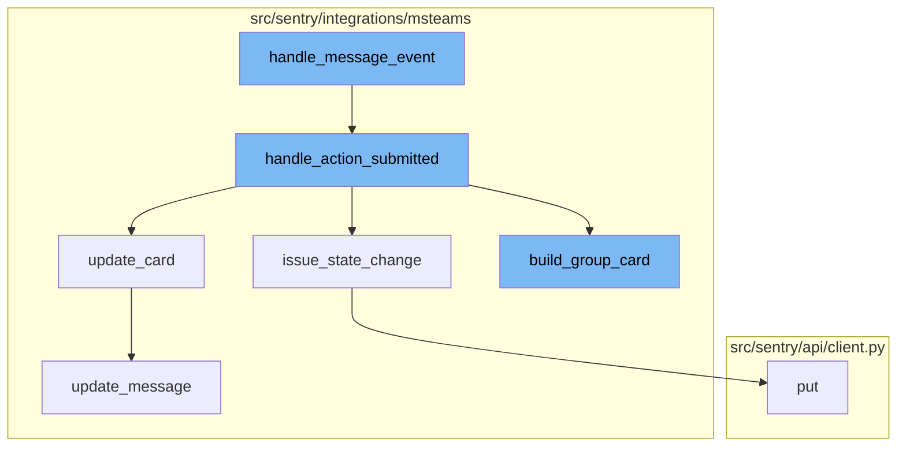

## Overview

The `handle_message_event` function is a crucial part of the message handling process in Sentry. It serves as the entry point for handling message events, delegating the handling to different functions based on the event type and conversation type.

<SwmSnippet path="/src/sentry/integrations/msteams/webhook.py" line="338">

---

## handle_message_event

The `handle_message_event` function checks if the event is a user submitting an option on a card, and if so, it delegates the handling to `handle_action_submitted`. If the conversation type is 'channel', it delegates to `handle_channel_message`, otherwise it delegates to `handle_personal_message`.

```python
    def handle_message_event(self, request: HttpRequest) -> HttpResponse:
        data = request.data
        conversation = data.get("conversation", {})
        conversation_type = conversation.get("conversationType")

        # the only message events we care about are those which
        # are from a user submitting an option on a card, which
        # will always contain an "payload.actionType" in the data.
        if data.get("value", {}).get("payload", {}).get("actionType"):
            # Processing card actions can only occur in the Region silo.
            if SiloMode.get_current_mode() == SiloMode.CONTROL:
                return self.respond(status=400)
            return self.handle_action_submitted(request)
        elif conversation_type == "channel":
            return self.handle_channel_message(request)

        return self.handle_personal_message(request)
```

---

</SwmSnippet>

<SwmSnippet path="/src/sentry/integrations/msteams/webhook.py" line="560">

---

## handle_action_submitted

The `handle_action_submitted` function is responsible for handling actions submitted by users. It extracts necessary data from the request, validates the integration, group, and identity. If the identity is not found, it sends a linking card to the user. If the identity is found, it updates the state of the issue, refreshes the group from the database, builds a group card, and updates the card.

```python
    def handle_action_submitted(self, request: HttpRequest):
        # pull out parameters
        data = request.data
        channel_data = data["channelData"]
        tenant_id = channel_data["tenant"]["id"]
        payload = data["value"]["payload"]
        group_id = payload["groupId"]
        integration_id = payload["integrationId"]
        user_id = data["from"]["id"]
        activity_id = data["replyToId"]
        conversation = data["conversation"]
        if conversation["conversationType"] == "personal":
            conversation_id = conversation["id"]
        else:
            conversation_id = channel_data["channel"]["id"]

        integration = self.get_integration_from_card_action(data=data)
        if integration is None:
            logger.info(
                "msteams.action.missing-integration", extra={"integration_id": integration_id}
            )
```

---

</SwmSnippet>

<SwmSnippet path="/src/sentry/integrations/msteams/webhook.py" line="525">

---

## issue_state_change

The `issue_state_change` function is called within `handle_action_submitted` to update the state of the issue. It records an analytics event and sends a PUT request to update the issue.

```python
    def issue_state_change(self, group: Group, identity: RpcIdentity, data):
        event_write_key = ApiKey(
            organization_id=group.project.organization_id, scope_list=["event:write"]
        )

        has_escalating_issues = features.has(
            "organizations:escalating-issues-msteams", group.project.organization
        )

        # undoing the enum structure of ACTION_TYPE to
        # get a more sensible analytics_event
        action_types = {
            ACTION_TYPE.RESOLVE: "resolve",
            ACTION_TYPE.IGNORE: "ignore",
            ACTION_TYPE.ASSIGN: "assign",
            ACTION_TYPE.UNRESOLVE: "unresolve",
            ACTION_TYPE.UNASSIGN: "unassign",
        }
        action_data = self.make_action_data(data, identity.user_id, has_escalating_issues)
        status = action_types[data["payload"]["actionType"]]
        analytics_event = f"integrations.msteams.{status}"
```

---

</SwmSnippet>

<SwmSnippet path="/src/sentry/integrations/msteams/card_builder/issues.py" line="276">

---

## build_group_card

The `build_group_card` function is used to build a card for a group. The card includes the issue title, description, footer block, assignee details, and a set of actions.

```python
    def build_group_card(self, notification_uuid: str | None = None) -> AdaptiveCard:
        """
        The issue (group) card has the following components stacked vertically,
        1. The issue title which links to the issue.
        2. A description of the issue if it is available. (Optional)
        3. A footer block, which again has 3 components stacked horizontally,
            3a. The short id of the group.
            3b. The alert rule(s) that fired this notification.
            3c. The date and time of the event.
        4. Details of the assignee if the issue is assigned to an actor. (Optional)
        5. A set of three actions, resolve, ignore and assign which can
            futher reveal cards with dropdowns for selecting options.
        """
        # Explicit typing to satisfy mypy.
        fields: list[Block | None] = [
            self.build_group_descr(),
            self.build_group_footer(),
            self.build_assignee_note(),
            self.build_group_actions(),
        ]

```

---

</SwmSnippet>

<SwmSnippet path="/src/sentry/integrations/msteams/client.py" line="64">

---

## update_card

The `update_card` function is used to update a card in a conversation. It prepares the payload and calls `update_message` to send the update.

```python
    def update_card(self, conversation_id: str, activity_id: str, card):
        payload = {
            "type": "message",
            "attachments": [
                {"contentType": "application/vnd.microsoft.card.adaptive", "content": card}
            ],
        }
        return self.update_message(conversation_id, activity_id, payload)
```

---

</SwmSnippet>

<SwmSnippet path="/src/sentry/integrations/msteams/client.py" line="52">

---

## update_message

The `update_message` function is used to send an update to a message in a conversation. It sends a PUT request with the provided data.

```python
    def update_message(self, conversation_id: str, activity_id: str, data):
        return self.put(self.MESSAGE_URL % (conversation_id, activity_id), data=data)
```

---

</SwmSnippet>



# Flow drill down


<SwmSnippet path="/src/sentry/integrations/msteams/webhook.py" line="338">

---

# handle_message_event

The `handle_message_event` function is the entry point for handling message events. It checks if the event is a user submitting an option on a card, and if so, it delegates the handling to `handle_action_submitted`. If the conversation type is 'channel', it delegates to `handle_channel_message`, otherwise it delegates to `handle_personal_message`.

```python
    def handle_message_event(self, request: HttpRequest) -> HttpResponse:
        data = request.data
        conversation = data.get("conversation", {})
        conversation_type = conversation.get("conversationType")

        # the only message events we care about are those which
        # are from a user submitting an option on a card, which
        # will always contain an "payload.actionType" in the data.
        if data.get("value", {}).get("payload", {}).get("actionType"):
            # Processing card actions can only occur in the Region silo.
            if SiloMode.get_current_mode() == SiloMode.CONTROL:
                return self.respond(status=400)
            return self.handle_action_submitted(request)
        elif conversation_type == "channel":
            return self.handle_channel_message(request)

        return self.handle_personal_message(request)
```

---

</SwmSnippet>

<SwmSnippet path="/src/sentry/integrations/msteams/webhook.py" line="560">

---

# handle_action_submitted

The `handle_action_submitted` function is responsible for handling actions submitted by users. It extracts necessary data from the request, validates the integration, group, and identity. If the identity is not found, it sends a linking card to the user. If the identity is found, it updates the state of the issue, refreshes the group from the database, builds a group card, and updates the card.

```python
    def handle_action_submitted(self, request: HttpRequest):
        # pull out parameters
        data = request.data
        channel_data = data["channelData"]
        tenant_id = channel_data["tenant"]["id"]
        payload = data["value"]["payload"]
        group_id = payload["groupId"]
        integration_id = payload["integrationId"]
        user_id = data["from"]["id"]
        activity_id = data["replyToId"]
        conversation = data["conversation"]
        if conversation["conversationType"] == "personal":
            conversation_id = conversation["id"]
        else:
            conversation_id = channel_data["channel"]["id"]

        integration = self.get_integration_from_card_action(data=data)
        if integration is None:
            logger.info(
                "msteams.action.missing-integration", extra={"integration_id": integration_id}
            )
```

---

</SwmSnippet>

<SwmSnippet path="/src/sentry/integrations/msteams/webhook.py" line="525">

---

# issue_state_change

The `issue_state_change` function is called within `handle_action_submitted` to update the state of the issue. It records an analytics event and sends a PUT request to update the issue.

```python
    def issue_state_change(self, group: Group, identity: RpcIdentity, data):
        event_write_key = ApiKey(
            organization_id=group.project.organization_id, scope_list=["event:write"]
        )

        has_escalating_issues = features.has(
            "organizations:escalating-issues-msteams", group.project.organization
        )

        # undoing the enum structure of ACTION_TYPE to
        # get a more sensible analytics_event
        action_types = {
            ACTION_TYPE.RESOLVE: "resolve",
            ACTION_TYPE.IGNORE: "ignore",
            ACTION_TYPE.ASSIGN: "assign",
            ACTION_TYPE.UNRESOLVE: "unresolve",
            ACTION_TYPE.UNASSIGN: "unassign",
        }
        action_data = self.make_action_data(data, identity.user_id, has_escalating_issues)
        status = action_types[data["payload"]["actionType"]]
        analytics_event = f"integrations.msteams.{status}"
```

---

</SwmSnippet>

<SwmSnippet path="/src/sentry/integrations/msteams/card_builder/issues.py" line="276">

---

# build_group_card

The `build_group_card` function is used to build a card for a group. The card includes the issue title, description, footer block, assignee details, and a set of actions.

```python
    def build_group_card(self, notification_uuid: str | None = None) -> AdaptiveCard:
        """
        The issue (group) card has the following components stacked vertically,
        1. The issue title which links to the issue.
        2. A description of the issue if it is available. (Optional)
        3. A footer block, which again has 3 components stacked horizontally,
            3a. The short id of the group.
            3b. The alert rule(s) that fired this notification.
            3c. The date and time of the event.
        4. Details of the assignee if the issue is assigned to an actor. (Optional)
        5. A set of three actions, resolve, ignore and assign which can
            futher reveal cards with dropdowns for selecting options.
        """
        # Explicit typing to satisfy mypy.
        fields: list[Block | None] = [
            self.build_group_descr(),
            self.build_group_footer(),
            self.build_assignee_note(),
            self.build_group_actions(),
        ]

```

---

</SwmSnippet>

<SwmSnippet path="/src/sentry/integrations/msteams/client.py" line="64">

---

# update_card

The `update_card` function is used to update a card in a conversation. It prepares the payload and calls `update_message` to send the update.

```python
    def update_card(self, conversation_id: str, activity_id: str, card):
        payload = {
            "type": "message",
            "attachments": [
                {"contentType": "application/vnd.microsoft.card.adaptive", "content": card}
            ],
        }
        return self.update_message(conversation_id, activity_id, payload)
```

---

</SwmSnippet>

<SwmSnippet path="/src/sentry/integrations/msteams/client.py" line="52">

---

# update_message

The `update_message` function is used to send an update to a message in a conversation. It sends a PUT request with the provided data.

```python
    def update_message(self, conversation_id: str, activity_id: str, data):
        return self.put(self.MESSAGE_URL % (conversation_id, activity_id), data=data)
```

---

</SwmSnippet>

&nbsp;

*This is an auto-generated document by Swimm AI 🌊 and has not yet been verified by a human*

<SwmMeta version="3.0.0" repo-id="Z2l0aHViJTNBJTNBc2VudHJ5LWRlbW8lM0ElM0FTd2ltbS1EZW1v" repo-name="sentry-demo" doc-type="flows"><sup>Powered by [Swimm](/)</sup></SwmMeta>
