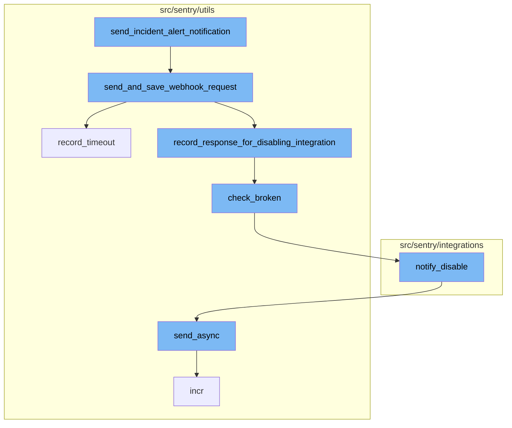
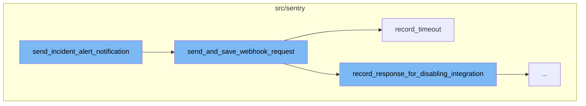
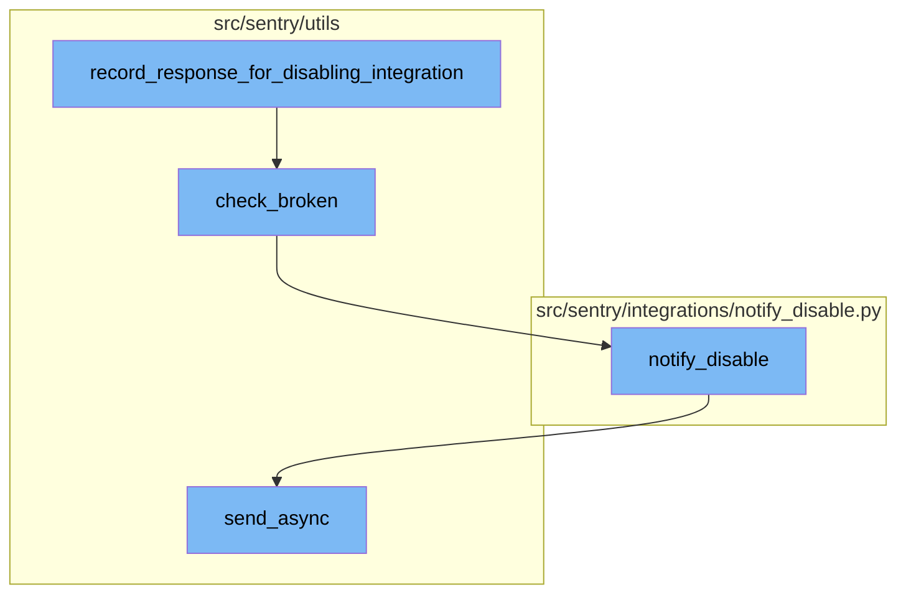

<SwmSnippet path="/src/sentry/integrations/services/integration/impl.py" line="374">

---

# send_incident_alert_notification

The `send_incident_alert_notification` function is responsible for sending a notification about an incident alert. It first retrieves the SentryApp and SentryAppInstallation objects based on the provided IDs. If either does not exist, it logs the error and returns False. If they do exist, it creates an AppPlatformEvent object and sends a webhook request using the `send_and_save_webhook_request` function.

```python
    def send_incident_alert_notification(
        self,
        *,
        sentry_app_id: int,
        action_id: int,
        incident_id: int,
        new_status: int,
        incident_attachment_json: str,
        organization_id: int,
        metric_value: str | None = None,
        notification_uuid: str | None = None,
    ) -> bool:
        try:
            sentry_app = SentryApp.objects.get(id=sentry_app_id)
        except SentryApp.DoesNotExist:
            logger.info(
                "metric_alert_webhook.missing_sentryapp",
                extra={
                    "sentry_app_id": sentry_app_id,
                    "organization_id": organization_id,
                },
```

---

</SwmSnippet>

<SwmSnippet path="/src/sentry/utils/sentry_apps/webhooks.py" line="116">

---

# send_and_save_webhook_request

The `send_and_save_webhook_request` function notifies a SentryApp's webhook about an incident and logs the response on Redis. It sends a request to the webhook URL and handles various response scenarios. If the response status code indicates a timeout or connection error, it calls the `record_timeout` function.

```python
def send_and_save_webhook_request(
    sentry_app: SentryApp | RpcSentryApp,
    app_platform_event: AppPlatformEvent,
    url: str | None = None,
) -> Response:
    """
    Notify a SentryApp's webhook about an incident and log response on redis.

    :param sentry_app: The SentryApp to notify via a webhook.
    :param app_platform_event: Incident data. See AppPlatformEvent.
    :param url: The URL to hit for this webhook if it is different from `sentry_app.webhook_url`.
    :return: Webhook response
    """
    buffer = SentryAppWebhookRequestsBuffer(sentry_app)

    org_id = app_platform_event.install.organization_id
    event = f"{app_platform_event.resource}.{app_platform_event.action}"
    slug = sentry_app.slug_for_metrics
    url = url or sentry_app.webhook_url
    assert url is not None

```

---

</SwmSnippet>

<SwmSnippet path="/src/sentry/utils/sentry_apps/webhooks.py" line="82">

---

# record_timeout

The `record_timeout` function records a timeout or connection error in the integration buffer to check if the SentryApp is broken and should be disabled. It updates the buffer and calls the `check_broken` function.

```python
def record_timeout(
    sentryapp: SentryApp | RpcSentryApp, org_id: str, e: ConnectionError | Timeout
) -> None:
    """
    Record Unpublished Sentry App timeout or connection error in integration buffer to check if it is broken and should be disabled
    """
    if not sentryapp.is_internal:
        return
    redis_key = get_redis_key(sentryapp, org_id)
    if not len(redis_key):
        return
    buffer = IntegrationRequestBuffer(redis_key)
    buffer.record_timeout()
    check_broken(sentryapp, org_id)
```

---

</SwmSnippet>

<SwmSnippet path="/src/sentry/utils/sentry_apps/webhooks.py" line="98">

---

# Record Response for Disabling Integration

The `record_response_for_disabling_integration` function is used to record the response of a webhook request. If the response is successful, it records the success. If the response is an error, it records the error and calls the `check_broken` function.

```python
def record_response_for_disabling_integration(
    sentryapp: SentryApp | RpcSentryApp, org_id: str, response: Response
) -> None:
    if not sentryapp.is_internal:
        return
    redis_key = get_redis_key(sentryapp, org_id)
    if not len(redis_key):
        return
    buffer = IntegrationRequestBuffer(redis_key)
    if is_response_success(response):
        buffer.record_success()
        return
    if is_response_error(response):
        buffer.record_error()
        check_broken(sentryapp, org_id)
```

---

</SwmSnippet>

<SwmSnippet path="/src/sentry/utils/sentry_apps/webhooks.py" line="53">

---

# Check Broken Integration

The `check_broken` function checks if the integration is broken. If it is, it disables the Sentry app and calls the `notify_disable` function to notify about the disabled integration.

```python
def check_broken(sentryapp: SentryApp | RpcSentryApp, org_id: str) -> None:
    from sentry.sentry_apps.services.app.service import app_service

    redis_key = get_redis_key(sentryapp, org_id)
    buffer = IntegrationRequestBuffer(redis_key)
    if buffer.is_integration_broken():
        org = Organization.objects.get(id=org_id)
        app_service.disable_sentryapp(id=sentryapp.id)
        notify_disable(org, sentryapp.name, redis_key, sentryapp.slug, sentryapp.webhook_url)
        buffer.clear()
        create_system_audit_entry(
            organization=org,
            target_object=org.id,
            event=audit_log.get_event_id("INTERNAL_INTEGRATION_DISABLED"),
            data={"name": sentryapp.name},
        )
        extra = {
            "sentryapp_webhook": sentryapp.webhook_url,
            "sentryapp_slug": sentryapp.slug,
            "sentryapp_uuid": sentryapp.uuid,
            "org_id": org_id,
```

---

</SwmSnippet>

<SwmSnippet path="/src/sentry/integrations/notify_disable.py" line="42">

---

# Notify Disable

The `notify_disable` function is used to notify the owners of the organization about the disabled integration. It builds a message with the necessary information and sends it asynchronously.

```python
def notify_disable(
    organization: RpcOrganization | Organization,
    integration_name: str,
    redis_key: str,
    integration_slug: str | None = None,
    webhook_url: str | None = None,
    project: str | None = None,
):

    integration_link = get_url(
        organization,
        get_provider_type(redis_key),
        integration_slug if "sentry-app" in redis_key and integration_slug else integration_name,
    )

    referrer = (
        "?referrer=disabled-sentry-app"
        if "sentry-app" in redis_key
        else "?referrer=disabled-integration"
    )

```

---

</SwmSnippet>

<SwmSnippet path="/src/sentry/utils/email/message_builder.py" line="232">

---

# Send Async

The `send_async` function is used to send the email message asynchronously. It builds the email message and sends it using the appropriate email task.

```python
    def send_async(
        self,
        to: Iterable[str] | None = None,
        cc: Sequence[str] | None = None,
        bcc: Sequence[str] | None = None,
    ) -> None:
        from sentry.tasks.email import send_email, send_email_control

        fmt = options.get("system.logging-format")
        messages = self.get_built_messages(to, cc=cc, bcc=bcc)
        extra: MutableMapping[str, str | tuple[str]] = {"message_type": self.type}
        loggable = [v for k, v in self.context.items() if hasattr(v, "id")]
        for context in loggable:
            extra[f"{type(context).__name__.lower()}_id"] = context.id

        log_mail_queued = partial(logger.info, "mail.queued", extra=extra)
        for message in messages:
            send_email_task = send_email.delay
            if SiloMode.get_current_mode() == SiloMode.CONTROL:
                send_email_task = send_email_control.delay
            safe_execute(send_email_task, message=message)
```

---

</SwmSnippet>



# Flow drill down

First, we'll zoom into this section of the flow:



<SwmSnippet path="/src/sentry/integrations/services/integration/impl.py" line="374">

---

# send_incident_alert_notification

The `send_incident_alert_notification` function is responsible for sending a notification about an incident alert. It first retrieves the SentryApp and SentryAppInstallation objects based on the provided IDs. If either does not exist, it logs the error and returns False. If they do exist, it creates an AppPlatformEvent object and sends a webhook request using the `send_and_save_webhook_request` function.

```python
    def send_incident_alert_notification(
        self,
        *,
        sentry_app_id: int,
        action_id: int,
        incident_id: int,
        new_status: int,
        incident_attachment_json: str,
        organization_id: int,
        metric_value: str | None = None,
        notification_uuid: str | None = None,
    ) -> bool:
        try:
            sentry_app = SentryApp.objects.get(id=sentry_app_id)
        except SentryApp.DoesNotExist:
            logger.info(
                "metric_alert_webhook.missing_sentryapp",
                extra={
                    "sentry_app_id": sentry_app_id,
                    "organization_id": organization_id,
                },
```

---

</SwmSnippet>

<SwmSnippet path="/src/sentry/utils/sentry_apps/webhooks.py" line="116">

---

# send_and_save_webhook_request

The `send_and_save_webhook_request` function notifies a SentryApp's webhook about an incident and logs the response on Redis. It sends a request to the webhook URL and handles various response scenarios. If the response status code indicates a timeout or connection error, it calls the `record_timeout` function.

```python
def send_and_save_webhook_request(
    sentry_app: SentryApp | RpcSentryApp,
    app_platform_event: AppPlatformEvent,
    url: str | None = None,
) -> Response:
    """
    Notify a SentryApp's webhook about an incident and log response on redis.

    :param sentry_app: The SentryApp to notify via a webhook.
    :param app_platform_event: Incident data. See AppPlatformEvent.
    :param url: The URL to hit for this webhook if it is different from `sentry_app.webhook_url`.
    :return: Webhook response
    """
    buffer = SentryAppWebhookRequestsBuffer(sentry_app)

    org_id = app_platform_event.install.organization_id
    event = f"{app_platform_event.resource}.{app_platform_event.action}"
    slug = sentry_app.slug_for_metrics
    url = url or sentry_app.webhook_url
    assert url is not None

```

---

</SwmSnippet>

<SwmSnippet path="/src/sentry/utils/sentry_apps/webhooks.py" line="82">

---

# record_timeout

The `record_timeout` function records a timeout or connection error in the integration buffer to check if the SentryApp is broken and should be disabled. It updates the buffer and calls the `check_broken` function.

```python
def record_timeout(
    sentryapp: SentryApp | RpcSentryApp, org_id: str, e: ConnectionError | Timeout
) -> None:
    """
    Record Unpublished Sentry App timeout or connection error in integration buffer to check if it is broken and should be disabled
    """
    if not sentryapp.is_internal:
        return
    redis_key = get_redis_key(sentryapp, org_id)
    if not len(redis_key):
        return
    buffer = IntegrationRequestBuffer(redis_key)
    buffer.record_timeout()
    check_broken(sentryapp, org_id)
```

---

</SwmSnippet>

Now, lets zoom into this section of the flow:



<SwmSnippet path="/src/sentry/utils/sentry_apps/webhooks.py" line="98">

---

# Record Response for Disabling Integration

The `record_response_for_disabling_integration` function is used to record the response of a webhook request. If the response is successful, it records the success. If the response is an error, it records the error and calls the `check_broken` function.

```python
def record_response_for_disabling_integration(
    sentryapp: SentryApp | RpcSentryApp, org_id: str, response: Response
) -> None:
    if not sentryapp.is_internal:
        return
    redis_key = get_redis_key(sentryapp, org_id)
    if not len(redis_key):
        return
    buffer = IntegrationRequestBuffer(redis_key)
    if is_response_success(response):
        buffer.record_success()
        return
    if is_response_error(response):
        buffer.record_error()
        check_broken(sentryapp, org_id)
```

---

</SwmSnippet>

<SwmSnippet path="/src/sentry/utils/sentry_apps/webhooks.py" line="53">

---

# Check Broken Integration

The `check_broken` function checks if the integration is broken. If it is, it disables the Sentry app and calls the `notify_disable` function to notify about the disabled integration.

```python
def check_broken(sentryapp: SentryApp | RpcSentryApp, org_id: str) -> None:
    from sentry.sentry_apps.services.app.service import app_service

    redis_key = get_redis_key(sentryapp, org_id)
    buffer = IntegrationRequestBuffer(redis_key)
    if buffer.is_integration_broken():
        org = Organization.objects.get(id=org_id)
        app_service.disable_sentryapp(id=sentryapp.id)
        notify_disable(org, sentryapp.name, redis_key, sentryapp.slug, sentryapp.webhook_url)
        buffer.clear()
        create_system_audit_entry(
            organization=org,
            target_object=org.id,
            event=audit_log.get_event_id("INTERNAL_INTEGRATION_DISABLED"),
            data={"name": sentryapp.name},
        )
        extra = {
            "sentryapp_webhook": sentryapp.webhook_url,
            "sentryapp_slug": sentryapp.slug,
            "sentryapp_uuid": sentryapp.uuid,
            "org_id": org_id,
```

---

</SwmSnippet>

<SwmSnippet path="/src/sentry/integrations/notify_disable.py" line="42">

---

# Notify Disable

The `notify_disable` function is used to notify the owners of the organization about the disabled integration. It builds a message with the necessary information and sends it asynchronously.

```python
def notify_disable(
    organization: RpcOrganization | Organization,
    integration_name: str,
    redis_key: str,
    integration_slug: str | None = None,
    webhook_url: str | None = None,
    project: str | None = None,
):

    integration_link = get_url(
        organization,
        get_provider_type(redis_key),
        integration_slug if "sentry-app" in redis_key and integration_slug else integration_name,
    )

    referrer = (
        "?referrer=disabled-sentry-app"
        if "sentry-app" in redis_key
        else "?referrer=disabled-integration"
    )

```

---

</SwmSnippet>

<SwmSnippet path="/src/sentry/utils/email/message_builder.py" line="232">

---

# Send Async

The `send_async` function is used to send the email message asynchronously. It builds the email message and sends it using the appropriate email task.

```python
    def send_async(
        self,
        to: Iterable[str] | None = None,
        cc: Sequence[str] | None = None,
        bcc: Sequence[str] | None = None,
    ) -> None:
        from sentry.tasks.email import send_email, send_email_control

        fmt = options.get("system.logging-format")
        messages = self.get_built_messages(to, cc=cc, bcc=bcc)
        extra: MutableMapping[str, str | tuple[str]] = {"message_type": self.type}
        loggable = [v for k, v in self.context.items() if hasattr(v, "id")]
        for context in loggable:
            extra[f"{type(context).__name__.lower()}_id"] = context.id

        log_mail_queued = partial(logger.info, "mail.queued", extra=extra)
        for message in messages:
            send_email_task = send_email.delay
            if SiloMode.get_current_mode() == SiloMode.CONTROL:
                send_email_task = send_email_control.delay
            safe_execute(send_email_task, message=message)
```

---

</SwmSnippet>

&nbsp;

*This is an auto-generated document by Swimm AI 🌊 and has not yet been verified by a human*

<SwmMeta version="3.0.0" repo-id="Z2l0aHViJTNBJTNBc2VudHJ5LWRlbW8lM0ElM0FTd2ltbS1EZW1v" repo-name="sentry-demo" doc-type="flows"><sup>Powered by [Swimm](/)</sup></SwmMeta>
