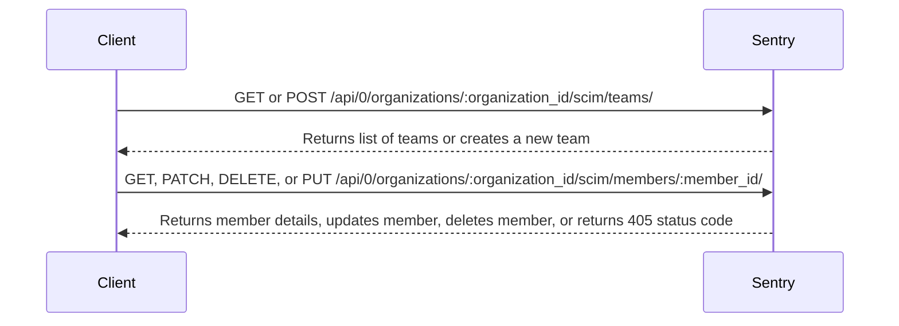

The Main Application in the sentry-demo repository refers to the primary entry point of the application. It is defined in multiple files, but primarily in `src/sentry/runner/main.py`. This function sets up the necessary configurations and initializes the application.

The `main` function in `src/sentry/runner/main.py` is responsible for setting up the command-line interface (CLI) and handling exceptions. It uses the `_get_prog` function to extract the proper program executable, and the `get` function to retrieve a configuration option.

The `main` function in `src/sentry/build/main.py` is responsible for building the application. It prints the status of the build process, syncs the integration docs, downloads the JavaScript SDK registry, and builds static assets.

The `main` function in `src/sentry/__main__.py` is the entry point when the module is run as a script. It simply calls the `main` function from `src/sentry/runner/main.py`.

The `bind_cache_to_option_store` function in `src/sentry/runner/initializer.py` is used to bind the cache to the option store during the application initialization.

<SwmSnippet path="/src/sentry/runner/main.py" line="121">

---

# Main Function in src/sentry/runner/main.py

The `main` function in `src/sentry/runner/main.py` is responsible for setting up the command-line interface (CLI) and handling exceptions. It uses the `_get_prog` function to extract the proper program executable, and the `get` function to retrieve a configuration option.

```python
def main() -> None:
    func = cli
    kwargs = {
        "prog_name": _get_prog(),
        "obj": {},
        "max_content_width": 100,
    }
    # This variable is *only* set as part of direnv/.envrc, thus, we cannot affect production
    if os.environ.get("SENTRY_DEVSERVICES_DSN"):
        # We do this here because `configure_structlog` executes later
        logging.basicConfig(format="%(levelname)s:%(message)s", level=logging.INFO)
        logger = logging.getLogger(__name__)

        logger.info(
            "The Sentry runner will report development issues to Sentry.io. "
            "Use SENTRY_DEVENV_NO_REPORT to avoid reporting issues."
        )
        try:
            func(**kwargs)
        except Exception as e:
            # This reports errors sentry-devservices
```

---

</SwmSnippet>

<SwmSnippet path="/src/sentry/build/main.py" line="6">

---

# Main Function in src/sentry/build/main.py

The `main` function in `src/sentry/build/main.py` is responsible for building the application. It prints the status of the build process, syncs the integration docs, downloads the JavaScript SDK registry, and builds static assets.

```python
def main() -> int:
    parser = argparse.ArgumentParser()
    parser.parse_args()

    print("=> integration docs")
    _integration_docs._sync_docs(_integration_docs._TARGET)
    print("=> js sdk registry")
    _js_sdk_registry._download(_js_sdk_registry._TARGET)
    print("=> static assets")
    _static_assets._build_static_assets()

    return 0
```

---

</SwmSnippet>

<SwmSnippet path="/src/sentry/__main__.py" line="1">

---

# Main Function in src/sentry/**main**.py

The `main` function in `src/sentry/__main__.py` is the entry point when the module is run as a script. It simply calls the `main` function from `src/sentry/runner/main.py`.

```python
from .runner.main import main

if __name__ == "__main__":
    main()
```

---

</SwmSnippet>

<SwmSnippet path="/src/sentry/runner/initializer.py" line="49">

---

# bind_cache_to_option_store Function

The `bind_cache_to_option_store` function in `src/sentry/runner/initializer.py` is used to bind the cache to the option store during the application initialization.

```python
                raise
        else:
            plugins.register(plugin)

    for plugin in plugins.all(version=None):
        init_plugin(plugin)

    from sentry.integrations.manager import default_manager as integrations
```

---

</SwmSnippet>

# SCIM API Endpoints

SCIM API Endpoints

<SwmSnippet path="/src/sentry/scim/endpoints/teams.py" line="159">

---

## OrganizationSCIMTeamIndex

The `OrganizationSCIMTeamIndex` class defines endpoints for handling SCIM API requests related to teams in an organization. It includes methods for handling GET and POST requests. The GET method is used to retrieve a paginated list of teams in an organization. The POST method is used to create a new team in an organization.

```python
@region_silo_endpoint
class OrganizationSCIMTeamIndex(SCIMEndpoint):
    publish_status = {
        "GET": ApiPublishStatus.PUBLIC,
        "POST": ApiPublishStatus.PUBLIC,
    }
    permission_classes = (OrganizationSCIMTeamPermission,)

    @extend_schema(
        operation_id="List an Organization's Paginated Teams",
        parameters=[GlobalParams.ORG_ID_OR_SLUG, SCIMQueryParamSerializer],
        request=None,
        responses={
            200: inline_sentry_response_serializer(
                "SCIMListResponseEnvelopeSCIMTeamIndexResponse", SCIMListTeamsResponse
            ),
            401: RESPONSE_UNAUTHORIZED,
            403: RESPONSE_FORBIDDEN,
            404: RESPONSE_NOT_FOUND,
        },
        examples=SCIMExamples.LIST_ORG_PAGINATED_TEAMS,
```

---

</SwmSnippet>

<SwmSnippet path="/src/sentry/scim/endpoints/members.py" line="166">

---

## OrganizationSCIMMemberDetails

The `OrganizationSCIMMemberDetails` class defines endpoints for handling SCIM API requests related to members in an organization. It includes methods for handling GET, PATCH, DELETE, and PUT requests. The GET method is used to retrieve details of a specific member. The PATCH method is used to update a member's attributes. The DELETE method is used to delete a member. The PUT method is not allowed and returns a 405 status code.

```python
@region_silo_endpoint
class OrganizationSCIMMemberDetails(SCIMEndpoint, OrganizationMemberEndpoint):
    publish_status = {
        "DELETE": ApiPublishStatus.PUBLIC,
        "GET": ApiPublishStatus.PUBLIC,
        "PUT": ApiPublishStatus.EXPERIMENTAL,
        "PATCH": ApiPublishStatus.PUBLIC,
    }
    permission_classes = (OrganizationSCIMMemberPermission,)

    def convert_args(
        self,
        request: Request,
        organization_id_or_slug: int | str,
        member_id: str = "me",
        *args: Any,
        **kwargs: Any,
    ) -> tuple[Any, Any]:
        try:
            args, kwargs = super().convert_args(
                request, organization_id_or_slug, member_id, *args, **kwargs
```

---

</SwmSnippet>



&nbsp;

*This is an auto-generated document by Swimm AI 🌊 and has not yet been verified by a human*

<SwmMeta version="3.0.0" repo-id="Z2l0aHViJTNBJTNBc2VudHJ5LWRlbW8lM0ElM0FTd2ltbS1EZW1v" repo-name="sentry-demo" doc-type="overview"><sup>Powered by [Swimm](/)</sup></SwmMeta>
