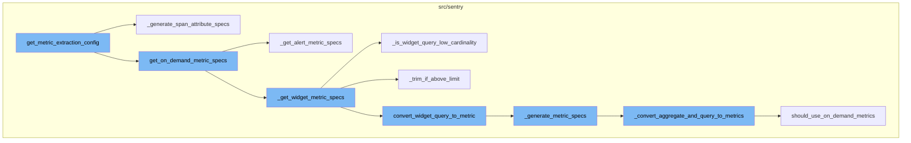
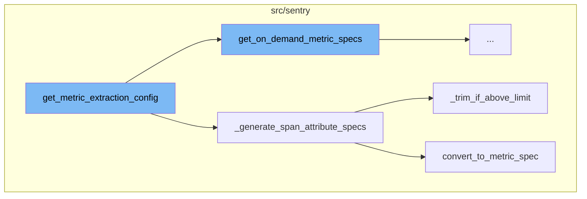
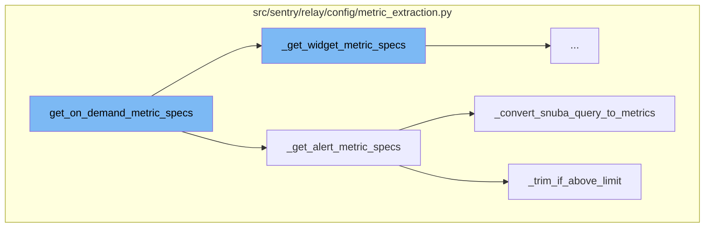
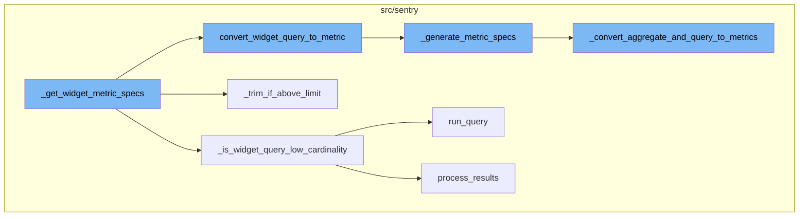

<SwmSnippet path="/src/sentry/relay/config/metric_extraction.py" line="101">

---

# get_metric_extraction_config

The `get_metric_extraction_config` function is responsible for returning a generic metric extraction configuration for a given project. It fetches the flags in batch for efficiency and propagates them downstream. The function also checks if there are any metric specifications, if not, it returns None.

```python
def get_metric_extraction_config(
    timeout: TimeChecker, project: Project
) -> MetricExtractionConfig | None:
    """
    Returns generic metric extraction config for the given project.

    This requires respective feature flags to be enabled. At the moment, metrics
    for the following models are extracted:
     - Performance alert rules with advanced filter expressions.
     - On-demand metrics widgets.
    """
    # For efficiency purposes, we fetch the flags in batch and propagate them downstream.
    sentry_sdk.set_tag("organization_id", project.organization_id)

    with sentry_sdk.start_span(op="get_on_demand_metric_specs"):
        alert_specs, widget_specs = get_on_demand_metric_specs(timeout, project)
    with sentry_sdk.start_span(op="generate_span_attribute_specs"):
        span_attr_specs = _generate_span_attribute_specs(project)
    with sentry_sdk.start_span(op="merge_metric_specs"):
        metric_specs = _merge_metric_specs(alert_specs, widget_specs, span_attr_specs)
    with sentry_sdk.start_span(op="get_extrapolation_config"):
```

---

</SwmSnippet>

<SwmSnippet path="/src/sentry/relay/config/metric_extraction.py" line="864">

---

## \_generate_span_attribute_specs

The `_generate_span_attribute_specs` function is called within `get_metric_extraction_config`. It generates span attribute specifications for a given project. It checks if the feature 'organizations:custom-metrics-extraction-rule' is enabled for the project's organization. If not, it returns an empty list. If the feature is enabled, it generates rules from the extraction configurations and converts them to metric specifications. If the number of specifications exceeds the maximum limit, it trims the list using the `_trim_if_above_limit` function.

```python
def _generate_span_attribute_specs(project: Project) -> list[HashedMetricSpec]:
    if not features.has(
        "organizations:custom-metrics-extraction-rule", organization=project.organization
    ):
        return []

    extraction_configs = SpanAttributeExtractionRuleConfig.objects.filter(project=project)
    extraction_rules = []
    for extraction_config in extraction_configs:
        extraction_rules.extend(extraction_config.generate_rules())

    version = SpecVersion(version=_METRIC_EXTRACTION_VERSION)

    specs = []
    for rule in extraction_rules:
        try:
            spec = cast(MetricSpec, convert_to_metric_spec(rule))

            if condition := spec.get("condition"):
                validate_rule_condition(json.dumps(condition))

```

---

</SwmSnippet>

<SwmSnippet path="/src/sentry/snuba/metrics/span_attribute_extraction.py" line="84">

---

### convert_to_metric_spec

The `convert_to_metric_spec` function is used within `_generate_span_attribute_specs` to convert a persisted MetricsExtractionRule into a SpanAttributeMetricSpec that satisfies the MetricSpec of the relay metric extraction config.

```python
def convert_to_metric_spec(extraction_rule: MetricsExtractionRule) -> SpanAttributeMetricSpec:
    """
    Converts a persisted MetricsExtractionRule into a SpanAttributeMetricSpec that satisfies
    MetricSpec of relay metric extraction config.
    """

    parsed_search_query = event_search.parse_search_query(extraction_rule.condition)
    extended_search_query = _extend_search_query(parsed_search_query)

    return {
        "category": "span",
        "mri": extraction_rule.generate_mri(),
        "field": _get_field(extraction_rule),
        "tags": _get_tags(extraction_rule, parsed_search_query),
        "condition": _get_rule_condition(extraction_rule, extended_search_query),
    }
```

---

</SwmSnippet>

<SwmSnippet path="/src/sentry/relay/config/metric_extraction.py" line="394">

---

#### \_trim_if_above_limit

The `_trim_if_above_limit` function is used within `_generate_span_attribute_specs` to trim the specifications if they exceed the maximum limit. It returns the accepted specifications and the trimmed specifications in a tuple.

```python
def _trim_if_above_limit(
    specs: Sequence[HashedMetricSpec],
    max_specs: int,
    project: Project,
    spec_type: Literal["alerts", "widgets", "span_attributes"],
) -> tuple[list[HashedMetricSpec], list[HashedMetricSpec]]:
    """Trim specs per version if above max limit, returns the accepted specs and the trimmed specs in a tuple"""
    return_specs = []
    trimmed_specs = []
    specs_per_version: dict[int, dict[str, HashedMetricSpec]] = {}

    for hash, spec, spec_version in specs:
        specs_per_version.setdefault(spec_version.version, {})
        specs_per_version[spec_version.version][hash] = (hash, spec, spec_version)

    for version, _specs_for_version in specs_per_version.items():
        specs_for_version = _specs_for_version.values()
        if len(specs_for_version) > max_specs:
            with sentry_sdk.isolation_scope() as scope:
                scope.set_tag("project_id", project.id)
                scope.set_context("specs", {"values": [spec[0] for spec in specs_for_version]})
```

---

</SwmSnippet>

<SwmSnippet path="/src/sentry/relay/config/metric_extraction.py" line="171">

---

# get_on_demand_metric_specs

The `get_on_demand_metric_specs` function is the starting point of the flow. It checks for enabled features and then calls `_get_alert_metric_specs` and `_get_widget_metric_specs` to get the specifications for alerts and widgets respectively.

```python
def get_on_demand_metric_specs(
    timeout: TimeChecker, project: Project
) -> tuple[list[HashedMetricSpec], list[HashedMetricSpec]]:
    with sentry_sdk.start_span(op="on_demand_metrics_feature_flags"):
        enabled_features = on_demand_metrics_feature_flags(project.organization)
    timeout.check()

    prefilling = "organizations:on-demand-metrics-prefill" in enabled_features

    with sentry_sdk.start_span(op="get_alert_metric_specs"):
        alert_specs = _get_alert_metric_specs(project, enabled_features, prefilling)
    timeout.check()
    with sentry_sdk.start_span(op="get_widget_metric_specs"):
        widget_specs = _get_widget_metric_specs(project, enabled_features, prefilling)
    timeout.check()

    return (alert_specs, widget_specs)
```

---

</SwmSnippet>

<SwmSnippet path="/src/sentry/relay/config/metric_extraction.py" line="207">

---

## \_get_alert_metric_specs

The `_get_alert_metric_specs` function retrieves alert rules for the project and converts them to metrics. If the number of specs exceeds the maximum limit, it trims them using the `_trim_if_above_limit` function.

```python
def _get_alert_metric_specs(
    project: Project, enabled_features: set[str], prefilling: bool
) -> list[HashedMetricSpec]:
    if not ("organizations:on-demand-metrics-extraction" in enabled_features or prefilling):
        return []

    metrics.incr(
        "on_demand_metrics.get_alerts",
        tags={"prefilling": prefilling},
    )

    datasets = [Dataset.PerformanceMetrics.value]
    if prefilling:
        datasets.append(Dataset.Transactions.value)

    alert_rules = (
        AlertRule.objects.fetch_for_project(project)
        .filter(
            organization=project.organization,
            status=AlertRuleStatus.PENDING.value,
            snuba_query__dataset__in=datasets,
```

---

</SwmSnippet>

<SwmSnippet path="/src/sentry/relay/config/metric_extraction.py" line="486">

---

### \_convert_snuba_query_to_metrics

The `_convert_snuba_query_to_metrics` function is called within `_get_alert_metric_specs`. It converts the snuba query associated with each alert rule into a metric specification.

```python
def _convert_snuba_query_to_metrics(
    project: Project, snuba_query: SnubaQuery, prefilling: bool
) -> Sequence[HashedMetricSpec] | None:
    """
    If the passed snuba_query is a valid query for on-demand metric extraction,
    returns a tuple of (hash, MetricSpec) for the query. Otherwise, returns None.
    """
    environment = snuba_query.environment.name if snuba_query.environment is not None else None
    return _convert_aggregate_and_query_to_metrics(
        project,
        snuba_query.dataset,
        snuba_query.aggregate,
        snuba_query.query,
        environment,
        prefilling,
    )
```

---

</SwmSnippet>

<SwmSnippet path="/src/sentry/relay/config/metric_extraction.py" line="394">

---

#### \_trim_if_above_limit

The `_trim_if_above_limit` function is used to limit the number of specs. If the number of specs exceeds the maximum limit, it trims them and returns the accepted and trimmed specs.

```python
def _trim_if_above_limit(
    specs: Sequence[HashedMetricSpec],
    max_specs: int,
    project: Project,
    spec_type: Literal["alerts", "widgets", "span_attributes"],
) -> tuple[list[HashedMetricSpec], list[HashedMetricSpec]]:
    """Trim specs per version if above max limit, returns the accepted specs and the trimmed specs in a tuple"""
    return_specs = []
    trimmed_specs = []
    specs_per_version: dict[int, dict[str, HashedMetricSpec]] = {}

    for hash, spec, spec_version in specs:
        specs_per_version.setdefault(spec_version.version, {})
        specs_per_version[spec_version.version][hash] = (hash, spec, spec_version)

    for version, _specs_for_version in specs_per_version.items():
        specs_for_version = _specs_for_version.values()
        if len(specs_for_version) > max_specs:
            with sentry_sdk.isolation_scope() as scope:
                scope.set_tag("project_id", project.id)
                scope.set_context("specs", {"values": [spec[0] for spec in specs_for_version]})
```

---

</SwmSnippet>

<SwmSnippet path="/src/sentry/relay/config/metric_extraction.py" line="291">

---

## \_get_widget_metric_specs

The `_get_widget_metric_specs` function is responsible for fetching all queries of all on-demand metrics widgets of an organization. It then converts each widget query into a metric specification using the `convert_widget_query_to_metric` function. If the widget query can use stateful extraction, it checks if the extraction is enabled. If not, it ignores the widget. If the widget query cannot use stateful extraction, it checks if the widget query has low cardinality. If not, it ignores the widget. Finally, it trims the specifications if they exceed the maximum limit.

```python
def _get_widget_metric_specs(
    project: Project, enabled_features: set[str], prefilling: bool
) -> list[HashedMetricSpec]:
    if "organizations:on-demand-metrics-extraction-widgets" not in enabled_features:
        metrics.incr("on_demand_metrics.get_widget_metric_specs.extraction_feature_disabled")
        return []

    metrics.incr(
        "on_demand_metrics.get_widgets",
        tags={"prefilling": prefilling},
    )

    # fetch all queries of all on demand metrics widgets of this organization
    widget_queries = (
        DashboardWidgetQuery.objects.filter(
            widget__dashboard__organization=project.organization,
            widget__widget_type=DashboardWidgetTypes.DISCOVER,
        )
        .prefetch_related("dashboardwidgetqueryondemand_set", "widget")
        .order_by("-widget__dashboard__last_visited", "widget__order")
    )
```

---

</SwmSnippet>

<SwmSnippet path="/src/sentry/relay/config/metric_extraction.py" line="686">

---

### \_is_widget_query_low_cardinality

The `_is_widget_query_low_cardinality` function checks the cardinality of existing widget queries before allowing the metric specification. This is to ensure that group by clauses with high-cardinality tags are not added to the on-demand metric. It runs a query and processes the results to determine the cardinality.

```python
def _is_widget_query_low_cardinality(widget_query: DashboardWidgetQuery, project: Project) -> bool:
    """
    Checks cardinality of existing widget queries before allowing the metric spec, so that
    group by clauses with high-cardinality tags are not added to the on_demand metric.

    New queries will be checked upon creation and not allowed at that time.
    """
    params: ParamsType = {
        "statsPeriod": "30m",
        "project_objects": [project],
        "organization_id": project.organization_id,  # Organization id has to be specified to not violate allocation policy.
    }
    start, end = get_date_range_from_params(params)
    params["start"] = start
    params["end"] = end

    metrics.incr("on_demand_metrics.cardinality_check")

    query_killswitch = options.get("on_demand.max_widget_cardinality.killswitch")
    if query_killswitch:
        return True
```

---

</SwmSnippet>

<SwmSnippet path="/src/sentry/relay/config/metric_extraction.py" line="394">

---

#### \_trim_if_above_limit

The `_trim_if_above_limit` function trims the specifications per version if they exceed the maximum limit. It returns the accepted specifications and the trimmed specifications in a tuple.

```python
def _trim_if_above_limit(
    specs: Sequence[HashedMetricSpec],
    max_specs: int,
    project: Project,
    spec_type: Literal["alerts", "widgets", "span_attributes"],
) -> tuple[list[HashedMetricSpec], list[HashedMetricSpec]]:
    """Trim specs per version if above max limit, returns the accepted specs and the trimmed specs in a tuple"""
    return_specs = []
    trimmed_specs = []
    specs_per_version: dict[int, dict[str, HashedMetricSpec]] = {}

    for hash, spec, spec_version in specs:
        specs_per_version.setdefault(spec_version.version, {})
        specs_per_version[spec_version.version][hash] = (hash, spec, spec_version)

    for version, _specs_for_version in specs_per_version.items():
        specs_for_version = _specs_for_version.values()
        if len(specs_for_version) > max_specs:
            with sentry_sdk.isolation_scope() as scope:
                scope.set_tag("project_id", project.id)
                scope.set_context("specs", {"values": [spec[0] for spec in specs_for_version]})
```

---

</SwmSnippet>

<SwmSnippet path="/src/sentry/relay/config/metric_extraction.py" line="504">

---

### convert_widget_query_to_metric

The `convert_widget_query_to_metric` function converts a passed metrics widget query to one or more MetricSpecs. A widget query can result in multiple metric specs if it selects multiple fields.

```python
def convert_widget_query_to_metric(
    project: Project,
    widget_query: DashboardWidgetQuery,
    prefilling: bool,
    organization_bulk_query_cache: dict[int, dict[str, bool]] | None = None,
) -> list[HashedMetricSpec]:
    """
    Converts a passed metrics widget query to one or more MetricSpecs.
    Widget query can result in multiple metric specs if it selects multiple fields
    """
    metrics_specs: list[HashedMetricSpec] = []

    if not widget_query.aggregates:
        return metrics_specs

    aggregates = widget_query.aggregates
    groupbys = widget_query.columns

    for aggregate in aggregates:
        metrics_specs += _generate_metric_specs(
            aggregate, widget_query, project, prefilling, groupbys, organization_bulk_query_cache
```

---

</SwmSnippet>

<SwmSnippet path="/src/sentry/relay/config/metric_extraction.py" line="530">

---

#### \_generate_metric_specs

The `_generate_metric_specs` function generates metric specifications for each aggregate in the widget query. It uses the `_convert_aggregate_and_query_to_metrics` function to convert each aggregate and query to a metric specification.

```python
def _generate_metric_specs(
    aggregate: str,
    widget_query: DashboardWidgetQuery,
    project: Project,
    prefilling: bool,
    groupbys: Sequence[str] | None = None,
    organization_bulk_query_cache: dict[int, dict[str, bool]] | None = None,
) -> list[HashedMetricSpec]:
    metrics_specs = []
    metrics.incr("on_demand_metrics.before_widget_spec_generation")
    if results := _convert_aggregate_and_query_to_metrics(
        project,
        # there is an internal check to make sure we extract metrics only for performance dataset
        # however widgets do not have a dataset field, so we need to pass it explicitly
        Dataset.PerformanceMetrics.value,
        aggregate,
        widget_query.conditions,
        None,
        prefilling,
        groupbys=groupbys,
        spec_type=MetricSpecType.DYNAMIC_QUERY,
```

---

</SwmSnippet>

<SwmSnippet path="/src/sentry/relay/config/metric_extraction.py" line="791">

---

##### \_convert_aggregate_and_query_to_metrics

The `_convert_aggregate_and_query_to_metrics` function converts an aggregate and a query to a metric specification with its hash value. It creates as many specifications as supported and validates each specification.

```python
def _convert_aggregate_and_query_to_metrics(
    project: Project,
    dataset: str,
    aggregate: str,
    query: str,
    environment: str | None,
    prefilling: bool,
    spec_type: MetricSpecType = MetricSpecType.SIMPLE_QUERY,
    groupbys: Sequence[str] | None = None,
    organization_bulk_query_cache: dict[int, dict[str, bool]] | None = None,
) -> Sequence[HashedMetricSpec] | None:
    """
    Converts an aggregate and a query to a metric spec with its hash value.

    Extra metric specs will be returned if we need to maintain various versions of it.
    This makes it easier to maintain multiple spec versions when a mistake is made.
    """

    # We can avoid injection of the environment in the query, since it's supported by standard, thus it won't change
    # the supported state of a query, since if it's standard, and we added environment it will still be standard
    # and if it's on demand, it will always be on demand irrespectively of what we add.
```

---

</SwmSnippet>



# Flow drill down

First, we'll zoom into this section of the flow:



<SwmSnippet path="/src/sentry/relay/config/metric_extraction.py" line="101">

---

# get_metric_extraction_config Function

The `get_metric_extraction_config` function is responsible for returning a generic metric extraction configuration for a given project. It fetches the flags in batch for efficiency and propagates them downstream. The function also checks if there are any metric specifications, if not, it returns None.

```python
def get_metric_extraction_config(
    timeout: TimeChecker, project: Project
) -> MetricExtractionConfig | None:
    """
    Returns generic metric extraction config for the given project.

    This requires respective feature flags to be enabled. At the moment, metrics
    for the following models are extracted:
     - Performance alert rules with advanced filter expressions.
     - On-demand metrics widgets.
    """
    # For efficiency purposes, we fetch the flags in batch and propagate them downstream.
    sentry_sdk.set_tag("organization_id", project.organization_id)

    with sentry_sdk.start_span(op="get_on_demand_metric_specs"):
        alert_specs, widget_specs = get_on_demand_metric_specs(timeout, project)
    with sentry_sdk.start_span(op="generate_span_attribute_specs"):
        span_attr_specs = _generate_span_attribute_specs(project)
    with sentry_sdk.start_span(op="merge_metric_specs"):
        metric_specs = _merge_metric_specs(alert_specs, widget_specs, span_attr_specs)
    with sentry_sdk.start_span(op="get_extrapolation_config"):
```

---

</SwmSnippet>

<SwmSnippet path="/src/sentry/relay/config/metric_extraction.py" line="864">

---

## \_generate_span_attribute_specs Function

The `_generate_span_attribute_specs` function is called within `get_metric_extraction_config`. It generates span attribute specifications for a given project. It checks if the feature 'organizations:custom-metrics-extraction-rule' is enabled for the project's organization. If not, it returns an empty list. If the feature is enabled, it generates rules from the extraction configurations and converts them to metric specifications. If the number of specifications exceeds the maximum limit, it trims the list using the `_trim_if_above_limit` function.

```python
def _generate_span_attribute_specs(project: Project) -> list[HashedMetricSpec]:
    if not features.has(
        "organizations:custom-metrics-extraction-rule", organization=project.organization
    ):
        return []

    extraction_configs = SpanAttributeExtractionRuleConfig.objects.filter(project=project)
    extraction_rules = []
    for extraction_config in extraction_configs:
        extraction_rules.extend(extraction_config.generate_rules())

    version = SpecVersion(version=_METRIC_EXTRACTION_VERSION)

    specs = []
    for rule in extraction_rules:
        try:
            spec = cast(MetricSpec, convert_to_metric_spec(rule))

            if condition := spec.get("condition"):
                validate_rule_condition(json.dumps(condition))

```

---

</SwmSnippet>

<SwmSnippet path="/src/sentry/snuba/metrics/span_attribute_extraction.py" line="84">

---

### convert_to_metric_spec Function

The `convert_to_metric_spec` function is used within `_generate_span_attribute_specs` to convert a persisted MetricsExtractionRule into a SpanAttributeMetricSpec that satisfies the MetricSpec of the relay metric extraction config.

```python
def convert_to_metric_spec(extraction_rule: MetricsExtractionRule) -> SpanAttributeMetricSpec:
    """
    Converts a persisted MetricsExtractionRule into a SpanAttributeMetricSpec that satisfies
    MetricSpec of relay metric extraction config.
    """

    parsed_search_query = event_search.parse_search_query(extraction_rule.condition)
    extended_search_query = _extend_search_query(parsed_search_query)

    return {
        "category": "span",
        "mri": extraction_rule.generate_mri(),
        "field": _get_field(extraction_rule),
        "tags": _get_tags(extraction_rule, parsed_search_query),
        "condition": _get_rule_condition(extraction_rule, extended_search_query),
    }
```

---

</SwmSnippet>

<SwmSnippet path="/src/sentry/relay/config/metric_extraction.py" line="394">

---

#### \_trim_if_above_limit Function

The `_trim_if_above_limit` function is used within `_generate_span_attribute_specs` to trim the specifications if they exceed the maximum limit. It returns the accepted specifications and the trimmed specifications in a tuple.

```python
def _trim_if_above_limit(
    specs: Sequence[HashedMetricSpec],
    max_specs: int,
    project: Project,
    spec_type: Literal["alerts", "widgets", "span_attributes"],
) -> tuple[list[HashedMetricSpec], list[HashedMetricSpec]]:
    """Trim specs per version if above max limit, returns the accepted specs and the trimmed specs in a tuple"""
    return_specs = []
    trimmed_specs = []
    specs_per_version: dict[int, dict[str, HashedMetricSpec]] = {}

    for hash, spec, spec_version in specs:
        specs_per_version.setdefault(spec_version.version, {})
        specs_per_version[spec_version.version][hash] = (hash, spec, spec_version)

    for version, _specs_for_version in specs_per_version.items():
        specs_for_version = _specs_for_version.values()
        if len(specs_for_version) > max_specs:
            with sentry_sdk.isolation_scope() as scope:
                scope.set_tag("project_id", project.id)
                scope.set_context("specs", {"values": [spec[0] for spec in specs_for_version]})
```

---

</SwmSnippet>

Now, lets zoom into this section of the flow:



<SwmSnippet path="/src/sentry/relay/config/metric_extraction.py" line="171">

---

# get_on_demand_metric_specs

The `get_on_demand_metric_specs` function is the starting point of the flow. It checks for enabled features and then calls `_get_alert_metric_specs` and `_get_widget_metric_specs` to get the specifications for alerts and widgets respectively.

```python
def get_on_demand_metric_specs(
    timeout: TimeChecker, project: Project
) -> tuple[list[HashedMetricSpec], list[HashedMetricSpec]]:
    with sentry_sdk.start_span(op="on_demand_metrics_feature_flags"):
        enabled_features = on_demand_metrics_feature_flags(project.organization)
    timeout.check()

    prefilling = "organizations:on-demand-metrics-prefill" in enabled_features

    with sentry_sdk.start_span(op="get_alert_metric_specs"):
        alert_specs = _get_alert_metric_specs(project, enabled_features, prefilling)
    timeout.check()
    with sentry_sdk.start_span(op="get_widget_metric_specs"):
        widget_specs = _get_widget_metric_specs(project, enabled_features, prefilling)
    timeout.check()

    return (alert_specs, widget_specs)
```

---

</SwmSnippet>

<SwmSnippet path="/src/sentry/relay/config/metric_extraction.py" line="207">

---

# \_get_alert_metric_specs

The `_get_alert_metric_specs` function retrieves alert rules for the project and converts them to metrics. If the number of specs exceeds the maximum limit, it trims them using the `_trim_if_above_limit` function.

```python
def _get_alert_metric_specs(
    project: Project, enabled_features: set[str], prefilling: bool
) -> list[HashedMetricSpec]:
    if not ("organizations:on-demand-metrics-extraction" in enabled_features or prefilling):
        return []

    metrics.incr(
        "on_demand_metrics.get_alerts",
        tags={"prefilling": prefilling},
    )

    datasets = [Dataset.PerformanceMetrics.value]
    if prefilling:
        datasets.append(Dataset.Transactions.value)

    alert_rules = (
        AlertRule.objects.fetch_for_project(project)
        .filter(
            organization=project.organization,
            status=AlertRuleStatus.PENDING.value,
            snuba_query__dataset__in=datasets,
```

---

</SwmSnippet>

<SwmSnippet path="/src/sentry/relay/config/metric_extraction.py" line="486">

---

# \_convert_snuba_query_to_metrics

The `_convert_snuba_query_to_metrics` function is called within `_get_alert_metric_specs`. It converts the snuba query associated with each alert rule into a metric specification.

```python
def _convert_snuba_query_to_metrics(
    project: Project, snuba_query: SnubaQuery, prefilling: bool
) -> Sequence[HashedMetricSpec] | None:
    """
    If the passed snuba_query is a valid query for on-demand metric extraction,
    returns a tuple of (hash, MetricSpec) for the query. Otherwise, returns None.
    """
    environment = snuba_query.environment.name if snuba_query.environment is not None else None
    return _convert_aggregate_and_query_to_metrics(
        project,
        snuba_query.dataset,
        snuba_query.aggregate,
        snuba_query.query,
        environment,
        prefilling,
    )
```

---

</SwmSnippet>

<SwmSnippet path="/src/sentry/relay/config/metric_extraction.py" line="394">

---

# \_trim_if_above_limit

The `_trim_if_above_limit` function is used to limit the number of specs. If the number of specs exceeds the maximum limit, it trims them and returns the accepted and trimmed specs.

```python
def _trim_if_above_limit(
    specs: Sequence[HashedMetricSpec],
    max_specs: int,
    project: Project,
    spec_type: Literal["alerts", "widgets", "span_attributes"],
) -> tuple[list[HashedMetricSpec], list[HashedMetricSpec]]:
    """Trim specs per version if above max limit, returns the accepted specs and the trimmed specs in a tuple"""
    return_specs = []
    trimmed_specs = []
    specs_per_version: dict[int, dict[str, HashedMetricSpec]] = {}

    for hash, spec, spec_version in specs:
        specs_per_version.setdefault(spec_version.version, {})
        specs_per_version[spec_version.version][hash] = (hash, spec, spec_version)

    for version, _specs_for_version in specs_per_version.items():
        specs_for_version = _specs_for_version.values()
        if len(specs_for_version) > max_specs:
            with sentry_sdk.isolation_scope() as scope:
                scope.set_tag("project_id", project.id)
                scope.set_context("specs", {"values": [spec[0] for spec in specs_for_version]})
```

---

</SwmSnippet>

Now, lets zoom into this section of the flow:



<SwmSnippet path="/src/sentry/relay/config/metric_extraction.py" line="291">

---

# \_get_widget_metric_specs Function

The `_get_widget_metric_specs` function is responsible for fetching all queries of all on-demand metrics widgets of an organization. It then converts each widget query into a metric specification using the `convert_widget_query_to_metric` function. If the widget query can use stateful extraction, it checks if the extraction is enabled. If not, it ignores the widget. If the widget query cannot use stateful extraction, it checks if the widget query has low cardinality. If not, it ignores the widget. Finally, it trims the specifications if they exceed the maximum limit.

```python
def _get_widget_metric_specs(
    project: Project, enabled_features: set[str], prefilling: bool
) -> list[HashedMetricSpec]:
    if "organizations:on-demand-metrics-extraction-widgets" not in enabled_features:
        metrics.incr("on_demand_metrics.get_widget_metric_specs.extraction_feature_disabled")
        return []

    metrics.incr(
        "on_demand_metrics.get_widgets",
        tags={"prefilling": prefilling},
    )

    # fetch all queries of all on demand metrics widgets of this organization
    widget_queries = (
        DashboardWidgetQuery.objects.filter(
            widget__dashboard__organization=project.organization,
            widget__widget_type=DashboardWidgetTypes.DISCOVER,
        )
        .prefetch_related("dashboardwidgetqueryondemand_set", "widget")
        .order_by("-widget__dashboard__last_visited", "widget__order")
    )
```

---

</SwmSnippet>

<SwmSnippet path="/src/sentry/relay/config/metric_extraction.py" line="686">

---

# \_is_widget_query_low_cardinality Function

The `_is_widget_query_low_cardinality` function checks the cardinality of existing widget queries before allowing the metric specification. This is to ensure that group by clauses with high-cardinality tags are not added to the on-demand metric. It runs a query and processes the results to determine the cardinality.

```python
def _is_widget_query_low_cardinality(widget_query: DashboardWidgetQuery, project: Project) -> bool:
    """
    Checks cardinality of existing widget queries before allowing the metric spec, so that
    group by clauses with high-cardinality tags are not added to the on_demand metric.

    New queries will be checked upon creation and not allowed at that time.
    """
    params: ParamsType = {
        "statsPeriod": "30m",
        "project_objects": [project],
        "organization_id": project.organization_id,  # Organization id has to be specified to not violate allocation policy.
    }
    start, end = get_date_range_from_params(params)
    params["start"] = start
    params["end"] = end

    metrics.incr("on_demand_metrics.cardinality_check")

    query_killswitch = options.get("on_demand.max_widget_cardinality.killswitch")
    if query_killswitch:
        return True
```

---

</SwmSnippet>

<SwmSnippet path="/src/sentry/relay/config/metric_extraction.py" line="394">

---

# \_trim_if_above_limit Function

The `_trim_if_above_limit` function trims the specifications per version if they exceed the maximum limit. It returns the accepted specifications and the trimmed specifications in a tuple.

```python
def _trim_if_above_limit(
    specs: Sequence[HashedMetricSpec],
    max_specs: int,
    project: Project,
    spec_type: Literal["alerts", "widgets", "span_attributes"],
) -> tuple[list[HashedMetricSpec], list[HashedMetricSpec]]:
    """Trim specs per version if above max limit, returns the accepted specs and the trimmed specs in a tuple"""
    return_specs = []
    trimmed_specs = []
    specs_per_version: dict[int, dict[str, HashedMetricSpec]] = {}

    for hash, spec, spec_version in specs:
        specs_per_version.setdefault(spec_version.version, {})
        specs_per_version[spec_version.version][hash] = (hash, spec, spec_version)

    for version, _specs_for_version in specs_per_version.items():
        specs_for_version = _specs_for_version.values()
        if len(specs_for_version) > max_specs:
            with sentry_sdk.isolation_scope() as scope:
                scope.set_tag("project_id", project.id)
                scope.set_context("specs", {"values": [spec[0] for spec in specs_for_version]})
```

---

</SwmSnippet>

<SwmSnippet path="/src/sentry/relay/config/metric_extraction.py" line="504">

---

# convert_widget_query_to_metric Function

The `convert_widget_query_to_metric` function converts a passed metrics widget query to one or more MetricSpecs. A widget query can result in multiple metric specs if it selects multiple fields.

```python
def convert_widget_query_to_metric(
    project: Project,
    widget_query: DashboardWidgetQuery,
    prefilling: bool,
    organization_bulk_query_cache: dict[int, dict[str, bool]] | None = None,
) -> list[HashedMetricSpec]:
    """
    Converts a passed metrics widget query to one or more MetricSpecs.
    Widget query can result in multiple metric specs if it selects multiple fields
    """
    metrics_specs: list[HashedMetricSpec] = []

    if not widget_query.aggregates:
        return metrics_specs

    aggregates = widget_query.aggregates
    groupbys = widget_query.columns

    for aggregate in aggregates:
        metrics_specs += _generate_metric_specs(
            aggregate, widget_query, project, prefilling, groupbys, organization_bulk_query_cache
```

---

</SwmSnippet>

<SwmSnippet path="/src/sentry/relay/config/metric_extraction.py" line="530">

---

# \_generate_metric_specs Function

The `_generate_metric_specs` function generates metric specifications for each aggregate in the widget query. It uses the `_convert_aggregate_and_query_to_metrics` function to convert each aggregate and query to a metric specification.

```python
def _generate_metric_specs(
    aggregate: str,
    widget_query: DashboardWidgetQuery,
    project: Project,
    prefilling: bool,
    groupbys: Sequence[str] | None = None,
    organization_bulk_query_cache: dict[int, dict[str, bool]] | None = None,
) -> list[HashedMetricSpec]:
    metrics_specs = []
    metrics.incr("on_demand_metrics.before_widget_spec_generation")
    if results := _convert_aggregate_and_query_to_metrics(
        project,
        # there is an internal check to make sure we extract metrics only for performance dataset
        # however widgets do not have a dataset field, so we need to pass it explicitly
        Dataset.PerformanceMetrics.value,
        aggregate,
        widget_query.conditions,
        None,
        prefilling,
        groupbys=groupbys,
        spec_type=MetricSpecType.DYNAMIC_QUERY,
```

---

</SwmSnippet>

<SwmSnippet path="/src/sentry/relay/config/metric_extraction.py" line="791">

---

# \_convert_aggregate_and_query_to_metrics Function

The `_convert_aggregate_and_query_to_metrics` function converts an aggregate and a query to a metric specification with its hash value. It creates as many specifications as supported and validates each specification.

```python
def _convert_aggregate_and_query_to_metrics(
    project: Project,
    dataset: str,
    aggregate: str,
    query: str,
    environment: str | None,
    prefilling: bool,
    spec_type: MetricSpecType = MetricSpecType.SIMPLE_QUERY,
    groupbys: Sequence[str] | None = None,
    organization_bulk_query_cache: dict[int, dict[str, bool]] | None = None,
) -> Sequence[HashedMetricSpec] | None:
    """
    Converts an aggregate and a query to a metric spec with its hash value.

    Extra metric specs will be returned if we need to maintain various versions of it.
    This makes it easier to maintain multiple spec versions when a mistake is made.
    """

    # We can avoid injection of the environment in the query, since it's supported by standard, thus it won't change
    # the supported state of a query, since if it's standard, and we added environment it will still be standard
    # and if it's on demand, it will always be on demand irrespectively of what we add.
```

---

</SwmSnippet>

&nbsp;

*This is an auto-generated document by Swimm AI 🌊 and has not yet been verified by a human*

<SwmMeta version="3.0.0" repo-id="Z2l0aHViJTNBJTNBc2VudHJ5LWRlbW8lM0ElM0FTd2ltbS1EZW1v" repo-name="sentry-demo" doc-type="flows"><sup>Powered by [Swimm](/)</sup></SwmMeta>
