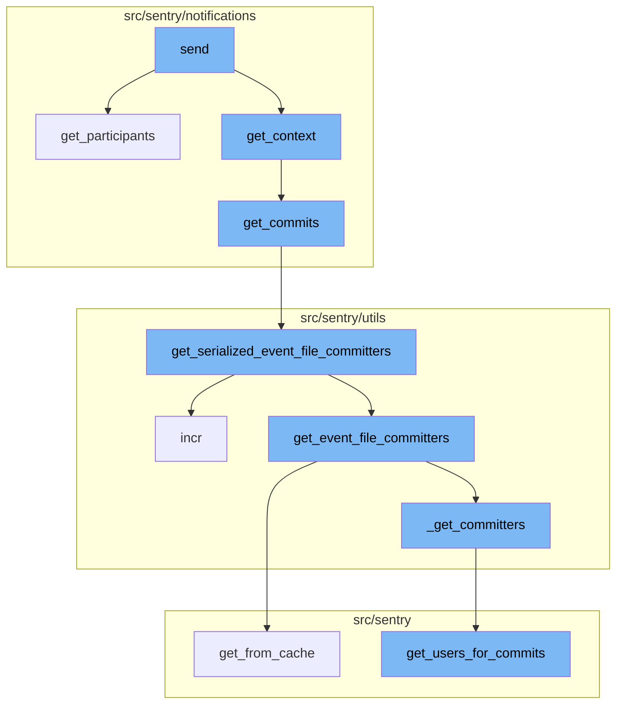
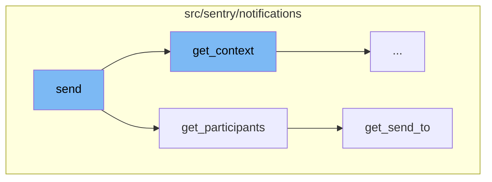
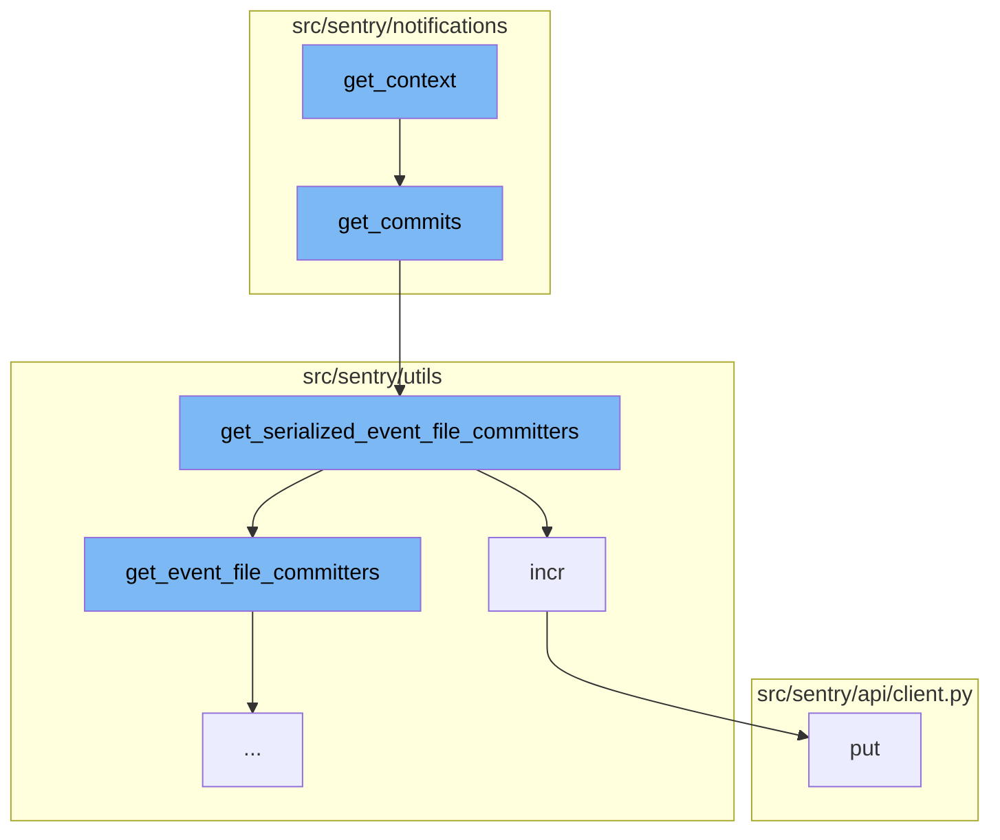
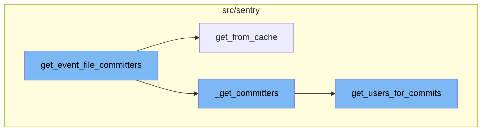

# Send Function Overview

The 'send' function is the starting point of the notification sending process. It first gathers the participants who will receive the notification using the 'get_participants' function. If there are no participants, the function logs this information and returns. If there are participants, it then gathers the shared context for the notification using the 'get_context' function. Finally, it sends the notification to each participant using the 'notify' function.

# Gathering Participants

The 'get_participants' function is used to determine who will receive the notification. It does this by calling the 'get_send_to' function, which returns a mapping of providers to participants. The 'get_send_to' function is responsible for determining the recipients of the notification. It first determines the eligible recipients based on the project, target type, target identifier, event, and fallthrough choice. If there are rules, it filters out any recipients who are muted according to the rules. Finally, it returns the recipients by provider.

# Gathering Context

The `get_context` function is the first step in the send flow. It gathers all the necessary context for the notification, including project details, group details, event details, and rules. It also checks for enhanced privacy settings and adjusts the context accordingly. The `get_commits` function is called within `get_context`. It identifies potentially suspect commits and their authors. It does this by calling the `get_serialized_event_file_committers` function.

# Identifying Commits and Authors

The `get_serialized_event_file_committers` function retrieves a list of committers for the event file. It first checks if there are any group owners for the event. If there are, it retrieves the commit and author details. If not, it calculates the committers based on the event frames and the SDK name. The `incr` function is called within `get_serialized_event_file_committers`. It increments a metric counter, which can be used for monitoring and performance tracking.

# Sending the Notification

The `put` function is the final step in the send flow. It sends a PUT request, which is typically used to update an existing resource.

# Retrieving Committers

The `get_event_file_committers` function retrieves the committers of a file in an event. It first gets the group from the cache using `get_from_cache` and then retrieves the commits associated with the releases of the group. If there are commits, it processes the event frames and retrieves the file changes in the commits. Finally, it calls `_get_committers` to get the committers of the relevant commits.

# Caching and Retrieving Committers

`get_from_cache` is a utility function used to retrieve a model instance from the cache. If the instance is not found in the cache, it fetches it from the database and stores it in the cache for future use. This function is used in `get_event_file_committers` to retrieve the group instance. `_get_committers` is a helper function used to extract the unique committers from the annotated frames and return their serialized sentry accounts. It organizes the committers by a heuristic where the first frame is worth 5 points, the second is worth 4, etc. It then calls `get_users_for_commits` to get the users for the commits.

# Retrieving Users for Commits

`get_users_for_commits` is the final function in the focused flow. It retrieves the users associated with the authors of the commits. It first gets the authors from the cache and then retrieves the users for these authors.



# Flow drill down

First, we'll zoom into this section of the flow:



<SwmSnippet path="/src/sentry/notifications/notifications/rules.py" line="295">

---

# The 'send' Function

The 'send' function is the starting point of the notification sending process. It first gathers the participants who will receive the notification using the 'get_participants' function. If there are no participants, the function logs this information and returns. If there are participants, it then gathers the shared context for the notification using the 'get_context' function. Finally, it sends the notification to each participant using the 'notify' function.

```python
    def send(self) -> None:
        from sentry.notifications.notify import notify

        metrics.incr("mail_adapter.notify")
        logger.info(
            "mail.adapter.notify",
            extra={
                "target_type": self.target_type.value,
                "target_identifier": self.target_identifier,
                "group": self.group.id,
                "project_id": self.project.id,
                "organization": self.organization.id,
                "fallthrough_choice": (
                    self.fallthrough_choice.value if self.fallthrough_choice else None
                ),
                "notification_uuid": self.notification_uuid,
            },
        )

        participants_by_provider = self.get_participants()
        if not participants_by_provider:
```

---

</SwmSnippet>

<SwmSnippet path="/src/sentry/notifications/notifications/rules.py" line="107">

---

# The 'get_participants' Function

The 'get_participants' function is used to determine who will receive the notification. It does this by calling the 'get_send_to' function, which returns a mapping of providers to participants.

```python
    def get_participants(self) -> Mapping[ExternalProviders, Iterable[Actor]]:
        return get_send_to(
            project=self.project,
            target_type=self.target_type,
            target_identifier=self.target_identifier,
            event=self.event,
            notification_type_enum=self.notification_setting_type_enum,
            fallthrough_choice=self.fallthrough_choice,
            rules=self.rules,
            notification_uuid=self.notification_uuid,
        )
```

---

</SwmSnippet>

<SwmSnippet path="/src/sentry/notifications/utils/participants.py" line="362">

---

# The 'get_send_to' Function

The 'get_send_to' function is responsible for determining the recipients of the notification. It first determines the eligible recipients based on the project, target type, target identifier, event, and fallthrough choice. If there are rules, it filters out any recipients who are muted according to the rules. Finally, it returns the recipients by provider.

```python
def get_send_to(
    project: Project,
    target_type: ActionTargetType,
    target_identifier: int | None = None,
    event: Event | None = None,
    notification_type_enum: NotificationSettingEnum = NotificationSettingEnum.ISSUE_ALERTS,
    fallthrough_choice: FallthroughChoiceType | None = None,
    rules: Iterable[Rule] | None = None,
    notification_uuid: str | None = None,
) -> Mapping[ExternalProviders, set[Actor]]:
    recipients = determine_eligible_recipients(
        project, target_type, target_identifier, event, fallthrough_choice
    )

    if rules:
        rule_snoozes = RuleSnooze.objects.filter(Q(rule__in=rules))
        muted_user_ids = []
        for rule_snooze in rule_snoozes:
            if rule_snooze.user_id is None:
                return {}
            else:
```

---

</SwmSnippet>

Now, lets zoom into this section of the flow:



<SwmSnippet path="/src/sentry/notifications/notifications/rules.py" line="162">

---

# Send Flow

The `get_context` function is the first step in the send flow. It gathers all the necessary context for the notification, including project details, group details, event details, and rules. It also checks for enhanced privacy settings and adjusts the context accordingly.

```python
    def get_context(self) -> MutableMapping[str, Any]:
        environment = self.event.get_tag("environment")
        enhanced_privacy = self.organization.flags.enhanced_privacy
        rule_details = get_rules(self.rules, self.organization, self.project)
        sentry_query_params = self.get_sentry_query_params(ExternalProviders.EMAIL)
        for rule in rule_details:
            rule.url = rule.url + sentry_query_params
            rule.status_url = rule.url + sentry_query_params

        notification_reason = get_owner_reason(
            project=self.project,
            target_type=self.target_type,
            event=self.event,
            fallthrough_choice=self.fallthrough_choice,
        )
        fallback_params: MutableMapping[str, str] = {}
        group_header = get_group_substatus_text(self.group)

        notification_uuid = self.notification_uuid if hasattr(self, "notification_uuid") else None
        context = {
            "project_label": self.project.get_full_name(),
```

---

</SwmSnippet>

<SwmSnippet path="/src/sentry/notifications/utils/__init__.py" line="240">

---

The `get_commits` function is called within `get_context`. It identifies potentially suspect commits and their authors. It does this by calling the `get_serialized_event_file_committers` function.

```python
def get_commits(project: Project, event: Event) -> Sequence[Mapping[str, Any]]:
    # lets identify possibly suspect commits and owners
    commits: MutableMapping[int, Mapping[str, Any]] = {}
    try:
        committers = get_serialized_event_file_committers(project, event)
    except (Commit.DoesNotExist, Release.DoesNotExist):
        pass
    except Exception as exc:
        logging.exception(str(exc))
    else:
        for committer in committers:
            for commit in committer["commits"]:
                if commit["id"] not in commits:
                    commit_data = dict(commit)
                    commit_data["shortId"] = commit_data["id"][:7]
                    commit_data["author"] = committer["author"]
                    commit_data["subject"] = (
                        commit_data["message"].split("\n", 1)[0] if commit_data["message"] else ""
                    )
                    if commit.get("pullRequest"):
                        commit_data["pull_request"] = commit["pullRequest"]
```

---

</SwmSnippet>

<SwmSnippet path="/src/sentry/utils/committers.py" line="295">

---

The `get_serialized_event_file_committers` function retrieves a list of committers for the event file. It first checks if there are any group owners for the event. If there are, it retrieves the commit and author details. If not, it calculates the committers based on the event frames and the SDK name.

```python
def get_serialized_event_file_committers(
    project: Project, event: Event, frame_limit: int = 25
) -> Sequence[AuthorCommitsSerialized]:

    group_owners = GroupOwner.objects.filter(
        group_id=event.group_id,
        project=project,
        organization_id=project.organization_id,
        type=GroupOwnerType.SUSPECT_COMMIT.value,
        context__isnull=False,
    ).order_by("-date_added")

    if len(group_owners) > 0:
        owner = next(filter(lambda go: go.context.get("commitId"), group_owners), None)
        if not owner:
            return []
        commit = Commit.objects.get(id=owner.context.get("commitId"))
        commit_author = commit.author

        if not commit_author:
            return []
```

---

</SwmSnippet>

<SwmSnippet path="/src/sentry/utils/metrics.py" line="101">

---

The `incr` function is called within `get_serialized_event_file_committers`. It increments a metric counter, which can be used for monitoring and performance tracking.

```python
    def incr(
        self,
        key: str,
        instance: str | None = None,
        tags: Tags | None = None,
        amount: int = 1,
        sample_rate: float = settings.SENTRY_METRICS_SAMPLE_RATE,
    ) -> None:
        if not self._started:
            self._start()
        self.q.put((key, instance, tags, amount, sample_rate))
```

---

</SwmSnippet>

<SwmSnippet path="/src/sentry/api/client.py" line="119">

---

The `put` function is the final step in the send flow. It sends a PUT request, which is typically used to update an existing resource.

```python
    def put(self, *args, **kwargs):
        return self.request("PUT", *args, **kwargs)
```

---

</SwmSnippet>

Now, lets zoom into this section of the flow:



<SwmSnippet path="/src/sentry/utils/committers.py" line="232">

---

# get_event_file_committers

The `get_event_file_committers` function is the starting point of the focused flow. It retrieves the committers of a file in an event. It first gets the group from the cache using `get_from_cache` and then retrieves the commits associated with the releases of the group. If there are commits, it processes the event frames and retrieves the file changes in the commits. Finally, it calls `_get_committers` to get the committers of the relevant commits.

```python
def get_event_file_committers(
    project: Project,
    group_id: int,
    event_frames: Sequence[Mapping[str, Any]],
    event_platform: str,
    frame_limit: int = 25,
    sdk_name: str | None = None,
) -> Sequence[AuthorCommits]:
    group = Group.objects.get_from_cache(id=group_id)

    first_release_version = group.get_first_release()
    if not first_release_version:
        raise Release.DoesNotExist

    releases = get_previous_releases(project, first_release_version)
    if not releases:
        raise Release.DoesNotExist

    commits = _get_commits(releases)
    if not commits:
        raise Commit.DoesNotExist
```

---

</SwmSnippet>

<SwmSnippet path="/src/sentry/db/models/manager/base.py" line="281">

---

# get_from_cache

`get_from_cache` is a utility function used to retrieve a model instance from the cache. If the instance is not found in the cache, it fetches it from the database and stores it in the cache for future use. This function is used in `get_event_file_committers` to retrieve the group instance.

```python
    def get_from_cache(
        self, use_replica: bool = settings.SENTRY_MODEL_CACHE_USE_REPLICA, **kwargs: Any
    ) -> M:
        """
        Wrapper around QuerySet.get which supports caching of the
        intermediate value.  Callee is responsible for making sure
        the cache key is cleared on save.
        """
        if not self.cache_fields:
            raise ValueError("We cannot cache this query. Just hit the database.")

        key, pk_name, value = self._get_cacheable_kv_from_kwargs(kwargs)
        if key not in self.cache_fields and key != pk_name:
            raise ValueError("We cannot cache this query. Just hit the database.")

        cache_key = self.__get_lookup_cache_key(**{key: value})
        local_cache = self._get_local_cache()

        def validate_result(inst: Any) -> M:
            if isinstance(inst, self.model) and (key != pk_name or int(value) == inst.pk):
                return inst
```

---

</SwmSnippet>

<SwmSnippet path="/src/sentry/utils/committers.py" line="149">

---

# \_get_committers

`_get_committers` is a helper function used to extract the unique committers from the annotated frames and return their serialized sentry accounts. It organizes the committers by a heuristic where the first frame is worth 5 points, the second is worth 4, etc. It then calls `get_users_for_commits` to get the users for the commits.

```python
def _get_committers(
    annotated_frames: Sequence[AnnotatedFrame],
    commits: Sequence[tuple[Commit, int]],
) -> Sequence[AuthorCommits]:
    # extract the unique committers and return their serialized sentry accounts
    committers: MutableMapping[int, int] = defaultdict(int)

    # organize them by this heuristic (first frame is worth 5 points, second is worth 4, etc.)
    limit = 5
    for annotated_frame in annotated_frames:
        if limit == 0:
            break
        for commit, score in annotated_frame["commits"]:
            if not commit.author_id:
                continue
            committers[commit.author_id] += limit
            limit -= 1
            if limit == 0:
                break

    author_users: Mapping[str, Author] = get_users_for_commits([c for c, _ in commits])
```

---

</SwmSnippet>

<SwmSnippet path="/src/sentry/api/serializers/models/commit.py" line="12">

---

# get_users_for_commits

`get_users_for_commits` is the final function in the focused flow. It retrieves the users associated with the authors of the commits. It first gets the authors from the cache and then retrieves the users for these authors.

```python
def get_users_for_commits(item_list, user=None) -> Mapping[str, Author]:
    authors = list(
        CommitAuthor.objects.get_many_from_cache([i.author_id for i in item_list if i.author_id])
    )

    if authors:
        org_ids = {item.organization_id for item in item_list}
        if len(org_ids) == 1:
            return get_users_for_authors(organization_id=org_ids.pop(), authors=authors, user=user)
    return {}
```

---

</SwmSnippet>

&nbsp;

*This is an auto-generated document by Swimm AI 🌊 and has not yet been verified by a human*

<SwmMeta version="3.0.0" repo-id="Z2l0aHViJTNBJTNBc2VudHJ5LWRlbW8lM0ElM0FTd2ltbS1EZW1v" repo-name="sentry-demo" doc-type="flows"><sup>Powered by [Swimm](/)</sup></SwmMeta>
