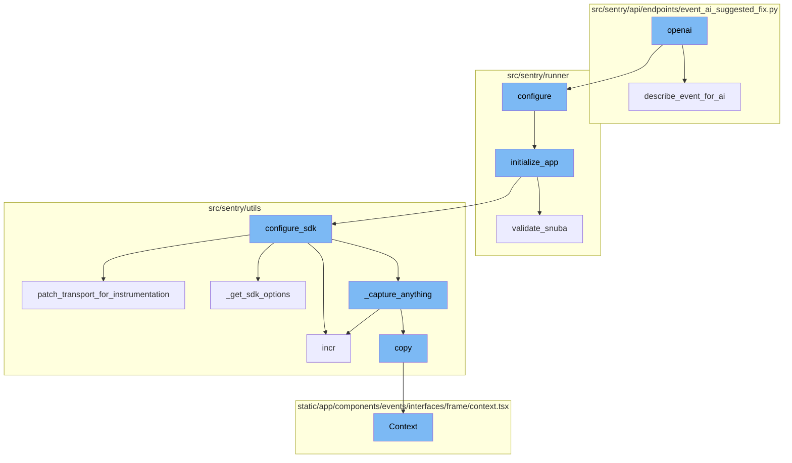
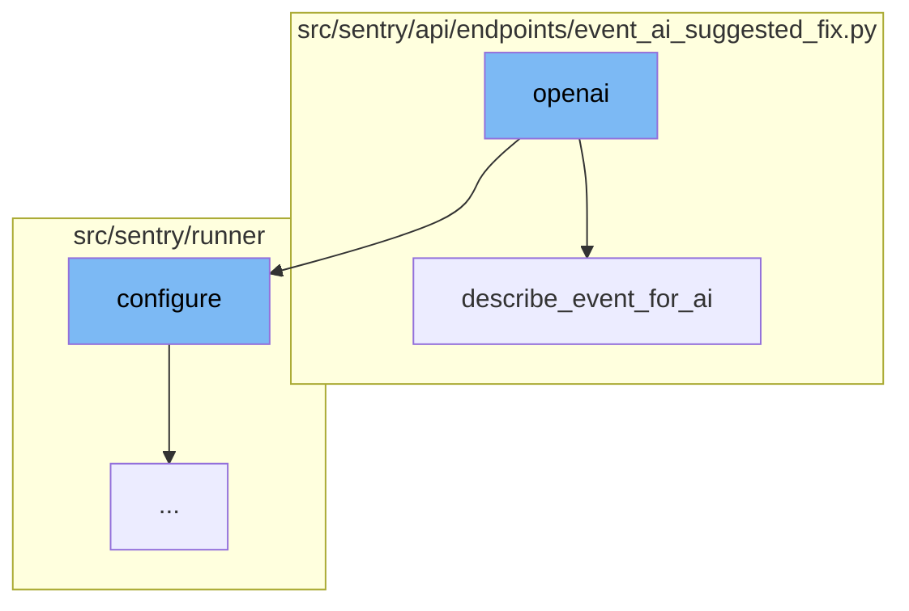
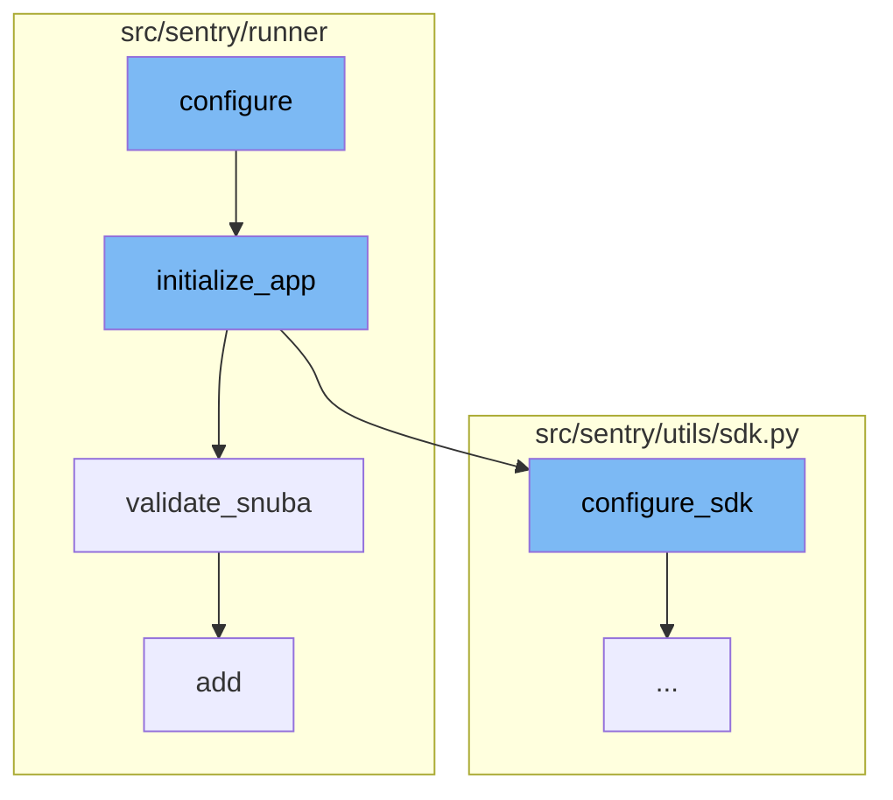
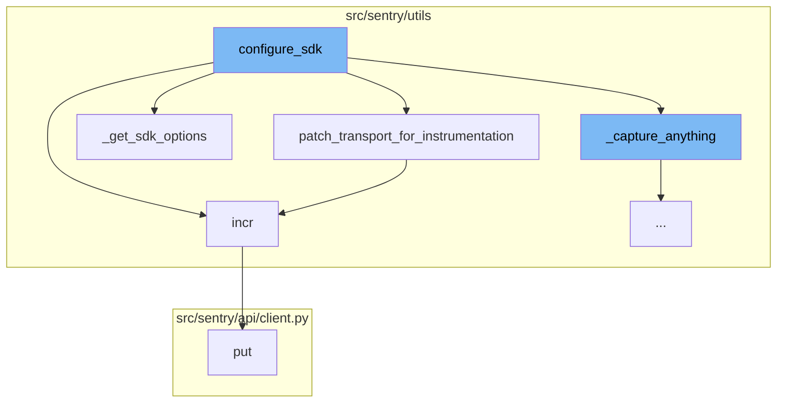
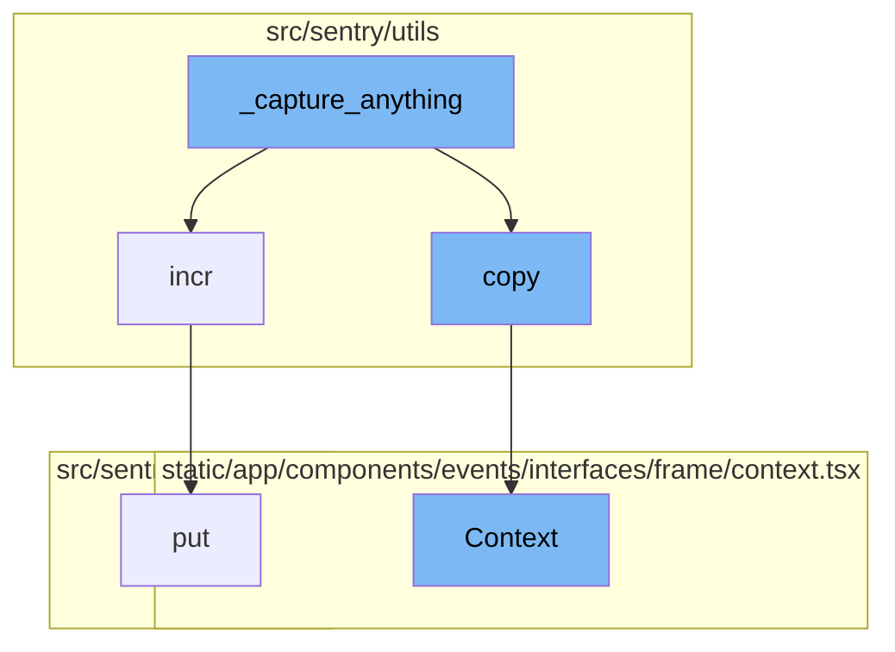

<SwmSnippet path="/src/sentry/runner/commands/openai.py" line="12">

---

# OpenAI Integration

The `openai` function is the main entry point for the OpenAI integration. It takes an event, a model, and a flag to dump the prompt. It first configures the Sentry runner, then loads the event data and depending on the `dump_prompt` flag, it either prints the AI's description of the event or suggests a fix for the event.

```python
def openai(event: IO[str], model: str, dump_prompt: bool) -> None:
    """
    Runs the OpenAI assistent against a JSON event payload.
    """
    from sentry.runner import configure

    configure()

    from sentry.api.endpoints.event_ai_suggested_fix import describe_event_for_ai, suggest_fix

    event_data = json.load(event)
    if dump_prompt:
        click.echo(json.dumps(describe_event_for_ai(event_data, model=model), indent=2))
    else:
        resp = suggest_fix(event_data, stream=True, model=model)
        for chunk in resp:
            click.echo(chunk, nl=False)
        click.echo()
```

---

</SwmSnippet>

<SwmSnippet path="/src/sentry/api/endpoints/event_ai_suggested_fix.py" line="190">

---

# Event Description for AI

The `describe_event_for_ai` function is used to prepare the event data for the AI model. It formats the event data into a structure that the AI model can understand. This includes extracting the message, platform, exceptions, and other relevant information from the event.

```python
def describe_event_for_ai(event, model):
    detailed = model.startswith("gpt-4")
    data = {}

    msg = event.get("logentry")
    if msg:
        data["message"] = msg

    platform = event.get("platform")
    if platform and platform != "other":
        data["language"] = platform

    exceptions = data.setdefault("exceptions", [])
    for idx, exc in enumerate(
        reversed((event.get("exception", {})).get("values", ())[:MAX_EXCEPTIONS])
    ):
        exception: dict[str, Any] = {}
        if idx > 0:
            exception["raised_during_handling_of_previous_exception"] = True
        exception["num"] = idx + 1
        exc_type = exc.get("type")
```

---

</SwmSnippet>

<SwmSnippet path="/src/sentry/runner/settings.py" line="53">

---

# Application Configuration

The `configure` function is the entry point of the OpenAI flow. It takes in the configuration files and sets up the environment accordingly. If the environment is already set up, it simply returns. Otherwise, it adds additional mimetypes for static files, checks if the configuration files exist, and if they do, it sets the environment variables accordingly. Finally, it calls the `initialize_app` function.

```python
def configure(
    ctx: click.Context | None, py: str, yaml: str | None, skip_service_validation: bool = False
) -> None:
    """
    Given the two different config files, set up the environment.

    NOTE: Will only execute once, so it's safe to call multiple times.
    """
    global __installed
    if __installed:
        return

    # Make sure that our warnings are always displayed.
    warnings.filterwarnings("default", "", Warning, r"^sentry")

    # Add in additional mimetypes that are useful for our static files
    # which aren't common in default system registries
    import mimetypes

    for type, ext in (
        ("application/json", "map"),
```

---

</SwmSnippet>

<SwmSnippet path="/src/sentry/runner/initializer.py" line="306">

---

# Application Initialization

The `initialize_app` function takes in the configuration and sets up the application accordingly. It sets up various settings, validates the configuration, and initializes various services. It also calls the `validate_snuba` function to ensure that everything related to Snuba is in sync.

```python
def initialize_app(config: dict[str, Any], skip_service_validation: bool = False) -> None:
    settings = config["settings"]

    # Just reuse the integration app for Single Org / Self-Hosted as
    # it doesn't make much sense to use 2 separate apps for SSO and
    # integration.
    if settings.SENTRY_SINGLE_ORGANIZATION:
        options_mapper.update(
            {
                "github-app.client-id": "GITHUB_APP_ID",
                "github-app.client-secret": "GITHUB_API_SECRET",
            }
        )

    bootstrap_options(settings, config["options"])

    logging.raiseExceptions = settings.DEBUG

    configure_structlog()

    # Commonly setups don't correctly configure themselves for production envs
```

---

</SwmSnippet>

<SwmSnippet path="/src/sentry/runner/initializer.py" line="620">

---

# Snuba Validation

The `validate_snuba` function checks if all the required Snuba backends are set up and if the event stream is compatible with Snuba. If not, it raises a configuration error. This function ensures that the Sentry application is correctly configured to use Snuba.

```python
def validate_snuba() -> None:
    """
    Make sure everything related to Snuba is in sync.

    This covers a few cases:

    * When you have features related to Snuba, you must also
      have Snuba fully configured correctly to continue.
    * If you have Snuba specific search/tagstore/tsdb backends,
      you must also have a Snuba compatible eventstream backend
      otherwise no data will be written into Snuba.
    * If you only have Snuba related eventstream, yell that you
      probably want the other backends otherwise things are weird.
    """
    if not settings.DEBUG:
        return

    has_all_snuba_required_backends = (
        settings.SENTRY_SEARCH
        in (
            "sentry.search.snuba.EventsDatasetSnubaSearchBackend",
```

---

</SwmSnippet>

<SwmSnippet path="/src/sentry/runner/commands/permissions.py" line="37">

---

# Permission Addition

The `add` function takes in a user and a permission, and adds the permission to the user. If the permission already exists for the user, it simply returns a message stating so. Otherwise, it adds the permission and returns a success message.

```python
def add(user: str, permission: str) -> None:
    "Add a permission to a user."
    from django.db import IntegrityError, transaction

    from sentry.models.userpermission import UserPermission

    user_inst = user_param_to_user(user)

    try:
        with transaction.atomic(router.db_for_write(UserPermission)):
            UserPermission.objects.create(user=user_inst, permission=permission)
    except IntegrityError:
        click.echo(f"Permission already exists for `{user_inst.username}`")
    else:
        click.echo(f"Added permission `{permission}` to `{user_inst.username}`")
```

---

</SwmSnippet>

<SwmSnippet path="/src/sentry/utils/sdk.py" line="275">

---

# SDK Configuration

The `configure_sdk` function sets up the SDK for the application. It includes a class `MultiplexingTransport` which has methods for capturing events and envelopes, recording lost events, and checking the health of the transport. The `_capture_anything` method is particularly important as it ensures that events are captured and sent to Sentry.

```python
def configure_sdk():
    """
    Setup and initialize the Sentry SDK.
    """
    sdk_options, dsns = _get_sdk_options()

    internal_project_key = get_project_key()

    if dsns.sentry4sentry:
        transport = make_transport(get_options(dsn=dsns.sentry4sentry, **sdk_options))
        sentry4sentry_transport = patch_transport_for_instrumentation(transport, "upstream")
    else:
        sentry4sentry_transport = None

    if dsns.sentry_saas:
        transport = make_transport(get_options(dsn=dsns.sentry_saas, **sdk_options))
        sentry_saas_transport = patch_transport_for_instrumentation(transport, "relay")
    elif settings.IS_DEV and not settings.SENTRY_USE_RELAY:
        sentry_saas_transport = None
    elif internal_project_key and internal_project_key.dsn_private:
        transport = make_transport(get_options(dsn=internal_project_key.dsn_private, **sdk_options))
```

---

</SwmSnippet>

<SwmSnippet path="/src/sentry/utils/sdk.py" line="237">

---

# Transport Instrumentation

`patch_transport_for_instrumentation` is a function that patches transport functions to add metrics. This helps improve resolution around events sent to the ingest. It modifies the `_send_request` method of the transport to increment a metric before sending the request.

```python
# Patches transport functions to add metrics to improve resolution around events sent to our ingest.
# Leaving this in to keep a permanent measurement of sdk requests vs ingest.
def patch_transport_for_instrumentation(transport, transport_name):
    _send_request = transport._send_request
    if _send_request:

        def patched_send_request(*args, **kwargs):
            metrics.incr(f"internal.sent_requests.{transport_name}.events")
            return _send_request(*args, **kwargs)

        transport._send_request = patched_send_request
    return transport
```

---

</SwmSnippet>

<SwmSnippet path="/src/sentry/utils/metrics.py" line="101">

---

# Metric Increment

`incr` is a function that increments a metric's value. This function is used to track the number of captured and uncaptured events.

```python
    def incr(
        self,
        key: str,
        instance: str | None = None,
        tags: Tags | None = None,
        amount: int = 1,
        sample_rate: float = settings.SENTRY_METRICS_SAMPLE_RATE,
    ) -> None:
        if not self._started:
            self._start()
        self.q.put((key, instance, tags, amount, sample_rate))
```

---

</SwmSnippet>

<SwmSnippet path="/src/sentry/utils/sdk.py" line="256">

---

# SDK Options Retrieval

`_get_sdk_options` is a function that retrieves the SDK options. It copies the settings from `SENTRY_SDK_CONFIG`, modifies some of them, and returns the options along with the DSNs for Sentry and Relay.

```python
def _get_sdk_options() -> tuple[SdkConfig, Dsns]:
    sdk_options = settings.SENTRY_SDK_CONFIG.copy()
    sdk_options["send_client_reports"] = True
    sdk_options["traces_sampler"] = traces_sampler
    sdk_options["before_send_transaction"] = before_send_transaction
    sdk_options["before_send"] = before_send
    sdk_options["release"] = (
        f"backend@{sdk_options['release']}" if "release" in sdk_options else None
    )

    # Modify SENTRY_SDK_CONFIG in your deployment scripts to specify your desired DSN
    dsns = Dsns(
        sentry4sentry=sdk_options.pop("dsn", None),
        sentry_saas=sdk_options.pop("relay_dsn", None),
    )

    return sdk_options, dsns
```

---

</SwmSnippet>

<SwmSnippet path="/src/sentry/api/client.py" line="119">

---

# PUT Request

The `put` function is used to send a PUT request. This function is not directly mentioned in the flow but it might be used in the `request` method that is called within the `incr` function.

```python
    def put(self, *args, **kwargs):
        return self.request("PUT", *args, **kwargs)
```

---

</SwmSnippet>

<SwmSnippet path="/src/sentry/utils/sdk.py" line="334">

---

# Event Capture

The function `_capture_anything` is the starting point of the OpenAI flow. It is responsible for capturing events and metrics. It checks if the upstream metrics are enabled and if the method name is `capture_envelope`, it filters out all the statsd envelope items, which contain custom metrics sent by the SDK, unless they are allowed via a separate sample rate.

```python
        def _capture_anything(self, method_name, *args, **kwargs):
            # Sentry4Sentry (upstream) should get the event first because
            # it is most isolated from the sentry installation.
            if sentry4sentry_transport:
                metrics.incr("internal.captured.events.upstream")
                # TODO(mattrobenolt): Bring this back safely.
                # from sentry import options
                # install_id = options.get('sentry:install-id')
                # if install_id:
                #     event.setdefault('tags', {})['install-id'] = install_id
                s4s_args = args
                # We want to control whether we want to send metrics at the s4s upstream.
                if (
                    not settings.SENTRY_SDK_UPSTREAM_METRICS_ENABLED
                    and method_name == "capture_envelope"
                ):
                    args_list = list(args)
                    envelope = args_list[0]
                    # We filter out all the statsd envelope items, which contain custom metrics sent by the SDK.
                    # unless we allow them via a separate sample rate.
                    safe_items = [
```

---

</SwmSnippet>

<SwmSnippet path="/static/app/components/events/interfaces/frame/context.tsx" line="66">

---

# Context Display

The `Context` function is used to display the context of a frame in the Sentry UI. It shows the source code, variables, registers, and assembly related to a frame. It also handles the display of line coverage data if available.

```tsx
function Context({
  hasContextVars = false,
  hasContextSource = false,
  hasContextRegisters = false,
  isExpanded = false,
  hasAssembly = false,
  emptySourceNotation = false,
  registers,
  frame,
  event,
  className,
  frameMeta,
  registersMeta,
  platform,
}: Props) {
  const organization = useOrganization();

  const {projects} = useProjects();
  const project = useMemo(
    () => projects.find(p => p.id === event.projectID),
    [projects, event]
```

---

</SwmSnippet>



# Flow drill down

First, we'll zoom into this section of the flow:



# OpenAI Integration

OpenAI is integrated into the Sentry application to provide AI-assisted error analysis and suggestions for fixes. The main entry point for this functionality is the `openai` function.

<SwmSnippet path="/src/sentry/runner/commands/openai.py" line="12">

---

## openai Function

The `openai` function is the main entry point for the OpenAI integration. It takes an event, a model, and a flag to dump the prompt. It first configures the Sentry runner, then loads the event data and depending on the `dump_prompt` flag, it either prints the AI's description of the event or suggests a fix for the event.

```python
def openai(event: IO[str], model: str, dump_prompt: bool) -> None:
    """
    Runs the OpenAI assistent against a JSON event payload.
    """
    from sentry.runner import configure

    configure()

    from sentry.api.endpoints.event_ai_suggested_fix import describe_event_for_ai, suggest_fix

    event_data = json.load(event)
    if dump_prompt:
        click.echo(json.dumps(describe_event_for_ai(event_data, model=model), indent=2))
    else:
        resp = suggest_fix(event_data, stream=True, model=model)
        for chunk in resp:
            click.echo(chunk, nl=False)
        click.echo()
```

---

</SwmSnippet>

<SwmSnippet path="/src/sentry/api/endpoints/event_ai_suggested_fix.py" line="190">

---

## describe_event_for_ai Function

The `describe_event_for_ai` function is used to prepare the event data for the AI model. It formats the event data into a structure that the AI model can understand. This includes extracting the message, platform, exceptions, and other relevant information from the event.

```python
def describe_event_for_ai(event, model):
    detailed = model.startswith("gpt-4")
    data = {}

    msg = event.get("logentry")
    if msg:
        data["message"] = msg

    platform = event.get("platform")
    if platform and platform != "other":
        data["language"] = platform

    exceptions = data.setdefault("exceptions", [])
    for idx, exc in enumerate(
        reversed((event.get("exception", {})).get("values", ())[:MAX_EXCEPTIONS])
    ):
        exception: dict[str, Any] = {}
        if idx > 0:
            exception["raised_during_handling_of_previous_exception"] = True
        exception["num"] = idx + 1
        exc_type = exc.get("type")
```

---

</SwmSnippet>

Now, lets zoom into this section of the flow:



# OpenAI Flow

OpenAI in this context refers to a flow of operations in the Sentry application. The flow starts with the `configure` function, which sets up the environment based on different configuration files. This function is defined in `src/sentry/runner/settings.py`.

<SwmSnippet path="/src/sentry/runner/settings.py" line="53">

---

# OpenAI Flow

The `configure` function is the entry point of the OpenAI flow. It takes in the configuration files and sets up the environment accordingly. If the environment is already set up, it simply returns. Otherwise, it adds additional mimetypes for static files, checks if the configuration files exist, and if they do, it sets the environment variables accordingly. Finally, it calls the `initialize_app` function.

```python
def configure(
    ctx: click.Context | None, py: str, yaml: str | None, skip_service_validation: bool = False
) -> None:
    """
    Given the two different config files, set up the environment.

    NOTE: Will only execute once, so it's safe to call multiple times.
    """
    global __installed
    if __installed:
        return

    # Make sure that our warnings are always displayed.
    warnings.filterwarnings("default", "", Warning, r"^sentry")

    # Add in additional mimetypes that are useful for our static files
    # which aren't common in default system registries
    import mimetypes

    for type, ext in (
        ("application/json", "map"),
```

---

</SwmSnippet>

# Initialize App

The `initialize_app` function is the next step in the OpenAI flow. It is responsible for setting up the application based on the provided configuration. This function is defined in `src/sentry/runner/initializer.py`.

<SwmSnippet path="/src/sentry/runner/initializer.py" line="306">

---

# Initialize App

The `initialize_app` function takes in the configuration and sets up the application accordingly. It sets up various settings, validates the configuration, and initializes various services. It also calls the `validate_snuba` function to ensure that everything related to Snuba is in sync.

```python
def initialize_app(config: dict[str, Any], skip_service_validation: bool = False) -> None:
    settings = config["settings"]

    # Just reuse the integration app for Single Org / Self-Hosted as
    # it doesn't make much sense to use 2 separate apps for SSO and
    # integration.
    if settings.SENTRY_SINGLE_ORGANIZATION:
        options_mapper.update(
            {
                "github-app.client-id": "GITHUB_APP_ID",
                "github-app.client-secret": "GITHUB_API_SECRET",
            }
        )

    bootstrap_options(settings, config["options"])

    logging.raiseExceptions = settings.DEBUG

    configure_structlog()

    # Commonly setups don't correctly configure themselves for production envs
```

---

</SwmSnippet>

# Validate Snuba

The `validate_snuba` function is a part of the OpenAI flow that ensures everything related to Snuba is in sync. Snuba is a column-oriented, distributed data warehouse that Sentry uses for its event storage. This function is defined in `src/sentry/runner/initializer.py`.

<SwmSnippet path="/src/sentry/runner/initializer.py" line="620">

---

# Validate Snuba

The `validate_snuba` function checks if all the required Snuba backends are set up and if the event stream is compatible with Snuba. If not, it raises a configuration error. This function ensures that the Sentry application is correctly configured to use Snuba.

```python
def validate_snuba() -> None:
    """
    Make sure everything related to Snuba is in sync.

    This covers a few cases:

    * When you have features related to Snuba, you must also
      have Snuba fully configured correctly to continue.
    * If you have Snuba specific search/tagstore/tsdb backends,
      you must also have a Snuba compatible eventstream backend
      otherwise no data will be written into Snuba.
    * If you only have Snuba related eventstream, yell that you
      probably want the other backends otherwise things are weird.
    """
    if not settings.DEBUG:
        return

    has_all_snuba_required_backends = (
        settings.SENTRY_SEARCH
        in (
            "sentry.search.snuba.EventsDatasetSnubaSearchBackend",
```

---

</SwmSnippet>

# Add Permission

The `add` function is the final step in the OpenAI flow. It is responsible for adding a permission to a user. This function is defined in `src/sentry/runner/commands/permissions.py`.

<SwmSnippet path="/src/sentry/runner/commands/permissions.py" line="37">

---

# Add Permission

The `add` function takes in a user and a permission, and adds the permission to the user. If the permission already exists for the user, it simply returns a message stating so. Otherwise, it adds the permission and returns a success message.

```python
def add(user: str, permission: str) -> None:
    "Add a permission to a user."
    from django.db import IntegrityError, transaction

    from sentry.models.userpermission import UserPermission

    user_inst = user_param_to_user(user)

    try:
        with transaction.atomic(router.db_for_write(UserPermission)):
            UserPermission.objects.create(user=user_inst, permission=permission)
    except IntegrityError:
        click.echo(f"Permission already exists for `{user_inst.username}`")
    else:
        click.echo(f"Added permission `{permission}` to `{user_inst.username}`")
```

---

</SwmSnippet>

Now, lets zoom into this section of the flow:



# OpenAI Flow

OpenAI in this codebase refers to a flow of function calls that configure and initialize the application, set up the SDK, and handle data capture and metrics.

<SwmSnippet path="/src/sentry/utils/sdk.py" line="275">

---

## configure_sdk Function

`configure_sdk` is a function that sets up the SDK for the application. It includes a class `MultiplexingTransport` which has methods for capturing events and envelopes, recording lost events, and checking the health of the transport. The `_capture_anything` method is particularly important as it ensures that events are captured and sent to Sentry.

```python
def configure_sdk():
    """
    Setup and initialize the Sentry SDK.
    """
    sdk_options, dsns = _get_sdk_options()

    internal_project_key = get_project_key()

    if dsns.sentry4sentry:
        transport = make_transport(get_options(dsn=dsns.sentry4sentry, **sdk_options))
        sentry4sentry_transport = patch_transport_for_instrumentation(transport, "upstream")
    else:
        sentry4sentry_transport = None

    if dsns.sentry_saas:
        transport = make_transport(get_options(dsn=dsns.sentry_saas, **sdk_options))
        sentry_saas_transport = patch_transport_for_instrumentation(transport, "relay")
    elif settings.IS_DEV and not settings.SENTRY_USE_RELAY:
        sentry_saas_transport = None
    elif internal_project_key and internal_project_key.dsn_private:
        transport = make_transport(get_options(dsn=internal_project_key.dsn_private, **sdk_options))
```

---

</SwmSnippet>

<SwmSnippet path="/src/sentry/utils/sdk.py" line="237">

---

## patch_transport_for_instrumentation Function

`patch_transport_for_instrumentation` is a function that patches transport functions to add metrics. This helps improve resolution around events sent to the ingest. It modifies the `_send_request` method of the transport to increment a metric before sending the request.

```python
# Patches transport functions to add metrics to improve resolution around events sent to our ingest.
# Leaving this in to keep a permanent measurement of sdk requests vs ingest.
def patch_transport_for_instrumentation(transport, transport_name):
    _send_request = transport._send_request
    if _send_request:

        def patched_send_request(*args, **kwargs):
            metrics.incr(f"internal.sent_requests.{transport_name}.events")
            return _send_request(*args, **kwargs)

        transport._send_request = patched_send_request
    return transport
```

---

</SwmSnippet>

<SwmSnippet path="/src/sentry/utils/metrics.py" line="101">

---

## incr Function

`incr` is a function that increments a metric. It is used in the `patch_transport_for_instrumentation` function to count the number of sent requests.

```python
    def incr(
        self,
        key: str,
        instance: str | None = None,
        tags: Tags | None = None,
        amount: int = 1,
        sample_rate: float = settings.SENTRY_METRICS_SAMPLE_RATE,
    ) -> None:
        if not self._started:
            self._start()
        self.q.put((key, instance, tags, amount, sample_rate))
```

---

</SwmSnippet>

<SwmSnippet path="/src/sentry/utils/sdk.py" line="256">

---

## \_get_sdk_options Function

`_get_sdk_options` is a function that retrieves the SDK options. It copies the settings from `SENTRY_SDK_CONFIG`, modifies some of them, and returns the options along with the DSNs for Sentry and Relay.

```python
def _get_sdk_options() -> tuple[SdkConfig, Dsns]:
    sdk_options = settings.SENTRY_SDK_CONFIG.copy()
    sdk_options["send_client_reports"] = True
    sdk_options["traces_sampler"] = traces_sampler
    sdk_options["before_send_transaction"] = before_send_transaction
    sdk_options["before_send"] = before_send
    sdk_options["release"] = (
        f"backend@{sdk_options['release']}" if "release" in sdk_options else None
    )

    # Modify SENTRY_SDK_CONFIG in your deployment scripts to specify your desired DSN
    dsns = Dsns(
        sentry4sentry=sdk_options.pop("dsn", None),
        sentry_saas=sdk_options.pop("relay_dsn", None),
    )

    return sdk_options, dsns
```

---

</SwmSnippet>

<SwmSnippet path="/src/sentry/api/client.py" line="119">

---

## put Function

`put` is a function that sends a PUT request. It is used in the `incr` function to put a metric increment into a queue.

```python
    def put(self, *args, **kwargs):
        return self.request("PUT", *args, **kwargs)
```

---

</SwmSnippet>

Now, lets zoom into this section of the flow:



<SwmSnippet path="/src/sentry/utils/sdk.py" line="334">

---

# OpenAI Flow

The function `_capture_anything` is the starting point of the OpenAI flow. It is responsible for capturing events and metrics. It checks if the upstream metrics are enabled and if the method name is `capture_envelope`, it filters out all the statsd envelope items, which contain custom metrics sent by the SDK, unless they are allowed via a separate sample rate.

```python
        def _capture_anything(self, method_name, *args, **kwargs):
            # Sentry4Sentry (upstream) should get the event first because
            # it is most isolated from the sentry installation.
            if sentry4sentry_transport:
                metrics.incr("internal.captured.events.upstream")
                # TODO(mattrobenolt): Bring this back safely.
                # from sentry import options
                # install_id = options.get('sentry:install-id')
                # if install_id:
                #     event.setdefault('tags', {})['install-id'] = install_id
                s4s_args = args
                # We want to control whether we want to send metrics at the s4s upstream.
                if (
                    not settings.SENTRY_SDK_UPSTREAM_METRICS_ENABLED
                    and method_name == "capture_envelope"
                ):
                    args_list = list(args)
                    envelope = args_list[0]
                    # We filter out all the statsd envelope items, which contain custom metrics sent by the SDK.
                    # unless we allow them via a separate sample rate.
                    safe_items = [
```

---

</SwmSnippet>

<SwmSnippet path="/src/sentry/utils/metrics.py" line="101">

---

The `incr` function is called within `_capture_anything`. It is used to increment a metric's value. This function is used to track the number of captured and uncaptured events.

```python
    def incr(
        self,
        key: str,
        instance: str | None = None,
        tags: Tags | None = None,
        amount: int = 1,
        sample_rate: float = settings.SENTRY_METRICS_SAMPLE_RATE,
    ) -> None:
        if not self._started:
            self._start()
        self.q.put((key, instance, tags, amount, sample_rate))
```

---

</SwmSnippet>

<SwmSnippet path="/src/sentry/utils/services.py" line="42">

---

The `copy` function is called within `_capture_anything` to create a copy of the envelope with safe items. This is done to ensure that the original envelope and its items are distinct references.

```python
        self.backends = backends

    def copy(self) -> Context:
        return Context(self.request, self.backends.copy())
```

---

</SwmSnippet>

<SwmSnippet path="/static/app/components/events/interfaces/frame/context.tsx" line="66">

---

The `Context` function is used to display the context of a frame in the Sentry UI. It shows the source code, variables, registers, and assembly related to a frame. It also handles the display of line coverage data if available.

```tsx
function Context({
  hasContextVars = false,
  hasContextSource = false,
  hasContextRegisters = false,
  isExpanded = false,
  hasAssembly = false,
  emptySourceNotation = false,
  registers,
  frame,
  event,
  className,
  frameMeta,
  registersMeta,
  platform,
}: Props) {
  const organization = useOrganization();

  const {projects} = useProjects();
  const project = useMemo(
    () => projects.find(p => p.id === event.projectID),
    [projects, event]
```

---

</SwmSnippet>

<SwmSnippet path="/src/sentry/api/client.py" line="119">

---

The `put` function is used to send a PUT request. This function is not directly mentioned in the flow but it might be used in the `request` method that is called within the `incr` function.

```python
    def put(self, *args, **kwargs):
        return self.request("PUT", *args, **kwargs)
```

---

</SwmSnippet>

&nbsp;

*This is an auto-generated document by Swimm AI 🌊 and has not yet been verified by a human*

<SwmMeta version="3.0.0" repo-id="Z2l0aHViJTNBJTNBc2VudHJ5LWRlbW8lM0ElM0FTd2ltbS1EZW1v" repo-name="sentry-demo" doc-type="flows"><sup>Powered by [Swimm](/)</sup></SwmMeta>
