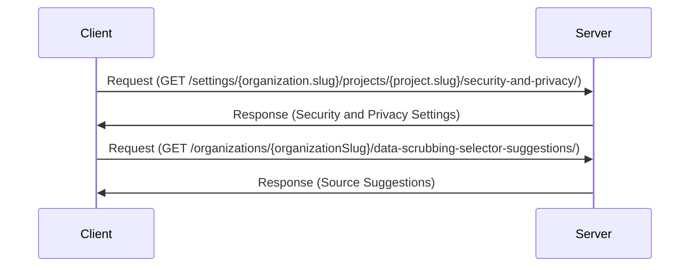

Data scrubbing, also known as data cleansing, is a process that ensures the quality and reliability of data. In the Sentry-Demo project, data scrubbing is implemented in the 'DataScrubbing' component. This component is responsible for managing the rules that define how data scrubbing should be performed. These rules can be added, edited, or deleted, and they are stored in the local storage of the browser for persistence. The 'DataScrubbing' component uses several hooks and functions to manage the state and behavior of these rules. For example, it uses the 'useApi' hook to get an API client, the 'useNavigate' hook to change the location, and the 'useParams' hook to get the parameters of the current route. The 'DataScrubbing' component also defines several functions such as 'loadRules', 'handleEdit', 'handleAdd', and 'handleDelete' to manage the rules.

The 'DataScrubbing' component also includes a modal for adding and editing rules. This modal is managed by the 'openModal' and 'handleCloseModal' functions. The 'openModal' function opens the modal and sets its content based on the current rule being edited, while the 'handleCloseModal' function closes the modal and navigates to the appropriate path. The 'DataScrubbing' component also includes a 'successfullySaved' function that is called when a rule is successfully saved. This function updates the rules state, displays a success message, and calls the 'onSubmitSuccess' function if it is provided.

The rules for data scrubbing are defined in the 'rules.tsx' file. Each rule has a type and a method. The type defines what kind of data the rule applies to, such as email addresses, IP addresses, or credit card numbers. The method defines how the data should be scrubbed, such as masking, hashing, or removing the data. The 'rules.tsx' file also includes several utility functions for working with rules, such as 'getRuleLabel' and 'getMethodLabel' which return the label for a given rule type or method, and 'getRuleDescription' which returns a description of a rule.

In addition to the 'DataScrubbing' component, the Sentry-Demo project also includes an 'OrganizationRules' component. This component displays the data scrubbing rules that are applied at the organization level. These rules are loaded from the 'relayPiiConfig' property of the organization. The 'OrganizationRules' component also includes a toggle for collapsing and expanding the list of rules.

<SwmSnippet path="/static/app/views/settings/components/dataScrubbing/index.tsx" line="44">

---

# DataScrubbing Component

The 'DataScrubbing' component is responsible for managing the rules that define how data scrubbing should be performed. It uses several hooks and functions to manage the state and behavior of these rules. It also includes a modal for adding and editing rules.

```tsx
export function DataScrubbing({
  project,
  endpoint,
  organization,
  disabled,
  onSubmitSuccess,
  additionalContext,
  relayPiiConfig,
}: Props) {
  const api = useApi();
  const [rules, setRules] = useState<Rule[]>([]);
  const navigate = useNavigate();
  const params = useParams();

  const successfullySaved = useCallback(
    (response: {relayPiiConfig: string}, successMessage: string) => {
      setRules(convertRelayPiiConfig(response.relayPiiConfig));
      addSuccessMessage(successMessage);
      onSubmitSuccess?.(response);
    },
    [onSubmitSuccess]
```

---

</SwmSnippet>

<SwmSnippet path="/static/app/views/settings/components/dataScrubbing/rules.tsx" line="1">

---

# Rules for Data Scrubbing

The rules for data scrubbing are defined in the 'rules.tsx' file. Each rule has a type and a method. The type defines what kind of data the rule applies to, and the method defines how the data should be scrubbed.

```tsx
import {forwardRef} from 'react';
import styled from '@emotion/styled';

import {Button} from 'sentry/components/button';
import ConfirmDelete from 'sentry/components/confirmDelete';
import TextOverflow from 'sentry/components/textOverflow';
import {IconDelete, IconEdit} from 'sentry/icons';
import {t} from 'sentry/locale';
import {space} from 'sentry/styles/space';

import type {Rule} from './types';
import {getRuleDescription} from './utils';

type Props = {
  rules: Array<Rule>;
  disabled?: boolean;
  onDeleteRule?: (id: Rule['id']) => void;
  onEditRule?: (id: Rule['id']) => void;
};

const Rules = forwardRef(function RulesList(
```

---

</SwmSnippet>

<SwmSnippet path="/static/app/views/settings/components/dataScrubbing/organizationRules.tsx" line="25">

---

# OrganizationRules Component

The 'OrganizationRules' component displays the data scrubbing rules that are applied at the organization level. These rules are loaded from the 'relayPiiConfig' property of the organization.

```tsx
export class OrganizationRules extends Component<Props, State> {
  state: State = {
    isCollapsed: true,
    rules: [],
  };

  componentDidMount() {
    this.loadRules();
  }

  componentDidUpdate(prevProps: Props) {
    if (
      prevProps.organization.relayPiiConfig !== this.props.organization.relayPiiConfig
    ) {
      this.loadRules();
      return;
    }

    this.loadContentHeight();
  }

```

---

</SwmSnippet>

# Data Scrubbing Endpoints

Data Scrubbing Endpoints

<SwmSnippet path="/static/app/views/settings/components/dataScrubbing/index.tsx" line="68">

---

## /settings/{organization.slug}/projects/{project.slug}/security-and-privacy/ Endpoint

This endpoint is used to navigate to the security and privacy settings of a specific project within an organization. It is used in the 'handleCloseModal' function to redirect the user after closing the modal.

```tsx
    const path = project?.slug
      ? `/settings/${organization.slug}/projects/${project.slug}/security-and-privacy/`
      : `/settings/${organization.slug}/security-and-privacy/`;

    navigate(path);
```

---

</SwmSnippet>

<SwmSnippet path="/static/app/views/settings/components/dataScrubbing/modals/modalManager.tsx" line="140">

---

## /organizations/{organizationSlug}/data-scrubbing-selector-suggestions/ Endpoint

This endpoint is used to fetch source suggestions for data scrubbing. It is used in the 'loadSourceSuggestions' function, which is called when the event ID changes.

```tsx
      const rawSuggestions = await api.requestPromise(
        `/organizations/${orgSlug}/data-scrubbing-selector-suggestions/`,
        {query}
      );
```

---

</SwmSnippet>



&nbsp;

*This is an auto-generated document by Swimm AI 🌊 and has not yet been verified by a human*

<SwmMeta version="3.0.0" repo-id="Z2l0aHViJTNBJTNBc2VudHJ5LWRlbW8lM0ElM0FTd2ltbS1EZW1v" repo-name="sentry-demo" doc-type="overview"><sup>Powered by [Swimm](/)</sup></SwmMeta>
