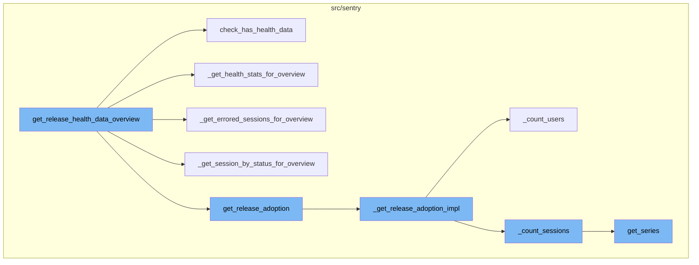
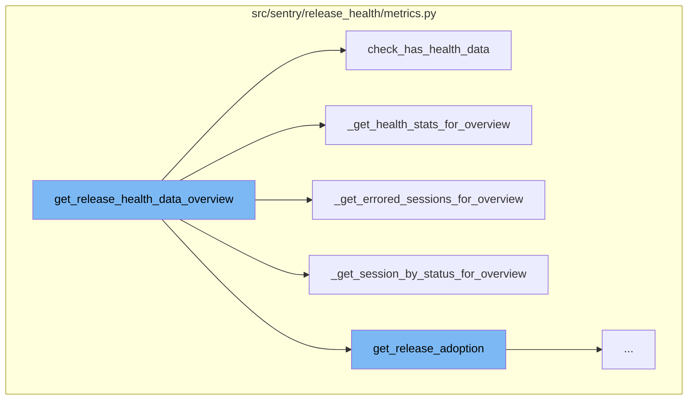
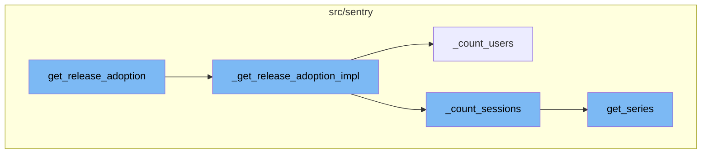

The `get_release_health_data_overview` function serves as the main entry point for fetching release health data. It takes in a list of project releases and optional parameters for environments, stats periods, and a stat type. The function returns a mapping of project releases to their respective health overviews.

The function first checks if health data is available for the given projects or releases using the `check_has_health_data` function. It queries the metrics for raw sessions and returns a set of projects or releases that have health data.

Depending on whether a health stats period is provided, it fetches health stats data or sets it as an empty dictionary. The health stats data is fetched using the `_get_health_stats_for_overview` function which constructs a metrics query for either users or sessions, executes the query, and returns a mapping of project releases to their respective health stats.

The function also fetches session duration data, errored sessions, and sessions by status. The errored sessions are fetched using the `_get_errored_sessions_for_overview` function which fetches the count of errored sessions for the given projects. The sessions by status are fetched using the `_get_session_by_status_for_overview` function which fetches the counts of sessions by their status for the given projects.

Finally, it fetches release adoption data and constructs the final return value. The release adoption data is fetched using the `get_release_adoption` function which prepares the necessary parameters and then calls the `_get_release_adoption_impl` function to get the actual data. The `_get_release_adoption_impl` function prepares common conditions and groupings for the query, and then calls `_count_users` and `_count_sessions` functions to get the number of users and sessions respectively.



# Flow drill down

First, we'll zoom into this section of the flow:



<SwmSnippet path="/src/sentry/release_health/metrics.py" line="945">

---

# Overview of get_release_health_data_overview

The `get_release_health_data_overview` function is the main entry point for fetching release health data. It takes in a list of project releases and optional parameters for environments, stats periods, and a stat type. It returns a mapping of project releases to their respective health overviews. The function first sets default values for `stat` and `now` if they are not provided. It then fetches project and organization IDs, and calculates the granularity and rollup for the stats. Depending on whether a health stats period is provided, it fetches health stats data or sets it as an empty dictionary. It then fetches session duration data, errored sessions, sessions by status, and user data. Finally, it fetches release adoption data and constructs the final return value.

```python
    def get_release_health_data_overview(
        self,
        project_releases: Sequence[ProjectRelease],
        environments: Sequence[EnvironmentName] | None = None,
        summary_stats_period: StatsPeriod | None = None,
        health_stats_period: StatsPeriod | None = None,
        stat: Literal["users", "sessions"] | None = None,
        now: datetime | None = None,
    ) -> Mapping[ProjectRelease, ReleaseHealthOverview]:
        """Checks quickly for which of the given project releases we have
        health data available.  The argument is a tuple of `(project_id, release_name)`
        tuples.  The return value is a set of all the project releases that have health
        data.
        """
        if stat is None:
            stat = "sessions"
        assert stat in ("sessions", "users")

        if now is None:
            now = datetime.now(timezone.utc)

```

---

</SwmSnippet>

<SwmSnippet path="/src/sentry/release_health/metrics.py" line="535">

---

# Checking for Health Data

The `check_has_health_data` function is used to check if health data is available for the given projects or releases. It queries the metrics for raw sessions and returns a set of projects or releases that have health data.

```python
    def check_has_health_data(
        self,
        projects_list: Collection[ProjectOrRelease],
        now: datetime | None = None,
    ) -> set[ProjectOrRelease]:
        if now is None:
            now = datetime.now(timezone.utc)

        start = now - timedelta(days=90)

        projects_list = list(projects_list)

        if len(projects_list) == 0:
            return set()

        includes_releases = isinstance(projects_list[0], tuple)

        if includes_releases:
            project_ids: list[ProjectId] = [x[0] for x in projects_list]  # type: ignore[index]
        else:
            project_ids = projects_list  # type: ignore[assignment]
```

---

</SwmSnippet>

<SwmSnippet path="/src/sentry/release_health/metrics.py" line="886">

---

# Fetching Health Stats

The `_get_health_stats_for_overview` function fetches health stats for the given projects. It constructs a metrics query for either users or sessions, executes the query, and returns a mapping of project releases to their respective health stats.

```python
    def _get_health_stats_for_overview(
        projects: Sequence[Project],
        where: list[Condition],
        org_id: int,
        stat: OverviewStat,
        granularity: int,
        start: datetime,
        end: datetime,
        buckets: int,
    ) -> Mapping[ProjectRelease, list[list[int]]]:

        project_ids = [p.id for p in projects]

        metric_field = {
            "users": MetricField(metric_mri=SessionMRI.ALL_USER.value, alias="value", op=None),
            "sessions": MetricField(metric_mri=SessionMRI.ALL.value, alias="value", op=None),
        }[stat]

        groupby = [
            MetricGroupByField(field="release"),
            MetricGroupByField(field="project_id"),
```

---

</SwmSnippet>

<SwmSnippet path="/src/sentry/release_health/metrics.py" line="715">

---

# Fetching Errored Sessions

The `_get_errored_sessions_for_overview` function fetches the count of errored sessions for the given projects. It constructs a metrics query for errored sessions, executes the query, and returns a mapping of project releases to their respective counts of errored sessions.

```python
    def _get_errored_sessions_for_overview(
        projects: Sequence[Project],
        where: list[Condition],
        org_id: int,
        granularity: int,
        start: datetime,
        end: datetime,
    ) -> Mapping[tuple[int, str], int]:
        """
        Count of errored sessions, incl fatal (abnormal, crashed) sessions,
        excl errored *preaggregated* sessions
        """
        project_ids = [p.id for p in projects]

        select = [
            MetricField(metric_mri=SessionMRI.ERRORED_SET.value, alias="value", op=None),
        ]

        groupby = [
            MetricGroupByField(field="project_id"),
            MetricGroupByField(field="release"),
```

---

</SwmSnippet>

<SwmSnippet path="/src/sentry/release_health/metrics.py" line="769">

---

# Fetching Sessions by Status

The `_get_session_by_status_for_overview` function fetches the counts of sessions by their status for the given projects. It constructs a metrics query for sessions by their status, executes the query, and returns a mapping of project releases and session status to their respective counts.

```python
    def _get_session_by_status_for_overview(
        projects: Sequence[Project],
        where: list[Condition],
        org_id: int,
        granularity: int,
        start: datetime,
        end: datetime,
    ) -> Mapping[tuple[int, str, str], int]:
        """
        Counts of init, abnormal and crashed sessions, purpose-built for overview
        """
        project_ids = [p.id for p in projects]

        select = [
            MetricField(metric_mri=SessionMRI.ABNORMAL.value, alias="abnormal", op=None),
            MetricField(metric_mri=SessionMRI.CRASHED.value, alias="crashed", op=None),
            MetricField(metric_mri=SessionMRI.ALL.value, alias="init", op=None),
            MetricField(
                metric_mri=SessionMRI.ERRORED_PREAGGREGATED.value,
                alias="errored_preaggr",
                op=None,
```

---

</SwmSnippet>

Now, lets zoom into this section of the flow:



<SwmSnippet path="/src/sentry/release_health/metrics.py" line="225">

---

# get_release_adoption

The `get_release_adoption` function is the entry point for fetching release adoption data. It prepares the necessary parameters and then calls the `_get_release_adoption_impl` function to get the actual data.

```python
    def get_release_adoption(
        self,
        project_releases: Sequence[ProjectRelease],
        environments: Sequence[EnvironmentName] | None = None,
        now: datetime | None = None,
        org_id: OrganizationId | None = None,
    ) -> ReleasesAdoption:
        project_ids = list({x[0] for x in project_releases})
        if org_id is None:
            org_id = self._get_org_id(project_ids)

        if now is None:
            now = datetime.now(timezone.utc)

        return self._get_release_adoption_impl(now, org_id, project_releases, environments)
```

---

</SwmSnippet>

<SwmSnippet path="/src/sentry/release_health/metrics.py" line="242">

---

# \_get_release_adoption_impl

The `_get_release_adoption_impl` function is responsible for the actual data fetching. It prepares common conditions and groupings for the query, and then calls `_count_users` and `_count_sessions` functions to get the number of users and sessions respectively.

```python
    def _get_release_adoption_impl(
        now: datetime,
        org_id: int,
        project_releases: Sequence[ProjectRelease],
        environments: Sequence[EnvironmentName] | None = None,
    ) -> ReleasesAdoption:
        start = now - timedelta(days=1)
        project_ids = [proj for proj, _rel in project_releases]
        projects = MetricsReleaseHealthBackend._get_projects(project_ids)

        def _get_common_where(total: bool) -> list[Condition]:
            where_common: list[Condition] = [
                filter_projects_by_project_release(project_releases),
            ]

            if environments is not None:
                where_common.append(
                    Condition(
                        lhs=Column("tags[environment]"),
                        op=Op.IN,
                        rhs=environments,
```

---

</SwmSnippet>

<SwmSnippet path="/src/sentry/release_health/metrics.py" line="323">

---

# \_count_users

The `_count_users` function counts the unique users for the given parameters. It prepares a `DeprecatingMetricsQuery` and then calls `get_series` function to execute the query and get the raw result. The raw result is then converted into a more usable format.

```python
        def _count_users(total: bool, referrer: str) -> dict[Any, int]:
            select = [
                MetricField(metric_mri=SessionMRI.RAW_USER.value, alias="value", op="count_unique")
            ]
            query = DeprecatingMetricsQuery(
                org_id=org_id,
                start=start,
                end=now,
                project_ids=project_ids,
                select=select,
                groupby=_get_common_groupby(total),
                where=_get_common_where(total),
                granularity=Granularity(LEGACY_SESSIONS_DEFAULT_ROLLUP),
                include_series=False,
                include_totals=True,
            )
            raw_result = get_series(projects=projects, metrics_query=query, use_case_id=USE_CASE_ID)
            return _convert_results(raw_result["groups"], total)
```

---

</SwmSnippet>

<SwmSnippet path="/src/sentry/release_health/metrics.py" line="300">

---

# \_count_sessions

The `_count_sessions` function counts the sessions for the given parameters. Similar to `_count_users`, it prepares a `DeprecatingMetricsQuery` and then calls `get_series` function to execute the query and get the raw result. The raw result is then converted into a more usable format.

```python
        def _count_sessions(
            total: bool, project_ids: Sequence[int], referrer: str
        ) -> dict[Any, int]:
            select = [
                MetricField(metric_mri=SessionMRI.ALL.value, alias="value", op=None),
            ]

            query = DeprecatingMetricsQuery(
                org_id=org_id,
                start=start,
                end=now,
                project_ids=project_ids,
                select=select,
                groupby=_get_common_groupby(total),
                where=_get_common_where(total),
                granularity=Granularity(LEGACY_SESSIONS_DEFAULT_ROLLUP),
                include_series=False,
                include_totals=True,
            )
            raw_result = get_series(projects=projects, metrics_query=query, use_case_id=USE_CASE_ID)

```

---

</SwmSnippet>

<SwmSnippet path="/src/sentry/snuba/metrics/datasource.py" line="897">

---

# get_series

The `get_series` function is a generic function to execute a `DeprecatingMetricsQuery` and get the raw result. It handles various edge cases and optimizes the query execution. The result is a time series data for the given query.

```python
def get_series(
    projects: Sequence[Project],
    metrics_query: DeprecatingMetricsQuery,
    use_case_id: UseCaseID,
    include_meta: bool = False,
    tenant_ids: dict[str, Any] | None = None,
) -> dict:
    """Get time series for the given query"""

    organization_id = projects[0].organization_id if projects else None
    tenant_ids = dict()
    if organization_id is not None:
        tenant_ids["organization_id"] = organization_id
    tenant_ids["use_case_id"] = use_case_id.value

    if metrics_query.interval is not None:
        interval = metrics_query.interval
    else:
        interval = metrics_query.granularity.granularity

    start, end, _num_intervals = to_intervals(metrics_query.start, metrics_query.end, interval)
```

---

</SwmSnippet>

# Where is this flow used?

This flow is used once, in a flow starting from `get_release_health_data_overview:::mainFlowStyle` as represented in the following diagram:

```mermaid
graph TD;

classDef mainFlowStyle color:#000000,fill:#7CB9F4
classDef rootsStyle color:#000000,fill:#00FFF4
classDef Style1 color:#000000,fill:#00FFAA
classDef Style2 color:#000000,fill:#FFFF00
classDef Style3 color:#000000,fill:#AA7CB9
```

&nbsp;

*This is an auto-generated document by Swimm AI 🌊 and has not yet been verified by a human*

<SwmMeta version="3.0.0" repo-id="Z2l0aHViJTNBJTNBc2VudHJ5LWRlbW8lM0ElM0FTd2ltbS1EZW1v" repo-name="sentry-demo" doc-type="flows"><sup>Powered by [Swimm](/)</sup></SwmMeta>
