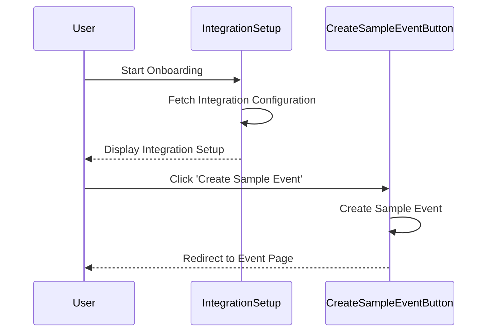

Onboarding in the views directory refers to the process of guiding new users through the initial setup of the Sentry platform. This process is designed to help users understand how to configure and use Sentry effectively.

The onboarding process is implemented through a series of steps, each represented by a component. These steps include welcoming the user, selecting a platform, setting up documentation, and integrating with other services.

Each step in the onboarding process is defined in the `onboarding.tsx` file. The steps are organized in a specific order to guide the user through the setup process. Each step has a corresponding component that renders the user interface for that step.

The onboarding process also includes a series of styled components that define the look and feel of the onboarding interface. These components are defined in the `onboarding.tsx` file and include elements such as headers, footers, and buttons.

The onboarding process is also responsive, with certain elements being hidden or displayed based on the screen size. This is achieved through the use of media queries in the styled components.

The `onboarding.spec.tsx` file contains tests for the onboarding process. These tests ensure that the onboarding process works as expected and guides the user through the correct steps.

<SwmSnippet path="/static/app/views/onboarding/onboarding.tsx" line="46">

---

# Onboarding Steps

The onboarding process is defined as a series of steps in the `getOrganizationOnboardingSteps` function. Each step is represented by an object with properties such as `id`, `title`, and `Component`. The `Component` property refers to the component that renders the user interface for that step.

```tsx
function getOrganizationOnboardingSteps(): StepDescriptor[] {
  return [
    {
      id: 'welcome',
      title: t('Welcome'),
      Component: TargetedOnboardingWelcome,
      cornerVariant: 'top-right',
    },
    {
      id: 'select-platform',
      title: t('Select platform'),
      Component: PlatformSelection,
      hasFooter: true,
      cornerVariant: 'top-left',
    },
    {
      id: 'setup-docs',
      title: t('Install the Sentry SDK'),
      Component: SetupDocs,
      hasFooter: true,
      cornerVariant: 'top-left',
```

---

</SwmSnippet>

<SwmSnippet path="/static/app/views/onboarding/onboarding.tsx" line="439">

---

# Onboarding Components

The onboarding interface is defined by a series of styled components. These components include elements such as headers, footers, and buttons, and are used to create the look and feel of the onboarding interface.

```tsx
const Container = styled('div')<{hasFooter: boolean}>`
  flex-grow: 1;
  display: flex;
  flex-direction: column;
  position: relative;
  background: ${p => p.theme.background};
  padding: 120px ${space(3)};
  width: 100%;
  margin: 0 auto;
  padding-bottom: ${p => p.hasFooter && '72px'};
  margin-bottom: ${p => p.hasFooter && '72px'};
`;

const Header = styled('header')`
  background: ${p => p.theme.background};
  padding-left: ${space(4)};
  padding-right: ${space(4)};
  position: sticky;
  height: 80px;
  align-items: center;
  top: 0;
```

---

</SwmSnippet>

<SwmSnippet path="/static/app/views/onboarding/onboarding.tsx" line="506">

---

# Responsive Onboarding

The onboarding interface is responsive, with certain elements being hidden or displayed based on the screen size. This is achieved through the use of media queries in the styled components.

```tsx
const AdaptivePageCorners = styled(PageCorners)`
  --corner-scale: 1;
  @media (max-width: ${p => p.theme.breakpoints.small}) {
    --corner-scale: 0.5;
  }
`;

const StyledStepper = styled(Stepper)`
  justify-self: center;
  @media (max-width: ${p => p.theme.breakpoints.medium}) {
    display: none;
  }
`;
```

---

</SwmSnippet>

# Onboarding Tests

The `onboarding.spec.tsx` file contains tests for the onboarding process. These tests ensure that the onboarding process works as expected and guides the user through the correct steps.

# Onboarding Endpoints

Onboarding Endpoints

<SwmSnippet path="/static/app/views/onboarding/integrationSetup.tsx" line="47">

---

## Integration Setup Endpoint

This endpoint is used to fetch the configuration for the integration setup during the onboarding process. The `integrationSlug` is used as a parameter to specify the integration provider. The response from this endpoint is used to set the integration provider state.

```tsx
    const endpoint = `/organizations/${organization.slug}/config/integrations/?provider_key=${integrationSlug}`;
    return api
      .requestPromise(endpoint)
      .then(integrations => {
        setProvider(integrations.providers[0]);
        setHasError(false);
      })
      .catch(error => {
        setHasError(true);
        throw error;
      });
```

---

</SwmSnippet>

<SwmSnippet path="/static/app/views/onboarding/createSampleEventButton.tsx" line="78">

---

## Create Sample Event Endpoint

This endpoint is used to create a sample event for the project during the onboarding process. The response from this endpoint includes the groupID of the created event. The component then waits for the event to be fully processed and available before redirecting the user to the event page.

```tsx

  componentWillUnmount() {
    this._isMounted = false;
  }

  private _isMounted = true;

  recordAnalytics({eventCreated, retries, duration}) {
    const {organization, project, source} = this.props;

    if (!project) {
      return;
    }

    const eventKey = `sample_event.${eventCreated ? 'created' : 'failed'}` as const;

    trackAnalytics(eventKey, {
      organization,
      project_id: project.id,
      platform: project.platform || '',
      interval: EVENT_POLL_INTERVAL,
```

---

</SwmSnippet>



&nbsp;

*This is an auto-generated document by Swimm AI 🌊 and has not yet been verified by a human*

<SwmMeta version="3.0.0" repo-id="Z2l0aHViJTNBJTNBc2VudHJ5LWRlbW8lM0ElM0FTd2ltbS1EZW1v" repo-name="sentry-demo" doc-type="overview"><sup>Powered by [Swimm](/)</sup></SwmMeta>
