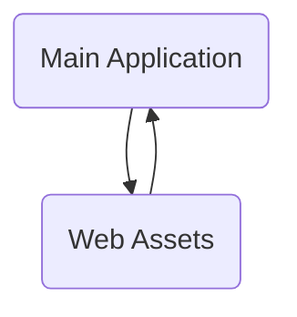

The sentry-demo repository is a developer-first error tracking and performance monitoring platform. It provides official SDKs for various programming languages and platforms. The platform is designed to help developers identify, triage, and prioritize errors in real-time, improving application performance and reducing downtime. It also includes features for automated error tracking, performance monitoring, and user feedback. The repository includes various components such as user interfaces, APIs, and integrations with other services.

- <SwmLink doc-title="Api">[Api](.swm/api.gew5dj9q.sw.md)</SwmLink>

## Main Components

### Main Application

The Main Application is the core of the Sentry-demo, orchestrating the various components and functionalities of the system.

- <SwmLink doc-title="Main application overview">[Main application overview](.swm/main-application-overview.syl3r5j6.sw.md)</SwmLink>
- <SwmLink doc-title="Understanding user identity management">[Understanding user identity management](.swm/understanding-user-identity-management.befjzl6h.sw.md)</SwmLink>
- <SwmLink doc-title="Overview of discover query management">[Overview of discover query management](.swm/overview-of-discover-query-management.6lm7uq7c.sw.md)</SwmLink>
- <SwmLink doc-title="Exploring user management in main application">[Exploring user management in main application](.swm/exploring-user-management-in-main-application.dhdsp5ij.sw.md)</SwmLink>
- <SwmLink doc-title="Basic concepts of sentry app creation">[Basic concepts of sentry app creation](.swm/basic-concepts-of-sentry-app-creation.pp93lfip.sw.md)</SwmLink>
- <SwmLink doc-title="Exploring issue handling">[Exploring issue handling](.swm/exploring-issue-handling.44yqv3u2.sw.md)</SwmLink>
- <SwmLink doc-title="Introduction to search functionality in main application">[Introduction to search functionality in main application](.swm/introduction-to-search-functionality-in-main-application.2jdcwisk.sw.md)</SwmLink>
- <SwmLink doc-title="Overview of eventstore system">[Overview of eventstore system](.swm/overview-of-eventstore-system.bh460pss.sw.md)</SwmLink>
- <SwmLink doc-title="Basic concepts of event receivers in main application">[Basic concepts of event receivers in main application](.swm/basic-concepts-of-event-receivers-in-main-application.vdo4pf5r.sw.md)</SwmLink>
- **Dynamic sampling**
  - <SwmLink doc-title="Exploring the dynamic sampling mechanism">[Exploring the dynamic sampling mechanism](.swm/exploring-the-dynamic-sampling-mechanism.o8f7x2o4.sw.md)</SwmLink>
  - <SwmLink doc-title="What are dynamic sampling tasks">[What are dynamic sampling tasks](.swm/what-are-dynamic-sampling-tasks.cntmzrtc.sw.md)</SwmLink>
  - <SwmLink doc-title="The model class">[The model class](.swm/the-model-class.a2rns.sw.md)</SwmLink>
  - **Rules**
    - <SwmLink doc-title="Overview of dynamic sampling rules">[Overview of dynamic sampling rules](.swm/overview-of-dynamic-sampling-rules.1vll5hkn.sw.md)</SwmLink>
    - <SwmLink doc-title="Exploring the impact of specific bias rules on sentrys sampling rate">[Exploring the impact of specific bias rules on sentrys sampling rate](.swm/exploring-the-impact-of-specific-bias-rules-on-sentrys-sampling-rate.w5ivt8wy.sw.md)</SwmLink>
- **Monitors**
  - <SwmLink doc-title="Basic concepts of monitor management in main application">[Basic concepts of monitor management in main application](.swm/basic-concepts-of-monitor-management-in-main-application.6za53a22.sw.md)</SwmLink>
  - <SwmLink doc-title="Introduction to monitor endpoints">[Introduction to monitor endpoints](.swm/introduction-to-monitor-endpoints.rp2wj7qi.sw.md)</SwmLink>
- **Interfaces**
  - <SwmLink doc-title="Introduction to data interfaces in main application">[Introduction to data interfaces in main application](.swm/introduction-to-data-interfaces-in-main-application.p146h8qo.sw.md)</SwmLink>
  - <SwmLink doc-title="The exception class">[The exception class](.swm/the-exception-class.3fmug.sw.md)</SwmLink>
- **Models**
  - <SwmLink doc-title="Understanding database models in main application">[Understanding database models in main application](.swm/understanding-database-models-in-main-application.uqchu9yf.sw.md)</SwmLink>
  - <SwmLink doc-title="Exploring file models">[Exploring file models](.swm/exploring-file-models.0h93em4k.sw.md)</SwmLink>
  - <SwmLink doc-title="Overview of integration models">[Overview of integration models](.swm/overview-of-integration-models.pwki97jn.sw.md)</SwmLink>
  - **Flows**
    - <SwmLink doc-title="Understanding _find_implicit_slug function">[Understanding \_find_implicit_slug function](.swm/understanding-_find_implicit_slug-function.g81xepjb.sw.md)</SwmLink>
    - <SwmLink doc-title="Understanding the post functionality in sentry">[Understanding the post functionality in sentry](.swm/understanding-the-post-functionality-in-sentry.9abbvuvl.sw.md)</SwmLink>
    - <SwmLink doc-title="Understanding the put function">[Understanding the put function](.swm/understanding-the-put-function.ry88g6oo.sw.md)</SwmLink>
    - <SwmLink doc-title="Understanding the fetch commits flow">[Understanding the fetch commits flow](.swm/understanding-the-fetch-commits-flow.tsq3pw6d.sw.md)</SwmLink>
    - <SwmLink doc-title="Understanding the post flow">[Understanding the post flow](.swm/understanding-the-post-flow.ruqc1gvn.sw.md)</SwmLink>
- **Incidents**
  - <SwmLink doc-title="Getting started with incident management">[Getting started with incident management](.swm/getting-started-with-incident-management.vod1glw0.sw.md)</SwmLink>
  - <SwmLink doc-title="Getting started with incident endpoints">[Getting started with incident endpoints](.swm/getting-started-with-incident-endpoints.snxnlpmt.sw.md)</SwmLink>
  - **Flows**
    - <SwmLink doc-title="Understanding handle_snuba_query_update">[Understanding handle_snuba_query_update](.swm/understanding-handle_snuba_query_update.cods88os.sw.md)</SwmLink>
    - <SwmLink doc-title="Understanding the update flow">[Understanding the update flow](.swm/understanding-the-update-flow.fpjsd6qz.sw.md)</SwmLink>
- **Rules**
  - <SwmLink doc-title="What is rule processing">[What is rule processing](.swm/what-is-rule-processing.mwr4pm7s.sw.md)</SwmLink>
  - <SwmLink doc-title="Getting started with rule actions">[Getting started with rule actions](.swm/getting-started-with-rule-actions.3g80zyyi.sw.md)</SwmLink>
  - <SwmLink doc-title="Getting started with event based conditions">[Getting started with event based conditions](.swm/getting-started-with-event-based-conditions.g9vll13i.sw.md)</SwmLink>
- **Tasks**
  - <SwmLink doc-title="Basic concepts of asynchronous tasks in main application">[Basic concepts of asynchronous tasks in main application](.swm/basic-concepts-of-asynchronous-tasks-in-main-application.tnq18cnr.sw.md)</SwmLink>
  - <SwmLink doc-title="Overview of integration tasks">[Overview of integration tasks](.swm/overview-of-integration-tasks.onf5wufg.sw.md)</SwmLink>
  - <SwmLink doc-title="Understanding prepare_organization_report function">[Understanding prepare_organization_report function](.swm/understanding-prepare_organization_report-function.2phmpdm1.sw.md)</SwmLink>
- **Notifications**
  - <SwmLink doc-title="Exploring the notification system">[Exploring the notification system](.swm/exploring-the-notification-system.tl4gqfxk.sw.md)</SwmLink>
  - <SwmLink doc-title="Flow of sending notifications in sentry">[Flow of sending notifications in sentry](.swm/flow-of-sending-notifications-in-sentry.99w0elqi.sw.md)</SwmLink>
  - **Notifications**
    - <SwmLink doc-title="Overview of notification system">[Overview of notification system](.swm/overview-of-notification-system.f2blj8wl.sw.md)</SwmLink>
    - <SwmLink doc-title="Understanding activity notifications">[Understanding activity notifications](.swm/understanding-activity-notifications.t7hl056t.sw.md)</SwmLink>
- **Web**
  - <SwmLink doc-title="Basic concepts of web interface">[Basic concepts of web interface](.swm/basic-concepts-of-web-interface.jbg5z1t4.sw.md)</SwmLink>
  - <SwmLink doc-title="Introduction to debug tools">[Introduction to debug tools](.swm/introduction-to-debug-tools.9phsz41s.sw.md)</SwmLink>
  - <SwmLink doc-title="Understanding the handle functions">[Understanding the handle functions](.swm/understanding-the-handle-functions.symqgs03.sw.md)</SwmLink>
- **Auth**
  - <SwmLink doc-title="Exploring the authentication process">[Exploring the authentication process](.swm/exploring-the-authentication-process.xxegjaii.sw.md)</SwmLink>
  - <SwmLink doc-title="Introduction to authentication and access control services">[Introduction to authentication and access control services](.swm/introduction-to-authentication-and-access-control-services.vvo4967x.sw.md)</SwmLink>
  - <SwmLink doc-title="Basic concepts of authentication providers">[Basic concepts of authentication providers](.swm/basic-concepts-of-authentication-providers.q6mt64da.sw.md)</SwmLink>
  - **Flows**
    - <SwmLink doc-title="Understanding the finish_pipeline function">[Understanding the finish_pipeline function](.swm/understanding-the-finish_pipeline-function.0cktaec7.sw.md)</SwmLink>
    - <SwmLink doc-title="Understanding the _finish_setup_pipeline flow">[Understanding the \_finish_setup_pipeline flow](.swm/understanding-the-_finish_setup_pipeline-flow.e3sly3lv.sw.md)</SwmLink>
- **Flows**
  - <SwmLink doc-title="Process_message flow">[Process_message flow](.swm/process_message-flow.lzoojvbm.sw.md)</SwmLink>
  - <SwmLink doc-title="Understanding process_occurrence_group">[Understanding process_occurrence_group](.swm/understanding-process_occurrence_group.879aluld.sw.md)</SwmLink>
- **Plugins**
  - <SwmLink doc-title="Getting started with the plugin system">[Getting started with the plugin system](.swm/getting-started-with-the-plugin-system.3i5an1z5.sw.md)</SwmLink>
  - <SwmLink doc-title="Introduction to plugin base">[Introduction to plugin base](.swm/introduction-to-plugin-base.msdrsjrs.sw.md)</SwmLink>
- **Sentry metrics**
  - <SwmLink doc-title="Introduction to sentry metrics processing">[Introduction to sentry metrics processing](.swm/introduction-to-sentry-metrics-processing.qp0ooi29.sw.md)</SwmLink>
  - <SwmLink doc-title="Basic concepts of metrics indexer">[Basic concepts of metrics indexer](.swm/basic-concepts-of-metrics-indexer.kfj94z82.sw.md)</SwmLink>
  - <SwmLink doc-title="Introduction to metrics consumers">[Introduction to metrics consumers](.swm/introduction-to-metrics-consumers.9jf3snjx.sw.md)</SwmLink>
  - **Querying**
    - <SwmLink doc-title="Exploring metrics querying">[Exploring metrics querying](.swm/exploring-metrics-querying.bm1g7smd.sw.md)</SwmLink>
    - <SwmLink doc-title="Understanding data querying">[Understanding data querying](.swm/understanding-data-querying.84tjyztl.sw.md)</SwmLink>
- **Events**
  - <SwmLink doc-title="Getting started with event handling in search">[Getting started with event handling in search](.swm/getting-started-with-event-handling-in-search.voupxp7u.sw.md)</SwmLink>
  - <SwmLink doc-title="Overview of event data query configurations">[Overview of event data query configurations](.swm/overview-of-event-data-query-configurations.biqyfdpu.sw.md)</SwmLink>
  - **Flows**
    - <SwmLink doc-title="Understanding run_query">[Understanding run_query](.swm/understanding-run_query.0zsu6ljp.sw.md)</SwmLink>
    - <SwmLink doc-title="__init__ flow">[\__init_\_ flow](.swm/__init__-flow.0dn7zcg1.sw.md)</SwmLink><SwmLink doc-title="__init__ flow">[\__init_\_ flow](.swm/__init__-flow.0dn7zcg1.sw.md)</SwmLink>
- **Api**
  - <SwmLink doc-title="Introduction to api in main application">[Introduction to api in main application](.swm/introduction-to-api-in-main-application.lx528jd0.sw.md)</SwmLink>
  - <SwmLink doc-title="Basic concepts of api utility modules">[Basic concepts of api utility modules](.swm/basic-concepts-of-api-utility-modules.qi8eehkh.sw.md)</SwmLink>
  - <SwmLink doc-title="Understanding api base classes and functions">[Understanding api base classes and functions](.swm/understanding-api-base-classes-and-functions.qbst9ktq.sw.md)</SwmLink>
  - **Flows**
    - <SwmLink doc-title="Understanding the put function">[Understanding the put function](.swm/understanding-the-put-function.nzrdsua9.sw.md)</SwmLink>
    - <SwmLink doc-title="Understanding the put flow">[Understanding the put flow](.swm/understanding-the-put-flow.277pe3xn.sw.md)</SwmLink>
  - **Serializers**
    - <SwmLink doc-title="Basic concepts of api serializers">[Basic concepts of api serializers](.swm/basic-concepts-of-api-serializers.ph6b6r4v.sw.md)</SwmLink>
    - <SwmLink doc-title="Introduction to rest framework serializers">[Introduction to rest framework serializers](.swm/introduction-to-rest-framework-serializers.twwwneqa.sw.md)</SwmLink>
    - <SwmLink doc-title="Exploring data models in serializers">[Exploring data models in serializers](.swm/exploring-data-models-in-serializers.t0wotsih.sw.md)</SwmLink>
    - <SwmLink doc-title="The serializer class">[The serializer class](.swm/the-serializer-class.0sgib.sw.md)</SwmLink>
  - **Classes**
    - <SwmLink doc-title="The projectendpoint class">[The projectendpoint class](.swm/the-projectendpoint-class.9joav.sw.md)</SwmLink>
    - <SwmLink doc-title="The organizationpermission class">[The organizationpermission class](.swm/the-organizationpermission-class.07xnw.sw.md)</SwmLink>
  - **Endpoints**
    - <SwmLink doc-title="Getting started with api endpoints">[Getting started with api endpoints](.swm/getting-started-with-api-endpoints.hid5498k.sw.md)</SwmLink>
    - <SwmLink doc-title="Basic concepts of relocations management in endpoints">[Basic concepts of relocations management in endpoints](.swm/basic-concepts-of-relocations-management-in-endpoints.rv8jfci6.sw.md)</SwmLink>
    - **Integrations**
      - <SwmLink doc-title="Basic concepts of endpoint integrations">[Basic concepts of endpoint integrations](.swm/basic-concepts-of-endpoint-integrations.wgz4ts4i.sw.md)</SwmLink>
      - <SwmLink doc-title="Introduction to sentry apps in integrations">[Introduction to sentry apps in integrations](.swm/introduction-to-sentry-apps-in-integrations.bi4flez2.sw.md)</SwmLink>
    - **Flows**
      - <SwmLink doc-title="Understanding _get_event_stats function">[Understanding \_get_event_stats function](.swm/understanding-_get_event_stats-function.umd077c5.sw.md)</SwmLink>
      - <SwmLink doc-title="Understanding rate limits">[Understanding rate limits](.swm/understanding-rate-limits.lu30xz0f.sw.md)</SwmLink>
      - <SwmLink doc-title="Understanding the post functionality">[Understanding the post functionality](.swm/understanding-the-post-functionality.aska3eww.sw.md)</SwmLink>
      - <SwmLink doc-title="Understanding the __init__ method">[Understanding the \__init_\_ method](.swm/understanding-the-__init__-method.kfbdumf7.sw.md)</SwmLink>`__init__` Method
      - <SwmLink doc-title="Understanding track_response_metric">[Understanding track_response_metric](.swm/understanding-track_response_metric.tgyfqr1s.sw.md)</SwmLink>
      - <SwmLink doc-title="Understanding the wrapper function">[Understanding the wrapper function](.swm/understanding-the-wrapper-function.49z7c4xc.sw.md)</SwmLink>
      - <SwmLink doc-title="Understanding handled_snuba_exceptions">[Understanding handled_snuba_exceptions](.swm/understanding-handled_snuba_exceptions.jnple3xb.sw.md)</SwmLink>
      - <SwmLink doc-title="Understanding decorators in python">[Understanding decorators in python](.swm/understanding-decorators-in-python.vhk9bpbz.sw.md)</SwmLink>
      - <SwmLink doc-title="Understanding span operations">[Understanding span operations](.swm/understanding-span-operations.8aakc4di.sw.md)</SwmLink>
      - <SwmLink doc-title="Understanding the wrapped functionality">[Understanding the wrapped functionality](.swm/understanding-the-wrapped-functionality.8e5csugw.sw.md)</SwmLink>
      - <SwmLink doc-title="Trace data serialization and augmentation">[Trace data serialization and augmentation](.swm/trace-data-serialization-and-augmentation.58ex5wmz.sw.md)</SwmLink>
      - <SwmLink doc-title="Understanding the put function">[Understanding the put function](.swm/understanding-the-put-function.lkr1eynu.sw.md)</SwmLink>
      - <SwmLink doc-title="Get_attrs flow">[Get_attrs flow](.swm/get_attrs-flow.m2a1e4rt.sw.md)</SwmLink>
      - <SwmLink doc-title="Understanding get_event_stats_metrics">[Understanding get_event_stats_metrics](.swm/understanding-get_event_stats_metrics.7npf7341.sw.md)</SwmLink>
      - <SwmLink doc-title="Understanding page_organization_integrations_ids">[Understanding page_organization_integrations_ids](.swm/understanding-page_organization_integrations_ids.tbba4ci8.sw.md)</SwmLink>
      - <SwmLink doc-title="Understanding fetch_rule_groups_paginated">[Understanding fetch_rule_groups_paginated](.swm/understanding-fetch_rule_groups_paginated.gag7556u.sw.md)</SwmLink>
      - <SwmLink doc-title="Understanding empty_result function">[Understanding empty_result function](.swm/understanding-empty_result-function.o0sfffgv.sw.md)</SwmLink>
      - <SwmLink doc-title="Understanding the put functionality">[Understanding the put functionality](.swm/understanding-the-put-functionality.6oc9zvhn.sw.md)</SwmLink>
      - <SwmLink doc-title="Understanding get_event_stats function">[Understanding get_event_stats function](.swm/understanding-get_event_stats-function.d67g4ybe.sw.md)</SwmLink>
      - <SwmLink doc-title="Understanding the post flow">[Understanding the post flow](.swm/understanding-the-post-flow.4qwzagf0.sw.md)</SwmLink>
      - <SwmLink doc-title="Understanding the get_deploys_by_project flow">[Understanding the get_deploys_by_project flow](.swm/understanding-the-get_deploys_by_project-flow.2u096ja7.sw.md)</SwmLink>
      - <SwmLink doc-title="Understanding get_stats_data_for_trending_events function">[Understanding get_stats_data_for_trending_events function](.swm/understanding-get_stats_data_for_trending_events-function.obnyw3i1.sw.md)</SwmLink>
      - <SwmLink doc-title="Fn flow">[Fn flow](.swm/fn-flow.p4iuvw5c.sw.md)</SwmLink>
  - **Flows**
    - <SwmLink doc-title="Understanding get_trend_columns flow">[Understanding get_trend_columns flow](.swm/understanding-get_trend_columns-flow.4g2mvima.sw.md)</SwmLink>
    - <SwmLink doc-title="Understanding get_stats_data_for_trending_events">[Understanding get_stats_data_for_trending_events](.swm/understanding-get_stats_data_for_trending_events.l4wvuyg3.sw.md)</SwmLink>
- **Flows**
  - <SwmLink doc-title="Understanding save_error_events function">[Understanding save_error_events function](.swm/understanding-save_error_events-function.xmpyd0kw.sw.md)</SwmLink>
  - <SwmLink doc-title="Understanding save_generic_events function">[Understanding save_generic_events function](.swm/understanding-save_generic_events-function.lmozq59z.sw.md)</SwmLink>
  - <SwmLink doc-title="Understanding the resolve flow">[Understanding the resolve flow](.swm/understanding-the-resolve-flow.gcmd940v.sw.md)</SwmLink>
  - <SwmLink doc-title="Understanding _build_where function">[Understanding \_build_where function](.swm/understanding-_build_where-function.pc1e8ie7.sw.md)</SwmLink>
  - <SwmLink doc-title="Understanding _get_group_limit_filters function">[Understanding \_get_group_limit_filters function](.swm/understanding-_get_group_limit_filters-function.o7ulfmfn.sw.md)</SwmLink>
  - <SwmLink doc-title="Understanding the get_from_cache function">[Understanding the get_from_cache function](.swm/understanding-the-get_from_cache-function.ejhy8dv2.sw.md)</SwmLink>
  - <SwmLink doc-title="Understanding bulk snuba queries with referrers">[Understanding bulk snuba queries with referrers](.swm/understanding-bulk-snuba-queries-with-referrers.6ajsst1r.sw.md)</SwmLink>
  - <SwmLink doc-title="Understanding _should_use_on_demand_metrics">[Understanding \_should_use_on_demand_metrics](.swm/understanding-_should_use_on_demand_metrics.bft6gkcg.sw.md)</SwmLink>
  - <SwmLink doc-title="Understanding the optimized search query flow">[Understanding the optimized search query flow](.swm/understanding-the-optimized-search-query-flow.e8cky3lj.sw.md)</SwmLink>
  - <SwmLink doc-title="Understanding the handle_assigned_to flow">[Understanding the handle_assigned_to flow](.swm/understanding-the-handle_assigned_to-flow.ko740vua.sw.md)</SwmLink>
  - <SwmLink doc-title="Understanding the widget update flow">[Understanding the widget update flow](.swm/understanding-the-widget-update-flow.0b28cumd.sw.md)</SwmLink>
  - <SwmLink doc-title="Understanding the update_inbox function">[Understanding the update_inbox function](.swm/understanding-the-update_inbox-function.djq8mfrz.sw.md)</SwmLink>
  - <SwmLink doc-title="Understanding the unguarded_write flow">[Understanding the unguarded_write flow](.swm/understanding-the-unguarded_write-flow.ieppsfaw.sw.md)</SwmLink>
  - <SwmLink doc-title="Understanding the get_next_expected_checkin_latest function">[Understanding the get_next_expected_checkin_latest function](.swm/understanding-the-get_next_expected_checkin_latest-function.x53vsl9w.sw.md)</SwmLink>
  - <SwmLink doc-title="Understanding the _schedule_invalidate_project_config function">[Understanding the \_schedule_invalidate_project_config function](.swm/understanding-the-_schedule_invalidate_project_config-function.kza5zhl5.sw.md)</SwmLink>
  - <SwmLink doc-title="Understanding the _process_checkin flow">[Understanding the \_process_checkin flow](.swm/understanding-the-_process_checkin-flow.1abmwr6v.sw.md)</SwmLink>
  - <SwmLink doc-title="Understanding get_snuba_queries function">[Understanding get_snuba_queries function](.swm/understanding-get_snuba_queries-function.x0jl2iod.sw.md)</SwmLink>
  - <SwmLink doc-title="Understanding the save_trusted_relays function">[Understanding the save_trusted_relays function](.swm/understanding-the-save_trusted_relays-function.jzqwtucp.sw.md)</SwmLink>
  - <SwmLink doc-title="Data writing process">[Data writing process](.swm/data-writing-process.z68hlyoq.sw.md)</SwmLink>
  - <SwmLink doc-title="Understanding the process_payload function">[Understanding the process_payload function](.swm/understanding-the-process_payload-function.anqlc41d.sw.md)</SwmLink>
  - <SwmLink doc-title="Understanding _handle_actions function">[Understanding \_handle_actions function](.swm/understanding-_handle_actions-function.9exbum57.sw.md)</SwmLink>
  - <SwmLink doc-title="Overview of release health data retrieval">[Overview of release health data retrieval](.swm/overview-of-release-health-data-retrieval.ngf4bl1t.sw.md)</SwmLink>
  - <SwmLink doc-title="Understanding handle_archived_until_escalating">[Understanding handle_archived_until_escalating](.swm/understanding-handle_archived_until_escalating.uab2z03v.sw.md)</SwmLink>
  - <SwmLink doc-title="Understanding the post flow">[Understanding the post flow](.swm/understanding-the-post-flow.msdudxsc.sw.md)</SwmLink>
  - <SwmLink doc-title="Building slack messages">[Building slack messages](.swm/building-slack-messages.pr9n9mul.sw.md)</SwmLink>
  - <SwmLink doc-title="Understanding the handle function">[Understanding the handle function](.swm/understanding-the-handle-function.izmtq8h8.sw.md)</SwmLink>
  - <SwmLink doc-title="Understanding the import process">[Understanding the import process](.swm/understanding-the-import-process.7hbk2wj1.sw.md)</SwmLink>
  - <SwmLink doc-title="Understanding process_clock_task">[Understanding process_clock_task](.swm/understanding-process_clock_task.b0jgt5ek.sw.md)</SwmLink>
  - <SwmLink doc-title="Understanding the import_global function">[Understanding the import_global function](.swm/understanding-the-import_global-function.a7as0g6f.sw.md)</SwmLink>
  - <SwmLink doc-title="Understanding the user import process">[Understanding the user import process](.swm/understanding-the-user-import-process.6cpuvmb7.sw.md)</SwmLink>
  - <SwmLink doc-title="Understanding the import_organizations flow">[Understanding the import_organizations flow](.swm/understanding-the-import_organizations-flow.lti9mqsf.sw.md)</SwmLink>
  - <SwmLink doc-title="Understanding the import_config function">[Understanding the import_config function](.swm/understanding-the-import_config-function.uyvlp2xx.sw.md)</SwmLink>
  - <SwmLink doc-title="Understanding the process_profile_task function">[Understanding the process_profile_task function](.swm/understanding-the-process_profile_task-function.xplfqnyq.sw.md)</SwmLink>
  - <SwmLink doc-title="Understanding sync_status_outbound">[Understanding sync_status_outbound](.swm/understanding-sync_status_outbound.cyof7gyw.sw.md)</SwmLink>
  - <SwmLink doc-title="Understanding the compare_commits function">[Understanding the compare_commits function](.swm/understanding-the-compare_commits-function.qly1grtc.sw.md)</SwmLink>
  - <SwmLink doc-title="Understanding the create_comment flow">[Understanding the create_comment flow](.swm/understanding-the-create_comment-flow.xtef797f.sw.md)</SwmLink>
  - <SwmLink doc-title="Understanding the create_issue process">[Understanding the create_issue process](.swm/understanding-the-create_issue-process.dops7jhr.sw.md)</SwmLink>
  - <SwmLink doc-title="Understanding backfill_seer_grouping_records_for_project">[Understanding backfill_seer_grouping_records_for_project](.swm/understanding-backfill_seer_grouping_records_for_project.1fv4n129.sw.md)</SwmLink>
  - <SwmLink doc-title="Sync_status_outbound flow">[Sync_status_outbound flow](.swm/sync_status_outbound-flow.4qxwnwrm.sw.md)</SwmLink>
  - <SwmLink doc-title="Understanding the build_integration process">[Understanding the build_integration process](.swm/understanding-the-build_integration-process.qz3a4y34.sw.md)</SwmLink>
  - <SwmLink doc-title="Get_access_token flow">[Get_access_token flow](.swm/get_access_token-flow.gqhdbxbu.sw.md)</SwmLink>
  - <SwmLink doc-title="Understanding the get_request_token flow">[Understanding the get_request_token flow](.swm/understanding-the-get_request_token-flow.dnqgpguu.sw.md)</SwmLink>
  - <SwmLink doc-title="Understanding the create_comment process">[Understanding the create_comment process](.swm/understanding-the-create_comment-process.rtr23qt3.sw.md)</SwmLink>
  - <SwmLink doc-title="Understanding the create_issue process">[Understanding the create_issue process](.swm/understanding-the-create_issue-process.8dsjnvpw.sw.md)</SwmLink>
  - <SwmLink doc-title="Understanding the create subscription flow">[Understanding the create subscription flow](.swm/understanding-the-create-subscription-flow.gg50uyd8.sw.md)</SwmLink>
  - <SwmLink doc-title="Notification sending process">[Notification sending process](.swm/notification-sending-process.3ueo8fu4.sw.md)</SwmLink>
  - <SwmLink doc-title="Understanding the put functionality">[Understanding the put functionality](.swm/understanding-the-put-functionality.g3rfyx14.sw.md)</SwmLink>
  - <SwmLink doc-title="Understanding the post process">[Understanding the post process](.swm/understanding-the-post-process.thyg7qam.sw.md)</SwmLink>
  - <SwmLink doc-title="Understanding the reprocessing group function">[Understanding the reprocessing group function](.swm/understanding-the-reprocessing-group-function.udtj0fsq.sw.md)</SwmLink>
  - <SwmLink doc-title="Understanding process_attachments_and_events">[Understanding process_attachments_and_events](.swm/understanding-process_attachments_and_events.vwsn4gie.sw.md)</SwmLink>
  - <SwmLink doc-title="User creation process">[User creation process](.swm/user-creation-process.nzpgietk.sw.md)</SwmLink>
  - <SwmLink doc-title="Understanding the commit context processing flow">[Understanding the commit context processing flow](.swm/understanding-the-commit-context-processing-flow.snolhfce.sw.md)</SwmLink>
  - <SwmLink doc-title="Understanding the post function flow">[Understanding the post function flow](.swm/understanding-the-post-function-flow.y90cb8bc.sw.md)</SwmLink>
  - <SwmLink doc-title="Understanding the post process">[Understanding the post process](.swm/understanding-the-post-process.h5wzjlri.sw.md)</SwmLink>
  - <SwmLink doc-title="Understanding the handle function">[Understanding the handle function](.swm/understanding-the-handle-function.tqsapvj2.sw.md)</SwmLink>
  - <SwmLink doc-title="Understanding the get_attrs function">[Understanding the get_attrs function](.swm/understanding-the-get_attrs-function.8m95c50m.sw.md)</SwmLink>
  - <SwmLink doc-title="Understanding process_suspect_commits">[Understanding process_suspect_commits](.swm/understanding-process_suspect_commits.8i6p8lxz.sw.md)</SwmLink>
  - <SwmLink doc-title="Metric extraction flow">[Metric extraction flow](.swm/metric-extraction-flow.3jsqhti0.sw.md)</SwmLink>
  - <SwmLink doc-title="Understanding the send_alert_event function">[Understanding the send_alert_event function](.swm/understanding-the-send_alert_event-function.ug5lzr1v.sw.md)</SwmLink>
  - <SwmLink doc-title="Webhook flow in sentry">[Webhook flow in sentry](.swm/webhook-flow-in-sentry.752svqaz.sw.md)</SwmLink>
  - <SwmLink doc-title="Incident alert notification flow">[Incident alert notification flow](.swm/incident-alert-notification-flow.cj3n3azh.sw.md)</SwmLink>
  - <SwmLink doc-title="Handling message events in sentry">[Handling message events in sentry](.swm/handling-message-events-in-sentry.axyws6ib.sw.md)</SwmLink>
  - <SwmLink doc-title="Workflow notification process">[Workflow notification process](.swm/workflow-notification-process.yqfvbzgy.sw.md)</SwmLink>
  - <SwmLink doc-title="Understanding the build_comment_webhook flow">[Understanding the build_comment_webhook flow](.swm/understanding-the-build_comment_webhook-flow.9woavtsi.sw.md)</SwmLink>
  - <SwmLink doc-title="Understanding the assemble_dif function">[Understanding the assemble_dif function](.swm/understanding-the-assemble_dif-function.qr7nwwj9.sw.md)</SwmLink>
  - <SwmLink doc-title="Webhook request flow">[Webhook request flow](.swm/webhook-request-flow.idvnkmx1.sw.md)</SwmLink>
  - <SwmLink doc-title="Understanding the create flow">[Understanding the create flow](.swm/understanding-the-create-flow.lll3y5fr.sw.md)</SwmLink>
  - <SwmLink doc-title="Understanding the get_response function">[Understanding the get_response function](.swm/understanding-the-get_response-function.2h1qdcep.sw.md)</SwmLink>
  - <SwmLink doc-title="Understanding preprocessing baseline config">[Understanding preprocessing baseline config](.swm/understanding-preprocessing-baseline-config.x1cssdcs.sw.md)</SwmLink>
  - <SwmLink doc-title="Handling username collisions">[Handling username collisions](.swm/handling-username-collisions.dtrcpmtp.sw.md)</SwmLink>
  - <SwmLink doc-title="Understanding _create_release_file function">[Understanding \_create_release_file function](.swm/understanding-_create_release_file-function.rfc3e4ay.sw.md)</SwmLink>
- **Classes**
  - <SwmLink doc-title="The pipelineview class">[The pipelineview class](.swm/the-pipelineview-class.zqrdi.sw.md)</SwmLink>
  - <SwmLink doc-title="The rpcmodel class">[The rpcmodel class](.swm/the-rpcmodel-class.3k5po.sw.md)</SwmLink>
  - <SwmLink doc-title="The basetsdb class">[The basetsdb class](.swm/the-basetsdb-class.p7le8.sw.md)</SwmLink>
  - <SwmLink doc-title="The defaultfieldsmodel class">[The defaultfieldsmodel class](.swm/the-defaultfieldsmodel-class.6b0kk.sw.md)</SwmLink>
  - <SwmLink doc-title="The logservice class">[The logservice class](.swm/the-logservice-class.3x6an.sw.md)</SwmLink>

### Web Assets

Web assets are resources used in the construction and optimization of a web application's user interface.

- <SwmLink doc-title="Web assets overview">[Web assets overview](.swm/web-assets-overview.k65stzet.sw.md)</SwmLink>
- <SwmLink doc-title="Overview of state management stores">[Overview of state management stores](.swm/overview-of-state-management-stores.qwlttwmd.sw.md)</SwmLink>
- <SwmLink doc-title="Overview of web assets plugins">[Overview of web assets plugins](.swm/overview-of-web-assets-plugins.fxrbimq6.sw.md)</SwmLink>
- **Views**
  - <SwmLink doc-title="Exploring web page views">[Exploring web page views](.swm/exploring-web-page-views.in30a5w2.sw.md)</SwmLink>
  - <SwmLink doc-title="Basic concepts of project setup process">[Basic concepts of project setup process](.swm/basic-concepts-of-project-setup-process.1zghqxm3.sw.md)</SwmLink>
  - <SwmLink doc-title="Exploring the relocation feature">[Exploring the relocation feature](.swm/exploring-the-relocation-feature.nk3w12uz.sw.md)</SwmLink>
  - <SwmLink doc-title="What is issue list overview">[What is issue list overview](.swm/what-is-issue-list-overview.kngac9ay.sw.md)</SwmLink>
  - <SwmLink doc-title="Introduction to replay functionality in views">[Introduction to replay functionality in views](.swm/introduction-to-replay-functionality-in-views.2tl6lnxy.sw.md)</SwmLink>
  - <SwmLink doc-title="Understanding alerts management">[Understanding alerts management](.swm/understanding-alerts-management.9w47annu.sw.md)</SwmLink>
  - <SwmLink doc-title="Getting started with project detail view">[Getting started with project detail view](.swm/getting-started-with-project-detail-view.q64ej65r.sw.md)</SwmLink>
  - <SwmLink doc-title="Exploring the admin interface">[Exploring the admin interface](.swm/exploring-the-admin-interface.yxjcd6i5.sw.md)</SwmLink>
  - <SwmLink doc-title="Overview of metrics monitoring">[Overview of metrics monitoring](.swm/overview-of-metrics-monitoring.nkzxwz93.sw.md)</SwmLink>
  - **Onboarding**
    - <SwmLink doc-title="Overview of the onboarding process">[Overview of the onboarding process](.swm/overview-of-the-onboarding-process.sqvn23v8.sw.md)</SwmLink>
    - <SwmLink doc-title="Introduction to onboarding components">[Introduction to onboarding components](.swm/introduction-to-onboarding-components.qb7noik2.sw.md)</SwmLink>
  - **Performance**
    - <SwmLink doc-title="Exploring performance monitoring in views">[Exploring performance monitoring in views](.swm/exploring-performance-monitoring-in-views.ocbijwq0.sw.md)</SwmLink>
    - <SwmLink doc-title="What is trace details in performance monitoring">[What is trace details in performance monitoring](.swm/what-is-trace-details-in-performance-monitoring.64tf1d88.sw.md)</SwmLink>
    - <SwmLink doc-title="What are performance trends">[What are performance trends](.swm/what-are-performance-trends.fdmjem1y.sw.md)</SwmLink>
    - <SwmLink doc-title="Understanding performancecontent">[Understanding performancecontent](.swm/understanding-performancecontent.ukj1oyqp.sw.md)</SwmLink>
    - **Transaction summary**
      - <SwmLink doc-title="Exploring the transaction performance summary">[Exploring the transaction performance summary](.swm/exploring-the-transaction-performance-summary.5fsz8zc6.sw.md)</SwmLink>
      - <SwmLink doc-title="Overview of transaction spans in transaction summary">[Overview of transaction spans in transaction summary](.swm/overview-of-transaction-spans-in-transaction-summary.dt7cn59e.sw.md)</SwmLink>
      - <SwmLink doc-title="Exploring the transaction performance overview">[Exploring the transaction performance overview](.swm/exploring-the-transaction-performance-overview.8acj2cai.sw.md)</SwmLink>
    - **New trace details**
      - <SwmLink doc-title="Overview of trace details in performance">[Overview of trace details in performance](.swm/overview-of-trace-details-in-performance.qxhrjwld.sw.md)</SwmLink>
      - <SwmLink doc-title="Understanding traceviewwaterfall">[Understanding traceviewwaterfall](.swm/understanding-traceviewwaterfall.yn6pvax9.sw.md)</SwmLink>
      - **Trace drawer**
        - <SwmLink doc-title="Exploring the trace details drawer">[Exploring the trace details drawer](.swm/exploring-the-trace-details-drawer.c16i623t.sw.md)</SwmLink>
        - <SwmLink doc-title="What are trace drawer details">[What are trace drawer details](.swm/what-are-trace-drawer-details.l4sdrvew.sw.md)</SwmLink>
    - **Landing**
      - <SwmLink doc-title="Exploring the performance landing view">[Exploring the performance landing view](.swm/exploring-the-performance-landing-view.p3hrlv11.sw.md)</SwmLink>
      - <SwmLink doc-title="Exploring performance data widgets in landing">[Exploring performance data widgets in landing](.swm/exploring-performance-data-widgets-in-landing.fo99o9st.sw.md)</SwmLink>
      - **Flows**
        - <SwmLink doc-title="Understanding the stackedareachartlistwidget">[Understanding the stackedareachartlistwidget](.swm/understanding-the-stackedareachartlistwidget.t5bi78l7.sw.md)</SwmLink>
        - <SwmLink doc-title="Understanding the vitalwidget flow">[Understanding the vitalwidget flow](.swm/understanding-the-vitalwidget-flow.1bexgj0n.sw.md)</SwmLink>
        - <SwmLink doc-title="Understanding performancescorelistwidget">[Understanding performancescorelistwidget](.swm/understanding-performancescorelistwidget.2xp8khkt.sw.md)</SwmLink>
        - <SwmLink doc-title="Understanding linechartlistwidget">[Understanding linechartlistwidget](.swm/understanding-linechartlistwidget.vexgiw5y.sw.md)</SwmLink>
  - **Organization stats**
    - <SwmLink doc-title="Overview of organization usage statistics">[Overview of organization usage statistics](.swm/overview-of-organization-usage-statistics.97xaeh9b.sw.md)</SwmLink>
    - <SwmLink doc-title="Overview of team performance insights">[Overview of team performance insights](.swm/overview-of-team-performance-insights.heoho6u2.sw.md)</SwmLink>
  - **Profiling**
    - <SwmLink doc-title="Introduction to profiling in views">[Introduction to profiling in views](.swm/introduction-to-profiling-in-views.0hzz6b24.sw.md)</SwmLink>
    - <SwmLink doc-title="Understanding differentialflamegraphview">[Understanding differentialflamegraphview](.swm/understanding-differentialflamegraphview.s6k3g8cy.sw.md)</SwmLink>
  - **Issue details**
    - <SwmLink doc-title="Understanding issue details views">[Understanding issue details views](.swm/understanding-issue-details-views.7u4u8uy9.sw.md)</SwmLink>
  - **Dashboards**
    - <SwmLink doc-title="Overview of dashboard management">[Overview of dashboard management](.swm/overview-of-dashboard-management.6hge5ffi.sw.md)</SwmLink>
    - <SwmLink doc-title="Localization and language support in sentry">[Localization and language support in sentry](.swm/localization-and-language-support-in-sentry.tbf8wb22.sw.md)</SwmLink>
    - <SwmLink doc-title="Delving into sentrys testing suite and qa practices">[Delving into sentrys testing suite and qa practices](.swm/delving-into-sentrys-testing-suite-and-qa-practices.dbmwlw81.sw.md)</SwmLink>
    - <SwmLink doc-title="Getting started with dashboard widget card">[Getting started with dashboard widget card](.swm/getting-started-with-dashboard-widget-card.vzp0b7et.sw.md)</SwmLink>
    - **Manage**
      - <SwmLink doc-title="Understanding dashboard management">[Understanding dashboard management](.swm/understanding-dashboard-management.4stfxijf.sw.md)</SwmLink>
      - <SwmLink doc-title="Understanding the dashboardlist component">[Understanding the dashboardlist component](.swm/understanding-the-dashboardlist-component.4ir83egu.sw.md)</SwmLink>
    - **Flows**
      - <SwmLink doc-title="Understanding widgetbuilder">[Understanding widgetbuilder](.swm/understanding-widgetbuilder.vyovmwc2.sw.md)</SwmLink>
      - <SwmLink doc-title="Understanding the render flow">[Understanding the render flow](.swm/understanding-the-render-flow.1pebikwy.sw.md)</SwmLink>
  - **Settings**
    - <SwmLink doc-title="Understanding application configuration settings">[Understanding application configuration settings](.swm/understanding-application-configuration-settings.yg7x7wft.sw.md)</SwmLink>
    - <SwmLink doc-title="What is team management in organization settings">[What is team management in organization settings](.swm/what-is-team-management-in-organization-settings.7ut9vyyc.sw.md)</SwmLink>
    - <SwmLink doc-title="Introduction to metrics management in project settings">[Introduction to metrics management in project settings](.swm/introduction-to-metrics-management-in-project-settings.fgxmr4qh.sw.md)</SwmLink>
    - <SwmLink doc-title="Basic concepts of organization integration management">[Basic concepts of organization integration management](.swm/basic-concepts-of-organization-integration-management.ikwdp6jz.sw.md)</SwmLink>
    - <SwmLink doc-title="Overview of relay key management">[Overview of relay key management](.swm/overview-of-relay-key-management.xchminn6.sw.md)</SwmLink>
    - <SwmLink doc-title="Basic concepts of settings components">[Basic concepts of settings components](.swm/basic-concepts-of-settings-components.xu753p7u.sw.md)</SwmLink>
    - <SwmLink doc-title="Introduction to developer integration settings">[Introduction to developer integration settings](.swm/introduction-to-developer-integration-settings.jx4bd9t2.sw.md)</SwmLink>
    - **Account**
      - <SwmLink doc-title="Getting started with account settings">[Getting started with account settings](.swm/getting-started-with-account-settings.81n97uh4.sw.md)</SwmLink>
      - <SwmLink doc-title="Overview of account notifications">[Overview of account notifications](.swm/overview-of-account-notifications.e9fqdcw5.sw.md)</SwmLink>
      - <SwmLink doc-title="Getting started with account authenticators">[Getting started with account authenticators](.swm/getting-started-with-account-authenticators.m6ydxxx9.sw.md)</SwmLink>
    - **Data scrubbing**
      - <SwmLink doc-title="Overview of data scrubbing in components">[Overview of data scrubbing in components](.swm/overview-of-data-scrubbing-in-components.tx4lb31v.sw.md)</SwmLink>
      - <SwmLink doc-title="What are data scrubbing modals">[What are data scrubbing modals](.swm/what-are-data-scrubbing-modals.3x9n6xwe.sw.md)</SwmLink>
    - **Project**
      - <SwmLink doc-title="Overview of project settings">[Overview of project settings](.swm/overview-of-project-settings.6adfqne1.sw.md)</SwmLink>
      - <SwmLink doc-title="Introduction to project ownership management">[Introduction to project ownership management](.swm/introduction-to-project-ownership-management.hmtvitox.sw.md)</SwmLink>
  - **Detail**
    - <SwmLink doc-title="Getting started with replay details">[Getting started with replay details](.swm/getting-started-with-replay-details.jw2qmdmy.sw.md)</SwmLink>
    - <SwmLink doc-title="Exploring network details">[Exploring network details](.swm/exploring-network-details.ww4n5wsv.sw.md)</SwmLink>
  - **Rules**
    - <SwmLink doc-title="Understanding alert rules">[Understanding alert rules](.swm/understanding-alert-rules.9tq1wt3f.sw.md)</SwmLink>
    - <SwmLink doc-title="Getting started with metric alert rules">[Getting started with metric alert rules](.swm/getting-started-with-metric-alert-rules.stvz9rnm.sw.md)</SwmLink>
    - **Details**
      - <SwmLink doc-title="Introduction to metric alert rule details">[Introduction to metric alert rule details](.swm/introduction-to-metric-alert-rule-details.g2dxlnn6.sw.md)</SwmLink>
      - <SwmLink doc-title="Understanding the render flow">[Understanding the render flow](.swm/understanding-the-render-flow.kj93rc2p.sw.md)</SwmLink>
    - **Issue**
      - <SwmLink doc-title="Introduction to issue alert rule">[Introduction to issue alert rule](.swm/introduction-to-issue-alert-rule.klxfzrd1.sw.md)</SwmLink>
      - <SwmLink doc-title="Understanding the renderloading function">[Understanding the renderloading function](.swm/understanding-the-renderloading-function.0zt09n04.sw.md)</SwmLink>
  - **Discover**
    - <SwmLink doc-title="Introduction to the discover feature">[Introduction to the discover feature](.swm/introduction-to-the-discover-feature.6kllytjm.sw.md)</SwmLink>
    - <SwmLink doc-title="Introduction to data table in discover">[Introduction to data table in discover](.swm/introduction-to-data-table-in-discover.6lsw5at0.sw.md)</SwmLink>
    - **Flows**
      - <SwmLink doc-title="Understanding tableview component">[Understanding tableview component](.swm/understanding-tableview-component.7tg8pc8a.sw.md)</SwmLink>
      - <SwmLink doc-title="Understanding the render flow">[Understanding the render flow](.swm/understanding-the-render-flow.vbjnkcs6.sw.md)</SwmLink>
      - <SwmLink doc-title="Understanding _rendergridbodycell">[Understanding \_rendergridbodycell](.swm/understanding-_rendergridbodycell.mx3az8gp.sw.md)</SwmLink>
    - **Flows**
      - <SwmLink doc-title="Understanding eventdetailscontent">[Understanding eventdetailscontent](.swm/understanding-eventdetailscontent.173lythi.sw.md)</SwmLink>
      - <SwmLink doc-title="Understanding the render process">[Understanding the render process](.swm/understanding-the-render-process.i2yckw4g.sw.md)</SwmLink>
  - **Releases**
    - <SwmLink doc-title="Understanding release management in views">[Understanding release management in views](.swm/understanding-release-management-in-views.2woh8a2k.sw.md)</SwmLink>
    - <SwmLink doc-title="Overview of the releases list">[Overview of the releases list](.swm/overview-of-the-releases-list.4mhryeoa.sw.md)</SwmLink>
    - **Detail**
      - <SwmLink doc-title="Understanding release details">[Understanding release details](.swm/understanding-release-details.3h8pkf49.sw.md)</SwmLink>
      - <SwmLink doc-title="Introduction to release overview">[Introduction to release overview](.swm/introduction-to-release-overview.gdiw2ibm.sw.md)</SwmLink>
  - **Monitors**
    - <SwmLink doc-title="Basic concepts of monitoring components">[Basic concepts of monitoring components](.swm/basic-concepts-of-monitoring-components.2vrlhk4r.sw.md)</SwmLink>
    - <SwmLink doc-title="Basic concepts of timeline in monitors">[Basic concepts of timeline in monitors](.swm/basic-concepts-of-timeline-in-monitors.1jbeqya6.sw.md)</SwmLink>
  - **Insights**
    - <SwmLink doc-title="Overview of performance insights views">[Overview of performance insights views](.swm/overview-of-performance-insights-views.srcn093g.sw.md)</SwmLink>
    - <SwmLink doc-title="Understanding cachesamplepanel">[Understanding cachesamplepanel](.swm/understanding-cachesamplepanel.34tucwtm.sw.md)</SwmLink>
    - **Queues**
      - <SwmLink doc-title="Understanding insights queues">[Understanding insights queues](.swm/understanding-insights-queues.z5dj3vzv.sw.md)</SwmLink>
      - <SwmLink doc-title="Understanding messagespansamplespanel">[Understanding messagespansamplespanel](.swm/understanding-messagespansamplespanel.5bmmwb8x.sw.md)</SwmLink>
    - **Mobile**
      - <SwmLink doc-title="Exploring mobile insights">[Exploring mobile insights](.swm/exploring-mobile-insights.qnm8aklz.sw.md)</SwmLink>
      - <SwmLink doc-title="Getting started with mobile app initialization">[Getting started with mobile app initialization](.swm/getting-started-with-mobile-app-initialization.68rmuz1z.sw.md)</SwmLink>
      - <SwmLink doc-title="Basic concepts of mobile screenload performance">[Basic concepts of mobile screenload performance](.swm/basic-concepts-of-mobile-screenload-performance.e74he6gm.sw.md)</SwmLink>
      - **Flows**
        - <SwmLink doc-title="Understanding screensview">[Understanding screensview](.swm/understanding-screensview.iiig61n3.sw.md)</SwmLink>
        - <SwmLink doc-title="Understanding screenloadspanstable">[Understanding screenloadspanstable](.swm/understanding-screenloadspanstable.10wav5z6.sw.md)</SwmLink>
        - <SwmLink doc-title="Understanding screencharts">[Understanding screencharts](.swm/understanding-screencharts.5runol66.sw.md)</SwmLink>
        - <SwmLink doc-title="Understanding the screenstable component">[Understanding the screenstable component](.swm/understanding-the-screenstable-component.p1zri63z.sw.md)</SwmLink>
    - **Http**
      - <SwmLink doc-title="Overview of http monitoring in insights">[Overview of http monitoring in insights](.swm/overview-of-http-monitoring-in-insights.7cc6jfbv.sw.md)</SwmLink>
      - <SwmLink doc-title="Understanding httpdomainsummarypage">[Understanding httpdomainsummarypage](.swm/understanding-httpdomainsummarypage.r6f92ucm.sw.md)</SwmLink>
      - **Components**
        - <SwmLink doc-title="Understanding http components">[Understanding http components](.swm/understanding-http-components.t4syf9i9.sw.md)</SwmLink>
        - <SwmLink doc-title="Understanding httpsamplespanel">[Understanding httpsamplespanel](.swm/understanding-httpsamplespanel.jvcuriqe.sw.md)</SwmLink>
    - **Common**
      - <SwmLink doc-title="Introduction to shared resources in insights">[Introduction to shared resources in insights](.swm/introduction-to-shared-resources-in-insights.j46bw7kd.sw.md)</SwmLink>
      - <SwmLink doc-title="Overview of insights views">[Overview of insights views](.swm/overview-of-insights-views.v5gwy5kq.sw.md)</SwmLink>
      - <SwmLink doc-title="Understanding common components">[Understanding common components](.swm/understanding-common-components.j2xv14b5.sw.md)</SwmLink>
      - <SwmLink doc-title="Getting started with data queries">[Getting started with data queries](.swm/getting-started-with-data-queries.aaa4uzoh.sw.md)</SwmLink>
    - **Browser**
      - <SwmLink doc-title="Overview of browser insights">[Overview of browser insights](.swm/overview-of-browser-insights.56xwilgv.sw.md)</SwmLink>
      - <SwmLink doc-title="Basic concepts of browser web vitals components">[Basic concepts of browser web vitals components](.swm/basic-concepts-of-browser-web-vitals-components.hrhhoc0i.sw.md)</SwmLink>
      - **Flows**
        - <SwmLink doc-title="Understanding pageoverviewwebvitalsdetailpanel">[Understanding pageoverviewwebvitalsdetailpanel](.swm/understanding-pageoverviewwebvitalsdetailpanel.ieq2u9ey.sw.md)</SwmLink>
        - <SwmLink doc-title="Understanding the webvitalsdetailpanel">[Understanding the webvitalsdetailpanel](.swm/understanding-the-webvitalsdetailpanel.1sraginy.sw.md)</SwmLink>
        - <SwmLink doc-title="Understanding pagesampleperformancetable">[Understanding pagesampleperformancetable](.swm/understanding-pagesampleperformancetable.91d1l941.sw.md)</SwmLink>
- **Components**
  - <SwmLink doc-title="Basic concepts of ui components in web assets">[Basic concepts of ui components in web assets](.swm/basic-concepts-of-ui-components-in-web-assets.illvjhgn.sw.md)</SwmLink>
  - <SwmLink doc-title="What is metrics in components">[What is metrics in components](.swm/what-is-metrics-in-components.bqff7fh3.sw.md)</SwmLink>
  - <SwmLink doc-title="Getting started with organization management">[Getting started with organization management](.swm/getting-started-with-organization-management.rsz9bgki.sw.md)</SwmLink>
  - <SwmLink doc-title="What are sidebar components">[What are sidebar components](.swm/what-are-sidebar-components.gcodtqfu.sw.md)</SwmLink>
  - <SwmLink doc-title="Understanding performance monitoring in components">[Understanding performance monitoring in components](.swm/understanding-performance-monitoring-in-components.vpsdesm2.sw.md)</SwmLink>
  - <SwmLink doc-title="Understanding the compact select component">[Understanding the compact select component](.swm/understanding-the-compact-select-component.xs316zzk.sw.md)</SwmLink>
  - <SwmLink doc-title="Understanding deprecated form components">[Understanding deprecated form components](.swm/understanding-deprecated-form-components.kymkqy0k.sw.md)</SwmLink>
  - <SwmLink doc-title="Exploring issue groups in components">[Exploring issue groups in components](.swm/exploring-issue-groups-in-components.fmbd6pfr.sw.md)</SwmLink>
  - **Onboarding**
    - <SwmLink doc-title="Exploring the onboarding process in components">[Exploring the onboarding process in components](.swm/exploring-the-onboarding-process-in-components.t00dhm3f.sw.md)</SwmLink>
    - <SwmLink doc-title="Getting started with onboarding documentation">[Getting started with onboarding documentation](.swm/getting-started-with-onboarding-documentation.espbj4up.sw.md)</SwmLink>
  - **Forms**
    - <SwmLink doc-title="Basic concepts of form components">[Basic concepts of form components](.swm/basic-concepts-of-form-components.drktxj6g.sw.md)</SwmLink>
    - <SwmLink doc-title="Understanding form fields">[Understanding form fields](.swm/understanding-form-fields.uhfpwqq6.sw.md)</SwmLink>
  - **Events**
    - <SwmLink doc-title="Exploring event handling in components">[Exploring event handling in components](.swm/exploring-event-handling-in-components.b2gtjb40.sw.md)</SwmLink>
    - <SwmLink doc-title="Understanding event contexts">[Understanding event contexts](.swm/understanding-event-contexts.gw0ueb23.sw.md)</SwmLink>
    - <SwmLink doc-title="What is autofix in events">[What is autofix in events](.swm/what-is-autofix-in-events.cd31vo5s.sw.md)</SwmLink>
    - <SwmLink doc-title="Overview of event anomaly detection">[Overview of event anomaly detection](.swm/overview-of-event-anomaly-detection.6ol1fqty.sw.md)</SwmLink>
    - **Interfaces**
      - <SwmLink doc-title="Exploring event data interfaces">[Exploring event data interfaces](.swm/exploring-event-data-interfaces.7upvw7lz.sw.md)</SwmLink>
      - <SwmLink doc-title="Getting started with the breadcrumb component">[Getting started with the breadcrumb component](.swm/getting-started-with-the-breadcrumb-component.eu5vrvrf.sw.md)</SwmLink>
      - <SwmLink doc-title="What is frame in event interfaces">[What is frame in event interfaces](.swm/what-is-frame-in-event-interfaces.kwfde79h.sw.md)</SwmLink>
      - <SwmLink doc-title="What is span processing">[What is span processing](.swm/what-is-span-processing.l1egnvjr.sw.md)</SwmLink>
      - <SwmLink doc-title="Understanding the request flow">[Understanding the request flow](.swm/understanding-the-request-flow.vzjljx2f.sw.md)</SwmLink>
      - **Crash content**
        - <SwmLink doc-title="Getting started with crash details">[Getting started with crash details](.swm/getting-started-with-crash-details.l91n5eh2.sw.md)</SwmLink>
        - <SwmLink doc-title="Introduction to exception handling">[Introduction to exception handling](.swm/introduction-to-exception-handling.jrr6u8ja.sw.md)</SwmLink>
      - **Debug meta**
        - <SwmLink doc-title="Introduction to debug metadata management">[Introduction to debug metadata management](.swm/introduction-to-debug-metadata-management.y7haxqeh.sw.md)</SwmLink>
        - <SwmLink doc-title="Understanding debug image details in debug meta">[Understanding debug image details in debug meta](.swm/understanding-debug-image-details-in-debug-meta.vld55ot8.sw.md)</SwmLink>
      - **Flows**
        - <SwmLink doc-title="Understanding spandetail flow">[Understanding spandetail flow](.swm/understanding-spandetail-flow.09h5xiyy.sw.md)</SwmLink>
        - <SwmLink doc-title="Understanding newtracedetailsspandetail">[Understanding newtracedetailsspandetail](.swm/understanding-newtracedetailsspandetail.z6yupf76.sw.md)</SwmLink>
  - **Modals**
    - <SwmLink doc-title="Understanding the widgetviewermodal">[Understanding the widgetviewermodal](.swm/understanding-the-widgetviewermodal.zyrzggxh.sw.md)</SwmLink>
  - **Feedback item**
    - <SwmLink doc-title="Issue tracking integration in the sentry platform">[Issue tracking integration in the sentry platform](.swm/issue-tracking-integration-in-the-sentry-platform.sft6hcac.sw.md)</SwmLink>
  - **Replays**
    - <SwmLink doc-title="Understanding the zoomin function">[Understanding the zoomin function](.swm/understanding-the-zoomin-function.742o4gs8.sw.md)</SwmLink>
  - **Flows**
    - <SwmLink doc-title="Understanding archiveactions">[Understanding archiveactions](.swm/understanding-archiveactions.rhib76zt.sw.md)</SwmLink>
    - <SwmLink doc-title="Understanding performancecardtable">[Understanding performancecardtable](.swm/understanding-performancecardtable.24b40xu2.sw.md)</SwmLink>
    - <SwmLink doc-title="Understanding ignoreactions">[Understanding ignoreactions](.swm/understanding-ignoreactions.hvbegr21.sw.md)</SwmLink>
    - <SwmLink doc-title="Understanding resolveactions">[Understanding resolveactions](.swm/understanding-resolveactions.uojxfa4y.sw.md)</SwmLink>
- **Flows**
  - <SwmLink doc-title="Understanding _pull_out_data function">[Understanding \_pull_out_data function](.swm/understanding-_pull_out_data-function.6gtlwbx5.sw.md)</SwmLink>
  - <SwmLink doc-title="Understanding trace flow">[Understanding trace flow](.swm/understanding-trace-flow.cf0pul6q.sw.md)</SwmLink>
  - <SwmLink doc-title="Actions flow">[Actions flow](.swm/actions-flow.dip1cve7.sw.md)</SwmLink>
  - <SwmLink doc-title="Understanding data_fn function">[Understanding data_fn function](.swm/understanding-data_fn-function.ej5pi70t.sw.md)</SwmLink>
  - <SwmLink doc-title="Understanding the durationchart component">[Understanding the durationchart component](.swm/understanding-the-durationchart-component.6gbc7rxu.sw.md)</SwmLink>
  - <SwmLink doc-title="Understanding the cachelandingpage component">[Understanding the cachelandingpage component](.swm/understanding-the-cachelandingpage-component.7fchfm9v.sw.md)</SwmLink>
  - <SwmLink doc-title="Understanding __init__ function">[Understanding \__init_\_ function](.swm/understanding-__init__-function.iw383sls.sw.md)</SwmLink><SwmLink doc-title="Understanding __init__ function">[Understanding \__init_\_ function](.swm/understanding-__init__-function.iw383sls.sw.md)</SwmLink><SwmLink doc-title="Understanding __init__ function">[Understanding \__init_\_ function](.swm/understanding-__init__-function.iw383sls.sw.md)</SwmLink>
  - <SwmLink doc-title="Understanding aggregateflamegraphtreetable">[Understanding aggregateflamegraphtreetable](.swm/understanding-aggregateflamegraphtreetable.90ludxhi.sw.md)</SwmLink>
  - <SwmLink doc-title="Understanding sampletable">[Understanding sampletable](.swm/understanding-sampletable.3bfoyyp9.sw.md)</SwmLink>
  - <SwmLink doc-title="Understanding flamegraphtreetable">[Understanding flamegraphtreetable](.swm/understanding-flamegraphtreetable.4v3j0cjn.sw.md)</SwmLink>
  - <SwmLink doc-title="Understanding the databaselandingpage">[Understanding the databaselandingpage](.swm/understanding-the-databaselandingpage.avu339al.sw.md)</SwmLink>
  - <SwmLink doc-title="Understanding viewhierarchy">[Understanding viewhierarchy](.swm/understanding-viewhierarchy.6u63pwtz.sw.md)</SwmLink>
  - <SwmLink doc-title="Understanding appstartup flow">[Understanding appstartup flow](.swm/understanding-appstartup-flow.v0f69vdg.sw.md)</SwmLink>
  - <SwmLink doc-title="Understanding the httplandingpage">[Understanding the httplandingpage](.swm/understanding-the-httplandingpage.o6to38rd.sw.md)</SwmLink>
  - <SwmLink doc-title="Understanding the throughputchart component">[Understanding the throughputchart component](.swm/understanding-the-throughputchart-component.h4clkugu.sw.md)</SwmLink>
  - <SwmLink doc-title="Understanding webvitalslandingpage">[Understanding webvitalslandingpage](.swm/understanding-webvitalslandingpage.gygantdm.sw.md)</SwmLink>
  - <SwmLink doc-title="Understanding pagefilterscontainer">[Understanding pagefilterscontainer](.swm/understanding-pagefilterscontainer.6jd5lwar.sw.md)</SwmLink>
  - <SwmLink doc-title="Understanding spansummarycharts">[Understanding spansummarycharts](.swm/understanding-spansummarycharts.fao3ydj6.sw.md)</SwmLink>
  - <SwmLink doc-title="Understanding the countchart component">[Understanding the countchart component](.swm/understanding-the-countchart-component.w2iht4y0.sw.md)</SwmLink>
  - <SwmLink doc-title="Understanding the render flow">[Understanding the render flow](.swm/understanding-the-render-flow.80p89khf.sw.md)</SwmLink>

### Flows

- <SwmLink doc-title="Understanding the save_transaction_events flow">[Understanding the save_transaction_events flow](.swm/understanding-the-save_transaction_events-flow.nuw0gegu.sw.md)</SwmLink>
- <SwmLink doc-title="Openai integration in sentry">[Openai integration in sentry](.swm/openai-integration-in-sentry.ytwcyw4e.sw.md)</SwmLink>
- <SwmLink doc-title="Understanding the up functionality">[Understanding the up functionality](.swm/understanding-the-up-functionality.rkd0iud5.sw.md)</SwmLink>
- <SwmLink doc-title="Understanding the rm function">[Understanding the rm function](.swm/understanding-the-rm-function.sy0i8atp.sw.md)</SwmLink>
- <SwmLink doc-title="Understanding the attach flow">[Understanding the attach flow](.swm/understanding-the-attach-flow.6swys4yu.sw.md)</SwmLink>
- <SwmLink doc-title="Understanding sendmail flow">[Understanding sendmail flow](.swm/understanding-sendmail-flow.tvxpqyzi.sw.md)</SwmLink>
- <SwmLink doc-title="Understanding the put function and its flow">[Understanding the put function and its flow](.swm/understanding-the-put-function-and-its-flow.lmx8ty3x.sw.md)</SwmLink>
- <SwmLink doc-title="Understanding the llm flow">[Understanding the llm flow](.swm/understanding-the-llm-flow.0rg8ue1s.sw.md)</SwmLink>
- <SwmLink doc-title="Understanding _initialize_arroyo_subprocess">[Understanding \_initialize_arroyo_subprocess](.swm/understanding-_initialize_arroyo_subprocess.sg5kj0tx.sw.md)</SwmLink>
- <SwmLink doc-title="Understanding the multiprocess_worker function">[Understanding the multiprocess_worker function](.swm/understanding-the-multiprocess_worker-function.1ufvgzcl.sw.md)</SwmLink>
- <SwmLink doc-title="Understanding the configuration flow">[Understanding the configuration flow](.swm/understanding-the-configuration-flow.a9swddz8.sw.md)</SwmLink>
- <SwmLink doc-title="Understanding the inner function flow">[Understanding the inner function flow](.swm/understanding-the-inner-function-flow.obimnvm8.sw.md)</SwmLink>
- <SwmLink doc-title="Understanding the post function flow">[Understanding the post function flow](.swm/understanding-the-post-function-flow.665fcmrz.sw.md)</SwmLink>

## Build Tools

- <SwmLink doc-title="Usage of makefile in project build process">[Usage of makefile in project build process](.swm/usage-of-makefile-in-project-build-process.pp0jhk6h.sw.md)</SwmLink>

&nbsp;

*This is an auto-generated document by Swimm AI 🌊 and has not yet been verified by a human*

<SwmMeta version="3.0.0" repo-id="Z2l0aHViJTNBJTNBc2VudHJ5LWRlbW8lM0ElM0FTd2ltbS1EZW1v" repo-name="sentry-demo" doc-type="other">Powered by [Swimm](/)</SwmMeta>
