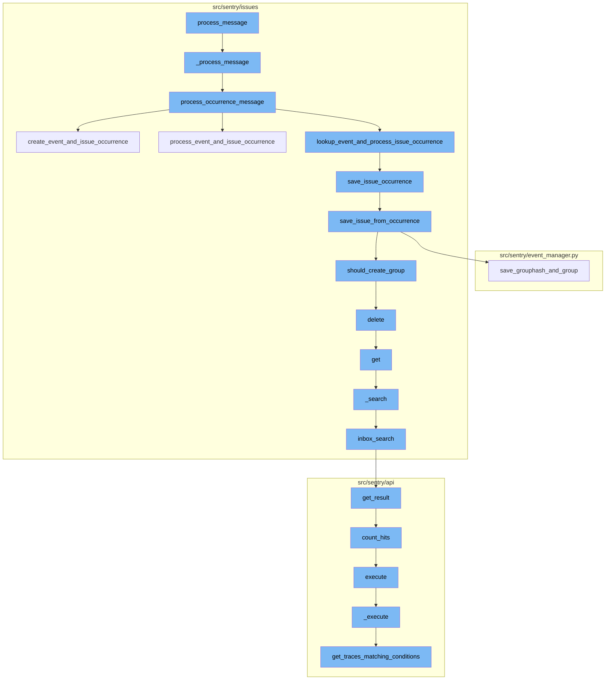
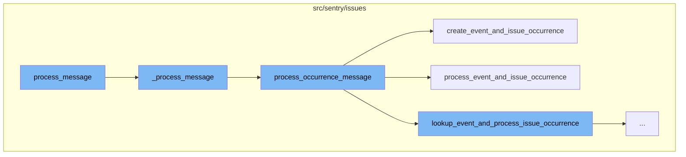
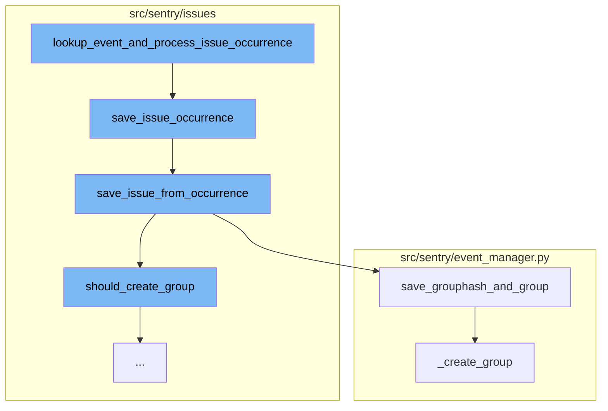
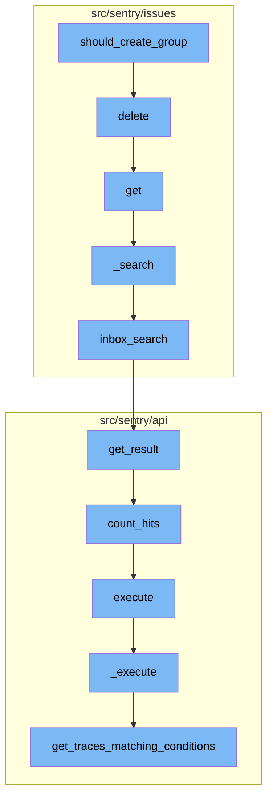
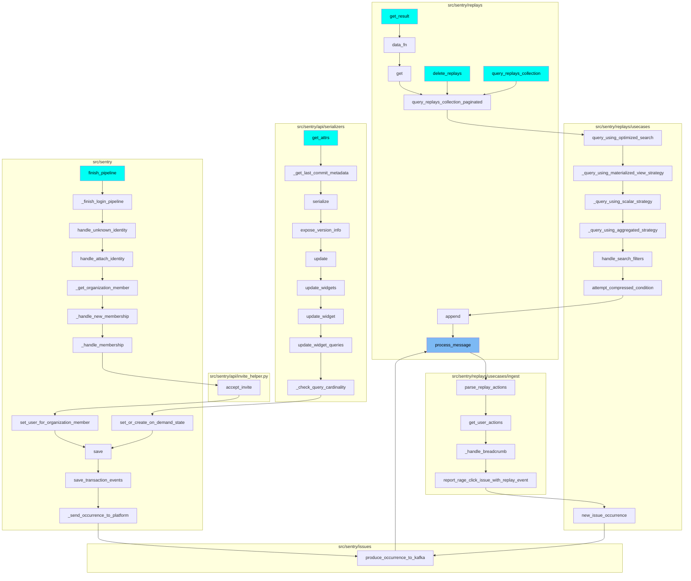

# Overview of process_message

The `process_message` function is a key part of the Sentry error tracking and performance monitoring platform. It is responsible for processing messages that contain information about errors or performance issues. The function takes a Kafka message as input, extracts the payload, and passes it to further processing functions.

<SwmSnippet path="/src/sentry/issues/run.py" line="95">

---

# Detailed Flow of process_message

`process_message` is the entry point for processing a message. It takes a Kafka message as input, extracts the payload, and passes it to `_process_message` for further processing.

```python
def process_message(message: Message[KafkaPayload]) -> None:
    from sentry.issues.occurrence_consumer import _process_message

    try:
        payload = orjson.loads(message.payload.value)
        _process_message(payload)
    except Exception:
        logger.exception("failed to process message payload")
```

---

</SwmSnippet>

<SwmSnippet path="/src/sentry/issues/occurrence_consumer.py" line="335">

---

`_process_message` is responsible for processing the message payload. It checks the payload type and based on that, it either processes a status change message or an occurrence message. If the payload type is not recognized, it increments a metric for dropped invalid payload types.

```python
def _process_message(
    message: Mapping[str, Any]
) -> tuple[IssueOccurrence | None, GroupInfo | None] | None:
    """
    :raises InvalidEventPayloadError: when the message is invalid
    :raises EventLookupError: when the provided event_id in the message couldn't be found.
    """
    with sentry_sdk.start_transaction(
        op="_process_message",
        name="issues.occurrence_consumer",
        sampled=True,
    ) as txn:
        try:
            # Messages without payload_type default to an OCCURRENCE payload
            payload_type = message.get("payload_type", PayloadType.OCCURRENCE.value)
            if payload_type == PayloadType.STATUS_CHANGE.value:
                group = process_status_change_message(message, txn)
                if not group:
                    return None

                return None, GroupInfo(group=group, is_new=False, is_regression=False)
```

---

</SwmSnippet>

<SwmSnippet path="/src/sentry/issues/occurrence_consumer.py" line="280">

---

`process_occurrence_message` is responsible for processing occurrence messages. It extracts the occurrence data from the message and checks if the group type allows ingestion. If it does, it processes the event and issue occurrence. If the event data is buffered spans, it creates an event and issue occurrence. Otherwise, it looks up the event and processes the issue occurrence.

```python
def process_occurrence_message(
    message: Mapping[str, Any], txn: Transaction | NoOpSpan | Span
) -> tuple[IssueOccurrence, GroupInfo | None] | None:
    with metrics.timer("occurrence_consumer._process_message._get_kwargs"):
        kwargs = _get_kwargs(message)
    occurrence_data = kwargs["occurrence_data"]
    metric_tags = {"occurrence_type": occurrence_data["type"]}
    is_buffered_spans = kwargs.get("is_buffered_spans", False)

    metrics.incr(
        "occurrence_ingest.messages",
        sample_rate=1.0,
        tags=metric_tags,
    )
    txn.set_tag("occurrence_type", occurrence_data["type"])

    project = Project.objects.get_from_cache(id=occurrence_data["project_id"])
    organization = Organization.objects.get_from_cache(id=project.organization_id)

    txn.set_tag("organization_id", organization.id)
    txn.set_tag("organization_slug", organization.slug)
```

---

</SwmSnippet>

<SwmSnippet path="/src/sentry/issues/occurrence_consumer.py" line="88">

---

`create_event_and_issue_occurrence` is used when the event data is buffered spans. It creates a lightweight event with a small set of fields that allows us to create occurrences. It then saves the issue occurrence.

```python
def create_event_and_issue_occurrence(
    occurrence_data: IssueOccurrenceData, event_data: dict[str, Any]
) -> tuple[IssueOccurrence, GroupInfo | None]:
    """With standalone span ingestion, we won't be storing events in
    nodestore, so instead we create a light-weight event with a small
    set of fields that lets us create occurrences.
    """
    project_id = occurrence_data["project_id"]
    event_id = occurrence_data["event_id"]
    if occurrence_data["event_id"] != event_data["event_id"]:
        raise ValueError(
            f"event_id in occurrence({occurrence_data['event_id']}) is different from event_id in event_data({event_data['event_id']})"
        )

    event = create_event(project_id, event_id, event_data)

    with metrics.timer(
        "occurrence_consumer._process_message.save_issue_occurrence",
        tags={"method": "create_event_and_issue_occurrence"},
    ):
        return save_issue_occurrence(occurrence_data, event)
```

---

</SwmSnippet>

<SwmSnippet path="/src/sentry/issues/occurrence_consumer.py" line="111">

---

`process_event_and_issue_occurrence` is used when the event data is not buffered spans. It saves the event from the occurrence and then saves the issue occurrence.

```python
def process_event_and_issue_occurrence(
    occurrence_data: IssueOccurrenceData, event_data: dict[str, Any]
) -> tuple[IssueOccurrence, GroupInfo | None]:
    if occurrence_data["event_id"] != event_data["event_id"]:
        raise ValueError(
            f"event_id in occurrence({occurrence_data['event_id']}) is different from event_id in event_data({event_data['event_id']})"
        )

    event = save_event_from_occurrence(event_data)
    with metrics.timer(
        "occurrence_consumer._process_message.save_issue_occurrence",
        tags={"method": "process_event_and_issue_occurrence"},
    ):
        return save_issue_occurrence(occurrence_data, event)
```

---

</SwmSnippet>

<SwmSnippet path="/src/sentry/issues/occurrence_consumer.py" line="127">

---

The function `lookup_event_and_process_issue_occurrence` is the starting point of the flow. It takes in occurrence data and attempts to look up the event associated with it. If successful, it proceeds to save the issue occurrence.

```python
def lookup_event_and_process_issue_occurrence(
    occurrence_data: IssueOccurrenceData,
) -> tuple[IssueOccurrence, GroupInfo | None]:
    project_id = occurrence_data["project_id"]
    event_id = occurrence_data["event_id"]
    try:
        event = lookup_event(project_id, event_id)
    except Exception:
        raise EventLookupError(f"Failed to lookup event({event_id}) for project_id({project_id})")

    with metrics.timer(
        "occurrence_consumer._process_message.save_issue_occurrence",
        tags={"method": "lookup_event_and_process_issue_occurrence"},
    ):
        return save_issue_occurrence(occurrence_data, event)
```

---

</SwmSnippet>

<SwmSnippet path="/src/sentry/issues/ingest.py" line="42">

---

`save_issue_occurrence` is the next step in the flow. It converts the occurrence data to an `IssueOccurrence` object and saves it. It then attempts to get the release associated with the event. If successful, it proceeds to save the issue from the occurrence.

```python
def save_issue_occurrence(
    occurrence_data: IssueOccurrenceData, event: Event
) -> tuple[IssueOccurrence, GroupInfo | None]:
    # Convert occurrence data to `IssueOccurrence`
    occurrence = IssueOccurrence.from_dict(occurrence_data)
    if occurrence.event_id != event.event_id:
        raise ValueError("IssueOccurrence must have the same event_id as the passed Event")
    # Note: For now we trust the project id passed along with the event. Later on we should make
    # sure that this is somehow validated.
    occurrence.save()

    try:
        release = Release.get(event.project, event.release)
    except Release.DoesNotExist:
        # The release should always exist here since event has been ingested at this point, but just
        # in case it has been deleted
        release = None
    group_info = save_issue_from_occurrence(occurrence, event, release)
    if group_info:
        environment = event.get_environment()
        _get_or_create_group_environment(environment, release, [group_info])
```

---

</SwmSnippet>

<SwmSnippet path="/src/sentry/issues/ingest.py" line="162">

---

`save_issue_from_occurrence` is the next function in the flow. It creates the necessary arguments for creating an issue, checks if a group should be created, and if so, proceeds to save the grouphash and group.

```python
def save_issue_from_occurrence(
    occurrence: IssueOccurrence, event: Event, release: Release | None
) -> GroupInfo | None:
    project = event.project
    issue_kwargs = _create_issue_kwargs(occurrence, event, release)
    # We need to augment the message with occurrence data here since we can't build a `GroupEvent`
    # until after we have created a `Group`.
    issue_kwargs["message"] = augment_message_with_occurrence(issue_kwargs["message"], occurrence)

    # TODO: For now we will assume a single fingerprint. We can expand later if necessary.
    # Note that additional fingerprints won't be used to generated additional issues, they'll be
    # used to map the occurrence to a specific issue.
    new_grouphash = occurrence.fingerprint[0]
    existing_grouphash = (
        GroupHash.objects.filter(project=project, hash=new_grouphash)
        .select_related("group")
        .first()
    )

    if not existing_grouphash:
        cluster_key = settings.SENTRY_ISSUE_PLATFORM_RATE_LIMITER_OPTIONS.get("cluster", "default")
```

---

</SwmSnippet>

<SwmSnippet path="/src/sentry/event_manager.py" line="2991">

---

`save_grouphash_and_group` is the next function in the flow. It attempts to get or create a `GroupHash` object. If a new `GroupHash` is created, it also creates a new `Group`. If the `Group` creation fails, it fetches the `Group` associated with the `GroupHash`.

```python
def save_grouphash_and_group(
    project: Project,
    event: Event,
    new_grouphash: str,
    **group_kwargs: Any,
) -> tuple[Group, bool]:
    group = None
    with transaction.atomic(router.db_for_write(GroupHash)):
        group_hash, created = GroupHash.objects.get_or_create(project=project, hash=new_grouphash)
        if created:
            group = _create_group(project, event, **group_kwargs)
            group_hash.update(group=group)

    if group is None:
        # If we failed to create the group it means another worker beat us to
        # it. Since a GroupHash can only be created in a transaction with the
        # Group, we can guarantee that the Group will exist at this point and
        # fetch it via GroupHash
        group = Group.objects.get(grouphash__project=project, grouphash__hash=new_grouphash)
    return group, created
```

---

</SwmSnippet>

<SwmSnippet path="/src/sentry/event_manager.py" line="1956">

---

The `_create_group` function is called within `save_grouphash_and_group` if a new `GroupHash` is created. It attempts to create a new `Group` with the provided arguments. If there's an `IntegrityError`, it tries to handle it by unsticking the project counter and trying to create the `Group` again.

```python
def _create_group(
    project: Project,
    event: Event,
    *,
    first_release: Release | None = None,
    **group_creation_kwargs: Any,
) -> Group:
    short_id = _get_next_short_id(project)

    # it's possible the release was deleted between
    # when we queried for the release and now, so
    # make sure it still exists
    group_creation_kwargs["first_release_id"] = (
        Release.objects.filter(id=first_release.id).values_list("id", flat=True).first()
        if first_release
        else None
    )

    group_data = group_creation_kwargs.pop("data", {})

    # add sdk tag to metadata
```

---

</SwmSnippet>

<SwmSnippet path="/src/sentry/issues/grouptype.py" line="597">

---

The `should_create_group` function is the starting point of the flow. It determines whether a new group should be created based on the noise configuration of the group type. If the number of times the group has been seen exceeds the ignore limit, the group hash is deleted and a new group is created.

```python
def should_create_group(
    grouptype: type[GroupType],
    client: RedisCluster | StrictRedis,
    grouphash: str,
    project: Project,
) -> bool:
    key = f"grouphash:{grouphash}:{project.id}"
    times_seen = client.incr(key)
    noise_config = grouptype.noise_config

    if not noise_config:
        return True

    over_threshold = times_seen >= noise_config.ignore_limit

    metrics.incr(
        "noise_reduction.should_create_group.threshold",
        tags={
            "over_threshold": over_threshold,
            "group_type": grouptype.slug,
        },
```

---

</SwmSnippet>

<SwmSnippet path="/src/sentry/issues/endpoints/organization_group_index.py" line="503">

---

The `delete` function is the next step in the flow. It is responsible for bulk removing a list of issues. The issues to be removed are identified by their IDs, which are passed as query parameters.

`````````````````````````````python
    def delete(self, request: Request, organization) -> Response:
        """
        Bulk Remove a List of Issues
        ````````````````````````````

        Permanently remove the given issues. The list of issues to
        modify is given through the `id` query parameter.  It is repeated
        for each issue that should be removed.

        Only queries by 'id' are accepted.

        If any IDs are out of scope this operation will succeed without
        any data mutation.

        :qparam int id: a list of IDs of the issues to be removed.  This
                        parameter shall be repeated for each issue, e.g.
                        `?id=1&id=2&id=3`. If this parameter is not provided,
                        it will attempt to remove the first 1000 issues.
        :pparam string organization_id_or_slug: the id or slug of the organization the
                                          issues belong to.
        :auth: required
`````````````````````````````

---

</SwmSnippet>

<SwmSnippet path="/src/sentry/issues/endpoints/organization_group_index.py" line="211">

---

The `_search` function is used to build and execute the search query based on the request, organization, projects, and environments. It returns the result of the search query and the query parameters.

``````````````````````````````python
    def get(self, request: Request, organization) -> Response:
        """
        List an Organization's Issues
        `````````````````````````````

        Return a list of issues (groups) bound to an organization.  All parameters are
        supplied as query string parameters.

        A default query of ``is:unresolved issue.priority:[high,medium]`` is applied.
        To return results with other statuses send a new query value
        (i.e. ``?query=`` for all results).

        The ``groupStatsPeriod`` parameter can be used to select the timeline
        stats which should be present. Possible values are: '' (disable),
        '24h', '14d'

        The ``statsPeriod`` parameter can be used to select a date window starting
        from now. Ex. ``14d``.

        The ``start`` and ``end`` parameters can be used to select an absolute
        date period to fetch issues from.
``````````````````````````````

---

</SwmSnippet>

<SwmSnippet path="/src/sentry/issues/endpoints/organization_group_index.py" line="60">

---

The `inbox_search` function is used to perform an inbox search. It filters the GroupInbox objects based on the date added and project, and applies additional filters if environments are specified. The function also handles pagination and returns the groups that match the search criteria.

```python
def inbox_search(
    projects: Sequence[Project],
    environments: Sequence[Environment] | None = None,
    limit: int = 100,
    cursor: Cursor | None = None,
    count_hits: bool = False,
    search_filters: Sequence[SearchFilter] | None = None,
    date_from: datetime | None = None,
    date_to: datetime | None = None,
    max_hits: int | None = None,
    actor: Any | None = None,
) -> CursorResult:
    now: datetime = timezone.now()
    end: datetime | None = None
    end_params: list[datetime] = [
        _f for _f in [date_to, get_search_filter(search_filters, "date", "<")] if _f
    ]
    if end_params:
        end = min(end_params)

    end = end if end else now + ALLOWED_FUTURE_DELTA
```

---

</SwmSnippet>

<SwmSnippet path="/src/sentry/api/paginator.py" line="136">

---

The `get_result` function in the paginator is used to paginate the results. It builds the queryset based on the cursor value and offset, and fetches the required number of results. The function also counts the total number of hits if required.

```python
    def get_result(self, limit=100, cursor=None, count_hits=False, known_hits=None, max_hits=None):
        # cursors are:
        #   (identifier(integer), row offset, is_prev)
        if cursor is None:
            cursor = Cursor(0, 0, 0)

        limit = min(limit, self.max_limit)

        if cursor.value:
            cursor_value = self.value_from_cursor(cursor)
        else:
            cursor_value = 0

        queryset = self.build_queryset(cursor_value, cursor.is_prev)

        # TODO(dcramer): this does not yet work correctly for ``is_prev`` when
        # the key is not unique

        # max_hits can be limited to speed up the query
        if max_hits is None:
            max_hits = MAX_HITS_LIMIT
```

---

</SwmSnippet>

<SwmSnippet path="/src/sentry/api/paginator.py" line="27">

---

The `count_hits` function is used to count the total number of hits in the queryset. It builds a query to count the IDs and executes it using a database cursor.

```python
def count_hits(queryset, max_hits):
    if not max_hits:
        return 0
    hits_query = queryset.values()[:max_hits].query
    # clear out any select fields (include select_related) and pull just the id
    hits_query.clear_select_clause()
    hits_query.add_fields(["id"])
    hits_query.clear_ordering(force=True, clear_default=True)
    try:
        h_sql, h_params = hits_query.sql_with_params()
    except EmptyResultSet:
        return 0
    cursor = connections[queryset.using_replica().db].cursor()
    cursor.execute(f"SELECT COUNT(*) FROM ({h_sql}) as t", h_params)
    return cursor.fetchone()[0]
```

---

</SwmSnippet>

<SwmSnippet path="/src/sentry/api/endpoints/organization_traces.py" line="341">

---

The `execute` function is used to execute the trace search. It returns the data from the `_execute` function.

```python
    def execute(self, offset: int, limit: int):
        return {"data": self._execute()}
```

---

</SwmSnippet>

<SwmSnippet path="/src/sentry/api/endpoints/organization_traces.py" line="344">

---

The `_execute` function is the final step in the flow. It gets the traces matching the conditions, refines the parameters, and executes all the queries. The function then processes the results and returns the final data.

```python
    def _execute(self):
        with handle_span_query_errors():
            min_timestamp, max_timestamp, trace_ids = self.get_traces_matching_conditions(
                self.params,
                self.snuba_params,
            )

        self.refine_params(min_timestamp, max_timestamp)

        if not trace_ids:
            return []

        with handle_span_query_errors():
            params, snuba_params = self.params_with_all_projects()

            all_queries = self.get_all_queries(
                params,
                snuba_params,
                trace_ids,
            )

```

---

</SwmSnippet>

<SwmSnippet path="/src/sentry/api/endpoints/organization_traces.py" line="415">

---

The `get_traces_matching_conditions` function is used to get the traces that match the conditions. Depending on whether the metric is specified, it calls either `get_traces_matching_metric_conditions` or `get_traces_matching_span_conditions`.

```python
    def get_traces_matching_conditions(
        self,
        params: ParamsType,
        snuba_params: SnubaParams,
    ) -> tuple[datetime, datetime, list[str]]:
        if self.mri is not None:
            sentry_sdk.set_tag("mri", self.mri)
            return self.get_traces_matching_metric_conditions(params, snuba_params)

        return self.get_traces_matching_span_conditions(params, snuba_params)
```

---

</SwmSnippet>



# Flow drill down

First, we'll zoom into this section of the flow:



<SwmSnippet path="/src/sentry/issues/run.py" line="95">

---

# process_message

`process_message` is the entry point for processing a message. It takes a Kafka message as input, extracts the payload, and passes it to `_process_message` for further processing.

```python
def process_message(message: Message[KafkaPayload]) -> None:
    from sentry.issues.occurrence_consumer import _process_message

    try:
        payload = orjson.loads(message.payload.value)
        _process_message(payload)
    except Exception:
        logger.exception("failed to process message payload")
```

---

</SwmSnippet>

<SwmSnippet path="/src/sentry/issues/occurrence_consumer.py" line="335">

---

# \_process_message

`_process_message` is responsible for processing the message payload. It checks the payload type and based on that, it either processes a status change message or an occurrence message. If the payload type is not recognized, it increments a metric for dropped invalid payload types.

```python
def _process_message(
    message: Mapping[str, Any]
) -> tuple[IssueOccurrence | None, GroupInfo | None] | None:
    """
    :raises InvalidEventPayloadError: when the message is invalid
    :raises EventLookupError: when the provided event_id in the message couldn't be found.
    """
    with sentry_sdk.start_transaction(
        op="_process_message",
        name="issues.occurrence_consumer",
        sampled=True,
    ) as txn:
        try:
            # Messages without payload_type default to an OCCURRENCE payload
            payload_type = message.get("payload_type", PayloadType.OCCURRENCE.value)
            if payload_type == PayloadType.STATUS_CHANGE.value:
                group = process_status_change_message(message, txn)
                if not group:
                    return None

                return None, GroupInfo(group=group, is_new=False, is_regression=False)
```

---

</SwmSnippet>

<SwmSnippet path="/src/sentry/issues/occurrence_consumer.py" line="280">

---

# process_occurrence_message

`process_occurrence_message` is responsible for processing occurrence messages. It extracts the occurrence data from the message and checks if the group type allows ingestion. If it does, it processes the event and issue occurrence. If the event data is buffered spans, it creates an event and issue occurrence. Otherwise, it looks up the event and processes the issue occurrence.

```python
def process_occurrence_message(
    message: Mapping[str, Any], txn: Transaction | NoOpSpan | Span
) -> tuple[IssueOccurrence, GroupInfo | None] | None:
    with metrics.timer("occurrence_consumer._process_message._get_kwargs"):
        kwargs = _get_kwargs(message)
    occurrence_data = kwargs["occurrence_data"]
    metric_tags = {"occurrence_type": occurrence_data["type"]}
    is_buffered_spans = kwargs.get("is_buffered_spans", False)

    metrics.incr(
        "occurrence_ingest.messages",
        sample_rate=1.0,
        tags=metric_tags,
    )
    txn.set_tag("occurrence_type", occurrence_data["type"])

    project = Project.objects.get_from_cache(id=occurrence_data["project_id"])
    organization = Organization.objects.get_from_cache(id=project.organization_id)

    txn.set_tag("organization_id", organization.id)
    txn.set_tag("organization_slug", organization.slug)
```

---

</SwmSnippet>

<SwmSnippet path="/src/sentry/issues/occurrence_consumer.py" line="88">

---

# create_event_and_issue_occurrence

`create_event_and_issue_occurrence` is used when the event data is buffered spans. It creates a lightweight event with a small set of fields that allows us to create occurrences. It then saves the issue occurrence.

```python
def create_event_and_issue_occurrence(
    occurrence_data: IssueOccurrenceData, event_data: dict[str, Any]
) -> tuple[IssueOccurrence, GroupInfo | None]:
    """With standalone span ingestion, we won't be storing events in
    nodestore, so instead we create a light-weight event with a small
    set of fields that lets us create occurrences.
    """
    project_id = occurrence_data["project_id"]
    event_id = occurrence_data["event_id"]
    if occurrence_data["event_id"] != event_data["event_id"]:
        raise ValueError(
            f"event_id in occurrence({occurrence_data['event_id']}) is different from event_id in event_data({event_data['event_id']})"
        )

    event = create_event(project_id, event_id, event_data)

    with metrics.timer(
        "occurrence_consumer._process_message.save_issue_occurrence",
        tags={"method": "create_event_and_issue_occurrence"},
    ):
        return save_issue_occurrence(occurrence_data, event)
```

---

</SwmSnippet>

<SwmSnippet path="/src/sentry/issues/occurrence_consumer.py" line="111">

---

# process_event_and_issue_occurrence

`process_event_and_issue_occurrence` is used when the event data is not buffered spans. It saves the event from the occurrence and then saves the issue occurrence.

```python
def process_event_and_issue_occurrence(
    occurrence_data: IssueOccurrenceData, event_data: dict[str, Any]
) -> tuple[IssueOccurrence, GroupInfo | None]:
    if occurrence_data["event_id"] != event_data["event_id"]:
        raise ValueError(
            f"event_id in occurrence({occurrence_data['event_id']}) is different from event_id in event_data({event_data['event_id']})"
        )

    event = save_event_from_occurrence(event_data)
    with metrics.timer(
        "occurrence_consumer._process_message.save_issue_occurrence",
        tags={"method": "process_event_and_issue_occurrence"},
    ):
        return save_issue_occurrence(occurrence_data, event)
```

---

</SwmSnippet>

Now, lets zoom into this section of the flow:



<SwmSnippet path="/src/sentry/issues/occurrence_consumer.py" line="127">

---

# Processing Message Flow

The function `lookup_event_and_process_issue_occurrence` is the starting point of the flow. It takes in occurrence data and attempts to look up the event associated with it. If successful, it proceeds to save the issue occurrence.

```python
def lookup_event_and_process_issue_occurrence(
    occurrence_data: IssueOccurrenceData,
) -> tuple[IssueOccurrence, GroupInfo | None]:
    project_id = occurrence_data["project_id"]
    event_id = occurrence_data["event_id"]
    try:
        event = lookup_event(project_id, event_id)
    except Exception:
        raise EventLookupError(f"Failed to lookup event({event_id}) for project_id({project_id})")

    with metrics.timer(
        "occurrence_consumer._process_message.save_issue_occurrence",
        tags={"method": "lookup_event_and_process_issue_occurrence"},
    ):
        return save_issue_occurrence(occurrence_data, event)
```

---

</SwmSnippet>

<SwmSnippet path="/src/sentry/issues/ingest.py" line="42">

---

`save_issue_occurrence` is the next step in the flow. It converts the occurrence data to an `IssueOccurrence` object and saves it. It then attempts to get the release associated with the event. If successful, it proceeds to save the issue from the occurrence.

```python
def save_issue_occurrence(
    occurrence_data: IssueOccurrenceData, event: Event
) -> tuple[IssueOccurrence, GroupInfo | None]:
    # Convert occurrence data to `IssueOccurrence`
    occurrence = IssueOccurrence.from_dict(occurrence_data)
    if occurrence.event_id != event.event_id:
        raise ValueError("IssueOccurrence must have the same event_id as the passed Event")
    # Note: For now we trust the project id passed along with the event. Later on we should make
    # sure that this is somehow validated.
    occurrence.save()

    try:
        release = Release.get(event.project, event.release)
    except Release.DoesNotExist:
        # The release should always exist here since event has been ingested at this point, but just
        # in case it has been deleted
        release = None
    group_info = save_issue_from_occurrence(occurrence, event, release)
    if group_info:
        environment = event.get_environment()
        _get_or_create_group_environment(environment, release, [group_info])
```

---

</SwmSnippet>

<SwmSnippet path="/src/sentry/issues/ingest.py" line="162">

---

`save_issue_from_occurrence` is the next function in the flow. It creates the necessary arguments for creating an issue, checks if a group should be created, and if so, proceeds to save the grouphash and group.

```python
def save_issue_from_occurrence(
    occurrence: IssueOccurrence, event: Event, release: Release | None
) -> GroupInfo | None:
    project = event.project
    issue_kwargs = _create_issue_kwargs(occurrence, event, release)
    # We need to augment the message with occurrence data here since we can't build a `GroupEvent`
    # until after we have created a `Group`.
    issue_kwargs["message"] = augment_message_with_occurrence(issue_kwargs["message"], occurrence)

    # TODO: For now we will assume a single fingerprint. We can expand later if necessary.
    # Note that additional fingerprints won't be used to generated additional issues, they'll be
    # used to map the occurrence to a specific issue.
    new_grouphash = occurrence.fingerprint[0]
    existing_grouphash = (
        GroupHash.objects.filter(project=project, hash=new_grouphash)
        .select_related("group")
        .first()
    )

    if not existing_grouphash:
        cluster_key = settings.SENTRY_ISSUE_PLATFORM_RATE_LIMITER_OPTIONS.get("cluster", "default")
```

---

</SwmSnippet>

<SwmSnippet path="/src/sentry/event_manager.py" line="2991">

---

`save_grouphash_and_group` is the next function in the flow. It attempts to get or create a `GroupHash` object. If a new `GroupHash` is created, it also creates a new `Group`. If the `Group` creation fails, it fetches the `Group` associated with the `GroupHash`.

```python
def save_grouphash_and_group(
    project: Project,
    event: Event,
    new_grouphash: str,
    **group_kwargs: Any,
) -> tuple[Group, bool]:
    group = None
    with transaction.atomic(router.db_for_write(GroupHash)):
        group_hash, created = GroupHash.objects.get_or_create(project=project, hash=new_grouphash)
        if created:
            group = _create_group(project, event, **group_kwargs)
            group_hash.update(group=group)

    if group is None:
        # If we failed to create the group it means another worker beat us to
        # it. Since a GroupHash can only be created in a transaction with the
        # Group, we can guarantee that the Group will exist at this point and
        # fetch it via GroupHash
        group = Group.objects.get(grouphash__project=project, grouphash__hash=new_grouphash)
    return group, created
```

---

</SwmSnippet>

<SwmSnippet path="/src/sentry/event_manager.py" line="1956">

---

The `_create_group` function is called within `save_grouphash_and_group` if a new `GroupHash` is created. It attempts to create a new `Group` with the provided arguments. If there's an `IntegrityError`, it tries to handle it by unsticking the project counter and trying to create the `Group` again.

```python
def _create_group(
    project: Project,
    event: Event,
    *,
    first_release: Release | None = None,
    **group_creation_kwargs: Any,
) -> Group:
    short_id = _get_next_short_id(project)

    # it's possible the release was deleted between
    # when we queried for the release and now, so
    # make sure it still exists
    group_creation_kwargs["first_release_id"] = (
        Release.objects.filter(id=first_release.id).values_list("id", flat=True).first()
        if first_release
        else None
    )

    group_data = group_creation_kwargs.pop("data", {})

    # add sdk tag to metadata
```

---

</SwmSnippet>

Now, lets zoom into this section of the flow:



<SwmSnippet path="/src/sentry/issues/grouptype.py" line="597">

---

# Process Message Flow

The `should_create_group` function is the starting point of the flow. It determines whether a new group should be created based on the noise configuration of the group type. If the number of times the group has been seen exceeds the ignore limit, the group hash is deleted and a new group is created.

```python
def should_create_group(
    grouptype: type[GroupType],
    client: RedisCluster | StrictRedis,
    grouphash: str,
    project: Project,
) -> bool:
    key = f"grouphash:{grouphash}:{project.id}"
    times_seen = client.incr(key)
    noise_config = grouptype.noise_config

    if not noise_config:
        return True

    over_threshold = times_seen >= noise_config.ignore_limit

    metrics.incr(
        "noise_reduction.should_create_group.threshold",
        tags={
            "over_threshold": over_threshold,
            "group_type": grouptype.slug,
        },
```

---

</SwmSnippet>

<SwmSnippet path="/src/sentry/issues/endpoints/organization_group_index.py" line="503">

---

The `delete` function is the next step in the flow. It is responsible for bulk removing a list of issues. The issues to be removed are identified by their IDs, which are passed as query parameters.

`````````````````````````````python
    def delete(self, request: Request, organization) -> Response:
        """
        Bulk Remove a List of Issues
        ````````````````````````````

        Permanently remove the given issues. The list of issues to
        modify is given through the `id` query parameter.  It is repeated
        for each issue that should be removed.

        Only queries by 'id' are accepted.

        If any IDs are out of scope this operation will succeed without
        any data mutation.

        :qparam int id: a list of IDs of the issues to be removed.  This
                        parameter shall be repeated for each issue, e.g.
                        `?id=1&id=2&id=3`. If this parameter is not provided,
                        it will attempt to remove the first 1000 issues.
        :pparam string organization_id_or_slug: the id or slug of the organization the
                                          issues belong to.
        :auth: required
`````````````````````````````

---

</SwmSnippet>

<SwmSnippet path="/src/sentry/issues/endpoints/organization_group_index.py" line="211">

---

The `get` function lists an organization's issues. It applies a default query of `is:unresolved issue.priority:[high,medium]` and can be customized with various query parameters. The function also handles pagination and returns a response with the serialized groups.

``````````````````````````````python
    def get(self, request: Request, organization) -> Response:
        """
        List an Organization's Issues
        `````````````````````````````

        Return a list of issues (groups) bound to an organization.  All parameters are
        supplied as query string parameters.

        A default query of ``is:unresolved issue.priority:[high,medium]`` is applied.
        To return results with other statuses send a new query value
        (i.e. ``?query=`` for all results).

        The ``groupStatsPeriod`` parameter can be used to select the timeline
        stats which should be present. Possible values are: '' (disable),
        '24h', '14d'

        The ``statsPeriod`` parameter can be used to select a date window starting
        from now. Ex. ``14d``.

        The ``start`` and ``end`` parameters can be used to select an absolute
        date period to fetch issues from.
``````````````````````````````

---

</SwmSnippet>

<SwmSnippet path="/src/sentry/issues/endpoints/organization_group_index.py" line="162">

---

The `_search` function is used to build and execute the search query based on the request, organization, projects, and environments. It returns the result of the search query and the query parameters.

```python
    def _search(
        self, request: Request, organization, projects, environments, extra_query_kwargs=None
    ):
        with start_span(op="_search"):
            query_kwargs = build_query_params_from_request(
                request, organization, projects, environments
            )
            if extra_query_kwargs is not None:
                assert "environment" not in extra_query_kwargs
                query_kwargs.update(extra_query_kwargs)

            query_kwargs["environments"] = environments if environments else None

            query_kwargs["actor"] = request.user
            if query_kwargs["sort_by"] == "inbox":
                query_kwargs.pop("sort_by")
                result = inbox_search(**query_kwargs)
            else:

                def use_group_snuba_dataset() -> bool:
                    # if useGroupSnubaDataset we consider using the snuba dataset
```

---

</SwmSnippet>

<SwmSnippet path="/src/sentry/issues/endpoints/organization_group_index.py" line="60">

---

The `inbox_search` function is used to perform an inbox search. It filters the GroupInbox objects based on the date added and project, and applies additional filters if environments are specified. The function also handles pagination and returns the groups that match the search criteria.

```python
def inbox_search(
    projects: Sequence[Project],
    environments: Sequence[Environment] | None = None,
    limit: int = 100,
    cursor: Cursor | None = None,
    count_hits: bool = False,
    search_filters: Sequence[SearchFilter] | None = None,
    date_from: datetime | None = None,
    date_to: datetime | None = None,
    max_hits: int | None = None,
    actor: Any | None = None,
) -> CursorResult:
    now: datetime = timezone.now()
    end: datetime | None = None
    end_params: list[datetime] = [
        _f for _f in [date_to, get_search_filter(search_filters, "date", "<")] if _f
    ]
    if end_params:
        end = min(end_params)

    end = end if end else now + ALLOWED_FUTURE_DELTA
```

---

</SwmSnippet>

<SwmSnippet path="/src/sentry/api/paginator.py" line="136">

---

The `get_result` function in the paginator is used to paginate the results. It builds the queryset based on the cursor value and offset, and fetches the required number of results. The function also counts the total number of hits if required.

```python
    def get_result(self, limit=100, cursor=None, count_hits=False, known_hits=None, max_hits=None):
        # cursors are:
        #   (identifier(integer), row offset, is_prev)
        if cursor is None:
            cursor = Cursor(0, 0, 0)

        limit = min(limit, self.max_limit)

        if cursor.value:
            cursor_value = self.value_from_cursor(cursor)
        else:
            cursor_value = 0

        queryset = self.build_queryset(cursor_value, cursor.is_prev)

        # TODO(dcramer): this does not yet work correctly for ``is_prev`` when
        # the key is not unique

        # max_hits can be limited to speed up the query
        if max_hits is None:
            max_hits = MAX_HITS_LIMIT
```

---

</SwmSnippet>

<SwmSnippet path="/src/sentry/api/paginator.py" line="27">

---

The `count_hits` function is used to count the total number of hits in the queryset. It builds a query to count the IDs and executes it using a database cursor.

```python
def count_hits(queryset, max_hits):
    if not max_hits:
        return 0
    hits_query = queryset.values()[:max_hits].query
    # clear out any select fields (include select_related) and pull just the id
    hits_query.clear_select_clause()
    hits_query.add_fields(["id"])
    hits_query.clear_ordering(force=True, clear_default=True)
    try:
        h_sql, h_params = hits_query.sql_with_params()
    except EmptyResultSet:
        return 0
    cursor = connections[queryset.using_replica().db].cursor()
    cursor.execute(f"SELECT COUNT(*) FROM ({h_sql}) as t", h_params)
    return cursor.fetchone()[0]
```

---

</SwmSnippet>

<SwmSnippet path="/src/sentry/api/endpoints/organization_traces.py" line="341">

---

The `execute` function is used to execute the trace search. It returns the data from the `_execute` function.

```python
    def execute(self, offset: int, limit: int):
        return {"data": self._execute()}
```

---

</SwmSnippet>

<SwmSnippet path="/src/sentry/api/endpoints/organization_traces.py" line="344">

---

The `_execute` function is the final step in the flow. It gets the traces matching the conditions, refines the parameters, and executes all the queries. The function then processes the results and returns the final data.

```python
    def _execute(self):
        with handle_span_query_errors():
            min_timestamp, max_timestamp, trace_ids = self.get_traces_matching_conditions(
                self.params,
                self.snuba_params,
            )

        self.refine_params(min_timestamp, max_timestamp)

        if not trace_ids:
            return []

        with handle_span_query_errors():
            params, snuba_params = self.params_with_all_projects()

            all_queries = self.get_all_queries(
                params,
                snuba_params,
                trace_ids,
            )

```

---

</SwmSnippet>

<SwmSnippet path="/src/sentry/api/endpoints/organization_traces.py" line="415">

---

The `get_traces_matching_conditions` function is used to get the traces that match the conditions. Depending on whether the metric is specified, it calls either `get_traces_matching_metric_conditions` or `get_traces_matching_span_conditions`.

```python
    def get_traces_matching_conditions(
        self,
        params: ParamsType,
        snuba_params: SnubaParams,
    ) -> tuple[datetime, datetime, list[str]]:
        if self.mri is not None:
            sentry_sdk.set_tag("mri", self.mri)
            return self.get_traces_matching_metric_conditions(params, snuba_params)

        return self.get_traces_matching_span_conditions(params, snuba_params)
```

---

</SwmSnippet>

# Where is this flow used?

This flow is used multiple times in the codebase as represented in the following diagram:

(Note - these are only some of the entry points of this flow)



&nbsp;

*This is an auto-generated document by Swimm AI 🌊 and has not yet been verified by a human*

<SwmMeta version="3.0.0" repo-id="Z2l0aHViJTNBJTNBc2VudHJ5LWRlbW8lM0ElM0FTd2ltbS1EZW1v" repo-name="sentry-demo" doc-type="flows"><sup>Powered by [Swimm](/)</sup></SwmMeta>
