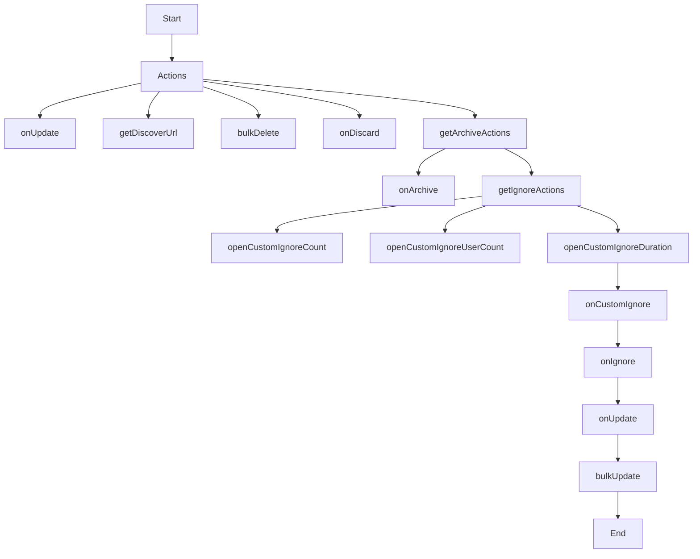

This document will cover the 'Actions Flow' feature in Sentry, which includes:

1. The purpose of the Actions Flow
2. The steps involved in the Actions Flow
3. The impact of each step on the end user.

Technical document: <SwmLink doc-title="Actions flow">[Actions flow](/.swm/actions-flow.dip1cve7.sw.md)</SwmLink>

# Actions Flow

Actions in Sentry are operations that can be performed on issues. They are used to manage and control the state of issues in the system. This includes updating, deleting, discarding, and archiving issues.

# onUpdate Function

The onUpdate function is called when there is a need to update the issue. It uses the bulkUpdate function to perform the update operation. The function also checks if the update is a resolution status and tracks the issue action accordingly. This allows for tracking of issue updates and ensures that all changes are properly logged.

# getDiscoverUrl Function

The getDiscoverUrl function is used to generate a URL for the Discover view of the issue. It creates a discoverQuery based on the issue's details and uses it to create a discoverView. The URL for this view is then returned. This allows users to easily navigate to the Discover view of an issue.

# bulkDelete Function

The bulkDelete function is used to delete multiple issues at once. It uses the wrapRequest function to make the API request for deletion. This allows for efficient deletion of multiple issues, reducing the time and effort required to manage issues.

# onDiscard Function

The onDiscard function is used to discard an issue. It makes an API request to update the issue with discard: true. Upon successful discard, it redirects the user to the issues page. This allows users to easily discard issues that are no longer relevant.

# getArchiveActions Function

The getArchiveActions function is responsible for generating the archive actions that can be performed on an issue. It takes in a set of properties and returns an object containing the archive actions and a function onArchive to handle the archive action. This provides users with a set of actions they can perform to manage the archive status of an issue.

# getIgnoreActions Function

The getIgnoreActions function is the starting point of the flow. It defines several actions that can be performed, such as ignoring an issue for a certain duration, ignoring until a certain count is reached, or ignoring until a certain user count is reached. These actions are represented as modal windows that are opened when the corresponding action is triggered. This provides users with a set of actions they can perform to manage the ignore status of an issue.

# openCustomIgnoreDuration Function

The openCustomIgnoreDuration function opens a modal window that allows the user to specify a duration for which an issue should be ignored. The details selected in the modal are then passed to the onCustomIgnore function. This allows users to easily specify a custom duration for ignoring an issue.

# onCustomIgnore Function

The onCustomIgnore function is triggered when a user selects a custom ignore duration. It calls the onIgnore function with the selected status details and bypasses the confirmation. This allows users to easily specify a custom ignore duration and have it applied without additional confirmation.

# onIgnore Function

The onIgnore function opens a confirmation modal. If the confirmation is bypassed or the user confirms, it calls the onUpdate function with the new status details. This allows users to easily confirm their decision to ignore an issue and have the new status applied.

# bulkUpdate Function

The bulkUpdate function updates the group store and sends a PUT request to the server with the new data. This ensures that all changes to the issue status are properly stored and updated on the server.

&nbsp;

*This is an auto-generated document by Swimm AI 🌊 and has not yet been verified by a human*

<SwmMeta version="3.0.0" repo-id="Z2l0aHViJTNBJTNBc2VudHJ5LWRlbW8lM0ElM0FTd2ltbS1EZW1v" repo-name="sentry-demo" doc-type="product-flows">Powered by [Swimm](/)</SwmMeta>
