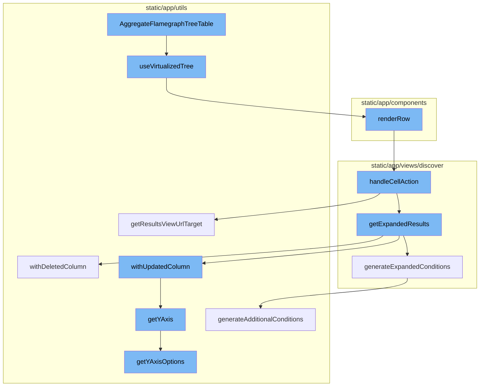

This document will cover the 'AggregateFlamegraphTreeTable' feature, which includes:

 1. Rendering the flamegraph tree table
 2. Managing the state of the virtualized tree
 3. Rendering each row of the transactions table
 4. Handling actions on a cell in the table
 5. Generating the URL target for the results view
 6. Converting an aggregated query into one that does not have aggregates
 7. Removing a column from the EventView and adjusting the sort keys and yAxis accordingly
 8. Creating additional conditions based on the fields in an EventView and a dataRow/event
 9. Updating a column in the EventView and adjusting the sort keys and yAxis accordingly
10. Returning the current selected yAxis if it is one of the items in yAxisOptions, otherwise it returns the default option.

Technical document: <SwmLink doc-title="Understanding AggregateFlamegraphTreeTable">[Understanding AggregateFlamegraphTreeTable](/.swm/understanding-aggregateflamegraphtreetable.90ludxhi.sw.md)</SwmLink>

# Rendering the flamegraph tree table

The 'AggregateFlamegraphTreeTable' function is the starting point of the flow. It is responsible for rendering the flamegraph tree table. It uses several hooks and local states to manage the flamegraph's state, such as the current view, the root nodes, the tree, the color map, and the sort function. It also defines the 'fixedRenderRow' and 'dynamicRenderRow' callbacks, which are used to render each row of the flamegraph tree table.

# Managing the state of the virtualized tree

The 'useVirtualizedTree' hook is used to manage the state of the virtualized tree. It provides several functionalities such as handling scrolling, clicking, mouse movement, sorting changes, and node expansion. It also provides the 'handleRowClick', 'handleRowMouseEnter', 'handleExpandTreeNode', 'handleRowKeyDown', and 'handleScrollTo' callbacks, which are used in the 'AggregateFlamegraphTreeTable' function to handle user interactions.

# Rendering each row of the transactions table

The 'renderRow' method is used to render each row of the transactions table. It takes a row of data, the row index, the column order, and the table metadata as arguments. It then maps over the column order to render each cell in the row. It also handles cell actions, which can be triggered by user interactions.

# Handling actions on a cell in the table

The 'handleCellAction' function is used to handle actions on a cell in the table. Depending on the action, it may modify the query, update the view, or navigate to a new page. It uses the 'getExpandedResults' function to drill down into each distinct value and get a count for each value.

# Generating the URL target for the results view

The 'getResultsViewUrlTarget' method is used to generate the URL target for the results view. It takes the organization slug and a boolean indicating whether the current page is the homepage as arguments. It returns an object containing the pathname and the query string object.

# Converting an aggregated query into one that does not have aggregates

The 'getExpandedResults' function is the starting point of the flow. It converts an aggregated query into one that does not have aggregates. It also applies additional conditions defined in 'additionalConditions' and generates conditions based on the 'dataRow' parameter and the current fields in the 'eventView'.

# Removing a column from the EventView and adjusting the sort keys and yAxis accordingly

The 'withDeletedColumn' method is called within 'getExpandedResults'. It removes a column from the EventView and adjusts the sort keys and yAxis accordingly.

# Creating additional conditions based on the fields in an EventView and a dataRow/event

The 'generateExpandedConditions' function is also called within 'getExpandedResults'. It creates additional conditions based on the fields in an EventView and a dataRow/event.

# Updating a column in the EventView and adjusting the sort keys and yAxis accordingly

The 'withUpdatedColumn' method is called twice within 'getExpandedResults'. It updates a column in the EventView and adjusts the sort keys and yAxis accordingly.

# Returning the current selected yAxis if it is one of the items in yAxisOptions, otherwise it returns the default option

The 'getYAxis' method is called within 'withUpdatedColumn' and 'withDeletedColumn'. It returns the current selected yAxis if it is one of the items in yAxisOptions, otherwise it returns the default option.

&nbsp;

*This is an auto-generated document by Swimm AI 🌊 and has not yet been verified by a human*

<SwmMeta version="3.0.0" repo-id="Z2l0aHViJTNBJTNBc2VudHJ5LWRlbW8lM0ElM0FTd2ltbS1EZW1v" repo-name="sentry-demo" doc-type="product-flows">Powered by [Swimm](/)</SwmMeta>
