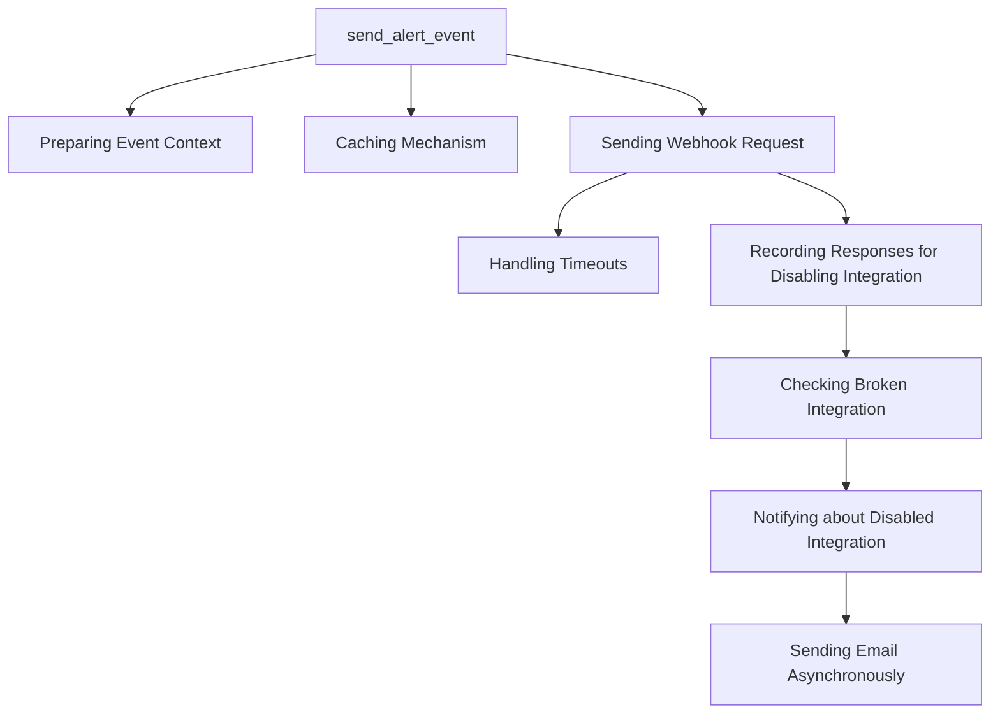

This document will cover the Alert Notification System in Sentry, focusing on the 'send_alert_event' function. We'll cover:

1. The purpose of the Alert Notification System
2. The process of preparing event context
3. The caching mechanism used
4. The process of sending the webhook request
5. How timeouts are handled
6. How responses are recorded for disabling integration
7. The process of checking broken integration
8. The process of notifying about disabled integration
9. The process of sending email asynchronously.

Technical document: <SwmLink doc-title="Understanding the send_alert_event Function">[Understanding the send_alert_event Function](/.swm/understanding-the-send_alert_event-function.ug5lzr1v.sw.md)</SwmLink>

# Alert Notification System

The Alert Notification System in Sentry is a crucial part of the platform's functionality. It is responsible for sending incident data to a SentryApp's webhook when an incident alert is triggered. This system ensures that the relevant parties are notified promptly when an incident occurs, allowing for quick response and resolution.

# Preparing Event Context

The event context is prepared by retrieving the project and organization related to the event from the cache. URLs for the event are generated and attached to the event context. This context is then used in the 'send_alert_event' function to send the alert.

# Caching Mechanism

The caching mechanism is used to improve the performance of the Alert Notification System. It retrieves the project and organization related to the event from the cache. If the requested data is not in the cache, it retrieves it from the database and stores it in the cache for future use.

# Sending the Webhook Request

The webhook request is sent to notify a SentryApp's webhook about an incident. The request includes the incident data and the URL to hit for the webhook. The system handles different types of responses and errors.

# Handling Timeouts

In the event of a timeout or connection error, the system records the timeout or connection error in the integration buffer for the unpublished Sentry App. It checks if the Sentry App is broken and should be disabled.

# Recording Responses for Disabling Integration

If the action of the app platform event is not 'event.alert', the system records the response for the purpose of disabling integrations. This ensures that broken integrations are identified and disabled promptly.

# Checking Broken Integration

The system checks if the integration is broken by using the 'IntegrationRequestBuffer'. If the integration is broken, it disables the integration, clears the buffer, and notifies about the disabled integration.

# Notifying about Disabled Integration

When an integration is disabled, the owners of the organization are notified. A message with the necessary details is created and sent asynchronously.

# Sending Email Asynchronously

The email message is sent asynchronously. The message is built, queued for sending, and the queued mail is logged.

&nbsp;

*This is an auto-generated document by Swimm AI 🌊 and has not yet been verified by a human*

<SwmMeta version="3.0.0" repo-id="Z2l0aHViJTNBJTNBc2VudHJ5LWRlbW8lM0ElM0FTd2ltbS1EZW1v" repo-name="sentry-demo" doc-type="product-flows">Powered by [Swimm](/)</SwmMeta>
