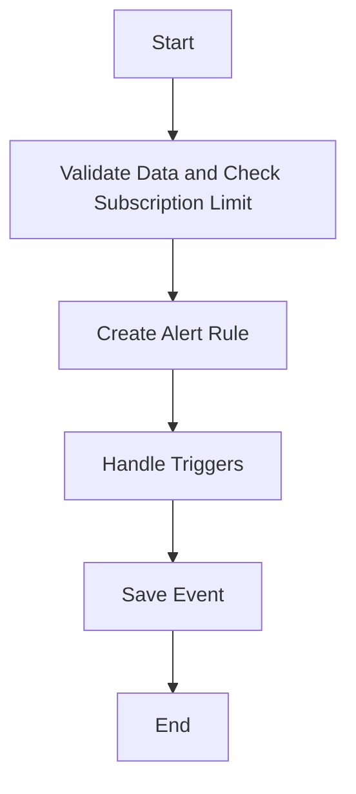

This document will provide a detailed understanding of the 'Alert Rule Creation Flow' in Sentry. We'll cover:

1. The purpose of the Alert Rule Creation Flow
2. The steps involved in the flow
3. The product logic behind each step.

Technical document: <SwmLink doc-title="Understanding the Create Flow">[Understanding the Create Flow](/.swm/understanding-the-create-flow.lll3y5fr.sw.md)</SwmLink>

# Purpose of the Alert Rule Creation Flow

The Alert Rule Creation Flow is a crucial part of Sentry's error tracking and performance monitoring platform. It allows users to create alert rules for their organization. These alert rules help in monitoring the performance of various projects under an organization and trigger alerts when certain conditions are met.

# Steps involved in the Alert Rule Creation Flow

The Alert Rule Creation Flow involves several steps:

1. Data Validation and Subscription Limit Check
2. Alert Rule Creation
3. Trigger Handling
4. Event Saving

# Product logic behind each step

1. **Data Validation and Subscription Limit Check**: This step ensures that the data provided by the user is valid and the organization's subscription count does not exceed the maximum limit. This is important to maintain the quality of data and prevent overloading of the system.

2. **Alert Rule Creation**: In this step, an alert rule is created for the organization based on various parameters provided by the user. This includes the organization, projects, name, query, aggregate, time window, threshold type, threshold period, and others. This step also handles the case if all projects are included.

3. **Trigger Handling**: This step is responsible for handling the triggers of an alert rule. It deletes the triggers that are not present in the incoming data and for each trigger data, it gets the trigger instance if it exists or sets it to None. It then validates the trigger serializer and saves it. This step ensures that the alert rule triggers are up-to-date and valid.

4. **Event Saving**: The final step is saving the event after normalizing and processing it. It saves adjacent models such as releases and environments to postgres and writes the event into the eventstream. It handles different types of events like transaction and generic. It also handles the case of duplicate event IDs that fall on the same day. This step ensures that the event data is stored properly for future reference.

&nbsp;

*This is an auto-generated document by Swimm AI 🌊 and has not yet been verified by a human*

<SwmMeta version="3.0.0" repo-id="Z2l0aHViJTNBJTNBc2VudHJ5LWRlbW8lM0ElM0FTd2ltbS1EZW1v" repo-name="sentry-demo" doc-type="product-flows">Powered by [Swimm](/)</SwmMeta>
