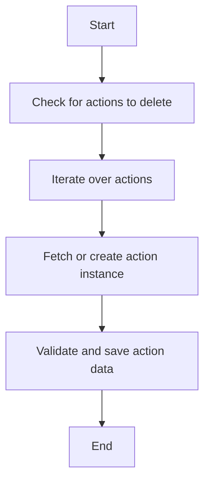

This document will cover the Alert Rule Triggers Management feature in Sentry, focusing on the product logic of the '\_handle_actions' function. We'll cover:

1. The purpose of the '\_handle_actions' function
2. The flow of the '\_handle_actions' function
3. The impact of the '\_handle_actions' function on the end user.

Technical document: <SwmLink doc-title="Understanding _handle_actions Function">[Understanding \_handle_actions Function](/.swm/understanding-_handle_actions-function.9exbum57.sw.md)</SwmLink>

# Purpose of the '\_handle_actions' function

The '\_handle_actions' function is a crucial part of the Alert Rule Triggers Management feature in Sentry. It is responsible for managing actions related to alert rule triggers. This function is used in various scenarios such as updating an alert rule, creating an alert rule, and updating an incident status.

# Flow of the '\_handle_actions' function

The '\_handle_actions' function operates in a sequence of steps. First, it checks if there are any actions that need to be deleted, which are not present in the updated data. If such actions exist, they are deleted. This ensures that the system is not cluttered with outdated or irrelevant actions. Following this, the function iterates over the actions, rewriting their fields and either fetching an existing action instance or creating a new one. This step ensures that the actions are up-to-date and relevant. An 'AlertRuleTriggerActionSerializer' is then used to validate and save the action data. If the serializer is valid, it attempts to save the action. However, if a 'ChannelLookupTimeoutError' is encountered during this process, it is stored and raised after the rest of the validation is complete. This step ensures that the actions are valid and can be executed without errors.

# Impact of the '\_handle_actions' function on the end user

The '\_handle_actions' function directly impacts the end user by ensuring that the alert rule triggers are managed effectively. By deleting outdated actions, updating existing ones, and creating new ones as needed, the function ensures that the user receives accurate and timely alerts. Additionally, by validating and saving action data, the function ensures that the alerts are reliable and error-free.

&nbsp;

*This is an auto-generated document by Swimm AI 🌊 and has not yet been verified by a human*

<SwmMeta version="3.0.0" repo-id="Z2l0aHViJTNBJTNBc2VudHJ5LWRlbW8lM0ElM0FTd2ltbS1EZW1v" repo-name="sentry-demo" doc-type="product-flows">Powered by [Swimm](/)</SwmMeta>
