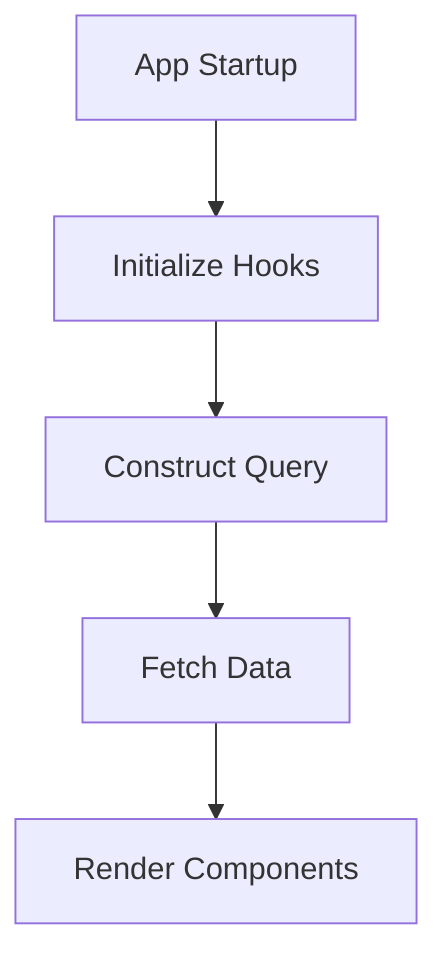

This document will cover the App Startup Flow in the Sentry application. We'll cover:

1. The purpose of the App Startup Flow
2. The process of initializing various hooks
3. The construction of a query for fetching data
4. The rendering of various components based on the fetched data.

Technical document: <SwmLink doc-title="Understanding AppStartup Flow">[Understanding AppStartup Flow](/.swm/understanding-appstartup-flow.v0f69vdg.sw.md)</SwmLink>

# Purpose of the App Startup Flow

The App Startup Flow is the entry point of the application startup process. It is responsible for initializing various hooks, constructing a query for fetching data, and handling the rendering of various components based on the fetched data. This flow ensures that the application is set up correctly and is ready to provide the user with a seamless experience.

# Initializing Various Hooks

The App Startup Flow begins by initializing various hooks. These hooks are used to retrieve and manage stateful logic related to the application's functionality. For example, hooks are used to retrieve the primary and secondary release names, determine if the selected project is cross-platform, and track analytics data. This step is crucial for setting up the necessary data and configurations for the application.

# Constructing a Query for Fetching Data

After initializing the hooks, the App Startup Flow constructs a query to fetch the necessary data for the application. This includes data related to the application's releases, projects, and analytics. The query is constructed based on the current state of the application and the data retrieved from the hooks. This step ensures that the application has all the necessary data to function correctly.

# Rendering Various Components Based on the Fetched Data

Once the data is fetched, the App Startup Flow handles the rendering of various components based on the fetched data. This includes components related to the application's user interface and functionality. The components are rendered in a way that provides the user with a seamless and intuitive experience. This step is crucial for providing the user with a functional and user-friendly application.

&nbsp;

*This is an auto-generated document by Swimm AI 🌊 and has not yet been verified by a human*

<SwmMeta version="3.0.0" repo-id="Z2l0aHViJTNBJTNBc2VudHJ5LWRlbW8lM0ElM0FTd2ltbS1EZW1v" repo-name="sentry-demo" doc-type="product-flows">Powered by [Swimm](/)</SwmMeta>
