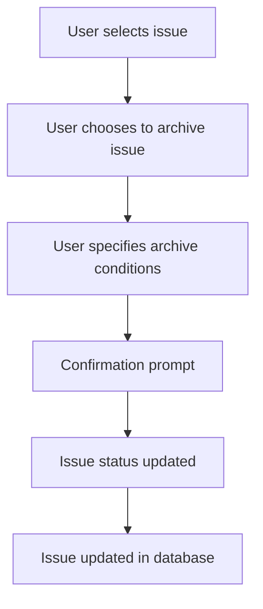

This document will cover the ArchiveActions feature of the Sentry application. We'll cover:

1. What is ArchiveActions
2. The flow of ArchiveActions
3. How ArchiveActions affects the end user

Technical document: <SwmLink doc-title="Understanding ArchiveActions">[Understanding ArchiveActions](/.swm/understanding-archiveactions.rhib76zt.sw.md)</SwmLink>

# What is ArchiveActions

ArchiveActions is a feature that allows users to manage the status of issues in the application. It provides a set of actions that can be performed on an issue, such as archiving it for a certain duration, a certain number of occurrences, or until it affects a certain number of users.

# The flow of ArchiveActions

The flow of ArchiveActions starts when a user selects an issue they wish to archive. They are then presented with options to specify the conditions under which an issue should be ignored. These conditions can be based on a certain duration, a certain number of occurrences, or until it affects a certain number of users. Once the user selects a condition, a confirmation prompt is displayed. Upon confirmation, the issue status is updated to 'IGNORED' and the substatus to 'ARCHIVED_UNTIL_CONDITION_MET'. This updated status is then sent to the server to update the issue in the database.

# How ArchiveActions affects the end user

The ArchiveActions feature provides users with greater control over how they manage issues in the application. By allowing users to specify conditions under which an issue should be ignored, users can effectively manage their issue backlog. This can help users focus on the most critical issues, while less critical issues are archived until the specified conditions are met.

&nbsp;

*This is an auto-generated document by Swimm AI 🌊 and has not yet been verified by a human*

<SwmMeta version="3.0.0" repo-id="Z2l0aHViJTNBJTNBc2VudHJ5LWRlbW8lM0ElM0FTd2ltbS1EZW1v" repo-name="sentry-demo" doc-type="product-flows">Powered by [Swimm](/)</SwmMeta>
