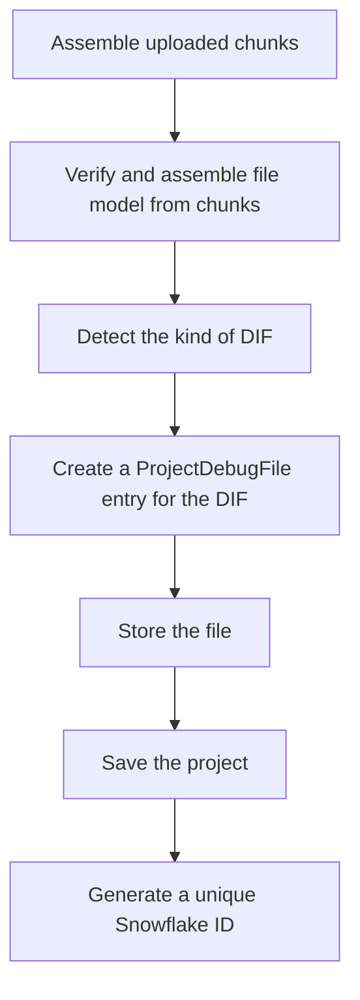

This document will cover the process of assembling Debug Information Files (DIFs) in the Sentry application. We'll cover:

1. Assembling uploaded chunks into a ProjectDebugFile
2. Verifying and assembling a file model from chunks
3. Detecting the kind of Debug Information File (DIF)
4. Creating a ProjectDebugFile entry for the provided DIF
5. Storing the file
6. Saving the project
7. Generating a unique Snowflake ID

Technical document: <SwmLink doc-title="Understanding the assemble_dif Function">[Understanding the assemble_dif Function](/.swm/understanding-the-assemble_dif-function.qr7nwwj9.sw.md)</SwmLink>

# Assembling uploaded chunks into a ProjectDebugFile

The process begins by assembling uploaded chunks into a ProjectDebugFile. This involves setting the project scope, initializing a delete_file flag, retrieving the project based on the provided project_id, and setting the assemble status to ASSEMBLING. The function then calls another function to assemble the chunks into a temporary file.

# Verifying and assembling a file model from chunks

The next step involves verifying and assembling a file model from chunks. All chunks are downloaded from the blob store to verify their integrity and are associated with a created file model. The full file is assembled in a temporary location and the complete content hash is verified. If the file size exceeds the maximum allowed size for the organization, the assemble status is set to ERROR and the function returns None.

# Detecting the kind of Debug Information File (DIF)

The system then detects the kind of Debug Information File (DIF) the file at a given path is. It supports various file formats including proguard, bcsymbolmap, uuidmap, il2cpp, and native debug information files (MachO, ELF or Breakpad). If the file is not a valid DIF, it raises a BadDif exception.

# Creating a ProjectDebugFile entry for the provided DIF

The system then creates a ProjectDebugFile entry for the provided Debug Information File (DIF). It takes a project, a DifMeta object, and optionally a file or a binary file object. If the correct entry already exists, it simply returns the existing entry. Otherwise, it creates a new entry and returns it.

# Storing the file

The file is then stored. The system takes a project id and an attachment, and returns a PutfileResult which includes the content type, size, sha1, and blob path of the file. The file is stored in a blob path, which is either inline or in a unique path under 'eventattachments/v1/'.

# Saving the project

The project is then saved. If the project doesn't have a slug, it generates one. If the SENTRY_USE_SNOWFLAKE setting is enabled, it saves the project with a snowflake id using a specific function.

# Generating a unique Snowflake ID

Finally, a unique Snowflake ID is generated. The system takes a redis key and generates a unique id based on the current time, region, and a sequence value from redis. The generated id is then validated and returned.

&nbsp;

*This is an auto-generated document by Swimm AI 🌊 and has not yet been verified by a human*

<SwmMeta version="3.0.0" repo-id="Z2l0aHViJTNBJTNBc2VudHJ5LWRlbW8lM0ElM0FTd2ltbS1EZW1v" repo-name="sentry-demo" doc-type="product-flows">Powered by [Swimm](/)</SwmMeta>
