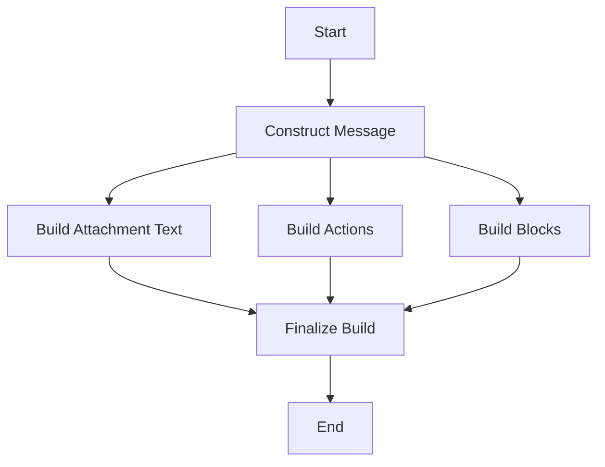

This document will cover the process of building Slack messages in the Sentry application. We'll cover:

1. The purpose of building Slack messages
2. The process of constructing the message
3. The components of the message
4. The finalization of the message construction.

Technical document: <SwmLink doc-title="Building Slack Messages">[Building Slack Messages](/.swm/building-slack-messages.pr9n9mul.sw.md)</SwmLink>

# Purpose of Building Slack Messages

The purpose of building Slack messages in Sentry is to provide a way for users to receive notifications about events in their projects directly in their Slack channels. This allows users to stay updated on the status of their projects without having to constantly check the Sentry application.

# Constructing the Message

The process of constructing the Slack message begins with generating the text for the attachment. This text includes details about the event that triggered the notification. The project and event details are then retrieved to provide context for the message.

# Components of the Message

The Slack message is composed of various blocks, each serving a specific purpose. These blocks include the title, culprit, text, tags, context, actions, suggested assignees, suspect commit info, notes, and footer. Each block provides specific information about the event, allowing users to get a comprehensive overview of the event at a glance.

# Finalizing the Message Construction

Once all the blocks have been constructed, they are combined into a single Slack message block. This finalized message is then ready to be sent to the appropriate Slack channel.

&nbsp;

*This is an auto-generated document by Swimm AI 🌊 and has not yet been verified by a human*

<SwmMeta version="3.0.0" repo-id="Z2l0aHViJTNBJTNBc2VudHJ5LWRlbW8lM0ElM0FTd2ltbS1EZW1v" repo-name="sentry-demo" doc-type="product-flows">Powered by [Swimm](/)</SwmMeta>
