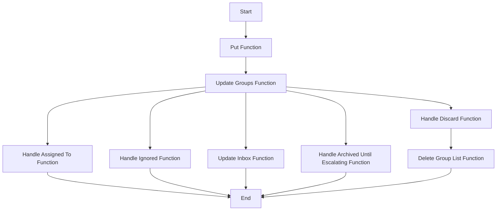

This document will explain the 'put' flow in the Sentry application. We'll cover:

1. The purpose of the 'put' flow
2. The steps involved in the 'put' flow
3. The impact of each step on the end user.

Technical document: <SwmLink doc-title="put">[put](/.swm/understanding-the-put-flow.277pe3xn.sw.md)</SwmLink>

# Purpose of the 'put' Flow

The 'put' flow is a sequence of operations that handle the bulk mutation of a list of issues. This means it allows for multiple issues to be updated at once, rather than having to update each issue individually. This is particularly useful when a large number of issues need to be updated with the same attributes.

# Steps Involved in the 'put' Flow

The 'put' flow begins with the 'put' function, which takes a list of issue IDs and a JSON object of attributes to modify. The 'put' function then calls the 'update_groups' function to perform the actual mutation. The 'update_groups' function is responsible for the actual mutation of the issues. It validates the data and performs various updates based on the validated data. These updates include assigning issues, handling ignored issues, updating the inbox status of issues, handling issues that are archived until escalating, and handling discarded issues.

# Impact of Each Step on the End User

Each step in the 'put' flow has a direct impact on the end user. For example, the 'handle_assigned_to' function assigns the issues to the assigned actor, which could change who is responsible for resolving the issue. The 'handle_ignored' function creates a snooze for each ignored issue, which could delay the resolution of the issue. The 'update_inbox' function moves the issues in or out of the inbox, which could affect the visibility of the issue. The 'handle_archived_until_escalating' function creates a forecast for each issue and removes the issue from the inbox, which could affect when the issue is addressed. Finally, the 'handle_discard' function permanently removes the issues, which could prevent the issue from being resolved.

&nbsp;

*This is an auto-generated document by Swimm AI 🌊 and has not yet been verified by a human*

<SwmMeta version="3.0.0" repo-id="Z2l0aHViJTNBJTNBc2VudHJ5LWRlbW8lM0ElM0FTd2ltbS1EZW1v" repo-name="sentry-demo" doc-type="product-flows">Powered by [Swimm](/)</SwmMeta>
