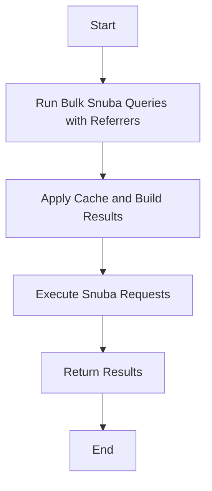

This document will cover the process of executing Bulk Snuba Queries with Referrers in the Sentry application. We'll cover:

1. The purpose of Bulk Snuba Queries with Referrers
2. The flow of executing these queries
3. The role of caching in this process
4. The execution of Snuba requests
5. The role of metrics in tracking query performance.

Technical document: <SwmLink doc-title="Understanding Bulk Snuba Queries with Referrers">[Understanding Bulk Snuba Queries with Referrers](/.swm/understanding-bulk-snuba-queries-with-referrers.6ajsst1r.sw.md)</SwmLink>

# Purpose of Bulk Snuba Queries with Referrers

Bulk Snuba Queries with Referrers is a key component in the Sentry application. It is responsible for running multiple queries in Snuba, a column-oriented, open-source, distributed data warehouse. This function accepts requests for either MQL or SnQL queries and runs them on the appropriate endpoint. Each request is paired with a referrer to be used for that request. The function also handles the 'consistent' override option if it is present.

# Flow of Executing Bulk Snuba Queries with Referrers

The flow of executing Bulk Snuba Queries with Referrers starts with the main entry point for running queries in Snuba. It then applies caching to the results and builds the final result set. If caching is enabled, it retrieves the cache keys for the requests and gets the cached data. If the cached result is not found, it increments the cache miss metric and adds the request to the query list. If the cached result is found, it increments the cache hit metric and adds the result to the results list. If caching is not enabled, it simply adds all requests to the query list. Finally, it runs the queries that were not found in the cache, stores the results in the cache, and adds them to the results list.

# Role of Caching in Bulk Snuba Queries with Referrers

Caching plays a crucial role in the process of executing Bulk Snuba Queries with Referrers. It helps in improving the performance of the function by storing the results of previous queries. When a new request comes in, the function first checks if the result for that request is already available in the cache. If it is, the function retrieves the result from the cache, thus saving the time and resources that would have been spent on executing the query again. If the result is not available in the cache, the function executes the query, stores the result in the cache for future use, and then returns the result.

# Execution of Snuba Requests

The execution of Snuba requests is done by the `_bulk_snuba_query` function. This function takes a sequence of Snuba requests and executes them. If there is more than one request, it uses a thread pool to execute them concurrently. The results of these queries are then processed and returned.

# Role of Metrics in Tracking Query Performance

Metrics are used to track the performance of the Bulk Snuba Queries with Referrers function. The `incr` function is used to increment the cache hit or miss metric. This helps in understanding the effectiveness of the caching mechanism. If the cache hit metric is high, it means that most of the results are being retrieved from the cache, indicating that the caching mechanism is working effectively. On the other hand, a high cache miss metric indicates that most of the results are not found in the cache, suggesting that the caching mechanism may need to be improved.

&nbsp;

*This is an auto-generated document by Swimm AI 🌊 and has not yet been verified by a human*

<SwmMeta version="3.0.0" repo-id="Z2l0aHViJTNBJTNBc2VudHJ5LWRlbW8lM0ElM0FTd2ltbS1EZW1v" repo-name="sentry-demo" doc-type="product-flows">Powered by [Swimm](/)</SwmMeta>
