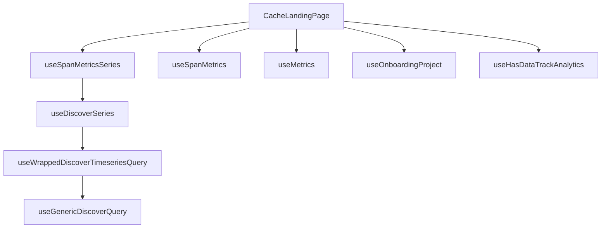

This document will cover the CacheLandingPage component, which includes:

1. Fetching data for cache insights
2. Displaying cache insights to the user
3. Managing data required for its various components

Technical document: <SwmLink doc-title="Understanding the CacheLandingPage Component">[Understanding the CacheLandingPage Component](/.swm/understanding-the-cachelandingpage-component.7fchfm9v.sw.md)</SwmLink>

# Fetching Data for Cache Insights

The CacheLandingPage component fetches data for cache insights using several hooks. These hooks include useSpanMetricsSeries, useSpanMetrics, useMetrics, useOnboardingProject, and useHasDataTrackAnalytics. The useSpanMetricsSeries hook fetches data for the cache miss rate and throughput charts. The useSpanMetrics hook fetches data for the transactions list. The useMetrics hook fetches transaction duration data. The useOnboardingProject hook determines if there's an onboarding project. The useHasDataTrackAnalytics hook tracks analytics data for the cache insights page.

# Displaying Cache Insights to the User

The CacheLandingPage component displays cache insights to the user. The data fetched by the hooks is passed to the respective components for rendering. For example, the data fetched by the useSpanMetricsSeries hook is passed to the cache miss rate and throughput charts for rendering. The data fetched by the useSpanMetrics hook is passed to the TransactionsTable component for rendering.

# Managing Data Required for Its Various Components

The CacheLandingPage component manages the data required for its various components. It uses the data fetched by the hooks to control the display of page information and to augment the transactions list with duration information.

&nbsp;

*This is an auto-generated document by Swimm AI 🌊 and has not yet been verified by a human*

<SwmMeta version="3.0.0" repo-id="Z2l0aHViJTNBJTNBc2VudHJ5LWRlbW8lM0ElM0FTd2ltbS1EZW1v" repo-name="sentry-demo" doc-type="product-flows">Powered by [Swimm](/)</SwmMeta>
