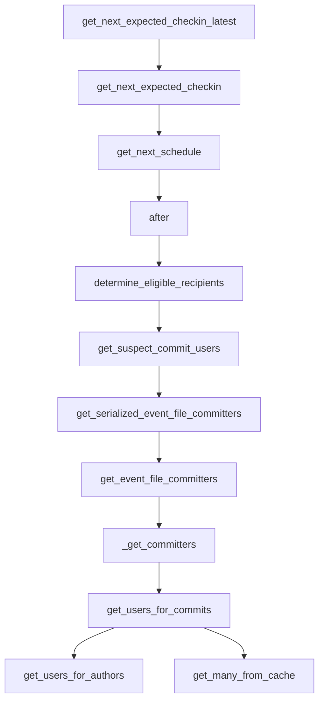

This document will cover the 'Check-in Notification Flow' in the Sentry application. We'll cover:

1. How the system calculates the next expected check-in time.
2. How the system determines the recipients for a notification.
3. How the system identifies the committers of a file associated with an event.

Technical document: <SwmLink doc-title="Understanding the get_next_expected_checkin_latest Function">[Understanding the get_next_expected_checkin_latest Function](/.swm/understanding-the-get_next_expected_checkin_latest-function.x53vsl9w.sw.md)</SwmLink>

# Calculating the Next Expected Check-in Time

The system calculates the next expected check-in time based on the most recent check-in time. This is determined by a user-configured margin. The system uses the 'get_next_expected_checkin' function to get the next expected check-in time. This function, in turn, uses the 'get_next_schedule' function to determine the next timestamp for a schedule from the reference timestamp.

# Determining the Recipients for a Notification

After an event, the system determines the eligible recipients for a notification. It uses the 'determine_eligible_recipients' function to either get the individual recipient from the target type/id or the owners as determined by rules for this project and event. This function gets the individual recipient from the target type/id or the owners as determined by rules for this project and event. It uses the 'get_suspect_commit_users' function to get a list of users that are suspect committers for the given event.

# Identifying the Committers of a File Associated with an Event

The system identifies the committers of a file associated with an event using the 'get_event_file_committers' function. This function retrieves the group associated with the event from the cache, retrieves the relevant releases and commits, and processes the event frames to identify the relevant file paths. It then matches these paths with the commits to identify the committers. The function uses the '\_get_committers' function to process the annotated frames and relevant commits and return the committers. This function extracts unique committers from the provided annotated frames and commits. It organizes them based on a heuristic where the first frame is worth 5 points, the second is worth 4, and so on. The function then returns a sequence of author commits.

&nbsp;

*This is an auto-generated document by Swimm AI 🌊 and has not yet been verified by a human*

<SwmMeta version="3.0.0" repo-id="Z2l0aHViJTNBJTNBc2VudHJ5LWRlbW8lM0ElM0FTd2ltbS1EZW1v" repo-name="sentry-demo" doc-type="product-flows">Powered by [Swimm](/)</SwmMeta>
