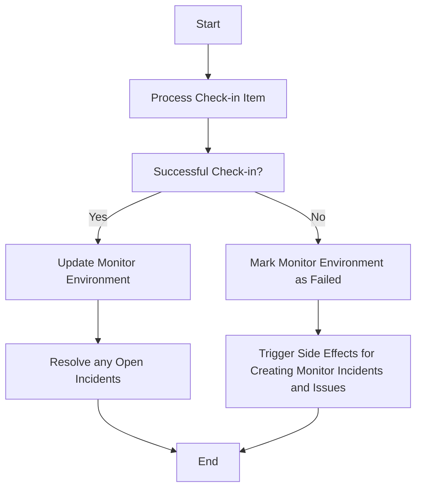

This document will cover the process of handling check-in items in Sentry. We'll cover:

1. The purpose of the check-in process
2. What happens when a check-in is successful
3. How monitors are retrieved or created
4. What happens when a check-in fails
5. How dynamic sampling rules are updated or created
6. How incident groups are resolved.

Technical document: <SwmLink doc-title="Understanding the _process_checkin Flow">[Understanding the \_process_checkin Flow](/.swm/understanding-the-_process_checkin-flow.1abmwr6v.sw.md)</SwmLink>

# Purpose of the Check-in Process

The check-in process is responsible for handling a check-in item. It extracts necessary information from the item payload and message, performs several checks, and if all checks pass, it proceeds to transform the check-in UUID and validate the monitor check-in. If validation passes, it attempts to retrieve or upsert the monitor for this check-in.

# Successful Check-in

When a check-in is successful, the system updates the monitor environment's last check-in time and next expected check-in times. If the monitor environment's status is not OK and the check-in status is OK, it checks if the incident is recovering. If the incident is recovering, it resolves any open incidents and updates the monitor environment's status to OK.

# Monitor Retrieval or Creation

The system retrieves or creates a monitor with a given configuration. It first tries to get an existing monitor with the given slug. If it doesn't exist, it creates a new one. If a configuration is provided, it validates the configuration and updates the monitor with the validated configuration.

# Failed Check-in

When a check-in fails, the system marks the monitor environment as failed and triggers side effects for creating monitor incidents and issues. It updates the monitor environment's last check-in time and next expected check-in times. If the failed check-in is a synthetic missed check-in, it does not move the `last_checkin` timestamp forward.

# Updating or Creating Dynamic Sampling Rules

The system updates an existing custom dynamic sampling rule or creates a new one if it doesn't exist. It first checks if a rule already exists for the given condition and organization. If it does, it updates the rule. If it doesn't, it creates a new rule.

# Resolving Incident Group

The system resolves an incident group. It sends a status change message to update the status of the group to RESOLVED.

&nbsp;

*This is an auto-generated document by Swimm AI 🌊 and has not yet been verified by a human*

<SwmMeta version="3.0.0" repo-id="Z2l0aHViJTNBJTNBc2VudHJ5LWRlbW8lM0ElM0FTd2ltbS1EZW1v" repo-name="sentry-demo" doc-type="product-flows">Powered by [Swimm](/)</SwmMeta>
