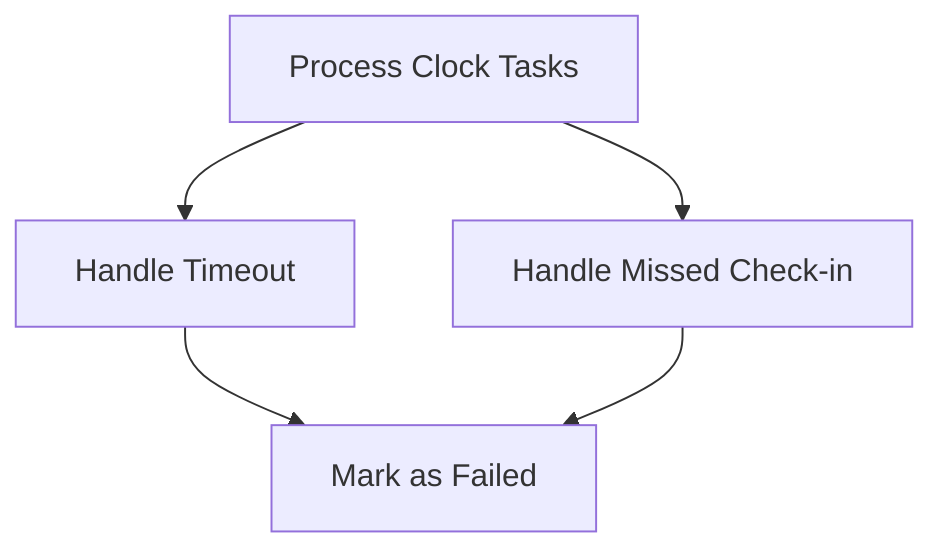

This document will cover the process of handling clock tasks in the Sentry application. We'll cover:

1. The purpose of processing clock tasks
2. How timeouts are handled
3. How missed check-ins are handled
4. How failures are marked

Technical document: <SwmLink doc-title="Understanding process_clock_task">[Understanding process_clock_task](/.swm/understanding-process_clock_task.b0jgt5ek.sw.md)</SwmLink>

# Processing Clock Tasks

The process of handling clock tasks is the first step in monitoring the status of various tasks within the Sentry application. This process involves decoding incoming messages and determining the type of task that needs to be handled. There are two main types of tasks that are processed: timeouts and missed check-ins.

# Handling Timeouts

When a timeout is detected for a check-in, the status of the check-in is updated to TIMEOUT. This means that the expected check-in did not occur within the expected timeframe. If there are no newer check-ins, the monitor is marked as failed. This is important as it allows the system to identify and flag tasks that are not completing as expected, which could indicate a problem that needs to be addressed.

# Handling Missed Check-ins

When a check-in is missed for a monitor environment, a missed check-in is created. This means that the system expected a check-in from a particular monitor environment, but did not receive it. The monitor is then marked as failed. This is crucial as it allows the system to keep track of monitor environments that are not checking in as expected, which could indicate an issue with the monitor environment.

# Marking Failures

When a check-in fails, the monitor environment is updated to failed and triggers side effects for creating monitor incidents and issues. This is a critical step as it allows the system to flag and track failed check-ins, which can then be investigated and resolved. This ensures that issues are not left unaddressed and can be resolved promptly to maintain the smooth operation of the system.

&nbsp;

*This is an auto-generated document by Swimm AI 🌊 and has not yet been verified by a human*

<SwmMeta version="3.0.0" repo-id="Z2l0aHViJTNBJTNBc2VudHJ5LWRlbW8lM0ElM0FTd2ltbS1EZW1v" repo-name="sentry-demo" doc-type="product-flows">Powered by [Swimm](/)</SwmMeta>
