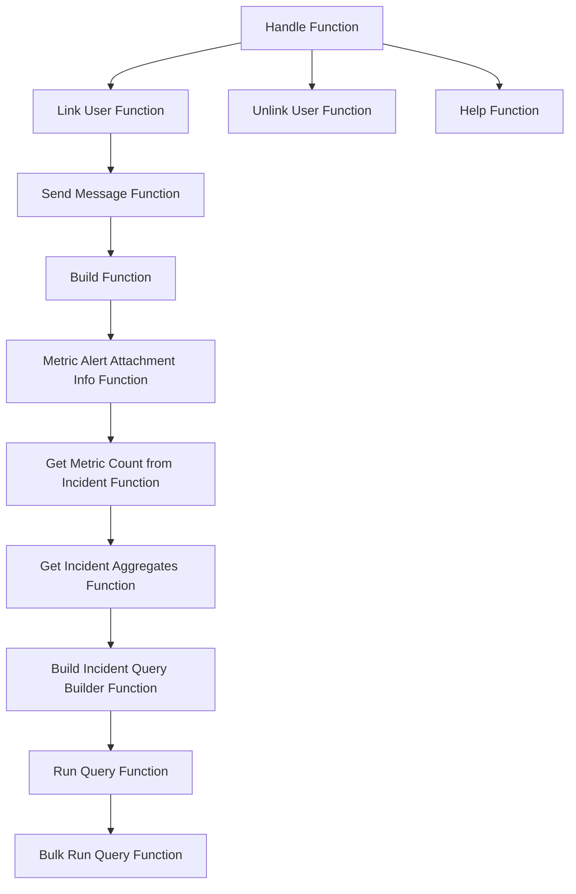

This document will cover the process of handling commands in the Sentry-Demo application. We'll cover:

 1. The entry point for handling commands
 2. The process of linking and unlinking users
 3. The process of sending help messages
 4. The process of sending messages
 5. The process of building messages
 6. The process of gathering information about metric alerts
 7. The process of getting metric count from incidents
 8. The process of getting incident aggregates
 9. The process of building incident query builder
10. The process of running and bulk running queries.

Technical document: <SwmLink doc-title="Understanding the Handle Function">[Understanding the Handle Function](/.swm/understanding-the-handle-function.tqsapvj2.sw.md)</SwmLink>

# Entry Point for Handling Commands

The handle function serves as the entry point for handling commands in the application. It retrieves the command name from the request and based on the command name, it delegates the handling to the appropriate function. If the command is unknown, it logs a warning and returns the help message.

# Linking and Unlinking Users

The application provides functionality to link and unlink users. The link_user function is called when a request to link a user is received. It checks if the request has an identity. If it does, it sends a message indicating that the user is already linked. If the request lacks an integration or user ID, it logs a warning and sends a message about missing data. If all checks pass, it builds a linking URL and sends a message to link the user. Similarly, the unlink_user function is called when a request to unlink a user is received. It first checks if the request has an identity. If not, it sends a not linked message. If the request does have an identity, it builds an unlinking URL and sends a message with this URL.

# Sending Help Messages

The help function is called when the help command is received. It simply sends a help message.

# Sending Messages

The send_message function is used to send a follow-up message. It checks if the message is a string and, if so, it creates a new DiscordMessageBuilder instance. It then returns a Response object with the message type and data.

# Building Messages

The build function is used to construct the message. It calls the metric_alert_attachment_info function to get the data for the message, constructs a URL, and builds the message embeds. The function returns the built message.

# Gathering Information about Metric Alerts

The metric_alert_attachment_info function gathers information about the metric alert. It determines the status of the incident, constructs a title and a title link, and gets the metric value. It then returns a dictionary with all the gathered information.

# Getting Metric Count from Incidents

The get_metric_count_from_incident function retrieves the current or last count of an incident aggregate. It does this by getting the incident trigger and calculating the start and end times based on the alert rule's time window. It then calls the get_incident_aggregates function to get the count.

# Getting Incident Aggregates

The get_incident_aggregates function calculates aggregate stats across the life of an incident or the provided range. It builds a query using the build_incident_query_builder function and runs the query. The function then returns the aggregated result.

# Building Incident Query Builder

The build_incident_query_builder function constructs a query to fetch incident data. It calculates the time range, gets the project IDs associated with the incident, and builds the query. It then adds conditions to the query and sets a limit before returning the query builder.

# Running and Bulk Running Queries

The run_query function is the entry point for executing a metrics query in Snuba. It calls the bulk_run_query function to execute the query. The bulk_run_query function executes a list of metrics queries in Snuba. It sets up the metrics query, resolves the metrics query, and then runs the Snuba queries. It then converts the Snuba results and returns them.

&nbsp;

*This is an auto-generated document by Swimm AI 🌊 and has not yet been verified by a human*

<SwmMeta version="3.0.0" repo-id="Z2l0aHViJTNBJTNBc2VudHJ5LWRlbW8lM0ElM0FTd2ltbS1EZW1v" repo-name="sentry-demo" doc-type="product-flows">Powered by [Swimm](/)</SwmMeta>
