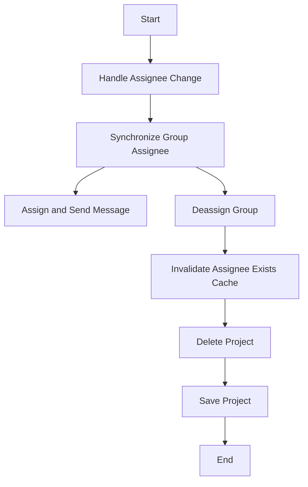

This document will cover the 'create_comment' flow in the Sentry platform, which allows users to create a comment on a Jira issue. We'll cover:

1. The purpose of the 'create_comment' flow
2. The process of handling assignee changes
3. The synchronization of group assignees
4. The process of assigning and sending messages
5. The process of deassigning groups and invalidating caches
6. The process of deleting and saving projects.

Technical document: <SwmLink doc-title="create_comment">[create_comment](/.swm/understanding-the-create_comment-flow.xtef797f.sw.md)</SwmLink>

# Purpose of the 'create_comment' Flow

The 'create_comment' flow is a series of operations that allow the creation of a comment on a Jira issue within the Sentry platform. This feature enhances the collaboration between team members by allowing them to discuss and share insights about specific issues directly within the platform.

# Handling Assignee Change

The process starts by checking if the assignee field has changed in the data received. If the assignee is not present, it indicates that the issue was unassigned. If an assignee is present, the system retrieves the assignee's email. This step ensures that the correct assignee is associated with the issue.

# Synchronizing Group Assignee

The system then synchronizes the group assignees. If the issue was unassigned, the group is deassigned from the user. If an assignee was specified, the group is assigned to the user. This step ensures that the correct users are associated with the issue.

# Assigning and Sending Message

The system updates the group with the selected assignee and records the assignment in the analytics. It then sends a message indicating that the assignee has been updated. This step keeps all team members informed about the assignment changes.

# Deassigning Group and Invalidating Caches

If the issue was unassigned, the system removes the assignee from the group and clears the ownership cache for the deassigned group. It also syncs the assignee status with external issues if the feature is enabled. This step ensures that the system accurately reflects the current assignee status.

# Deleting and Saving Projects

The system then deletes the project and removes notification settings for the project. If the project doesn't have a slug, it generates one. If a specific setting is enabled, it saves the project with a unique id. This step ensures that the system accurately reflects the current state of the project.

&nbsp;

*This is an auto-generated document by Swimm AI 🌊 and has not yet been verified by a human*

<SwmMeta version="3.0.0" repo-id="Z2l0aHViJTNBJTNBc2VudHJ5LWRlbW8lM0ElM0FTd2ltbS1EZW1v" repo-name="sentry-demo" doc-type="product-flows">Powered by [Swimm](/)</SwmMeta>
