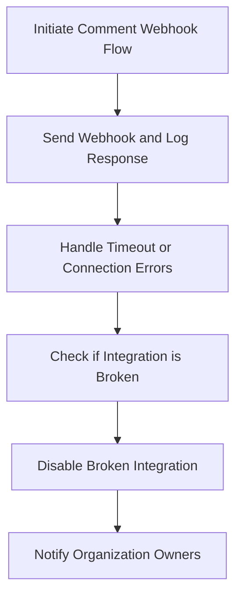

This document will cover the process of the 'Comment Webhook Flow' in the Sentry application. We'll cover:

1. Initiating the sequence of operations to send webhooks related to comments.
2. Sending the webhook and logging the response.
3. Handling timeout or connection errors.
4. Checking if the integration is broken and disabling it if necessary.
5. Notifying the organization owners about the disabled integration.

Technical document: <SwmLink doc-title="Understanding the build_comment_webhook Flow">[Understanding the build_comment_webhook Flow](/.swm/understanding-the-build_comment_webhook-flow.9woavtsi.sw.md)</SwmLink>

# Initiating the Comment Webhook Flow

The process begins when a comment is made in the Sentry application. The necessary data for the webhook, including the comment id, issue id, and project slug, is prepared. This data is then passed on to initiate the sending of the webhook.

# Sending the Webhook and Logging the Response

The webhook is sent and the response is logged for future reference. This step is crucial as it allows us to track the success or failure of the webhook transmission.

# Handling Timeout or Connection Errors

In case of a timeout or connection error during the webhook transmission, the error is recorded. This allows us to identify and troubleshoot issues that may be causing the failure of the webhook transmission.

# Checking if the Integration is Broken

If there are repeated failures in the webhook transmission, it may indicate that the integration is broken. In such cases, the integration is checked and if found to be broken, it is disabled to prevent further errors.

# Notifying the Organization Owners

Once the integration is disabled, the owners of the organization are notified about the disabled integration. This ensures that the owners are aware of the issue and can take necessary action to fix the broken integration.

&nbsp;

*This is an auto-generated document by Swimm AI 🌊 and has not yet been verified by a human*

<SwmMeta version="3.0.0" repo-id="Z2l0aHViJTNBJTNBc2VudHJ5LWRlbW8lM0ElM0FTd2ltbS1EZW1v" repo-name="sentry-demo" doc-type="product-flows">Powered by [Swimm](/)</SwmMeta>
