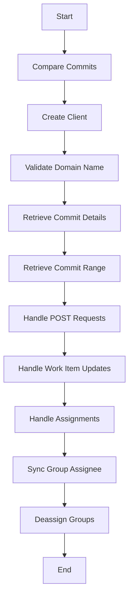

This document will cover the process of comparing commits in the Sentry application. We'll cover:

1. The purpose of comparing commits
2. How commits are compared
3. The impact of commit comparison on the end user.

Technical document: <SwmLink doc-title="Understanding the compare_commits Function">[Understanding the compare_commits Function](/.swm/understanding-the-compare_commits-function.qly1grtc.sw.md)</SwmLink>

# Purpose of Comparing Commits

Comparing commits is a crucial part of the commit comparison process in Sentry. This process is used to compare the changes between two given commit hashes. This is important for tracking the changes made in each commit and understanding the evolution of the codebase.

# How Commits are Compared

The process of comparing commits involves several steps. First, the system retrieves the installation and instance details. Then, it creates a client using these details. If a start commit hash is not provided, the system retrieves the commits up to the end commit hash. If both start and end commit hashes are provided, it retrieves the commit range between these two hashes.

# Impact on the End User

The process of comparing commits has a direct impact on the end user. It allows the user to see the changes made in each commit, which can help them understand the evolution of the codebase. Additionally, it can help identify any potential issues or bugs introduced in a specific commit. This can be particularly useful for debugging and troubleshooting purposes.

&nbsp;

*This is an auto-generated document by Swimm AI 🌊 and has not yet been verified by a human*

<SwmMeta version="3.0.0" repo-id="Z2l0aHViJTNBJTNBc2VudHJ5LWRlbW8lM0ElM0FTd2ltbS1EZW1v" repo-name="sentry-demo" doc-type="product-flows">Powered by [Swimm](/)</SwmMeta>
