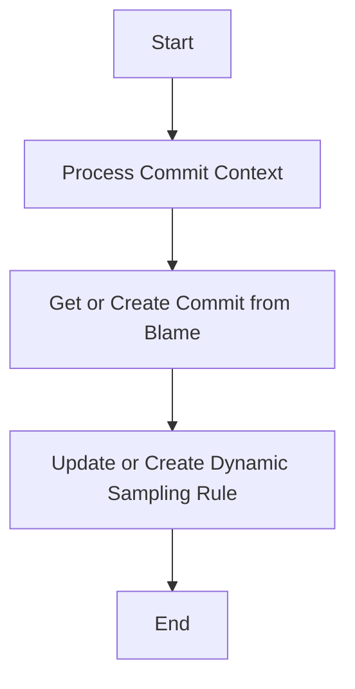

This document will provide an overview of the Commit Context Processing Flow in Sentry. We'll cover:

1. The purpose of the Commit Context Processing Flow
2. The steps involved in the flow
3. The impact of each step on the end user.

Technical document: <SwmLink doc-title="Understanding the Commit Context Processing Flow">[Understanding the Commit Context Processing Flow](/.swm/understanding-the-commit-context-processing-flow.snolhfce.sw.md)</SwmLink>

# Purpose of the Commit Context Processing Flow

The Commit Context Processing Flow is a crucial part of Sentry's error tracking and performance monitoring platform. It is responsible for processing the context of a commit, which includes identifying the first frame in the stack trace that is 'in_app' and retrieving or creating a commit based on the blame information. This flow helps in assigning the issue to the person who modified the line in the code.

# Steps involved in the Commit Context Processing Flow

The flow starts with the 'Process Commit Context' step, where it ensures thread safety and sets up basic logging details. It then retrieves the code mappings for the project and identifies the first frame in the stack trace that is 'in_app'. If no such frame is found, it falls back to processing suspect commits. If a frame is found, it attempts to find the commit context for all frames. The next step is 'Get or Create Commit from Blame', where it tries to retrieve a commit with the same repository ID and commit ID from the database. If it doesn't exist, it creates a new commit with the blame information and saves it to the database. The final step is 'Update or Create Dynamic Sampling Rule', where it checks if a rule already exists for the given condition and organization. If it does, it updates the rule's end date, number of samples, and sample rate. If no rule exists, it creates a new rule with the provided parameters.

# Impact on the end user

The Commit Context Processing Flow directly impacts the end user by improving the accuracy of error tracking and performance monitoring. By identifying the person who modified the line in the code, it helps in assigning the issue to the right person, thereby speeding up the resolution process. Moreover, by updating or creating a dynamic sampling rule, it ensures that the data collected is relevant and useful for debugging.

&nbsp;

*This is an auto-generated document by Swimm AI 🌊 and has not yet been verified by a human*

<SwmMeta version="3.0.0" repo-id="Z2l0aHViJTNBJTNBc2VudHJ5LWRlbW8lM0ElM0FTd2ltbS1EZW1v" repo-name="sentry-demo" doc-type="product-flows">Powered by [Swimm](/)</SwmMeta>
