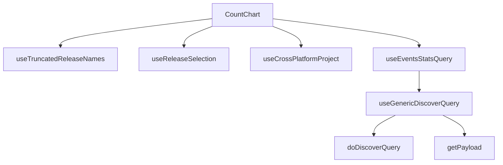

This document will cover the CountChart component, which includes:

1. Gathering necessary data for the chart
2. Truncating release names
3. Determining primary and secondary releases
4. Providing information about the project's platform
5. Making API requests to the Discover endpoint
6. Preparing the API payload

Technical document: <SwmLink doc-title="Understanding the CountChart Component">[Understanding the CountChart Component](/.swm/understanding-the-countchart-component.w2iht4y0.sw.md)</SwmLink>

# Gathering necessary data for the chart

The CountChart component is responsible for rendering a chart based on the count of events. It uses several hooks to gather the necessary data and conditions for the chart. The height of the chart is passed as a prop.

# Truncating release names

The useTruncatedReleaseNames hook is used to truncate the release names to a specified length. It uses the useReleaseSelection hook to get the primary and secondary release names, and then truncates them.

# Determining primary and secondary releases

The useReleaseSelection hook provides the primary and secondary releases. It uses the useReleases hook to get the releases data and then determines the primary and secondary releases based on the data and location query.

# Providing information about the project's platform

The useCrossPlatformProject hook provides information about the project's platform. It uses the usePageFilters and useProjects hooks to get the necessary data and then determines if the project is cross-platform and the selected platform.

# Making API requests to the Discover endpoint

The useEventsStatsQuery function is the starting point of the CountChart flow. It prepares the necessary parameters and calls the useGenericDiscoverQuery function. The parameters include event view details, location, organization slug, and request payload. The function returns the result of the useGenericDiscoverQuery function, which includes the data and loading status.

# Preparing the API payload

The getPayload function prepares the API payload based on the provided props. It either calls the getRequestPayload function or the getEventsAPIPayload function of the event view. It also includes additional parameters like cursor, limit, pagination, and referrer in the payload.

&nbsp;

*This is an auto-generated document by Swimm AI 🌊 and has not yet been verified by a human*

<SwmMeta version="3.0.0" repo-id="Z2l0aHViJTNBJTNBc2VudHJ5LWRlbW8lM0ElM0FTd2ltbS1EZW1v" repo-name="sentry-demo" doc-type="product-flows">Powered by [Swimm](/)</SwmMeta>
