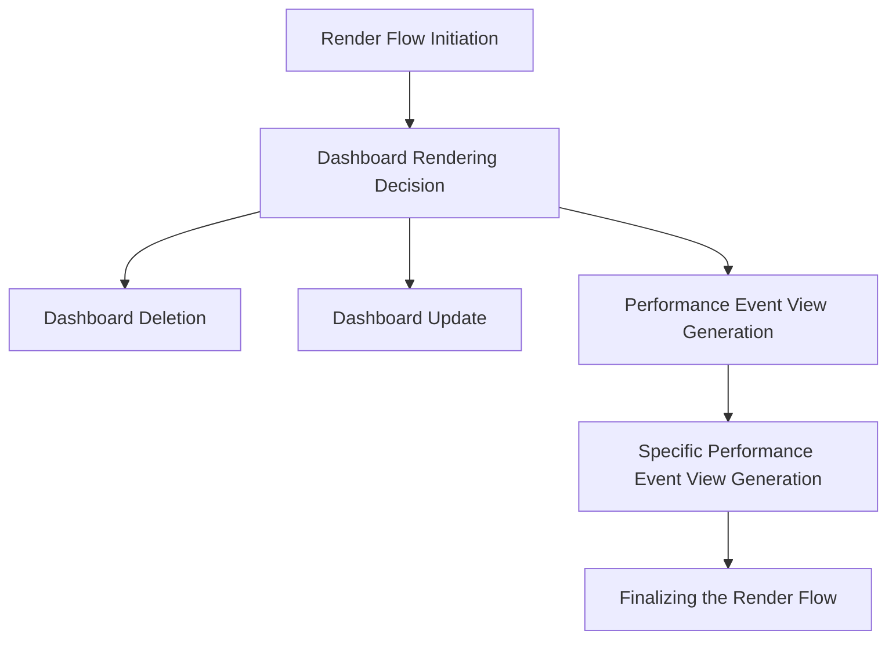

This document will cover the Dashboard Render Flow in Sentry, which includes:

1. The initiation of the render flow
2. The decision-making process for rendering the dashboard
3. The deletion of a dashboard
4. The update of a dashboard
5. The generation of performance event views.

Technical document: <SwmLink doc-title="Understanding the Render Flow">[Understanding the Render Flow](/.swm/understanding-the-render-flow.1pebikwy.sw.md)</SwmLink>

# Render Flow Initiation

The render flow is initiated by the `render` function. This function checks certain conditions and based on them, it decides which function to call next. It can either call `renderWidgetBuilder`, `renderDashboardDetail`, or `renderDefaultDashboardDetail`.

# Dashboard Rendering Decision

The `renderDefaultDashboardDetail` function is responsible for rendering the default dashboard. This function is called when the organization does not have the 'dashboards-edit' feature. The `renderDashboardDetail` function prepares the necessary data and state for rendering the dashboard details. It also generates the performance event view and checks if the dashboard is using transactions.

# Dashboard Deletion

The `onDelete` function is triggered when a user wants to delete a dashboard. It sends a DELETE request to the server and updates the component's state based on the response.

# Dashboard Update

The `updateDashboard` function is called within `renderDashboardDetail`. It sends a PUT request to the server to update the dashboard details. The updated dashboard details are then returned as a promise.

# Performance Event View Generation

The `generatePerformanceEventView` function generates a generic performance event view and then, based on the landing display field, it calls the appropriate function to generate a specific performance event view. These specific performance event view generation functions include `generateMobilePerformanceEventView`, `generateFrontendPageloadPerformanceEventView`, `generateFrontendOtherPerformanceEventView`, `generateBackendPerformanceEventView`, and `generateGenericPerformanceEventView`.

# Finalizing the Render Flow

The `fromNewQueryWithLocation` method in the `EventView` class is used to create an `EventView` instance from a new query and location. It applies global selection header values from the location to the new query. This marks the end of the render flow.

&nbsp;

*This is an auto-generated document by Swimm AI 🌊 and has not yet been verified by a human*

<SwmMeta version="3.0.0" repo-id="Z2l0aHViJTNBJTNBc2VudHJ5LWRlbW8lM0ElM0FTd2ltbS1EZW1v" repo-name="sentry-demo" doc-type="product-flows">Powered by [Swimm](/)</SwmMeta>
