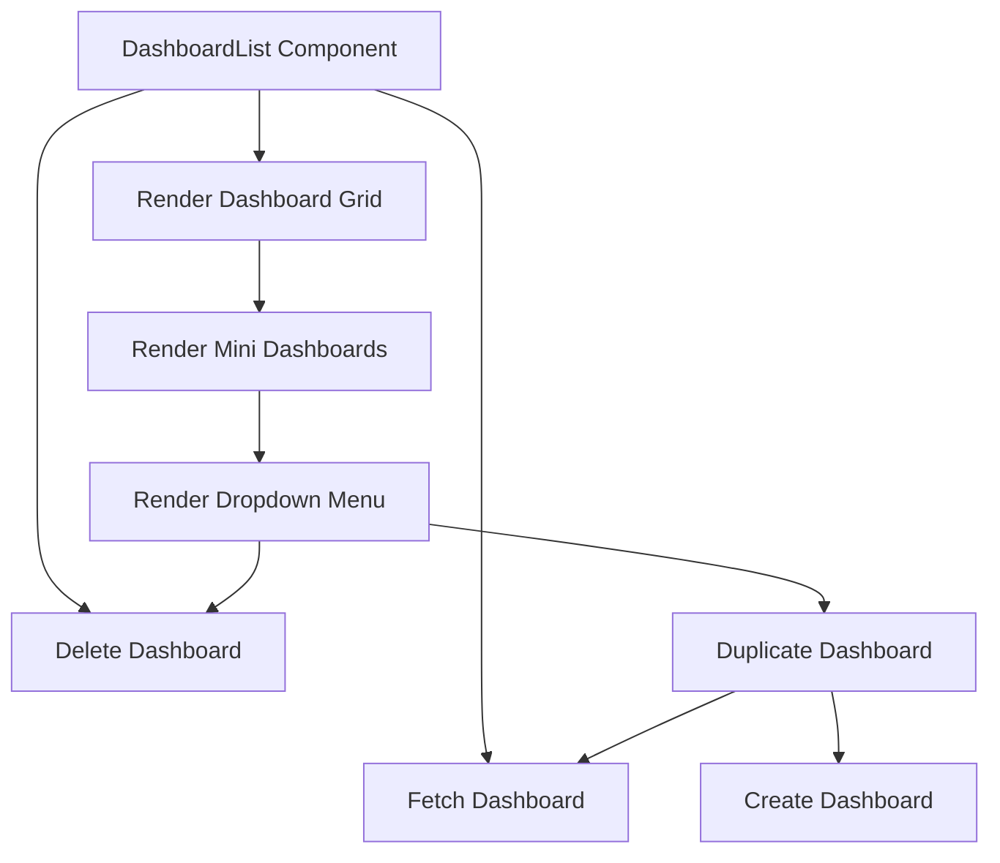

This document will cover the DashboardList component in the Sentry application. We'll cover:

1. Overview of the DashboardList component
2. Deleting a dashboard
3. Fetching a dashboard
4. Rendering the dashboard grid
5. Rendering mini dashboards
6. Rendering the dropdown menu
7. Duplicating a dashboard
8. Creating a dashboard

Technical document: <SwmLink doc-title="Understanding the DashboardList Component">[Understanding the DashboardList Component](/.swm/understanding-the-dashboardlist-component.4ir83egu.sw.md)</SwmLink>

# Overview of the DashboardList Component

The DashboardList component is a key part of the Sentry application. It provides the functionality for managing and rendering dashboards. This includes deleting, duplicating, and fetching dashboards. It also handles the rendering of the dashboard grid and the dropdown menu for each dashboard.

# Deleting a Dashboard

When a user decides to delete a dashboard, the application triggers a function to handle this action. This function sends a request to the server to remove the selected dashboard. If the deletion is successful, the user will be notified with a success message. If an error occurs during the deletion process, an error message will be displayed.

# Fetching a Dashboard

When the details of a specific dashboard are needed, the application triggers a function to fetch these details. This function sends a request to the server to retrieve the dashboard details. If the fetch is successful, the dashboard details will be returned. If an error occurs during the fetch process, an error message will be displayed.

# Rendering the Dashboard Grid

The application checks if there are any dashboards to display. If there are no dashboards, a message will be displayed to the user. If there are dashboards, the application will render each dashboard in a grid format.

# Rendering Mini Dashboards

For each dashboard, the application creates a mini version of the dashboard. This mini dashboard provides a snapshot of the dashboard's content. Each mini dashboard also includes a dropdown menu for user interactions.

# Rendering the Dropdown Menu

The dropdown menu provides options for the user to interact with the dashboard. This includes options to duplicate or delete the dashboard. When the user selects an option, the corresponding function is triggered.

# Duplicating a Dashboard

When a user decides to duplicate a dashboard, the application triggers a function to handle this action. This function first fetches the details of the dashboard to be duplicated. Then, it creates a new dashboard with the fetched details. If the duplication is successful, the user will be notified with a success message. If an error occurs during the duplication process, an error message will be displayed.

# Creating a Dashboard

When a new dashboard needs to be created, the application triggers a function to handle this action. This function sends a request to the server with the new dashboard's details. If the creation is successful, the new dashboard will be added to the list of dashboards. If an error occurs during the creation process, an error message will be displayed.

&nbsp;

*This is an auto-generated document by Swimm AI 🌊 and has not yet been verified by a human*

<SwmMeta version="3.0.0" repo-id="Z2l0aHViJTNBJTNBc2VudHJ5LWRlbW8lM0ElM0FTd2ltbS1EZW1v" repo-name="sentry-demo" doc-type="product-flows">Powered by [Swimm](/)</SwmMeta>
