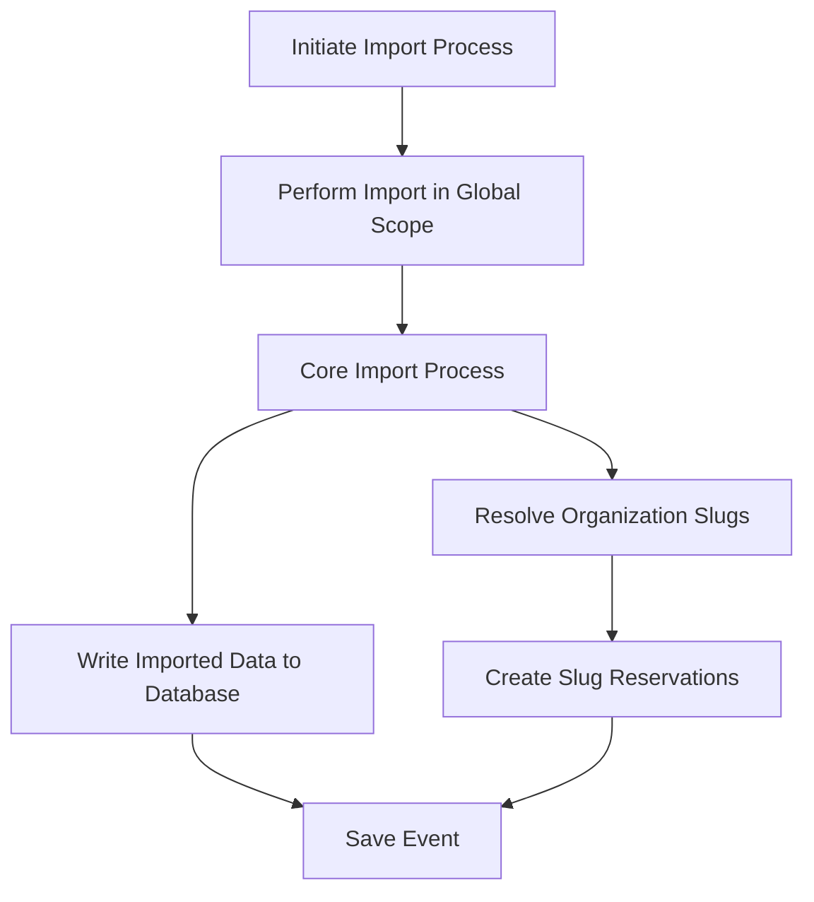

This document will cover the 'Data Import' feature of Sentry, which includes:

1. Initiating the import process
2. Performing the import in the global scope
3. Core import process
4. Writing the imported data to the database
5. Resolving organization slugs
6. Creating slug reservations
7. Saving the event.

Technical document: <SwmLink doc-title="Understanding the import_global Function">[Understanding the import_global Function](/.swm/understanding-the-import_global-function.a7as0g6f.sw.md)</SwmLink>

# Initiating the Import Process

The import process in Sentry is initiated by the 'import_global' function. This function takes in various parameters including the source file, decryption keys, and flags for user interaction. It then starts the import process.

# Performing the Import in Global Scope

The 'import_in_global_scope' function is responsible for performing an import in the 'Global' scope. This means that all models will be imported from the provided source file. It then starts the actual import process.

# Core Import Process

The '\_import' function is the core of the import process. It reads the JSON models from the source file, writes them to the database, and resolves organization slugs.

# Writing the Imported Data to the Database

The 'do_writes' function is responsible for writing the imported data to the database. It iterates over the JSON models and writes each model to the database.

# Resolving Organization Slugs

The 'resolve_org_slugs_from_pk_map' function is responsible for resolving organization slugs from the PrimaryKeyMap and reconciling their slug globally. It then creates slug reservations for imported organizations.

# Creating Slug Reservations

The 'bulk_create_organization_slugs' function is responsible for creating slug reservations for imported organizations that already exist on the region. It then creates the slug reservations.

# Saving the Event

The 'save' function is the final step in the flow. It is responsible for saving the event after normalizing and processing it. It saves adjacent models such as releases and environments to the database and writes the event into the eventstream.

&nbsp;

*This is an auto-generated document by Swimm AI 🌊 and has not yet been verified by a human*

<SwmMeta version="3.0.0" repo-id="Z2l0aHViJTNBJTNBc2VudHJ5LWRlbW8lM0ElM0FTd2ltbS1EZW1v" repo-name="sentry-demo" doc-type="product-flows">Powered by [Swimm](/)</SwmMeta>
