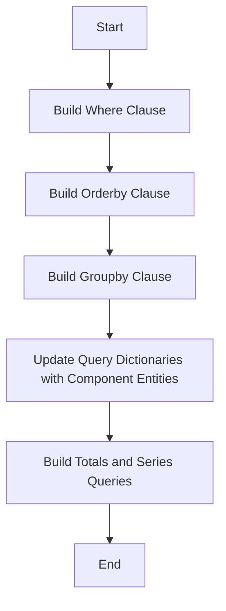

This document will cover the 'Data Querying Process' in Sentry, which includes:

1. Overview of the Data Querying Process
2. Building the where clause
3. Building the orderby clause
4. Building the groupby clause
5. Updating query dictionaries with component entities
6. Building totals and series queries
7. Usage of the Data Querying Process

Technical document: <SwmLink doc-title="Understanding get_snuba_queries Function">[Understanding get_snuba_queries Function](/.swm/understanding-get_snuba_queries-function.x0jl2iod.sw.md)</SwmLink>

# Overview of the Data Querying Process

The Data Querying Process is a crucial part of the Sentry application. It is responsible for fetching and manipulating data from the database. The process starts by iterating over the metrics query select fields and creating metric field objects. Depending on the type of the entity, it either updates the query dictionaries with component entities or validates the entity and adds it to the metric object dictionary. After that, it constructs the where, groupby, and orderby clauses. Finally, it constructs the queries dictionary and returns it along with the fields in entities.

# Building the where clause

The where clause of the Snuba query is built by adding conditions for the organization id and project ids. Then it adds the timeframe conditions. If there are additional where conditions in the metrics query, it processes them and adds them to the where clause.

# Building the orderby clause

The orderby clause of the Snuba query is built by iterating over the orderby fields in the metrics query and generating the necessary SnQL for each field.

# Building the groupby clause

The groupby clause of the Snuba query is built by iterating over the groupby fields in the metrics query and generating the necessary SnQL for each field.

# Updating query dictionaries with component entities

The query dictionaries are updated with component entities by iterating over the component entities and updating the metric object dictionary and fields in entities dictionary.

# Building totals and series queries

The totals and series queries are built by creating a totals query and if the metrics query includes totals, it adds the totals query to the return value. If the metrics query includes series, it calculates the series limit and adds the series query to the return value.

# Usage of the Data Querying Process

The Data Querying Process is used in multiple places in the Sentry application. Some of the entry points include 'get_release_health_data_overview', 'get_crash_free_breakdown', 'get_result', 'query_stats', and 'run_sessions_query'.

&nbsp;

*This is an auto-generated document by Swimm AI 🌊 and has not yet been verified by a human*

<SwmMeta version="3.0.0" repo-id="Z2l0aHViJTNBJTNBc2VudHJ5LWRlbW8lM0ElM0FTd2ltbS1EZW1v" repo-name="sentry-demo" doc-type="product-flows">Powered by [Swimm](/)</SwmMeta>
