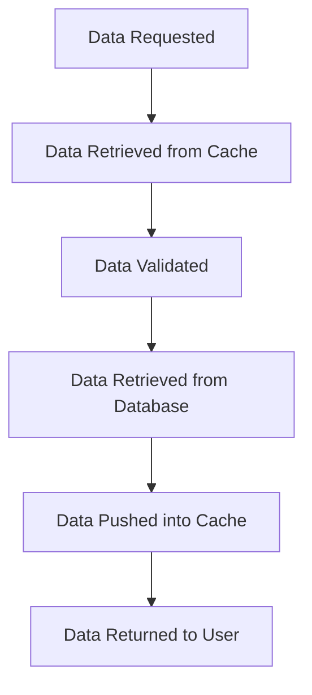

This document will cover the 'Data Retrieval and Caching' process in the Sentry application. We'll cover:

1. The purpose of data retrieval and caching
2. The process of data retrieval
3. The process of data validation
4. The process of data caching.

Technical document: <SwmLink doc-title="get_from_cache">[get_from_cache](/.swm/understanding-the-get_from_cache-function.ejhy8dv2.sw.md)</SwmLink>

# Purpose of Data Retrieval and Caching

The 'Data Retrieval and Caching' process is a crucial part of the Sentry application. It ensures that the application can quickly access and retrieve data, improving the overall performance and user experience. The process involves retrieving data from a cache, validating it, and if necessary, retrieving it from the database and updating the cache.

# Process of Data Retrieval

When data is requested, the application first attempts to retrieve it from the cache. This is a faster method of data retrieval compared to querying the database. If the required data is not found in the cache, or if the data in the cache is not valid, the application will then retrieve the data from the database.

# Process of Data Validation

Data validation is an important step in the data retrieval process. It ensures that the data retrieved from the cache is valid and up-to-date. If the data is not valid, it is removed from the cache, and the data is retrieved from the database.

# Process of Data Caching

After the data is retrieved from the database, it is pushed into the cache. This ensures that the next time the same data is requested, it can be quickly retrieved from the cache, improving the performance of the application.

&nbsp;

*This is an auto-generated document by Swimm AI 🌊 and has not yet been verified by a human*

<SwmMeta version="3.0.0" repo-id="Z2l0aHViJTNBJTNBc2VudHJ5LWRlbW8lM0ElM0FTd2ltbS1EZW1v" repo-name="sentry-demo" doc-type="product-flows">Powered by [Swimm](/)</SwmMeta>
