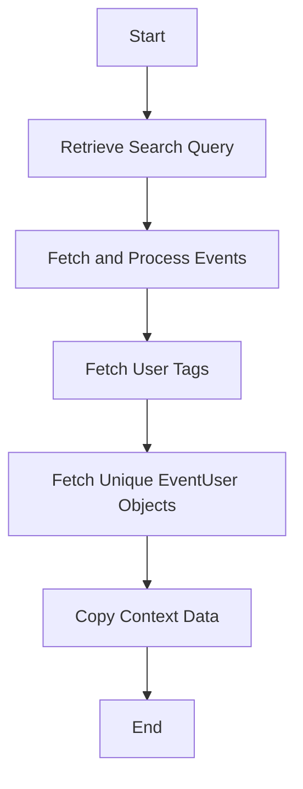

This document will cover the process of data retrieval and processing in the Sentry application. We'll cover:

1. The role of the data_fn function in the data retrieval and processing flow.
2. How the data_fn function fetches and processes event data.
3. The process of fetching user tags.
4. The process of fetching unique EventUser objects.
5. The process of copying context data.

Technical document: <SwmLink doc-title="Understanding data_fn Function">[Understanding data_fn Function](/.swm/understanding-data_fn-function.ej5pi70t.sw.md)</SwmLink>

# The Role of the data_fn Function

The data_fn function serves as the starting point of the data retrieval and processing flow. It takes an offset and limit as parameters and returns a list of Event objects. The function constructs a query, runs the query, and transforms the results into Event objects. If the full flag is set, the function fetches all the data blobs for NodeDatas of a list of Event objects with a single multi-get command to nodestore, and binds the returned blobs to the NodeDatas.

# Fetching and Processing Event Data

The data_fn function fetches and processes event data from Snuba. It constructs a Snuba query, runs the query, and processes the results into a list of Event objects. If the full parameter in the parent function is set to true, it also binds the results using the bind_nodes function from the eventstore.backend.

# Fetching User Tags

The get_user_tag function is used to fetch the user tag for a given key-value pair. It uses the for_projects method of the EventUser class to fetch the user tag. The for_projects function fetches the EventUser with a Snuba query that exists within a list of projects and valid keyword_filters. It tries to fetch as many unique rows as possible from the query and returns a list of unique EventUser objects.

# Fetching Unique EventUser Objects

The \_find_unique function returns the first instance of an EventUser object with a unique tag_value from the Snuba results. It iterates over the data results and appends unique event users to the result list.

# Copying Context Data

The copy function returns a new Context object with the same request and a copy of the backends. The Context function is a React component that renders the context of a frame in the Sentry UI. It displays the source code, variables, registers, and assembly of the frame based on the provided props.

&nbsp;

*This is an auto-generated document by Swimm AI 🌊 and has not yet been verified by a human*

<SwmMeta version="3.0.0" repo-id="Z2l0aHViJTNBJTNBc2VudHJ5LWRlbW8lM0ElM0FTd2ltbS1EZW1v" repo-name="sentry-demo" doc-type="product-flows">Powered by [Swimm](/)</SwmMeta>
