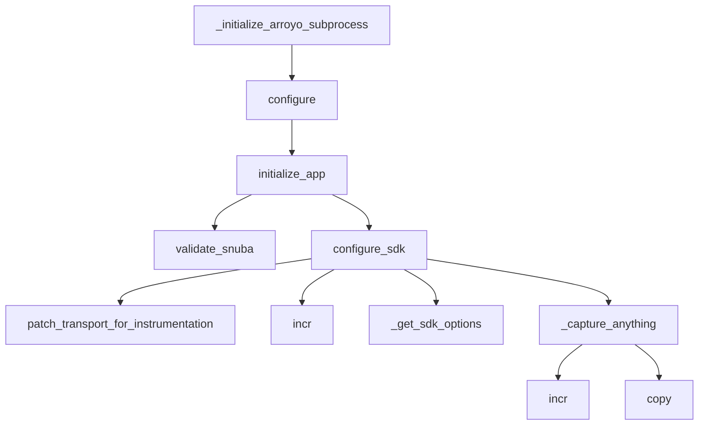

This document will cover the process of data streaming and processing in the Sentry application, specifically focusing on the '\_initialize_arroyo_subprocess' function. We'll cover:

1. The purpose of the '\_initialize_arroyo_subprocess' function
2. The flow of the '\_initialize_arroyo_subprocess' function
3. The SDK Configuration
4. Event Capture

Technical document: <SwmLink doc-title="Understanding _initialize_arroyo_subprocess">[Understanding \_initialize_arroyo_subprocess](/.swm/understanding-_initialize_arroyo_subprocess.sg5kj0tx.sw.md)</SwmLink>

# Purpose of the '\_initialize_arroyo_subprocess' function

The '\_initialize_arroyo_subprocess' function is a key part of the Sentry application's data processing pipeline. It sets up the Arroyo subprocess, a component that handles data streaming and processing in the application. The function takes an initializer function and a set of tags as arguments. If an initializer is provided, it is called. Then, it adds the provided tags to all threads.

# Flow of the '\_initialize_arroyo_subprocess' function

The flow of '\_initialize_arroyo_subprocess' involves several steps. After the function is called, it triggers the 'configure' function, which sets up the environment given two different config files. Then, the 'initialize_app' function is called within the 'configure' function. It sets up various settings, validates the configuration, and initializes various services. The 'validate_snuba' function is then called to ensure everything related to Snuba is in sync. Finally, the 'add' function is called to add a permission to a user.

# SDK Configuration

The 'configure_sdk' function is responsible for setting up the Sentry SDK. This includes configuring the transport layer and capturing any events or errors. The 'patch_transport_for_instrumentation' function is called within 'configure_sdk' to patch the transport functions to add metrics for better resolution around events sent to the ingest. The 'incr' function is used to increment a metric. It is called within 'patch_transport_for_instrumentation' and 'configure_sdk' to track the number of sent requests and captured events respectively.

# Event Capture

The '\_capture_anything' function is responsible for capturing events and metrics. It checks if the sentry4sentry_transport is available and if so, it increments the internal captured events upstream metric. The 'copy' function is used to create a copy of the current context. This is used in '\_capture_anything' to create a copy of the envelope for sentry4sentry_transport.

&nbsp;

*This is an auto-generated document by Swimm AI 🌊 and has not yet been verified by a human*

<SwmMeta version="3.0.0" repo-id="Z2l0aHViJTNBJTNBc2VudHJ5LWRlbW8lM0ElM0FTd2ltbS1EZW1v" repo-name="sentry-demo" doc-type="product-flows">Powered by [Swimm](/)</SwmMeta>
