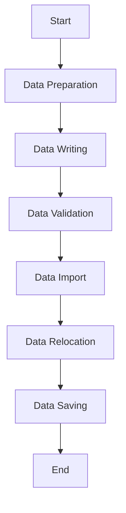

This document will cover the data writing process in the Sentry application. We'll cover:

1. The purpose of the data writing process
2. The steps involved in the data writing process
3. The impact of each step on the end user.

Technical document: <SwmLink doc-title="Data Writing Process">[Data Writing Process](/.swm/data-writing-process.z68hlyoq.sw.md)</SwmLink>

# Purpose of the Data Writing Process

The data writing process is a crucial part of the Sentry application. It is responsible for writing data to the database, which includes user data, event data, and configuration data. This process ensures that the data is correctly stored and can be retrieved when needed, which is essential for the functionality of the application and the user experience.

# Steps Involved in the Data Writing Process

The data writing process involves several steps. First, the data is prepared and validated. This includes checking the data for errors and ensuring it is in the correct format. Next, the data is written to the database. This involves writing the data to the appropriate tables and fields in the database. After the data is written, it is validated to ensure it was correctly written. If any errors are found, they are corrected. Finally, the data is imported and relocated. This involves moving the data to the appropriate location in the database and ensuring it is correctly linked to other related data.

# Impact on the End User

The data writing process has a significant impact on the end user. It ensures that the user's data is correctly stored and can be retrieved when needed. This includes the user's personal information, their settings, and their activity within the application. If the data writing process fails or encounters an error, the user may experience issues with the application, such as data loss or incorrect data display. Therefore, it is crucial that the data writing process is reliable and accurate.

&nbsp;

*This is an auto-generated document by Swimm AI 🌊 and has not yet been verified by a human*

<SwmMeta version="3.0.0" repo-id="Z2l0aHViJTNBJTNBc2VudHJ5LWRlbW8lM0ElM0FTd2ltbS1EZW1v" repo-name="sentry-demo" doc-type="product-flows">Powered by [Swimm](/)</SwmMeta>
