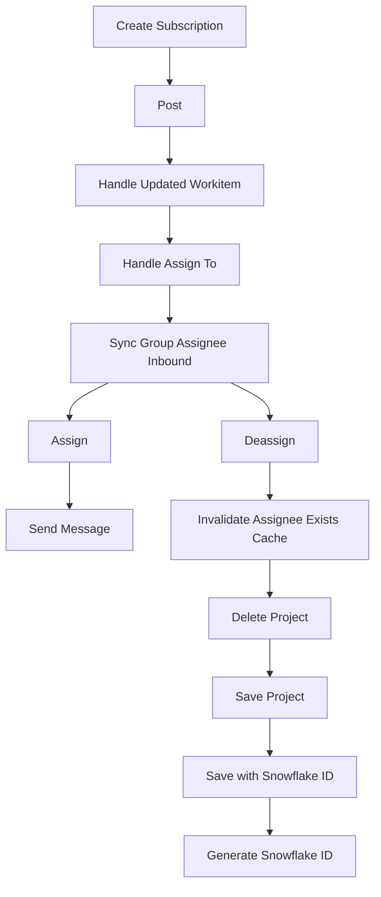

This document will cover the 'Create Subscription Flow' in the Sentry-Demo repository. We'll cover:

1. The purpose of the flow
2. The steps involved in the flow
3. The product logic behind each step
4. The impact of each step on the end user.

Technical document: <SwmLink doc-title="Understanding the Create Subscription Flow">[Understanding the Create Subscription Flow](/.swm/understanding-the-create-subscription-flow.gg50uyd8.sw.md)</SwmLink>

# Create Subscription

The 'Create Subscription' step is the initiation of the flow. It involves creating a subscription with the VSTS API. This subscription is crucial for the flow as it sets up a webhook that listens for specific events, in this case, when a work item is updated.

# Post

The 'Post' step is where the webhook endpoint receives the event from VSTS. It validates the payload and if the event type is 'workitem.updated', it retrieves the integration and proceeds to the next step. This step ensures that only valid and relevant events are processed further.

# Handle Updated Workitem

The 'Handle Updated Workitem' step processes the event when a work item is updated in VSTS. It extracts the necessary information from the payload and proceeds to handle the assignment of the work item. This step is crucial as it determines the specific work item that has been updated and needs to be processed.

# Handle Assign To

The 'Handle Assign To' step handles the assignment of the work item. It parses the new assignee from the payload and syncs the assignee with Sentry. This step ensures that the correct assignee is identified and updated in Sentry.

# Sync Group Assignee Inbound

The 'Sync Group Assignee Inbound' step syncs the assignee of the work item with Sentry. If the assignee is to be unassigned, it proceeds to the 'Deassign' step. Otherwise, it assigns the work item to the user in Sentry and proceeds to the 'Assign' step. This step ensures that the assignment status in Sentry reflects the current status in VSTS.

# Assign

The 'Assign' step assigns the work item to a user in Discord. It updates the group with the new assignee and sends a message to Discord to notify about the assignment. This step ensures that the assignment is communicated to the relevant parties.

# Send Message

The 'Send Message' step sends a message to Discord. It can either send a new message or update an existing one. This step ensures that the assignment update is communicated effectively.

# Deassign

The 'Deassign' step is responsible for removing the assignment of a group. It first checks if there is a previous assignee for the group. If there is, it deletes the assignment and creates an activity log for the unassignment. It also clears the ownership cache for the deassigned group and syncs the Sentry assignee to external issues if the feature is enabled. This step ensures that the unassignment is properly processed and logged.

# Invalidate Assignee Exists Cache

The 'Invalidate Assignee Exists Cache' step clears the assignee exists cache for a specific group or for all groups within a project that had an event within a certain time window. This step ensures that the cache is up-to-date and reflects the current assignment status.

# Delete Project

The 'Delete Project' step removes a project. It manually cascades the deletion due to the absence of a foreign key relationship. It also removes notification settings for the project. This step ensures that the project is properly removed and all related data is cleaned up.

# Save Project

The 'Save Project' step saves a project. If the project doesn't have a slug, it generates one. If a certain setting is enabled, it saves the project with a unique ID. This step ensures that the project data is properly saved and can be retrieved later.

# Save with Snowflake ID

The 'Save with Snowflake ID' step saves a model instance with a unique ID. It generates a new unique ID if the instance doesn't have one and then attempts to save the instance. This step ensures that the instance is saved with a unique identifier.

# Generate Snowflake ID

The 'Generate Snowflake ID' step generates a unique ID. It uses various segment values such as version ID, region ID, and time difference to generate the ID. This step ensures that a unique and non-conflicting ID is generated for each instance.

&nbsp;

*This is an auto-generated document by Swimm AI 🌊 and has not yet been verified by a human*

<SwmMeta version="3.0.0" repo-id="Z2l0aHViJTNBJTNBc2VudHJ5LWRlbW8lM0ElM0FTd2ltbS1EZW1v" repo-name="sentry-demo" doc-type="product-flows">Powered by [Swimm](/)</SwmMeta>
