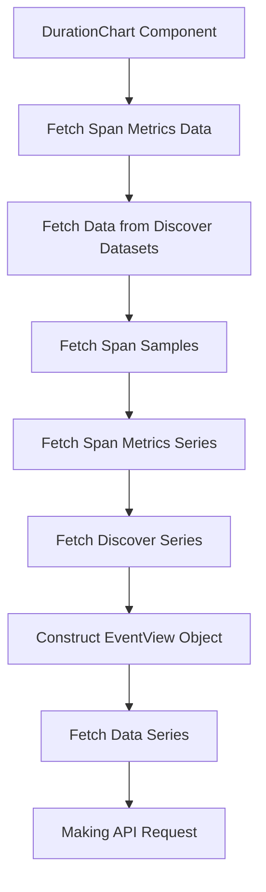

This document will provide a detailed explanation of the 'DurationChart' component in the Sentry application. We'll cover the following aspects:

1. Overview of the DurationChart component
2. Fetching span metrics data
3. Fetching data from Discover datasets
4. Fetching span samples
5. Fetching span metrics series
6. Fetching Discover series
7. Constructing EventView object
8. Fetching data series
9. Making API request.

Technical document: <SwmLink doc-title="Understanding the DurationChart Component">[Understanding the DurationChart Component](/.swm/understanding-the-durationchart-component.6gbc7rxu.sw.md)</SwmLink>

# Overview of the DurationChart Component

The DurationChart component is a visual representation of span metrics data in a chart format. It sets up page errors and filters, fetches span metrics data, and calculates averages and other metrics. It also handles user interactions with the chart such as clicks and mouse leave events.

# Fetching Span Metrics Data

The DurationChart component fetches span metrics data using a custom hook. This data is used to populate the chart with relevant information.

# Fetching Data from Discover Datasets

The component fetches data from the Discover datasets. This data is used to provide a comprehensive view of the span metrics.

# Fetching Span Samples

The component prepares the necessary data and makes an API request to fetch span samples. These samples are used to provide a detailed view of the span metrics.

# Fetching Span Metrics Series

The component fetches a series of data based on the provided options. This data series provides a comprehensive view of the span metrics over a period of time.

# Fetching Discover Series

The component fetches a series of data based on the provided options. This data series provides a comprehensive view of the span metrics over a period of time.

# Constructing EventView Object

The component constructs an EventView object based on the provided parameters. This object specifies the parameters for the data series to be fetched.

# Fetching Data Series

The component fetches the data series. It takes an EventView object as a parameter, constructs the API request payload based on this object, and makes the API request.

# Making API Request

The component makes the actual API request. It takes the API request payload as a parameter, makes the API request, and returns the result.

&nbsp;

*This is an auto-generated document by Swimm AI 🌊 and has not yet been verified by a human*

<SwmMeta version="3.0.0" repo-id="Z2l0aHViJTNBJTNBc2VudHJ5LWRlbW8lM0ElM0FTd2ltbS1EZW1v" repo-name="sentry-demo" doc-type="product-flows">Powered by [Swimm](/)</SwmMeta>
