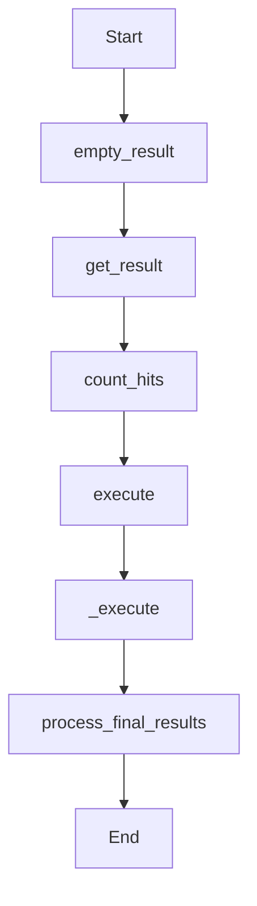

This document will cover the 'empty_result' function in the Sentry application, which is part of a larger flow involving data fetching and processing. We'll cover:

1. The purpose of the 'empty_result' function
2. The flow of the 'empty_result' function
3. The detailed flow of the function
4. The flow drill down.

Technical document: <SwmLink doc-title="empty_result">[empty_result](/.swm/understanding-empty_result-function.o0sfffgv.sw.md)</SwmLink>

# Purpose of the 'empty_result' function

The 'empty_result' function is used to return an empty result set. This is particularly useful as a placeholder when no data is available to be returned for a specific operation or query.

# Flow of the 'empty_result' function

The flow begins with the 'empty_result' function. This function is then followed by the 'get_result' function which is responsible for fetching the actual data. The 'count_hits' function is then called within 'get_result' to count the number of hits or matches for the given query. The 'execute' function is then called, which is a wrapper around the '\_execute' function, containing the main logic of the flow. The '\_execute' function fetches traces matching certain conditions, refines the parameters based on the fetched traces, and then processes the results. Finally, the 'process_final_results' function is called to process the final results, including error handling and formatting the results for output.

# Detailed Flow

The flow further drills down into functions like 'get_traces_matching_conditions', 'get_traces_matching_span_conditions', 'run_query', and 'process_results'. These functions are responsible for determining which conditions to match when retrieving traces, executing the metrics query in Snuba, and processing the results of the query respectively. The flow also includes functions like 'get_traces_matching_metric_conditions', 'get_traces_matching_span_conditions_in_traces', 'bulk_snuba_queries', and 'get_traces_matching_span_conditions_query'. These functions are used to get traces that match certain metric conditions, get traces that match certain span conditions within the given traces, increment a metric for the snuba query, and get the query for traces that match certain span conditions respectively.

# Flow drill down

In the flow drill down, we zoom into specific sections of the flow to understand the detailed workings of each function. This includes understanding how the 'empty_result' function works, how the 'get_result' function fetches data, how the 'count_hits' function counts the number of hits, how the 'execute' function wraps around the '\_execute' function, and how the 'process_final_results' function processes the final results.

&nbsp;

*This is an auto-generated document by Swimm AI 🌊 and has not yet been verified by a human*

<SwmMeta version="3.0.0" repo-id="Z2l0aHViJTNBJTNBc2VudHJ5LWRlbW8lM0ElM0FTd2ltbS1EZW1v" repo-name="sentry-demo" doc-type="product-flows">Powered by [Swimm](/)</SwmMeta>
