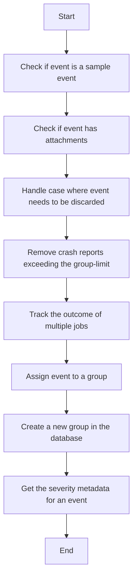

This document will cover the Error Event Processing feature of the Sentry platform. We'll cover:

1. The purpose of the Error Event Processing feature
2. The flow of processing error events
3. Handling of event attachments
4. Discarding of events
5. Filtering of attachments
6. Tracking of outcomes
7. Assigning events to groups
8. Creating groups
9. Handling of severity metadata.

Technical document: <SwmLink doc-title="Understanding save_error_events Function">[Understanding save_error_events Function](/.swm/understanding-save_error_events-function.xmpyd0kw.sw.md)</SwmLink>

# Purpose of the Error Event Processing feature

The Error Event Processing feature is a crucial part of the Sentry error tracking and performance monitoring platform. It is responsible for processing and saving error events, along with their attachments if any, into the system. This feature is the entry point for saving error events and it handles any exceptions that might occur during this process.

# Flow of processing error events

The flow of processing error events involves several steps. Initially, it checks if the event is a sample event. If it is, it logs the event details. Then, it checks if the event has attachments. If it does, it retrieves and saves them after all other processing is done. The function also handles the case where an event needs to be discarded, in which case it refunds the consumed quotas for the event and its attachments.

# Handling of event attachments

The function responsible for persisting cached event attachments into the file store iterates over the attachments and saves each one. If retrieving the attachment fails, it emits an outcome of INVALID(missing_chunks).

# Discarding of events

When an event needs to be discarded, the consumed quotas for the event and its attachments are refunded and an outcome of FILTERED(discarded-hash) is emitted for the event and each dropped attachment.

# Filtering of attachments

The function that removes crash reports exceeding the group-limit is used if the project or organization is configured to limit the amount of crash reports per group. The number of stored crashes is limited and one outcome per removed attachment is emitted.

# Tracking of outcomes

The function used to track the outcome of multiple jobs iterates over the jobs and for each job, it calls the function with the outcome set to ACCEPTED.

# Assigning events to groups

The function that checks if the job is optimized for grouping is used. If it is, it calls the function to save the aggregate, otherwise it calls the function to save the aggregate. The function then assigns the group info to the event and job if it exists.

# Creating groups

The function that prepares the necessary data and creates a new group in the database also handles the case where another process might be trying to create the same group, in which case it updates the group the other process just created, rather than creating a new group itself.

# Handling of severity metadata

The function used to get the severity metadata for an event is used for alert filtering.

&nbsp;

*This is an auto-generated document by Swimm AI 🌊 and has not yet been verified by a human*

<SwmMeta version="3.0.0" repo-id="Z2l0aHViJTNBJTNBc2VudHJ5LWRlbW8lM0ElM0FTd2ltbS1EZW1v" repo-name="sentry-demo" doc-type="product-flows">Powered by [Swimm](/)</SwmMeta>
