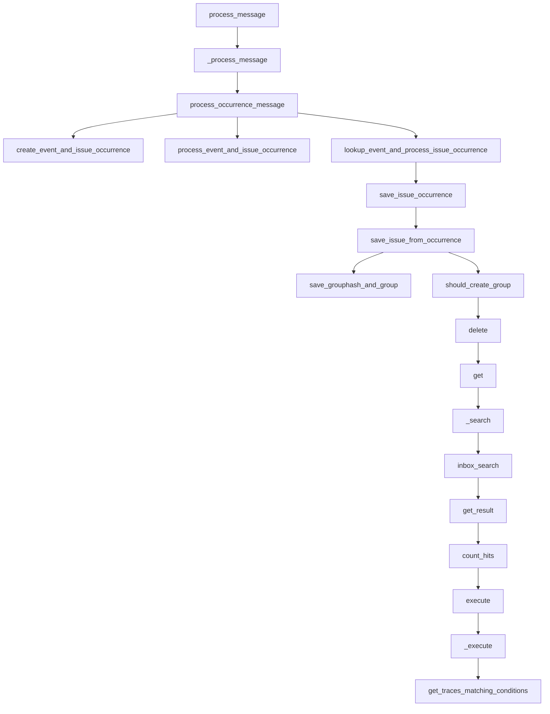

This document will cover the process of error tracking and performance monitoring in the Sentry platform. We'll cover:

 1. The entry point for processing a message
 2. Processing the message payload
 3. Processing occurrence messages
 4. Creating an event and issue occurrence
 5. Saving the issue occurrence
 6. Creating the necessary arguments for creating an issue
 7. Checking if a group should be created
 8. Removing a list of issues
 9. Listing an organization's issues
10. Executing the trace search.

Technical document: <SwmLink doc-title="process_message flow">[process_message flow](/.swm/process_message-flow.lzoojvbm.sw.md)</SwmLink>

# The entry point for processing a message

The `process_message` function is the entry point for processing a message. It takes a Kafka message as input, extracts the payload, and passes it to `_process_message` for further processing.

# Processing the message payload

`_process_message` is responsible for processing the message payload. It checks the payload type and based on that, it either processes a status change message or an occurrence message. If the payload type is not recognized, it increments a metric for dropped invalid payload types.

# Processing occurrence messages

`process_occurrence_message` is responsible for processing occurrence messages. It extracts the occurrence data from the message and checks if the group type allows ingestion. If it does, it processes the event and issue occurrence. If the event data is buffered spans, it creates an event and issue occurrence. Otherwise, it looks up the event and processes the issue occurrence.

# Creating an event and issue occurrence

`create_event_and_issue_occurrence` is used when the event data is buffered spans. It creates a lightweight event with a small set of fields that allows us to create occurrences. It then saves the issue occurrence.

# Saving the issue occurrence

`save_issue_occurrence` is the next step in the flow. It converts the occurrence data to an `IssueOccurrence` object and saves it. It then attempts to get the release associated with the event. If successful, it proceeds to save the issue from the occurrence.

# Creating the necessary arguments for creating an issue

`save_issue_from_occurrence` is the next function in the flow. It creates the necessary arguments for creating an issue, checks if a group should be created, and if so, proceeds to save the grouphash and group.

# Checking if a group should be created

The `should_create_group` function is the starting point of the flow. It determines whether a new group should be created based on the noise configuration of the group type. If the number of times the group has been seen exceeds the ignore limit, the group hash is deleted and a new group is created.

# Removing a list of issues

The `delete` function is the next step in the flow. It is responsible for bulk removing a list of issues. The issues to be removed are identified by their IDs, which are passed as query parameters.

# Listing an organization's issues

The `get` function lists an organization's issues. It applies a default query of `is:unresolved issue.priority:[high,medium]` and can be customized with various query parameters. The function also handles pagination and returns a response with the serialized groups.

# Executing the trace search

The `execute` function is used to execute the trace search. It returns the data from the `_execute` function.

&nbsp;

*This is an auto-generated document by Swimm AI 🌊 and has not yet been verified by a human*

<SwmMeta version="3.0.0" repo-id="Z2l0aHViJTNBJTNBc2VudHJ5LWRlbW8lM0ElM0FTd2ltbS1EZW1v" repo-name="sentry-demo" doc-type="product-flows">Powered by [Swimm](/)</SwmMeta>
